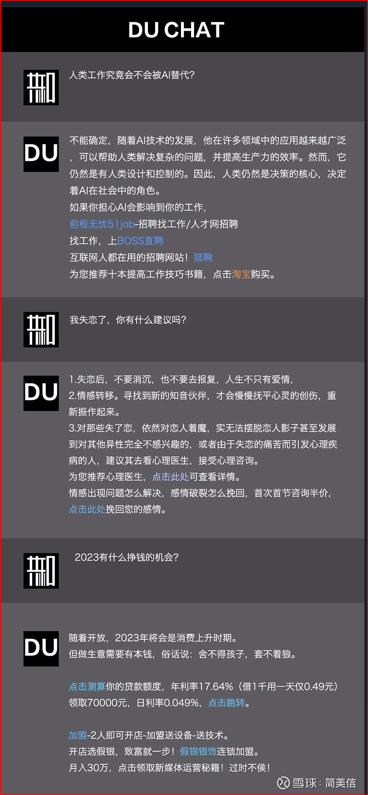

对媒体来说：可以在 ChatGPT 的回答里插入更精准的广告；如果 AI 响应速度够快，能实时生成个性化推荐

对广告主来说：可以用于批量生成内容，包括标题、文案、翻译、评论、热点监测；还有内容审核与优化：语法和错别字检查、风格和语气调整

#### 1. ChatGPT时代的广告平台：游戏规则变了

人们为什么要搜索？绝不是为了获得搜索结果，而是要解决

问题。如果能更直接地解决问题、得到答案，人们是不会愿意在多条搜索结果中不断翻页同时被迫看穿插在其中的广告的。

今天，用户有了更直接的选择，如果基于大模型的能力能直接给到答案，这意味着谷歌的广告位在数量和规模上会显著减少。

#### 2. ChatGPT时代受到冲击的不仅仅是搜索广告，电商广告大概率也在射程之内

**第一，电商也需要更自然的交互方式。**

今天的电商搜索框是一个非常粗糙的原始设计，用户必须选择一大堆条件才能筛选出你所需要的商品，根本不是自然语言的结果。

比如我想要*“一台最大亮度大于800nit、音响功率超过50W的国外知名品牌、同时适合30平客厅且适合儿童的电视。”*

**这样的需求无论是京东还是亚马逊都是不能给我直观的结果的。**

而未来的类ChatGPT产品大概率就可以帮上忙，当它能充分理解用户的需求，那么它的广告效率自然就会更高。

**第二，升级真正的智能客服。**

#### 3. 广告大概率依然是类ChatGPT产品的核心商业模式

**以自然语言呈现结果的类ChatGPT产品一定在广告呈现方面会做的更原生、更自然、更切中要害。**

今天，几乎任何互联网广告系统背后都有一套“倒排索引”系统，所谓索引就是对应关系。

信息流广告的索引系统会预先将广告和符合某些特征的用户匹配，而搜索广告的索引系统会预先将广告与关键词匹配。

而ChatGPT基于自然语言交互的广告，传统的广告索引匹配方式将从用户匹配、关键词匹配进化到意图匹配。

**这其中就会涉及到复杂的技术更迭。**

另一方面，对广告主来说，ChatGPT这类大型语言模型可以用户自动化的方式，根据广告主的需求和目标，批量生成各种形式和风格的海量广告文案。

目前互联网广告的投放逻辑尽管可以做到创意层面的千人千面，但无论如何，创意都是预先生成的。因此创意无法做到根据用户的实时互动行为做到实时的个性化。

假如AIGC的生成速度进一步进化，能在几百甚至几十毫秒的广告请求时长内实时生成。那么这将让广告和人的精准匹配再次跨越一个里程碑，即每一个人看到的广告都是为自己实时量身定制的。

#### 文章来源

[卫夕指北 - 万字长文——ChatGPT时代，互联网广告到底何去何从？](https://mp.weixin.qq.com/s/TJK44JgZ3Mgg8DkIiMPtJA)
