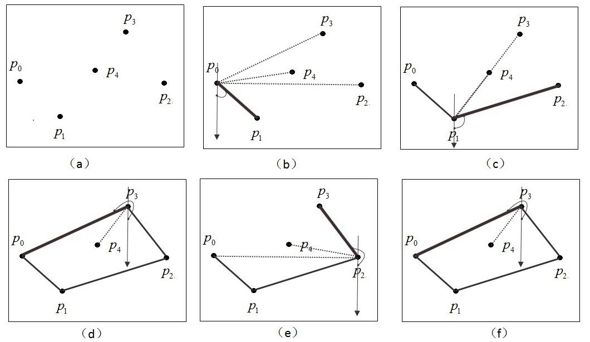
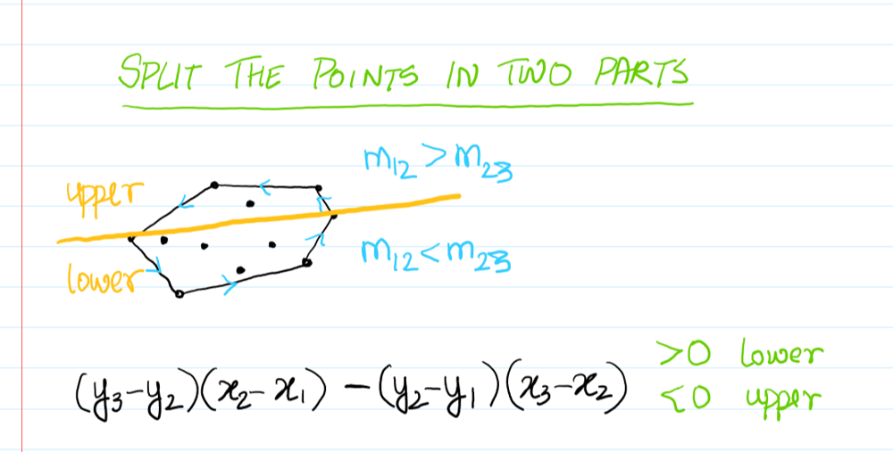

# 二维凸包 (2D Convex Hull)

将多个点连接成一个多边形，就叫凸包。

## 步进法

1. 从最左下的点开始
2. 遍历所有点，取极角最小的点，作为下个遍历的点
3. 遍历直到回到起点

## 单调链算法

1. 将所有点按 `x, y` 排序
2. 遍历两遍，分别构建上凸包和下凸包
   1. 以上凸包为例：对于线 `AB` 和 点 `C`，判断 `C` 在线的上方还是下方。方法是比较 `AB` 和 `AC` 的斜率。
   2. 如果 `C` 在线上方，则用 `C` 替换 `B`
   3. 否则将 `BC` 相连
3. 排序需要 `O(NlgN)`，第二步只需 `O(2N)`，比步进法高效

判断 `AB` 斜率的方法：
$$
Kab = (yb - ya) / (xb - xa)
$$
如果 `C` 在 `AB` 上方：
$$
(yc - ya) / (xc - xa) > (yb - ya) / (xb - xa) \\
 => (yc - ya) * (xb - xa) > (yb - ya) * (xc - xa) \\
$$

例题：[587. Erect the Fence](https://leetcode.com/problems/erect-the-fence/)

