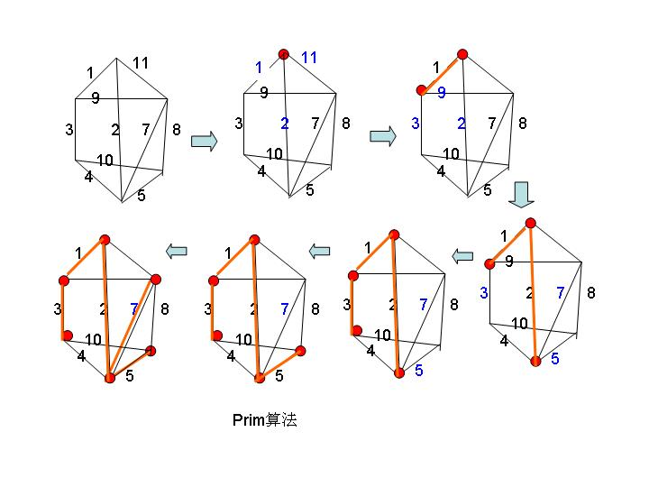

# 最小生成树 (MST)

Minimum Spanning Tree (MST)，最小生成树

给你一个有向带权图，需要你删除一些边，使这个图变成一个权值最小的树，这就是图论入门时最经典的最小生成树问题了


将高速公路问题中的城市看做图中的顶点，城市之间修建的道路看做图中顶点之间的边，城市之间所修修建的公路的长度看做是图中个边上的权值。这样我们就把高速公路问题转换成了求一个有向连通网的最小生成树问题。


### Kruskal 克鲁斯卡尔算法

所有的顶点放那，每次从所有的边中找一条代价最小的，同时保证加入的边不产生圈。

1. 先将边按权重排序
2. 遍历边，使用并查集尝试将边加入集合。通过并查集，如果没有圈可以成功加入，否则会加入失败
3. 遍历完所有边后，集合中剩下的就是最小生成树的边
```go
func BuildMST(n int, edges [][]int) int {
    sort(edges)        // 按代价排序
    set := UnionFind{} // 依赖于并查集，保证不产生圈
	set.Init(n)
    res := make([][]int, 0)
	for _, edge := range edges {         // 尝试将每条边加入并查集
		if set.Union(edge[0], edge[1]) { // 如果产生圈，则这两个点会指向同一个根节点，这里会返回false
            res = append(res, edge)
		}
	}
	return res
}
```


### Prime 普里姆算法

1. 将一个图的顶点分为两部分，一部分是最小生成树中的结点（A集合），另一部分是未处理的结点（B集合）。

2. 首先选择一个结点，将这个结点加入A中，然后对集合A中的顶点遍历，找出A中顶点关联的边权值最小的那个，将此顶点从B中删除，加入集合A中。
3. 递归重复步骤2，直到B集合中的结点为空，结束此过程。
4. A集合中的结点就是由Prime算法得到的最小生成树的结点，依照步骤2的结点连接这些顶点，得到的就是这个图的最小生成树




#### 参考

> [许铁-巡洋舰科技 - 话说最小生成树的prim算法和Kruskal算法的区别?](https://www.zhihu.com/question/26806466)