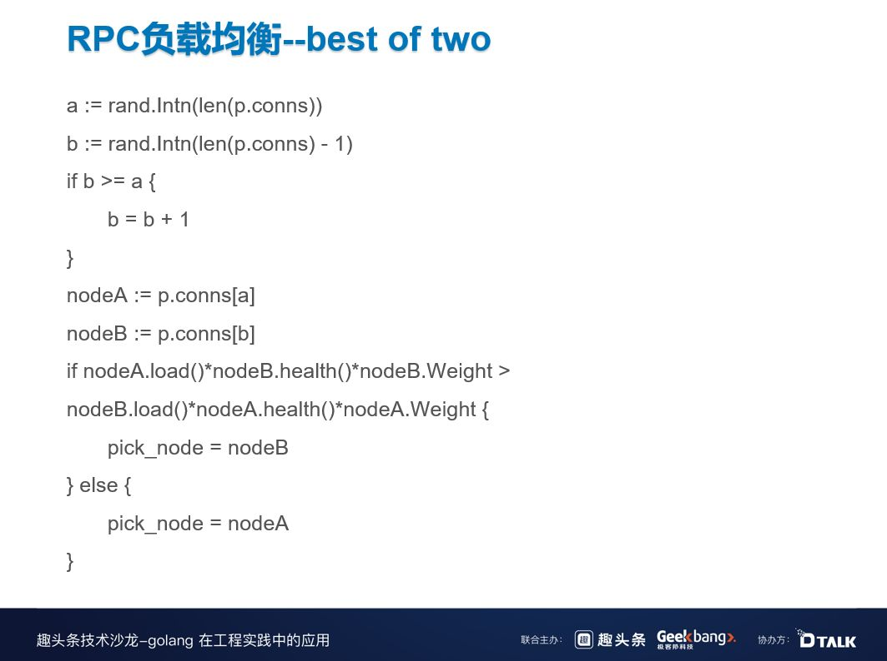

# B站在微服务治理中的探索与实践

曹国梁 [InfoQ](javascript:void(0);) *2019-07-12 19:05*

作者 | 曹国梁

编辑 | 田晓旭

本文整理自曹国梁在趣头条技术沙龙上发表的演讲《B 站在微服务治理中的探索与实践》。

大家都知道微服务有两个痛点，一个是如何拆分微服务，微服务的边界怎么划分制定；二是微服务上了规模之后如何管理，因为只要上了规模，任何小小的问题都可能会被放大，最后导致雪崩效应。

# 1 微服务化带来的挑战  

上图是我们 B 站全链路追踪的一个截图，这只是其中一个拓扑图的调用链路，就已经非常复杂了。可以想象一下，如果是整个公司所有的调用链路，会有多么复杂。而这就带来了微服务治理的复杂性问题：如何保证注册和发现；如何保证多机房高可用；如何保证低延迟等等。

其次，微服务化以后，服务拆分的比较多，调用链也比较长，调用链很容易受到一个坏节点的影响，导致用户端出现超时的现象。另外，负载不均衡会导致热点问题，并影响资源调度；单个节点不可用，如果限流或者熔断手段做的不好可能有雪崩效应；微服务代理的分布式事务问题和分布式一致性问题，以及编排、日志、链路追踪等问题。

# 2 Go 语言在 B 站开源服务发现框架 Discovery 的实践历程  

2015 年到 2017 年，B 站的微服务也是基于 Zookeeper，Zookeeper 是一个 CP 系统，可以保证一致性，在网络分区的情况下保证可用性。但是我们 CP 系统有一个问题，就是难以支持跨机房。如果机房 1 和机房 2 由于某些不稳定的原因发生网络断开，provider B 去往 ZK Follower 的注册是无法实现的。因为 ZK Follower 所有的请求是强一致，都有同步到 ZK Leader，这时机房 2 就无法注册了，但其实 Consumer B 和 Provider B 之间的网络是正常的。

Zookeeper 有一个性能瓶颈，因为强一致系统一般都会缓存全量日志，而 ZK Leader 是单节点的，所有的写请求都会到 ZK Leader 上，因此，写是无法水平扩展的。另外，基于 TCP 的健康检查也不是最优的。

2018 年，我们开始自研了服务发现框架，目前该框架已经在 B 站大规模使用了。这是一个 AP 的系统，Service Provider 注册以后，所有的注册、健康检测、取消注册都会通过 Discovery Server 异步同步到其它 Discovery Server，然后来保证最终一致。

Discovery Server 一定要满足网络分区时的自我保护，保证健康的服务节点可用。

客户端与 Discovery Server 是通过 HTTP Long Polling 来连接的。这种方式开发比较简单，且拥有推拉结合的好处，既能及时感知到节点变更，又方便并发编程的维护。

上图中下方的表格是与开源 Eureka 的对比图，基本上 Eureka 可以做到的，Discovery 也可以做到，Eureka 不能做到的，Discovery 还可以做到。（具体可参考表格）

接下来介绍一下机房的流量调度。

右下角的运维小人感知到机房 A 有问题，可以下发一个指令，指令可通过 Discovery 节点在机房 B 扩散，扩散完之后，会在机房 A 随机挑一个节点扩散，最后把调度信息发给 consumer，consumer 自动把大多数流量切换到 B。

如何保证最终一致？

每一个服务提供者实例都是全球唯一的，可以通过服务 ID+HostName 全球定位到服务实例，所以只要保证每个服务提供者实例达成一致，那么服务发现就大功告成了。服务提供者实例只要维持一个单调递增的 dirtyTime，发给 Discovery 节点之后，Discovery Server 收到注册请求或者其它请求，都会把这些请求广播一遍，在广播的时候就可以检查数据的一致性。

Discovery 另外一个比较重要的问题就是容灾。当发生网络分区和网络抖动的时候，因为每一个 Discovery 之间会同步复制心跳信息，所以短时间会丢失大量的心跳。例如，每分钟心跳小于阈值，Discovery 就会感知到，这时就不会剔除一些本该剔除的指令。即使没有进入非自我保护模式，Discovery 也会随机逐步剔除，避免一下子剔除导致全部过期。

当只有部分 Discovery 节点不可用时，因为每一个节点都是有数据的，所以此时只要选择连接其他正常的 Discovery 节点获取数据就可以了，并且不可用的节点重启之后，会自动拉取正常的节点，保持最新的同步。

如果全部的节点都不可用时，客户端 SDK 会缓存数据，并拒绝任何实例数过低的异常变更推送；在宕机期间，服务提供者会一直向 Discovery 节点发送心跳请求，直到 Disocvery 节点重启恢复正常之后会返回 404，此时服务提供者通过调用 Register 接口重新注册。

Discovery 框架客户端基本是零配置的，客户端 SDK 通过请求 SLB 拿到所有的 Discovery 服务端节点，并随机挑选一个节点作为拉取数据的节点。其次，我们在代码中做了动态注册，也就说每个 client.Dial 都会生成一个 connection，每个 connection 都会消费一个服务，每个服务都对应一个全局唯一的 appID，代码中通过写死 appID 来获取节点信息并连接。这种 appID 的方式能够做到动态订阅、动态销毁，实现零配置。

零配置的一个特点是在客户端 SDK 中的都是动态生成的，即所有的订阅、拉取都要在客户端中动态生态。这时，我们就需要创建一个全局唯一的 Builder。Builder Interface 实现了两个方法，一个是 Build，另一个是 Scheme。Build 方法会接受参数——appID，然后返回 Resolver，Resolver 会调用 watch。当有全局事件变更时，都会推送给 Builder，Resolver 从 MailBox 中获取到相关信息，通过 fetch 实现动态通知和实时推送。

这些都得益于我们的 Golang CSP 并发模型，Discovery 基本都是通过这种方式通信，并用这个方法解决并发编程的问题。和大家分享一下 Discovery 中的 Go 语言最佳实践。

首先是 errgroup 的使用，当我们启动了多个 groupteam，其中某个 groupteam 失败了，那就认为这次并发请求失败了。但是使用 errgroup 之后，当某个 groupteam 失败了之后，return error 后会生成一个新的 context，这样就可以通过散播 error 的方式来避免资源浪费。

其次是分布式客户端出错重试时尽量使用 BackoffRetry。假设此时有 100 个客户端，当搜索端炸了或者 CPU 满了，如果客户端同时一起重试会让情况变得很糟，大家都会竞争，排队会越来越严重。而使用 BackoffRetry，相当于加了一些随机量，出错之后随机 Sleep，并且增加一个避退的规则，例如这次是 1 毫秒，下次是 2 毫秒。这样，可以尽可能的保证重试的成功率。

# 3 RPC 负载均衡算法的演进之路 

服务发现是个 AP 系统，可能会出现延迟的情况，你拉取到的节点可能是一个错误节点，所以我们需要负载均衡来快速剔除它。另外，当出现某个节点 CPU 比较高或者网络抖动的情况，也是需要用到负载均衡。

这是我们负载均衡算法的 1.0 版本，比较常见的 Weighted Round Robin。从上图中可以看到，NodeA 权重：NodeB 权重：NodeC 权重 =3:2:1，也就是说 NodeA 会被调用 3 次，NodeB 会被调用 2 次，NodeC 会被调用 1 次，通过这种方式来做到负载的散布。但是这个版本也存在一些问题，一是无法快速摘除有问题的节点，二是无法均衡后端负载，三是无法降低总体延迟。

针对以上问题，我们进行了改进——动态感知的 WRR 算法，利用每次 RPC 请求返回的 Response 夹带 CPU 使用率，尽可能感知到服务负载，并且每隔一段时间整体调整一次节点的权重分数。

但是这个版本也存在一个问题。有一天，我们发现服务一直在报警，日志一直在报 504 错误（即超时重试），但是在监控时并没有发现问题，CPU 使用率基本都是 90% 左右。在 CPU 没有满的情况下，理论上来讲只可能出现一两个超时，不可能出现大量的超时，最后通过查看 WRR 日志，发现其实是信息滞后和分布式带来的羊群效应。

从图上可以看到当土拨鼠收到了金矿信息，它们就会蜂拥而至，跑在前面的可以抢到了金矿，但是跑在后面的可能抢不到，因为信息肯定是延迟的。另外，这些土拨鼠都是一个个独立的个体，它不是市场经济，市场经济即使信息有延迟，但是也可以通过规划、调度来分配资源。

导致出现上文诡异情况的原因，就是负载均衡 2.0 版本会自动刷新权重值，但是在刷新时无法做到完全的实时，再快也不可能超过一个 RTT，都会存在一些信息延迟差。当后台资源比较稀缺时，遇到网络抖动时，就可能会把该节点炸掉，但是在监控上面是感觉不到的，因为 CPU 已经被平均掉了。

发现这个问题之后，我们就引入了负载均衡 3.0。

1. 尽可能获得最新的信息: 使用带时间衰减的 Exponentially Weighted Moving Average（带系数的滑动平均值）实时更新延迟、成功率等信息。
2. 引入 best of two random choices 算法，加入一些随机性。上图中，横轴是信息延迟的时间，纵轴是平均请求响应时间。当横坐标接近 0 时，best 算法和负载均衡 2.0 差不多，但是当横坐标接近 40、50 时，这个差距就很明显了。
3. 引入 infliht 作为参考，平衡坏节点流量，inflight 越高被调度到的机会越少。

计算权重分数，每次请求来时我们都会更新延迟，并且把之前获得的时间延迟进行权重的衰减，新获得的时间提高权重，这样就实现了滚动更新。

上图就是 best of two 算法，每次从所有节点中随机 rand 一个节点 A 和 B，之后再经过了比较分数的算法，代码中的权重值指的是 Discovery 中设置的权重值。

如何测试 RPC 负载均衡？这个测试比较重要，上线的时候稍不注意就可能导致雪崩，所以需要谨慎一些，除了基本的单元测试外，测试代码还会模拟多客户端、多服务端场景，并随机加入网络抖动、长尾请求、服务器负载突变、请求失败等等真实场景中可能出现的情况，并在最后打印出结果来判断新的功能是否有效果。

另外，我们也会在线上的 Debug 日志中加一些分析，例如当前的分数成功率等等。

上图是这是我们上线以后 CPU 收敛的效果。

# 4 限流 & 熔断 

微服务中的负载均衡解决的是技术坏节点的问题，而限流和熔断主要是防止系统过载，防止系统雪崩。

这是 B 站一开始的熔断算法，是参考 Hystrix 熔断算法，当请求失败比率达到一定阈值之后，熔断器开启，并休眠一段时间，这段休眠期过后，熔断器将处于半开状态，在此状态下将试探性的放过一部分流量，如果这部分流量调用成功后，再次将熔断器闭合，否则熔断器继续保持开启并进入下一轮休眠周期。

但这个熔断算法有一个问题，过于一刀切，会把所有的系统一下子全部关掉，本来当时系统还可以通过 30% 或 20% 的流量，但是现在所有流量都不能通过。在半开状态下，试探性放入的流量必须全部成功，但是此时系统已经过载了，想要成功很难。因为这些问题，后来我们采用了 Google SRE 弹性熔断算法，弹性熔断是根据成功率进行调整的，当成功率越高的时候，被熔断的概率就越小，反之亦然。同时，参数是可以自定义的，通过调整参数可以使得熔断算法更加激进或者更加温和。

单机令牌桶限流是我们一开始就在使用的限流算法，就是到了现在，还有 50% 的服务是在使用这个算法。令牌桶一开始会装一些 token，每隔几秒令牌桶中会收到新的 token，当拦截器从令牌桶中拿 token 的时候，如果可以拿到就接着放行，如果拿不到就丢弃掉。

这个算法的问题是只针对局部服务端的限流，无法掌控全局资源，而且令牌桶的容量以及放 token 的速率无法很好的评估，因为系统负载一直在变化，如果系统因为某些原因进行了缩容和扩容，还需要人为手动去修改，运维成本比较大。另外，令牌桶是没有优先级的，所以无法让重要的请求先通过。

这是我们基于 BBR 算法开发的一个自适应限流，BBR 算法就是一个 TCP 的拥塞控制，与微服务中的限流也有一定的相似之处。自适应限流，基于 CPUIOPS 作为启发值，通过 BBR 算法来决定系统的最大承载量，适应零配置限流算法：cpu > 800 AND InFlight > (maxPass x minRtt x windows / 1000) 。

为什么要用 CPUIOPS 作为启发值呢？因为自适应限流与 TCP 拥塞控制还存在不同之处，TCP 中客户端可以控制发送率，从而探测到 maxPass，但是 RPC 线上无法控制流量的速率，所以必须以 CPU 作为标准，当 CPU 快满载的时候再开启，这时我们认为之前探测到的 maxPass 已经接近了系统的瓶颈，乘以 minRtt 就可以得到 InFlight。

除了自适应限流，我们还做了 Codel 队列，传统的队列都是先进先出，但是我们发现微服务可能不太适合这种做法，这是因为微服务会有超时，肯定不可能无限期的等下去，可能你的 SLP 已经设置了 800 毫秒的超时，如果这时放行的是一个老的请求，该请求的成功率就会变低，因为它可能已经排队了好长时间。

所以这时我们需要一个基于处理时间丢弃的队列，当系统处于高负载的时候，实行后进先出的策略，也就是说要主动丢弃排队久的请求，并让新的请求直接通过，利用这个队列来弥补之前算法中的缓冲问题，吸收突增的流量。

这是自适应无限流的效果，蓝色是请求进来的 QPS 量，绿色是真正通过的 QPS 量，从图中可以看到，当 CPU 达到百分百时，请求通过已经雪崩了。

这是自适应有限流的效果，可以看到即使蓝线一直在增，但绿线通过的量也没有受到影响，还是保持着一个比较平稳的通过率，可能因为拒绝请求的成本导致绿线稍微有些偏低，但整体影响不大。

# 5 回顾与展望  

回顾一下前文，Go 语言天然支持并发编程，CSP 模型满足大部分的并发场景，Discovery 就是大量应用了这种思想；贯彻组件化思想，Go 的接口设计刚好够用；Go 语⾔的程序开发需要在代码可读性与性能之间做好平衡取舍，应⽤程序并发模型要在控制之内。对于未来的规划，我们主要有 5 个小方向：

- Discovery 多机房自动化流量调度（全局视角）
- Discovery 实现 Merkle Tree 结构 & 支持 Gossip 协议
- RPC 负载均衡冷启动预热
- 具有全局视角的分布式限流方案
- RPC 请求优先级队列

# 原文链接

https://mp.weixin.qq.com/s/_iFe8DO1e-QcYG-CJDTHpg