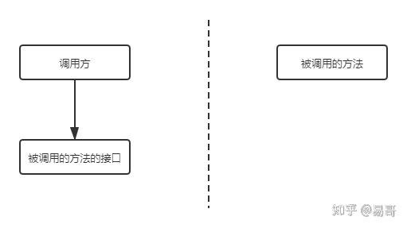
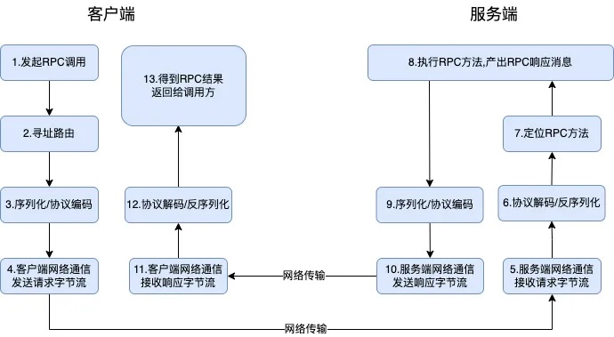
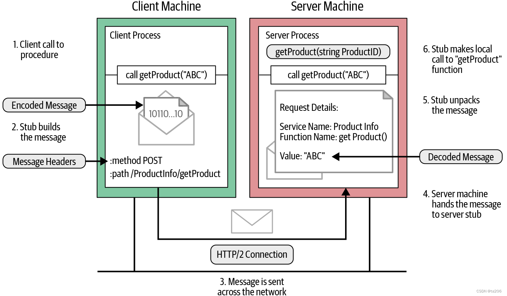
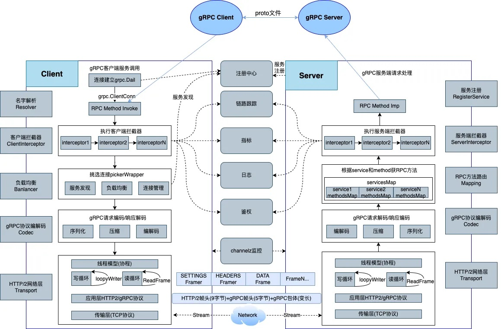
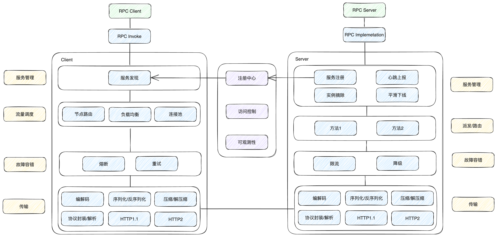
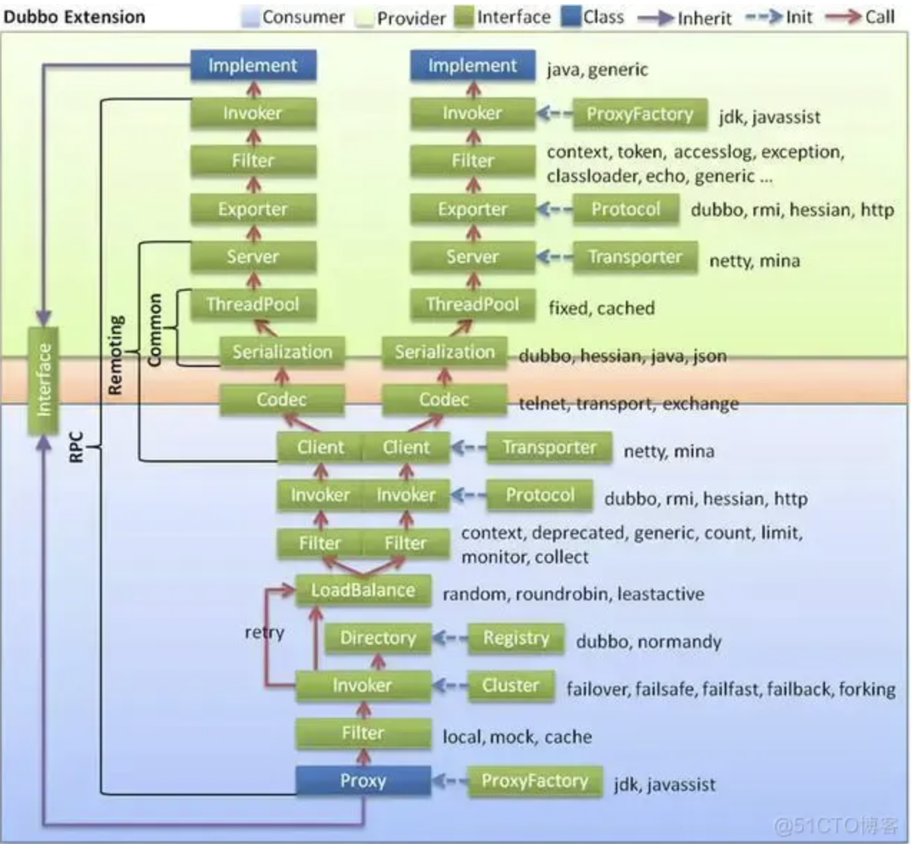

# HTTP 和 RPC 不是对等的概念

`RPC` 是一个完整的远程调用方案，它包括了：传输协议 + 序列化反序列化协议 + 通信协议 等。

而 `HTTP`只是一个通信协议，工作在 `OSI` 的第七层，不是一个完整的远程调用方案。

要想比较 `HTTP` 调用和 `RPC` 调用，应该将二者拉平为一个对等的概念。例如，**HTTP + Restful规范 + 序列化与反序列化**，构成一个完整的远程调用方案，再和 `RPC` 进行比较。

# 基于 HTTP 的远程调用方案

##### 优势

1. 实现和接入简单。大多数库天然支持 `HTTP`，用起来很容易，不需要引第三方库
2. 可读性好
3. 可以得到跨语言、防火墙的支持

##### 缺点

1. 有用信息占比少，毕竟 `HTTP` 工作在第七层，包含了大量的HTTP头等信息。导致 **效率低**
2. 虽然接入容易，但是麻烦，主要是参数的封装复杂

# RPC

RPC（Remote Procedure Call）全称远程过程调用，相比原生 HTTP 调用方式，特点是客户端可以像调用内部接口一样调用远程的方法（比如IDE支持函数高亮，可自动列出函数），也不需要做参数和响应的序列化、解析

RPC要求在调用方（客户端SDK）中放置被调用的方法的接口。调用方只要调用了这些接口，就相当于调用了被调用方的实际方法，十分易用

首先，调用方调用的是接口，必须得为接口构造一个假的实现（stub）。显然，要使用动态代理。这样，调用方的调用就被动态代理接收到了。

server 端实现了一系列可供远程调用的函数，client 端可以生成一个 stub，它提供一系列与 server 端远程函数一一对应的函数，client 端可以直接调用 stub 提供的函数，就像调用远程函数一样。

第二，动态代理接收到调用后，应该想办法调用远程的实际实现。这包括下面几步：

- 识别具体要调用的远程方法的IP、端口（服务发现）
- 将调用方法的入参进行序列化
- 通过通信将请求发送到远程的方法中

这样，远程的服务就接收到了调用方的请求。它应该：

- 反序列化各个调用参数
- 定位到实际要调用的方法，然后输入参数，执行方法
- 按照调用的路径返回调用的结果

整个过程如下所示。

之间的通信数据可读性不需要好，只需要RPC框架能读懂即可，不需要人类能读懂，因此效率可以更高：传输协议可以使用 `HTTP2 (GRPC)`，或者自研 (`Thrift`)。序列化协议可以使用 `protobuf (GRPC)`  / 自研 (`Thrift`等)。

# 调用示例

下图为client端调用远程函数的示例。server端提供getProduct函数来获取指定productID的产品详情，client端调用stub提供的对应的getProduct函数，来调用远程函数。整个调用过程如下：

 

1. client端调用stub中的getProduct函数；
2. client stub对message进行编码，并创建一个HTTP POST请求。在 gRPC 中，所有请求都是 HTTP POST 请求，content-type为`application/grpc`。它调用的远程函数 ( `/ProductInfo/getProduct`) 会作为单独的 HTTP 标头（path）发送；
3. HTTP POST请求通过网络发送到server端；
4. 当server端接收到message时，它会检查HTTP头，确认需要调用哪个server函数，并将message转交给server stub；
5. server stub将message解码为指定的数据结构；
6. 之后，server端本地调用`getProduct`，并将解码后的message作为参数传递给该函数。
7. server端函数返回结果后，会对结果进行编码并发送回client端。响应结果的处理过程和client端发送message的处理过程一致（响应结果→编码→HTTP 响应）；
8. client端收到message之后，将其解码，并传给等待的client进程。

# 架构样例

# Dubbo

#### 参考

[易哥 - 既然有 HTTP 请求，为什么还要用 RPC 调用](https://www.zhihu.com/question/41609070/answer/1030913797)

[深入理解grpc（二）：grpc原理](https://blog.csdn.net/ta206/article/details/127602915)
