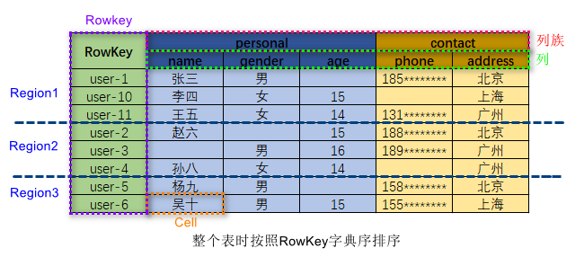
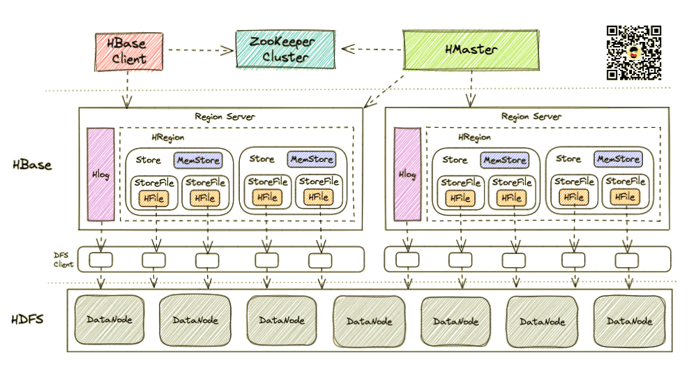

[TOC]

# 1. 数据模型

一条数据拥有一个全局唯一的键(RowKey)和任意数量的列(Column)，一列或多列组成一个列族(Column Family)，同一个列族中列的数据在物理上都存储在同一个 HFile 中，这样基于列存储的数据结构有利于数据缓存和查询

## 1.1 Column Family 列族
Column Family 即列族，HBase 基于列划分数据的物理存储，一个列族可以包含包意多列。

一般同一类的列会放在一个列族中，每个列族都有一组存储属性：

- 是否应该缓存在内存中
- 数据如何被压缩或行键如何编码等

HBase 在创建表的时候就必须指定列族。HBase的列族不是越多越好，官方荐一个表的列族数量最好小于或者等于3，过多的列族不利于 HBase 数据的管理和索引。

## 1.2 RowKey

RowKey的概念与关系型数据库中的主键相似，HBase 使用 RowKey 来唯一标识某行的数据。

访问 HBase 数据的方式有三种:

- 基于 RowKey的单行查询；
- 基于RowKey的范围查询；
- 全表扫描查询。

## 1.3 Region 分片

HBase 将表中的数据基于 RowKey 的不同范围划分到不同 Region 上，每个Region都负责一定范围的数据存储和访问。

每个表一开始只有一个 Region，随着数据不断插入表，Region 不断增大，当增大到一个阀值的时候，Region 就会等分成两个新的 Region。当table中的行不断增多，就会有越来越多的 Region。

这样即使有一个包括上百亿条数据的表，由于数据被划分到不同的 Region上，每个 Region 都可以独立地进行写入和查询，HBase 写查询时候可以于多 Region 分布式并发操作，因此访问速度也不会有太大的降低。

## 1.4 TimeStamp
TimeStamp 是实现 HBase 多版本的关键。在HBase 中，使用不同 TimeStamp 来标识相同RowKey对应的不同版本的数据。相同 RowKey的数据按照 TimeStamp 倒序排列。默认查询的是最新的版本，当然用户也可以指定 TimeStamp 的值来读取指定版本的数据。

# 2. 架构组成

## 1. HBase Client
HBase Client 为用户提供了访问 HBase 的接口，可以通过元数据表来定位到目标数据的 RegionServer，另外 HBase Client 还维护了对应的 cache 来加速 Hbase 的访问，比如缓存元数据的信息。

## 2. HMaster
HMaster 是 HBase 集群的主节点，负责整个集群的管理工作，主要工作职责如下：

1. 分配Region：负责启动的时候分配Region到具体的 RegionServer
2. 负载均衡：一方面负责将用户的数据均衡地分布在各个 Region Server 上，防止Region Server数据倾斜过载。另一方面负责将用户的请求均衡地分布在各个 Region Server 上，防止Region Server 请求过热
3. 维护数据：发现失效的 Region，并将失效的 Region 分配到正常的 RegionServer 上，并且在Region Sever 失效的时候，协调对应的HLog进行任务的拆分。

## 3. Region Server
Region Server 直接对接用户的读写请求，是真正的干活的节点，主要工作职责如下：

1. 管理 HMaster 为其分配的 Region；
2. 负责与底层的 HDFS 交互，存储数据到 HDFS；
3. 负责 Region 变大以后的拆分以及 StoreFile 的合并工作。

与 HMaster 的协同：当某个 RegionServer 宕机之后，ZK 会通知 Master 进行失效备援。下线的 RegionServer 所负责的 Region 暂时停止对外提供服务，Master 会将该 RegionServer 所负责的 Region 转移到其他 RegionServer 上，并且会对所下线的 RegionServer 上存在 MemStore 中还未持久化到磁盘中的数据由 WAL 重播进行恢复。

- HFile：HFile 和 StoreFile 是同一个文件，只不过站在 HDFS 的角度称这个文件为HFile，站在HBase的角度就称这个文件为StoreFile。

- HLog：负责记录着数据的操作日志，当HBase出现故障时可以进行日志重放、故障恢复。例如，磁盘掉电导致 MemStore中的数据没有持久化存储到 StoreFile，这时就可以通过HLog日志重放来恢复数据。

## 4. ZooKeeper
HBase 通过 ZooKeeper 来完成选举 HMaster、监控 Region Server、维护元数据集群配置等工作，主要工作职责如下：

- 选举HMaster：通ooKeeper来保证集中有1HMaster在运行，如果 HMaster 异常，则会通过选举机制产生新的 HMaster 来提供服务
- 监控Region Server: 通过 ZooKeeper 来监控 Region Server 的状态，当Region Server 有异常的时候，通过回调的形式通知 HMaster 有关Region Server 上下线的信息；
  维护元数据和集群配置：通过ooKeeper储B信息并对外提供访问接口。

## 5. HDFS

HDFS 为 HBase 提供底层数据存储服务，同时为 HBase提供高可用的支持， HBase 将 HLog 存储在 HDFS 上，当服务器发生异常宕机时，可以重放 HLog 来恢复数据。

# 3. HBase 的写入流程

**Region Server 寻址**

1. HBase Client 访问 ZooKeeper；
2. 获取写入 Region 所在的位置，即获取 hbase:meta 表位于哪个 Region Server；
   访问对应的 Region Server；
3. 获取 hbase:meta 表，并查询出目标数据位于哪个 Region Server 中的哪个 Region 中。并将该 table 的 Region 信息以及 meta 表的位置信息缓存在客户端的 meta cache，方便下次访问

**写 Hlog**

1. HBase Client 向 Region Server 发送写 Hlog 请求；
2. Region Server 会通过顺序写入磁盘的方式，将 Hlog 存储在 HDFS 上；

**写 MemStore 并返回结果**

1. HBase Client 向 Region Server 发送写 MemStore 请求；
2. 只有当写 Hlog 和写 MemStore 的请求都成功完成之后，并将反馈给 HBase Client，这时对于整个 HBase Client 写入流程已经完成。

# 4. HBase 的数据删除
删除流程类似PG，并不会立即将数据从磁盘上删除，因为 HBase 的数据通常被保存在 HDFS 中，而 HDFS 只允许新增或者追加数据文件，所以删除操作主要对要被删除的数据进行标记。

当执行删除操作时，HBase 新插入一条相同的 Key-Value 数据，但是
keyType=Delete，这便意味着数据被删除了，直到发生 Major_compaction 操作，数据才会真正地被从磁盘上删除。

HBase这种基于标记删除的方式是按顺序写磁盘的的，因此很容易实现海量数据的快速删除，有效避免了在海量数据中查找数据、执行删除及重建索引等复杂的流程。

# 原文链接

https://blog.csdn.net/weixin_43958974/article/details/125049446