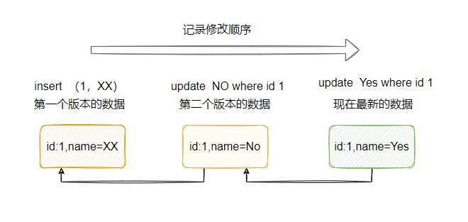
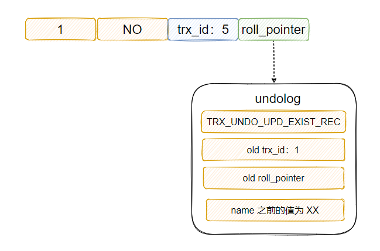
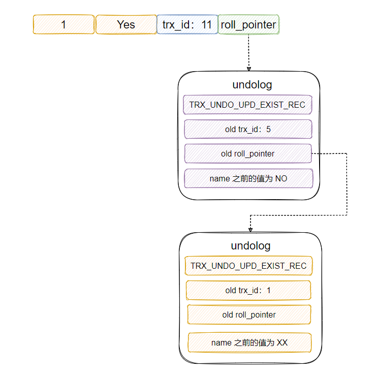

# MVCC

`MVCC` 全称 Multi Version  Concurrency Control 多版本并发控制。

## 基本原理

`MVCC` 的实现依赖于：两个隐藏字段（事务ID、回滚指针）、`undo log` 和 `read view`，其核心思想就是：只能查找事务ID小于等于当前事务ID的行。

#### 隐藏字段

`MySQL` 中会为每一行记录生成隐藏列，和 MVCC 相关的主要是事务ID、回滚指针

1. `DB_TRX_ID`：事务ID，根据事务产生时间顺序自动递增，是独一无二的。

2. `DB_ROLL_PTR`：回滚指针，本质上就是一个指向记录对应的 `undo log` 的指针，通过这个指针找之前版本的数据，多版本之间串联起来就形成了一条版本链。

3. 还有一个删除 `flag` ，标识行是否删除。

#### undo log

每次新增/改动数据都会记录一条 `undo` 日志，每条 `undo` 日志也都有一个 `DB_ROLL_PTR` 属性，可以将这些 `undo` 日志都连成链表，形成版本链。版本链的头节点就是当前记录最新的值，通过这个指针找之前版本的数据。

#### Read View

`read view` 一致性视图 就是在该事务执行的快照读的那一刻，生成数据库系统当前的一个快照。它由执行查询时 **所有未提交的事务ID数组** + **已经创建的最大事务ID** 组成，查询的数据结果需要跟 `read view` 做对比从而得到快照结果。

这样不同时刻启动的事务可以无锁地获得不同版本的数据 (快照读)。此时读写操作不会阻塞，无非就是多加了一个版本，历史版本记录可供已经启动的事务读取。

## 实现例子

拿上面的 `insert (1，XX)` 这条语句举例，成功插入之后数据页的记录上不仅存储 ID 1，name XX，还有 `trx_id` 和 `roll_pointer` 这两个隐藏字段：

- `trx_id`：当前事务ID。
- `roll_pointer`：指向 undo log 的指针。

从图中可以得知此时插入的事务ID是1，此时插入会生成一条 undolog ，并且记录上的 `roll_pointer` 会指向这条 undolog ，而这条 undolog  是一个类型为 `TRX_UNDO_INSERT_REC` 的 log，代表是 `insert` 生成的，里面存储了主键的长度和值 (还有其他值，不提)。

所以 InnoDB 可以根据 undolog  里的主键的值，找到这条记录，然后把它删除来实现 **回滚 (复原)** 的效果。可以简单地理解 undolog 里面存储的就是当前操作的反向操作，认为里面存了个 `delete 1` 就行。

此时事务1提交，然后另一个 ID 为 5 的事务再执行 `update NO where id 1` 这个语句，此时的记录和 undolog 就如下图所示：

之前 `insert` 产生的 undolog 被回收了，不需要再留着。如果有事务要访问更早的版本，让数据对它不可见就好了

而 `update` 产生的 undolog 不一样，它的类型为 `TRX_UNDO_UPD_EXIST_REC`。

假设事务 5 提交，然后另一个 ID 为 11 的事务执行`update Yes where id 1` 这个语句，此时的记录和 undolog 就如下图所示：

`update` 产生的 undolog 不会马上删除，因为可能有别的事务需要访问之前的版本，所以不能删。这样就串成了一个版本链，可以看到记录本身加上两条 undolog，这条 id 为 1 的记录共有三个版本。

## readView

版本链搞清楚了，这时候还需要知道一个概念 readView，这个 readView 就是用来判断哪个版本对当前事务可见的，这里有四个概念：

- `creator_trx_id`，当前事务ID。
- `m_ids`，生成 `readView` 时还活跃的事务ID集合，也就是已经启动但是还未提交的事务ID列表。
- `min_trx_id`，当前活跃ID之中的最小值。
- `max_trx_id`，生成 `readView` 时 InnoDB 将分配给下一个事务的 ID 的值（事务 ID 是递增分配的，越后面申请的事务ID越大）

对于可见版本的判断是从最新版本开始沿着版本链逐渐寻找老的版本，如果遇到符合条件的版本就返回。判断条件如下：

- 如果数据的 `trx_id ==  creator_trx_id` 说明修改这条数据的事务就是当前事务，所以可见。
- 如果数据的 `trx_id < min_trx_id`，说明修改这条数据的事务在当前事务生成 `readView` 的时候已提交，所以可见。
- 如果数据的 `trx_id` 在 `m_ids` 中，说明修改这条数据的事务此时还未提交，所以不可见。
- 如果数据的 `trx_id >= max_trx_id`，说明修改这条数据的事务在当前事务生成 `readView` 的时候还未启动，所以不可见。

来看一个简单的案例，练一练上面的规则

### 读已提交隔离级别下的MVCC

假设此时上文的事务 1 已经提交，事务 5 已经执行，但还未提交，此时有另一个事务在执行 `update YY where id=2`，也未提交，它的事务 ID 为 6，且也是现在最大的事务 ID。

现在有一个查询开启了事务，语句为 `select name where id=1`，那么这个查询语句：

- 此时 `creator_trx_id` 为 0，因为一个事务只有当有修改操作的时候才会被分配事务 ID。
- 此时 `m_ids` 为 [5，6]，这两个事务都未提交，为活跃的。
- 此时 `min_trx_id`，为 5。
- 此时 `max_trx_id`，为 7，因为最新分配的事务 ID 为 6，那么下一个就是7，事务 ID 是递增分配的。

此时最新版本的记录上 `trx_id` 为 5，不比 `min_trx_id` 小，在 `m_ids` 之中，表明还是活跃的，未提交，所以不可访问，根据 `roll_pointer` 找到上一个版本 `1`，比 `min_trx_id` 还小，说明在生成 `readView` 的时候已经提交，所以可以访问，因此返回 **版本1** 的结果。

然后事务 5 提交。

此时再次查询 `select name where id=1`，这时候又会生成新的 `readView`。

- 此时 `m_ids` 为 [6]，因为事务5提交了。
- 此时 `min_trx_id`，为 6。
- 此时 `max_trx_id`，为 7，此时没有新的事务申请。

此时最新版本的记录上 `trx_id` 为 `5`，比 `min_trx_id` 小，说明事务已经提交了，是可以访问的，因此返回 **版本5** 的结果。

这就是读已提交的 MVCC 操作，可以看到一个事务中的两次查询得到了不同的结果，即这个级别下会出现不可重复读。

### 可重复读隔离级别下的MVCC

可重复读和读已提交的 MVCC 判断版本的过程是一模一样的，唯一的差别在生成 readView 上。

上面的读已提交每次查询都会重新生成一个新的 `readView`，而可重复读在事务第一次生成 `readView` 之后的所有查询都共用同一个 `readView `。所以读到的始终是同一份数据。

## 问题

**MVCC 用来实现哪几个隔离级别**

用来实现读已提交 `RC` 和可重复读 `RR`。对于其他两个隔离级别，如果是读未提交的话，直接读最新版本的数据就行了，不需要保存以前的版本。可串行化隔离级别事务都串行执行了，所以也不需要多版本。

**为什么需要 MVCC ？如果没有 MVCC 会怎样？**

我：如果没有 `MVCC` 读写操作之间就会冲突。比如，有一个事务1正在执行，此时一个事务2修改了记录A，还未提交，此时事务1要读取记录A，因为事务2还未提交，所以事务1无法读取最新的记录A，强读的话发生脏读的情况，所以应该读记录A被事务2修改之前的数据，但是记录A已经被事务2改了，所以事务1咋办？只能用锁阻塞等待事务2的提交，这种实现叫 LBCC (Lock-Based Concurrent Control)。

如果有多版本的话，就不一样了。事务2修改的记录 A，还未提交，但是记录 A 被修改之前的版本还在，此时事务1就可以读取之前的版本数据，这样读写之间就不会阻塞了，所以说 MVCC 提高了事务的并发度，提升数据库的性能。

实际上 InnoDB 不会真的存储了多个版本的数据，只是借助 undolog 记录每次写操作的反向操作，所以索引上对应的记录只会有一个版本，即最新版本。只不过可以根据 undolog 中的记录反向操作得到数据的历史版本，所以看起来是多个版本。

**其实 undolog 算是热点资源，多个事务不就会争抢 undolog 了吗**

会，所以为了提高 undolog 的写入性能，每个事务都有属于自己的 undolog 页面链表，这样就提高了写入并发度。

再细一点就是 insert 类型的 undolog 和 update 类型的 undolog 属于不同的链表。

普通表和临时表各有一条 insert 类型的 undolog 和 update 类型的 undolog ，所以最多一个事务可以有四条 undolog 页面链表。

之所以分普通表和临时表是因为普通表的 undolog 写入是需要记录到 redolog 中的需要保证崩溃恢复，而临时表则不需要记录，反正是临时的。

**上面只说了 insert 和 update ，那 delete 呢？**

delete 其实是属于 update 的，不过分了好几种情况，delete 只会给记录上打个标记，表明这条记录被删除了，不会马上删除这条记录，因为记录还得存着给别的事务作为版本链访问。

**那这条被删除的记录就永远存在了？**

不会的，后台有一个 purge 线程，如果探测出当前没有事务会访问这个记录了，就会把它真正的删除。

####  参考

> [是Yes呀 - 关于MySQL的酸与MVCC和面试官小战三十回合](https://mp.weixin.qq.com/s?__biz=MzkxNTE3NjQ3MA==&mid=2247490249&idx=1&sn=4348983da767ff28982324acc1760ce5&chksm=c16277b0f615fea65e1aff38ba209095957a65953018f293ca9a1106e2d56521e09fc121247d&scene=132#wechat_redirect)

