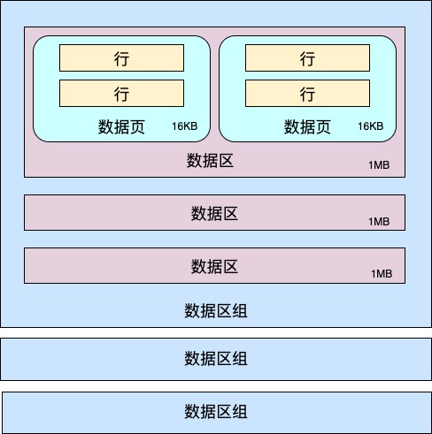

# InnoDB 记录格式

## 页

`InnoDB` 从磁盘中读取数据的最小单位是 **页**，一页默认 `16KB`。就是说，即便我们只查询一条记录，`InnoDB` 也会把至少 `16KB` 的内容从磁盘读到内存中。

页可以存放索引、数据、undo log、buffer 等。

页之间通过指针组成链表。

### 记录插入过程

在数据页中，当记录为空时，`User Records` 是不存在的。随着记录的一条条插入，会不断从 `Free Space` 开辟空间分配给记录

## 数据区

同一个表空间内的一组连续的数据页为一个 `extent`（区），默认区的大小为 `1MB`，页的大小为 `16KB`。`16*64=1024`，也就是说一个区里面会有 `64` 个连续的数据页。连续的 `256` 个数据区为一组数据区。

和广告管理里分广告组、广告计划、广告创意一样，主要是方便管理。

### 页分裂与页合并

这个过程类似 `redis` 的 `quicklist`。

当向写满的数据页里插入数据行时，就需要创建一个新页、移动部分行到新页、修改指针将新页和前后页串联起来。

这样逻辑上水平方向的一致性仍然满足。然而从物理存储上讲页是乱序的，而且大概率会落到不同的区。（即错位）

当你删了一行记录时，实际上记录并没有被物理删除，记录被标记（flaged）为删除并且它的空间变得允许被其他记录声明使用。

当页中删除的记录达到 `MERGE_THRESHOLD`（默认页体积的50%），`InnoDB` 会开始寻找最靠近的页（前或后）看看是否可以将两个页合并以优化空间使用。

### 填充因子

`MySQL` 可以给表设置一个填充因子，意为给每个页预留一定空间，为以后的插入留出空闲的空间，减少页分裂的产生，但可能会造成浪费空间。

## 行

`InnoDB` 的行格式有四种，分别是 `Compact`、`Redundant`、`Dynamic` 和 `Compressed`，它们在原理上大体都是相同的。

`Compact` 行格式的结构大概如图所示：

### 变长字段长度列表

`MySQL` 中有些类型的字段长度是不固定的，比如 `VARCHAR`、`TEXT` 等。`MySQL` 在存储这些变长类型的数据时，实际上分成了两部分存储：

1. 数据长度
2. 真实的数据

其中数据占用的字节数就保存在「变长字段长度列表」中。它是以列的「逆序」存储表中变长字段的实际长度的。

> 为啥是逆序？
>
> 因为每行是通过中间那个 **记录头信息** 串联起来的，因此通过指针遍历时，遍历到的地址是中部的头信息的地址。这样从中部向左，就是变长字段长度列表，和NULL值列表。从中部向右，就是列的值。
>
> 如果向左读到的第一个数据长度为10，那我们就可以知道，向右应当读取10个字节，读到的就是第一列的值。

### NULL 值列表

以一个「二进制位」`bitmap` 来表示一个允许为空的列，仍是「逆序」排列，其中 1 表示 `NULL`，0 表示非 `NULL`。

> 通过变长字段长度列表 + `NULL` 标志位，就可以精准读取到列。读取列时，先读取 `NULL` 标志位判断是不是 `NULL`，不是的话再访问变长列表获取长度即偏移量，通过偏移量即可访问到列。

### 记录头信息

- `delete_mask`：1 位，标记该行是否被删除
- `min_rec_mask`：1位，标记每层非叶子节点中的最小记录
- `n_owned`：4 位，当前记录拥有的记录数
- `heap_no`：13 位，当前记录在记录堆的位置
- `record_type`：3 位，记录的类型（索引/数据等）
- `next_record`：16 位，指向下一行

### 数据

数据又分隐藏列和用户真实数据。

#### 隐藏列

包含 `row_id`、`transaction_id`、`roll_pointer` 三列。

`row_id` 是建表时若未定义主键 / `Unique Key`，`InnoDB` 会用一个全局的自增ID 作为 `row_id`，否则表无法按顺序存储

`transaction_id` 和事务有关。`InnoDB` 里事务进行查询时，会使用一个 `readView`。如果某行的事务ID >  `readView` 的事务ID，说明该行是在查询期间由其他事务生成的，这时就不应该展示这行，避免脏读/不可重复读。

`roll_pointer` 是指向 `undo log` 的指针，主要用于 `MVCC` 。

#### 真实数据

用户真实数据会以数据库指定的编码格式存在文件上。

如果数据长度超过一页，（即行溢出），会使用多页存储。

# 总结

1. 数据在磁盘中的存储在物理空间上面是连续的
2. 数据是被存放在 `MySQL` 设计出来的数据页上面的，数据页上面存储的才是最终的一行一行的记录
3. 行的存储格式默认是 `Compact`
4. 每一行数据都会有相应的行描述部分，描述部分有【变长字段列表】【NULL标志位】【记录头信息】
5. 每一行都会有 `next_record` 指针，指向记录头和变长字段列表的中间某个位置，方便寻址
6. 变长列表中的 `varchar` 列、`NULL` 列的描述是逆序的

#### 参考

> [赐我白日梦 - MySQL数据页以及页分裂机制](https://www.cnblogs.com/ZhuChangwu/p/14041410.html)
>
> [WriteOnRead - InnoDB的一条记录长什么样子](https://zhuanlan.zhihu.com/p/147387036)
>
> [zyz1992 - MySql数据是如何存储在磁盘上存储的？](https://mp.weixin.qq.com/s/txnsywyS_NkYV4BIqPryCw)

