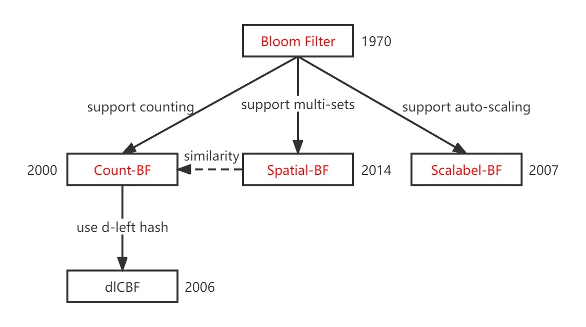

当我们想要快速判断一个元素是否在一个集合中时，首先想到的数据结构一定是 hashmap，但 hashmap 非常占空间。

其次会想到 bitmap。bitmap 将整数元素的值作为数组的下标，通过数组上值为 `0/1` 来标记元素存在。但 bitmap 有两个问题：

1. 只适用于整数
2. 如果集合稀疏，但跨度很大，也会占很多空间，造成浪费（比如只有 4000,000,000 这 1 个数，然而这一个数就需要开 40亿 的空间）

为此 BURTON H. BLOOM 在 1970年提出了一个观点，他认为如果使用的场景可以容忍假阳性错误，那么是存在空间消耗小且运行时间还快的算法（数据结构）的。其中第二种结构，因其在时空上更占优势而被我们熟知，该结构被后人称为 "Bloom Filter"。

# 基本原理

使用多个哈希函数将 key 映射到一个比特数组中的多个位置（可能冲突）并设值为1。

查询时计算相同哈希。

如果有某位为0，则说明被查 key 一定不存在。否则元素很可能在集合

# 演进

CBF支持计数，可以用于网络缓存优化

dlCBF是CBF的改进版，有更小的存储空间

Spatial-BF支持多个集合，配合同态加密使用可以用于户隐私保护

Scalable-BF支持自动扩容，被Redis作为其布隆过滤器的内部实现。

布隆过滤器中的哈希函数选择也是有学问题的，应该选在那些分布均匀计算速度快的，比如Murmur3。

|  | BloomFilter | Counting Bloom Filter(CBF)                                   | Spatial Bloom Filters  | Scalable Bloom Filters                                       |
| ------------ | ----------- | ------------------------------------------------------------ | ---------------------- | ------------------------------------------------------------ |
| 描述 |             | 将布隆过滤器比特数组的1为拓展为多位。插入时，如果冲突就在原值基础上+1 | 将一个集合改为多个集合 | 当集合元素数量接近阈值时，扩容一个新布隆过滤器来记录新数据。查询时需要判断多个布隆过滤器。Redis是用的就是这款 |
| 改进点   |             | 支持计数、删除                                               | 支持多集合             | 自动扩容                                                     |
| 时间复杂度 | O(K) | O(K) | O(K) | 插入: O(K) 查询: O(K0 + ... + Kn) |
| 空间复杂度 | O(M) | O(M*c) | O(M*c) | O(M0 + ... + Mn) |

- M: 布隆过滤器比特数组长度
- K：哈希函数个数
- c：计数的位数

# 布隆过滤器的误差率

假设数组长度为 `m`，`hash` 函数个数为 `k`
- 某一位被置为 `1` 的概率：
$$
1/m
$$

- 某一位没有被置为 `1` 的概率
$$
1-1/m
$$

- `k` 次 `hash` 后都没有被置为 `1` 的概率
$$
(1-1/m)^{k}
$$

- 使用 1/e 的等价交换：
$$
\lim\limits_{m \to ∞}(1-1/m)^{m} = 1/e
$$

- 带入得：
$$
(1-1/m)^{k} = (1/e)^{k/m} ≈ e^{-k/m}
$$

- 如果插入了 `n` 个元素，某一位仍然为 `0` 的概率:
$$
(1-1/m)^{kn} ≈ e^{-kn/m}
$$

- 取反，在插入n个元素后，某一位是 `1` 的概率就为：

$$
1 - e^{-kn/m}
$$

- 最终，某一元素没在集合中，但是被误判在集合中的概率为：（`k` 次 `hash` 都把 `0` 判定为 `1` 的概率）)
$$
(1-e^{kn/m}) ^ {k}
$$

对于实际应用，我们的目标应该是使错判率ε最小。求最小值的过程略，直接上结论：当 `k = (ln2)*(m/n)` 时，误差率最小。以下是k取最优值时，各个参数之间的关系： 
$$
k = - log_2ε
\\
m = 1.44 × k × n
$$

 有了这些参数之间的关系表达式，就能方便的让我们计算最合适的参数。比如我们有 1000w 个黑产账号，需要以不高于 0.001% 错误的的情况下识别出来。则需要的哈希函数个数为：`-log2(0.0001) = 16.6 = 17`，空间为：`1.44 * 17 * 10000000 / 8 / 1024 / 1024 = 29MB `

下面是一个网站，能帮忙我们快速计算各个参数：[Bloom filter calculator](https://hur.st/bloomfilter/?n=10M&p=1.0E-5&m=&k=)

# 问题

#### 为什么布隆过滤器不支持删除

比特位上的1实际会对应多个元素，删除某元素后会影响其他元素。

比如 key a 对应比特位3、5，key b 对应5、10。若将a对应的3、5号位清空，则会影响b的判断。

