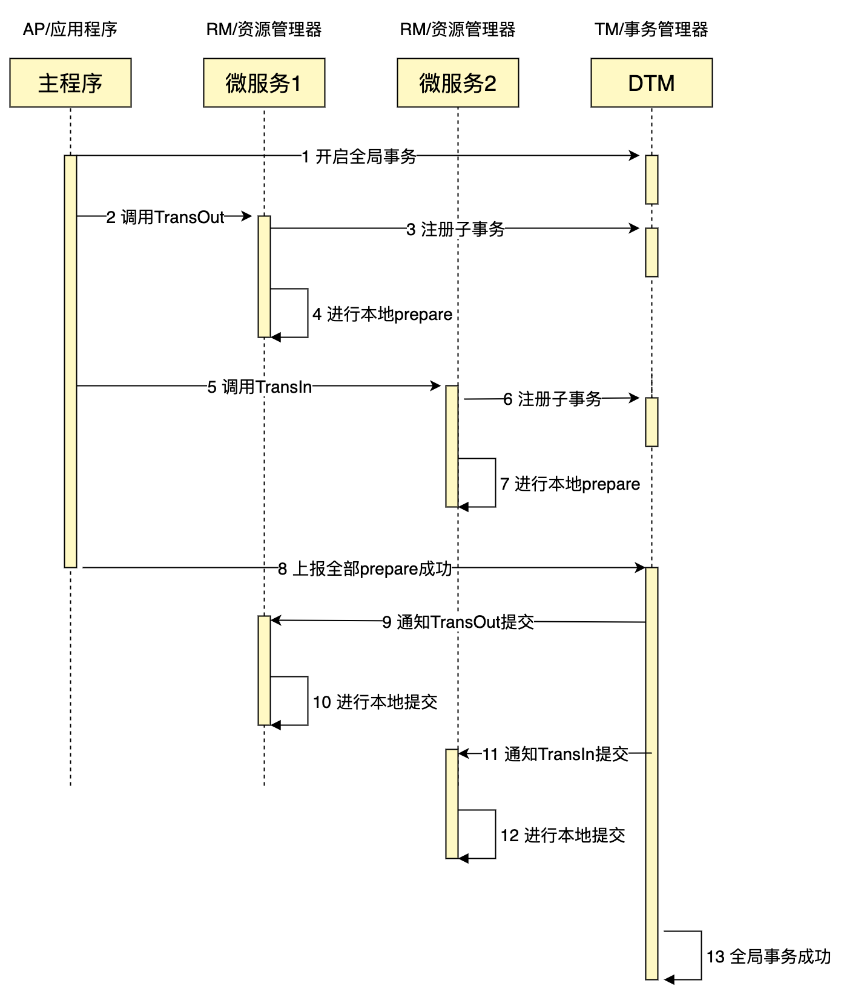
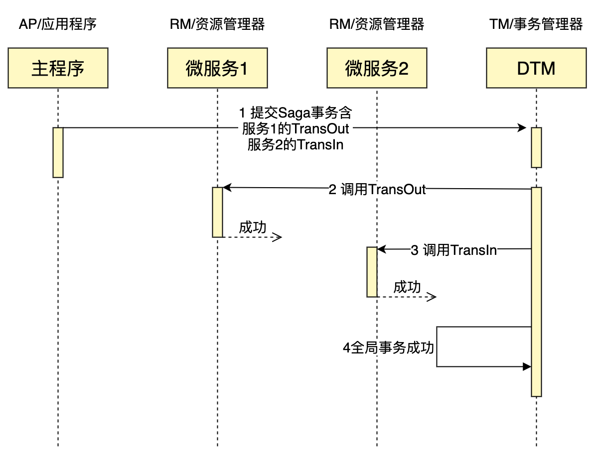
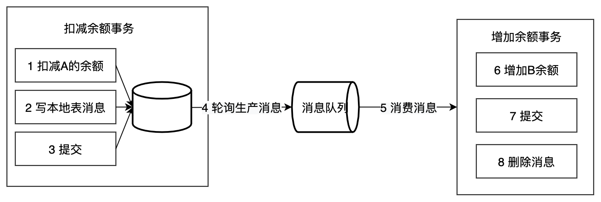

# 2阶段提交 / 2PC / XA

XA 是由 X/Open 组织提出的分布式事务的规范，XA 规范主要定义了 (全局) 事务管理器 (TM) 和(局部)资源管理器 (RM) 之间的接口。本地的数据库如 MySQL 在 XA 中扮演的是 RM 角色

XA 一共分为两阶段：

1. `prepare`：即所有的参与者 RM 准备执行事务并锁住需要的资源。参与者 ready 时，向 TM 报告已准备就绪。 
2. `commit / rollback`：当事务管理者 (TM) 确认所有参与者 (RM) 都 ready 后，向所有参与者发送 `commit` 命令。 目前主流的数据库基本都支持 XA 事务，包括 MySQL、Oracle、SQL Server、PostgreSQL
3. 如果有任何一个参与者 `prepare` 失败，那么 TM 会通知所有完成 prepare 的参与者进行回滚。

XA 事务由一个或多个资源管理器（RM）、一个事务管理器（TM）和一个应用程序（ApplicationProgram）组成。

XA 事务的特点是：

- 简单易理解，开发较容易
- 对资源进行了长时间的锁定，并发度低
- 第二阶段如果部分参与者没有收到 `commit`，会导致数据不一致

# 3PC

三段提交（3PC）是对两段提交（2PC）的一种升级优化，`3PC` 在 `2PC` 的第一阶段和第二阶段中插入一个准备阶段。保证了在最后提交阶段之前，各参与者节点的状态都一致。同时在协调者和参与者中都引入超时机制，当参与者未收到协调者的 `commit` 请求后，会对本地事务进行 `commit`，不会一直阻塞等待，解决了`2PC`的单点故障问题，但 `3PC` 还是没能从根本上解决数据一致性的问题。

`3PC` 的三个阶段分别是 `CanCommit`、`PreCommit`、`DoCommit`

# 补偿事务 / TCC

关于 `TCC (Try-Confirm-Cancel)`的概念，最早是由 Pat Helland 于 2007 年发表的一篇名为《Life beyond Distributed Transactions:an Apostate’s Opinion》的论文提出。核心思想是：针对每个操作都要注册一个与其对应的确认（Confirm）和补偿（Cancel）

`TCC` 分为 3 个阶段

- Try 阶段：尝试执行，完成所有业务检查（一致性）, 预留必须业务资源（准隔离性）
- Confirm 阶段：确认执行真正执行业务，不作任何业务检查，只使用 Try 阶段预留的业务资源，Confirm 操作要求具备幂等设计，Confirm 失败后需要进行重试。
- Cancel 阶段：取消执行，释放 Try 阶段预留的业务资源。Cancel 阶段的异常和 Confirm 阶段异常处理方案基本上一致，要求满足幂等设计。

**TCC的缺点：**

- 应用侵入性强：TCC由于基于在业务层面，至使每个操作都需要有 `try`、`confirm`、`cancel`三个接口。
- 开发难度大：代码开发量很大，要保证数据一致性 `confirm` 和 `cancel` 接口还必须实现幂等性。

# Sega

核心思想是将长事务拆分为多个本地短事务，由 Saga 事务协调器协调，如果正常结束那就正常完成，如果某个步骤失败，则根据相反顺序一次调用补偿操作。

Saga 事务的特点：

- 并发度高，不用像 XA 事务那样长期锁定资源
- 需要定义正常操作以及补偿操作，开发量比 XA 大
- 一致性较弱，对于转账，可能发生 A 用户已扣款，最后转账又失败的情况

Saga 适用的场景较多，长事务适用，对中间结果不敏感的业务场景适用。

# 本地消息表

本地消息表这个方案最初是 ebay 架构师 Dan Pritchett 在 2008 年发表给 ACM 的文章。设计核心是将需要分布式处理的任务通过消息的方式来异步确保执行。

写本地消息和业务操作放在一个事务里，保证了业务和发消息的原子性，要么他们全都成功，要么全都失败。

容错机制：

- 扣减余额事务失败时，事务直接回滚，无后续步骤
- 轮序生产消息失败， 增加余额事务失败则不会回滚，会重试（需要保证幂等）

本地消息表的特点：

- 长事务仅需要分拆成多个任务，使用简单
- 生产者需要额外的创建消息表
- 每个本地消息表都需要进行轮询
- 消费者的逻辑如果无法通过重试成功，那么还需要更多的机制，来回滚操作

适用于可异步执行的业务，且后续操作无需回滚的业务

# 最大努力通知

和前面介绍的的本地消息表类似，但消息的可靠性关键不再由发起方来保证，而是由接收方保证。接收方需要定期主动调用发起方的接口查询业务处理结果。

解决方案上，最大努力通知需要：

- 提供接口，让接受通知放能够通过接口查询业务处理结果
- 消息队列 `ACK` 机制，消息队列按照间隔 1min、5min、10min、30min、1h、2h、5h、10h 的方式，逐步拉大通知间隔 ，直到达到通知要求的时间窗口上限。之后不再通知

最大努力通知适用于业务通知类型，例如微信交易的结果，就是通过最大努力通知方式通知各个商户，既有回调通知，也有交易查询接口。

# 异常处理

在分布式事务的各个环节都有可能出现网络以及业务故障等问题，这些问题需要分布式事务的业务方做到防空回滚，幂等，防悬挂（回滚比提交先到）三个特性。

建议的方案是业务方通过事务签名生成唯一键，去查询相关联的操作是否已完成，如果已完成则直接返回成功。可以业务方自己实现，也可以做一个中间件实现。

###  
