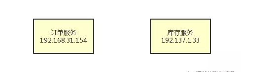

# Consul服务注册与服务发现机制

1、什么是服务注册中心？

顾名思义，假设你有一个分布式系统，里面包含了多个服务，部署在不同的机器上，然后这些不同机器上的服务之间要互相调用。

举个现实点的例子吧，比如电商系统里的订单服务需要调用库存服务，如下图所示。

现在的问题在于，订单服务在192.168.31.154这台机器上，库存服务在192.137.1.33这台机器上。

现在订单服务是想要调用库存服务，但是他并不知道库存服务在哪台机器上啊！毕竟人家都是在不同机器上的。

所以这个时候就需要服务注册中心出场了，这个时候你的系统架构中需要引入独立部署在一台机器上的服务注册中心，如下图所示。

然后订单服务、库存服务之类的兄弟，都需要配置上服务注册中心部署在哪台机器上，比如192.168.31.45这台机器。

接着订单服务、库存服务他们自己启动的时候，就得发送请求到到服务注册中心上去进行服务注册。也就是说，得告诉服务注册中心，自己是哪个服务，然后自己部署在哪台机器上。然后服务注册中心会把大家注册上来的信息放在注册表里，如下图。

​    接着订单服务假如想要调用库存服务，那么就找服务注册中心问问：能不能告诉我库存服务部署在哪台机器上？服务注册中心是知道这个信息的，所以就会告诉订单服务：库存服务部署在192.1371.133这台机器上，你就给这台机器发送请求吧。然后，订单服务就可以往库存服务的那台机器发送请求了，完成了服务间的调用。整个过程，如下图所示：

​    上述就是服务注册中心的作用、地位以及意义，现在大家应该知道服务注册中心的作用了吧。好！接着我们就来看看[Consul](https://so.csdn.net/so/search?q=Consul&spm=1001.2101.3001.7020)作为服务注册中心，他的架构设计原理是什么？

2、Consul服务注册中心的整体架构

​    如果要基于Consul作为服务注册中心，那么首先必须在每个服务所在的机器上部署一个Consul Agent，作为一个服务所在机器的代理。然后还得在多台机器上部署Consul Server，这就是核心的服务注册中心。这个Consul Agent可以用来收集你的服务信息然后发送给Consul Server，还会对你的服务不停的发送请求检查他是否健康。然后你要发现别的服务的时候，Consul Agent也会帮你转发请求给Consul Server，查询其他服务所在机器。Consul Server一般要求部署3~5台机器，以保证高可用以及数据一致性。他们之间会自动实现数据同步，而且Consul Server集群会自动选举出一台机器作为leader，其他的Consul Server就是follower。咱们看下面的图，先感受一下这个Consul他整体的架构。

3、Consul如何通过Raft协议实现强一致性？

   Eureka服务注册中心是不保证数据一致性的。这样的话，很可能你注册的服务，其他人是发现不了的，或者很迟才能发现。

OK，那么这里就来讨论一下Consul是如何实现数据一致性的。首先，大家知道Consul Server是部署集群的，而且他会选举出来一台Server作为Leader。

   接下来各个服务发送的注册请求都会落地给Leader，由Leader同步给其他Follower。所以首先第一点，Leader Server是绝对有最新的服务注册信息的，是不是？比如库存服务发起注册了，那么Leader Server上一定有库存服务的注册信息。接着如果比如订单服务要发现库存服务的话，这个查询请求会发送给Leader Server。这样服务注册和发现，都是通过一台Leader Server来进行的，就可以保证服务注册数据的强一致性了，大家看下图。

​    接着大家想，假如说库存服务在注册的时候数据刚写到Leader Server，结果Leader Server就宕机了，这时候怎么办？那么此时这条注册数据就丢失了，订单服务就没法发现那个库存服务了。没关系，这里Consul会基于Raft协议来解决这个问题。

​    首先，库存服务注册到Leader Server的时候，会采取Raft协议，要求必须让Leader Server把这条注册数据复制给大部分的Follower Server才算成功。这就保证了，如果你认为自己注册成功了，那么必然是多台Consul Server都有这条注册数据了。如果你刚发送给Leader Server他自己就宕机了，那么这次注册会认为失败。此时，Consul Server集群会重新选举一个Leader Server出来，你需要再次重新注册。这样就可以保证你注册成功的数据绝对不会丢，然后别人发现服务的时候一定可以从Leader Server上获取到最新的强一致的注册数据。

整个过程，如下图所示：

上面的图就可以看到，只要你注册的时候基于Raft协议强制同步到大多数Server，哪怕是Leader挂了，也会选举新的Leader。这样就可以让别人从新的Leader Server来发现你这个服务，所以数据是绝对强一致的。

4、Consul如何通过Agent实现分布式健康检查？

   最后说说Consul是如何通过各个服务机器上部署Agent来实现分布式健康检查的。集中式的心跳机制，比如传统的Eureka，是让各个服务都必须每隔一定时间发送心跳到Eureka Server。如果一段时间没收到心跳，那么就认为这个服务宕机了。

   但是这种集中式的心跳机制会对Eureka Server造成较大的心跳请求压力，实际上平时Eureka Server接收最多的请求之一就是成千上万服务发送过来的心跳请求。

   所以Consul在这块进行了架构优化，引入了Agent概念。   每个机器上的Consul Agent会不断的发送请求检查服务是否健康，是否宕机。如果服务宕机了，那么就会通知Consul Server。怎么样？是不是发现各个服务自己不用再发送心跳请求去Server了？减小了Server这部分的压力吧？没错，这就是Consul基于Agent实现的分布式健康检查机制，可以大幅度的减小Server端的压力。这样一来，哪怕你就部署个三五台机器，可以轻松支持成千上万个服务。咱们再来一张图，一起来看看：

# 原文链接

[xxxcyzyy - Consul服务注册与服务发现机制](https://blog.csdn.net/xxxcyzyy/article/details/104764219)