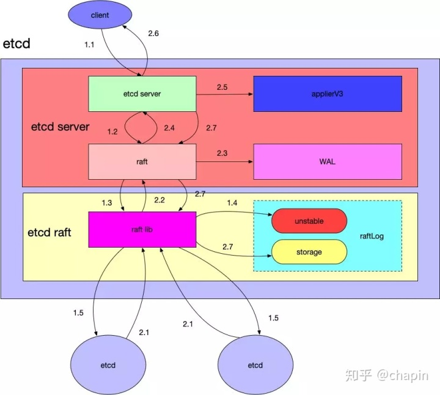

# 模块

1. 用于与客户端交互和底层 raft 模块通信的  etcd-server
2. 用于与集群中其他 etcd 节点通信的  etcd-raft
3. 用于存储日志的 etcd-WAL
4. 用于持久化用户数据的 etcd-storage
5. 用于与客户端交互的 etcd-client
6. 用于模块通信之间的 网络协议

一个请求与一个 etcd 集群的交互主要流程分为两大部分：

1. 写数据到某个 etcd server 中。
2. 该 etcd server 与集群中的其他 etcd 节点进行交互， 当确保数据已经被存储之后应答客户端

**请求流程划分为了以下几个子步骤：**

- 1.1：etcd server 收到客户端请求。
- 1.2：etcd server 将请求发送给本模块的 raft.go，这里负责与 etcd raft 模块进行通信。
- 1.3：raft.go 将数据封装成 raft 日志的形式提交给 raft 模块。
- 1.4：raft 模块会首先保存到 raftLog 的 unstable 存储部分。
- 1.5：raft 模块通过 raft 协议与集群中其他 etcd 节点进行交互。
- 写入数据的 etcd 是 leader 节点，因为在 raft 协议中，如果提交数据到非leader节点的话需要路由到 etcd leader 节点去。

**应答步骤如下：**

- 2.1 ：集群中其他节点向 leader 节点应答接收这条数据库。
- 2.2：当 leader 节点收到超过半数以上应答接收这条日志数据的节点时，etcd raft 通过 Ready 结构体通知 etcd server 中的 raft 该日志数据已经 commit。
- 2.3：raft.go 收到 Ready 数据时，首先将这条日志写到 WAL 模块中。
- 2.4：通知最上层的 etcd server  该日志已经 commit。
- 2.5：etcd server 调用 applierV3 模块将日志写入持久化存储中。
- 2.6：etcd server 应答客户端该数据写入成功。
- 2.7：最后 etcd server 调用 etcd raft，修改其 raftLog 模块的数据，将这条日志写入 raftLog storage 中。

# 参考

[chapin666 - 如何阅读 etcd 源码](https://zhuanlan.zhihu.com/p/164598281)