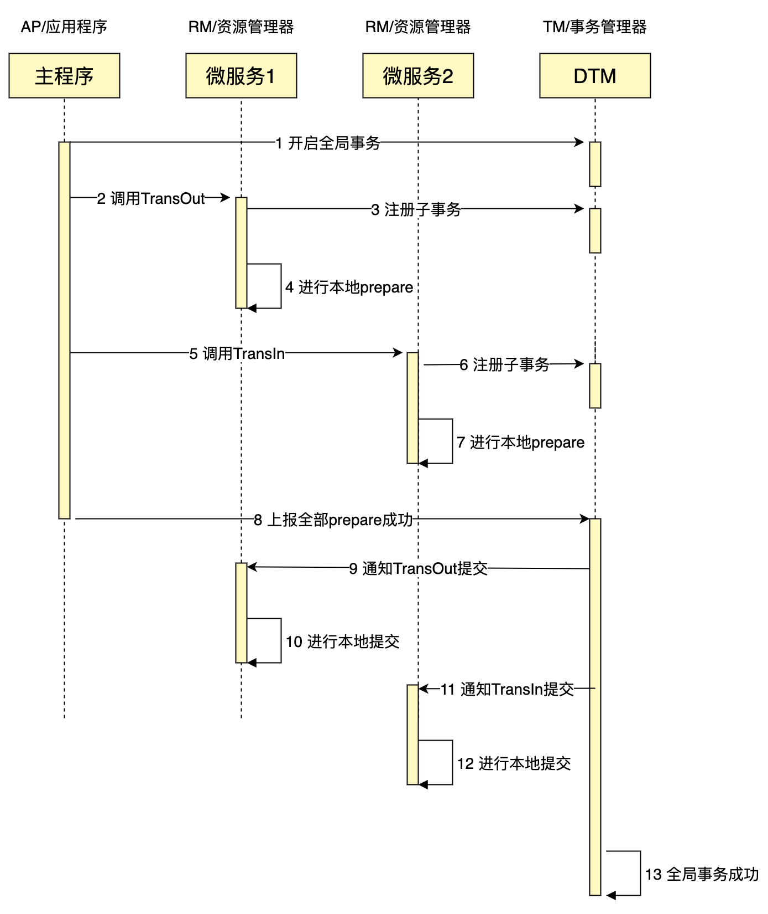
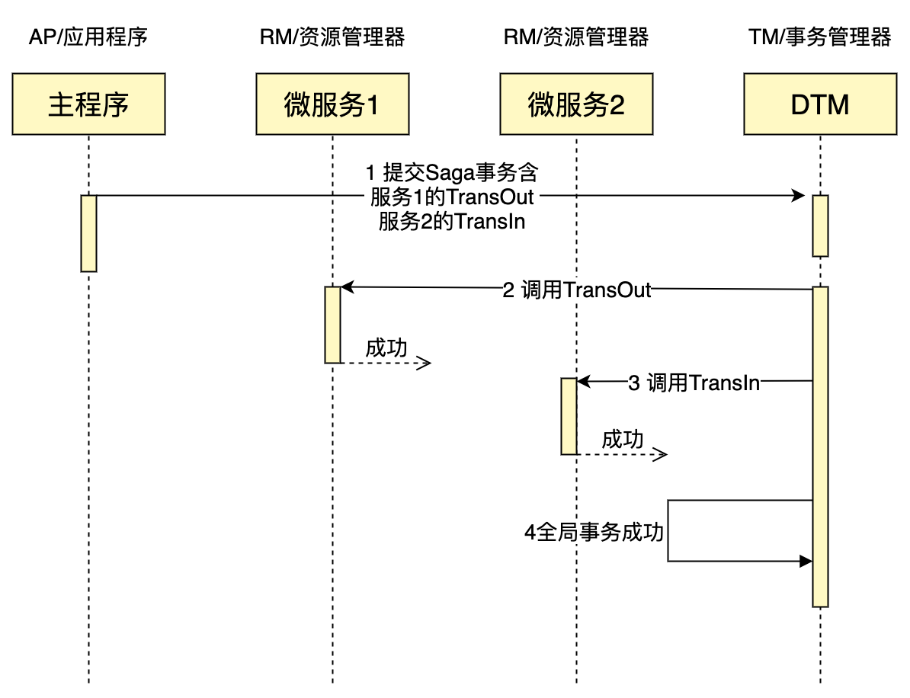
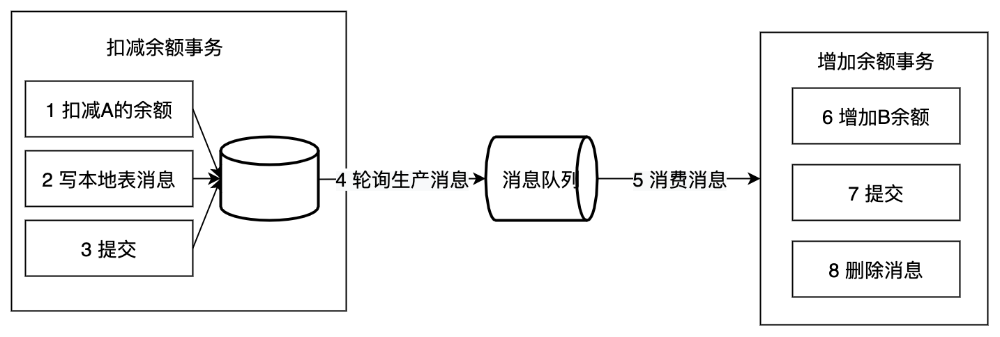

分布式事务重点解决两个问题：

1. 步骤 A、B、C 依序完成
2. 对每个步骤（如 A），至少有一个节点保证 A 完成

# 2阶段提交 / 2PC / XA

XA 是由 X/Open 组织提出的分布式事务的规范，XA 规范主要定义了 (全局) 事务管理器 (TM) 和(局部)资源管理器 (RM) 之间的接口。本地的数据库如 MySQL 在 XA 中扮演的是 RM 角色

XA 一共分为两阶段：

1. `prepare`：即所有的参与者 RM 准备执行事务并锁住需要的资源。参与者 ready 时，向 TM 报告已准备就绪。 
2. `commit / rollback`：当事务管理者 (TM) 确认所有参与者 (RM) 都 ready 后，向所有参与者发送 `commit` 命令。 目前主流的数据库基本都支持 XA 事务，包括 MySQL、Oracle、SQL Server、PostgreSQL
3. 如果有任何一个参与者 `prepare` 失败，那么 TM 会通知所有完成 `prepare` 的参与者进行回滚。

XA 事务由一个或多个资源管理器（RM）、一个事务管理器（TM）和一个应用程序（ApplicationProgram）组成。

XA 事务的特点是：

- 简单易理解，开发较容易
- 对资源进行了长时间的锁定，并发度低
- 第二阶段如果部分参与者没有收到 `commit`，会导致数据不一致

# 3PC

三段提交（3PC）是对两段提交（2PC）的一种升级优化，`3PC` 在 `2PC` 的第一阶段和第二阶段中插入一个准备阶段。保证了在最后提交阶段之前，各参与者节点的状态都一致。同时在协调者和参与者中都引入超时机制，当参与者未收到协调者的 `commit` 请求后，会对本地事务进行 `commit`，不会一直阻塞等待，解决了`2PC`的单点故障问题，但 `3PC` 还是没能从根本上解决数据一致性的问题。

`3PC` 的三个阶段分别是 `CanCommit`、`PreCommit`、`DoCommit`

# 补偿事务 / TCC

关于 `TCC (Try-Confirm-Cancel)`的概念，最早是由 Pat Helland 于 2007 年发表的一篇名为《Life beyond Distributed Transactions:an Apostate’s Opinion》的论文提出。核心思想是：针对每个操作都要注册一个与其对应的确认（Confirm）和补偿（Cancel）

`TCC` 分为 3 个阶段

- Try 阶段：尝试执行，完成所有业务检查（一致性）, 预留必须业务资源（准隔离性）
- Confirm 阶段：确认执行真正执行业务，不作任何业务检查，只使用 Try 阶段预留的业务资源，Confirm 操作要求具备幂等设计，Confirm 失败后需要进行重试。
- Cancel 阶段：取消执行，释放 Try 阶段预留的业务资源。Cancel 阶段的异常和 Confirm 阶段异常处理方案基本上一致，要求满足幂等设计。

**TCC的缺点：**

- 应用侵入性强：TCC由于基于在业务层面，至使每个操作都需要有 `try`、`confirm`、`cancel`三个接口。
- 开发难度大：代码开发量很大，要保证数据一致性 `confirm` 和 `cancel` 接口还必须实现幂等性。

# Sega

核心思想是将长事务拆分为多个本地短事务，由 Saga 事务协调器协调，如果正常结束那就正常完成，如果某个步骤失败，则根据相反顺序一次调用补偿操作。

Saga 事务的特点：

- 并发度高，不用像 XA 事务那样长期锁定资源
- 需要定义正常操作以及补偿操作，开发量比 XA 大
- 一致性较弱，对于转账，可能发生 A 用户已扣款，最后转账又失败的情况

Saga 适用的场景较多，长事务适用，对中间结果不敏感的业务场景适用。

# 本地消息表

本地消息表这个方案最初是 ebay 架构师 Dan Pritchett 在 2008 年发表给 ACM 的文章。设计核心是将需要分布式处理的任务通过消息的方式来异步确保执行。

写本地消息和业务操作放在一个事务里，保证了业务和发消息的原子性，要么他们全都成功，要么全都失败。

容错机制：

- 扣减余额事务失败时，事务直接回滚，无后续步骤
- 轮序生产消息失败， 增加余额事务失败则不会回滚，会重试（需要保证幂等）

本地消息表的特点：

- 长事务仅需要分拆成多个任务，使用简单
- 生产者需要额外的创建消息表
- 每个本地消息表都需要进行轮询
- 消费者的逻辑如果无法通过重试成功，那么还需要更多的机制，来回滚操作

适用于可异步执行的业务，且后续操作无需回滚的业务

# 事务消息

在上述的本地消息表方案中，生产者需要额外创建消息表，还需要对本地消息表进行轮询，业务负担较重。阿里开源的 RocketMQ 4.3 之后的版本正式支持事务消息，该事务消息本质上是把本地消息表放到 RocketMQ 上，解决生产端的消息发送与本地事务执行的原子性问题。

# 最大努力通知

和前面介绍的的本地消息表类似，但消息的可靠性关键不再由发起方来保证，而是由接收方保证。接收方需要定期主动调用发起方的接口查询业务处理结果。

解决方案上，最大努力通知需要：

- 提供接口，让接受通知放能够通过接口查询业务处理结果
- 消息队列 `ACK` 机制，消息队列按照间隔 1min、5min、10min、30min、1h、2h、5h、10h 的方式，逐步拉大通知间隔 ，直到达到通知要求的时间窗口上限。之后不再通知

最大努力通知适用于业务通知类型，例如微信交易的结果，就是通过最大努力通知方式通知各个商户，既有回调通知，也有交易查询接口。

# 异常处理

在分布式事务的各个环节都有可能出现网络以及业务故障等问题，这些问题需要分布式事务的业务方做到防空回滚，幂等，防悬挂（回滚比提交先到）三个特性。

建议的方案是业务方通过事务签名生成唯一键，去查询相关联的操作是否已完成，如果已完成则直接返回成功。可以业务方自己实现，也可以做一个中间件实现。

# 如何选择最适合你的分布式事务方案

由于分布式事务方案，无法做到 ACID 的保证，没有一种完美的方案，能够解决掉所有业务问题。因此在实际应用中，会根据业务的不同特性，选择最适合的分布式事务方案。

### 多个微服务组合成原子操作

有一类业务场景是需要把多个微服务组合成原子操作：假设您有一个活动业务，用户点击领取按钮后，会领取一张优惠券，和一个月的会员。优惠券和会员分别属于不同的服务，需要都被调用，不希望出现一个服务调用成功，另一个因为网络或者其他故障导致没有成功。

这个场景适合可靠消息方案，可以使用 RocketMQ、RabbitMQ 等，发送给消息队列的消息，一定要等收到队列接收确认，再返回应用程序。

### 本地事务 + 多个微服务组合为原子操作

有一类业务与前一种业务情况类似，但有一些差别：假设您有一个新用户注册成功后，领取一张优惠券和一个月会员。如果注册不成功，不希望调用领取；只有注册成功才领取。

这种情况，适合本地消息方案，或者事务消息方案。这两种方案都能保证本地事务和消息的原子性。

### 订单类对一致性要求较高的业务

订单交易类业务，涉及资金、库存、优惠券等多个服务，完成一个订单，需要相关的各个服务组合成一个整体可回滚的事务。如果订单进行过程中金额先扣减，后续因为库存不够只能退款，把金额补偿加回来。在这个过程中用户看到了金额减少，又金额变回来，体验很差。一般这类业务都会先冻结资金，如果订单能成功，再扣减资金；不能成功，则解冻资金，这样能够让资金信息对用户更友好。

这种场景适合 TCC 方案，可以在 TCC 的 Try 中冻结资金，Confirm 中扣减资金，Cancel 中解冻资金。

### 一致性要求不高的可回滚业务

如果业务对事务中的一致性要求不高，允许用户看到中间状态，例如用户的积分数据等。

这种模式适用 Saga 模式，Saga 对比与 TCC，只有正向操作和逆向补偿操作，会更加简单。

### 耗时较久的全局事务

耗时较旧的全局事务适合可靠消息和 Saga，不适合 TCC 和 XA，因为大多数的 XA 和 TCC 实现，为了方便用户灵活的定义事务，通常把事务的进度保存在应用程序，一旦事务进行中应用程序崩溃，无法往前进行下一步，只能回滚。

Saga 和可靠消息，把事务进度保存在数据库或消息系统中。任何一个组件临时的失败也没关系，如果重试成功，能够让事务继续。

其中如果整个事务是需要回滚的，那么适合 Saga，不需要回滚的，适合可靠消息。

### 并发度较低的业务

如果业务并发度不高，事务又需要支持回滚，那么适合 XA 方案。XA 方案，除了并发不高，也还需要本地数据库能支持 XA 接口。这个方案的优点是，使用上较简单，比较接近本地事务。

 

#### 参考

[分布式事务最经典的七种解决方案](https://dtm.pub/blogs/classic-dtrans.html)
