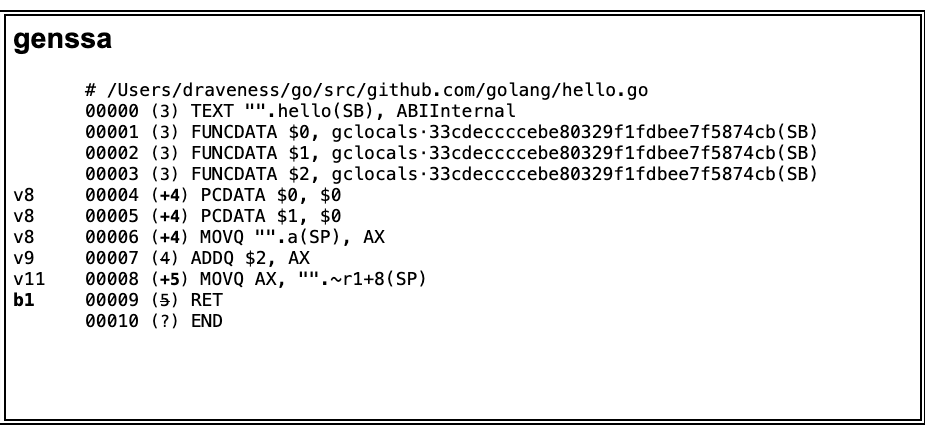

# 2.5 机器码生成

Go 语言编译的最后一个阶段是根据 SSA 中间代码生成机器码，这里谈的机器码是在目标 CPU 架构上能够运行的二进制代码，[中间代码生成](https://draveness.me/golang/docs/part1-prerequisite/ch02-compile/golang-ir-ssa/)一节简单介绍的从抽象语法树到 SSA 中间代码的生成过程，将近 50 个生成中间代码的步骤中有一些过程严格上说是属于机器码生成阶段的。

机器码的生成过程其实是对 SSA 中间代码的降级（lower）过程，在 SSA 中间代码降级的过程中，编译器将一些值重写成了目标 CPU 架构的特定值，降级的过程处理了所有机器特定的重写规则并对代码进行了一定程度的优化；在 SSA 中间代码生成阶段的最后，Go 函数体的代码会被转换成 [`cmd/compile/internal/obj.Prog`](https://draveness.me/golang/tree/cmd/compile/internal/obj.Prog) 结构。

## 2.5.1 指令集架构

[指令集架构](https://en.wikipedia.org/wiki/Instruction_set_architecture)是计算机的抽象模型，在很多时候也被称作架构或者计算机架构，它是计算机软件和硬件之间的接口和桥梁<sup>1</sup>；一个为特定指令集架构编写的应用程序能够运行在所有支持这种指令集架构的机器上，也就是说如果当前应用程序支持 x86 的指令集，那么就可以运行在所有使用 x86 指令集的机器上，这其实就是抽象层的作用，每一个指令集架构都定义了支持的数据结构、寄存器、管理主内存的硬件支持（例如内存一致、地址模型和虚拟内存）、支持的指令集和 IO 模型，它的引入其实就在软件和硬件之间引入了一个抽象层，让同一个二进制文件能够在不同版本的硬件上运行。

如果一个编程语言想要在所有的机器上运行，它就可以将中间代码转换成使用不同指令集架构的机器码，这可比为不同硬件单独移植要简单的太多了。


**图 2-16 计算机软硬件之间的桥梁**


最常见的指令集架构分类方法是根据指令的复杂度将其分为复杂指令集（CISC）和精简指令集（RISC），复杂指令集架构包含了很多特定的指令，但是其中的一些指令很少会被程序使用，而精简指令集只实现了经常被使用的指令，不常用的操作都会通过组合简单指令来实现。

[复杂指令集](https://en.wikipedia.org/wiki/Complex_instruction_set_computer)的特点就是指令数目多并且复杂，每条指令的字节长度并不相等，x86 就是常见的复杂指令集处理器，它的指令长度大小范围非常广，从 1 到 15 字节不等，对于长度不固定的指令，计算机必须额外对指令进行判断，这需要付出额外的性能损失<sup>2</sup>。

而[精简指令集](https://en.wikipedia.org/wiki/Reduced_instruction_set_computer)对指令的数目和寻址方式做了精简，大大减少指令数量的同时更容易实现，指令集中的每一个指令都使用标准的字节长度、执行时间相比复杂指令集会少很多，处理器在处理指令时也可以流水执行，提高了对并行的支持。作为一种常见的精简指令集处理器，arm 使用 4 个字节作为指令的固定长度，省略了判断指令的性能损失<sup>3</sup>，精简指令集其实就是利用了我们耳熟能详的 20/80 原则，用 20% 的基础指令和它们的组合来解决问题。

最开始的计算机使用复杂指令集是因为当时计算机的性能和内存比较有限，业界需要尽可能地减少机器需要执行的指令，所以更倾向于高度编码、长度不等以及多操作数的指令。不过随着计算机性能的提升，出现了精简指令集这种牺牲代码密度换取简单实现的设计；除此之外，硬件的飞速提升还带来了更多的寄存器和更高的时钟频率，软件开发人员也不再直接接触汇编代码，而是通过编译器和汇编器生成指令，复杂的机器指令对于编译器来说很难利用，所以精简指令在这种场景下更适合。

复杂指令集和精简指令集的使用是设计上的权衡，经过这么多年的发展，两种指令集也相互借鉴和学习，与最开始刚被设计出来时已经有了较大的差别，对于软件工程师来讲，复杂的硬件设备对于我们来说已经是领域下三层的知识了，其实不太需要掌握太多，但是对指令集架构感兴趣的读者可以找一些资料开拓眼界。


## 2.5.2 机器码生成

机器码的生成在 Go 的编译器中主要由两部分协同工作，其中一部分是负责 SSA 中间代码降级和根据目标架构进行特定处理的 [`cmd/compile/internal/ssa`](https://github.com/golang/go/tree/master/src/cmd/compile/internal/ssa) 包，另一部分是负责生成机器码的 [`cmd/internal/obj`](https://github.com/golang/go/tree/master/src/cmd/internal/obj)<sup>4</sup>：

- [`cmd/compile/internal/ssa`](https://github.com/golang/go/tree/master/src/cmd/compile/internal/ssa) 主要负责对 SSA 中间代码进行降级、执行架构特定的优化和重写并生成 [`cmd/compile/internal/obj.Prog`](https://draveness.me/golang/tree/cmd/compile/internal/obj.Prog) 指令；
- [`cmd/internal/obj`](https://github.com/golang/go/tree/master/src/cmd/internal/obj) 作为汇编器会将这些指令转换成机器码完成这次编译；

### SSA 降级

SSA 降级是在中间代码生成的过程中完成的，其中将近 50 轮处理的过程中，`lower` 以及后面的阶段都属于 SSA 降级这一过程，这么多轮的处理会将 SSA 转换成机器特定的操作：

```go
var passes = [...]pass{
	...
	{name: "lower", fn: lower, required: true},
	{name: "lowered deadcode for cse", fn: deadcode}, // deadcode immediately before CSE avoids CSE making dead values live again
	{name: "lowered cse", fn: cse},
	...
	{name: "trim", fn: trim}, // remove empty blocks
}
```

上面 `passes` 的第一行就是 `lower`，这是SSA 降级执行的第一个阶段，该阶段的入口方法是 [`cmd/compile/internal/ssa.lower`](https://draveness.me/golang/tree/cmd/compile/internal/ssa.lower) 函数，它会将 SSA 的中间代码转换成机器特定的指令：

```go
func lower(f *Func) {
	applyRewrite(f, f.Config.lowerBlock, f.Config.lowerValue)
}
```

向 [`cmd/compile/internal/ssa.applyRewrite`](https://draveness.me/golang/tree/cmd/compile/internal/ssa.applyRewrite) 传入的两个函数 `lowerBlock` 和 `lowerValue` 是在[中间代码生成](https://draveness.me/golang/docs/part1-prerequisite/ch02-compile/golang-ir-ssa/)阶段初始化 SSA 配置时确定的，这两个函数会分别转换函数中的代码块和代码块中的值。

假设目标机器使用 x86 的架构，最终会调用 [`cmd/compile/internal/ssa.rewriteBlock386`](https://draveness.me/golang/tree/cmd/compile/internal/ssa.rewriteBlock386) 和 [`cmd/compile/internal/ssa.rewriteValue386`](https://draveness.me/golang/tree/cmd/compile/internal/ssa.rewriteValue386) 两个函数，这两个函数是两个巨大的 switch 语句，前者总共有 2000 多行，后者将近 700 行，用于处理 x86 架构重写的函数总共有将近 30000 行代码，你能在 [`cmd/compile/internal/ssa/rewrite386.go`](https://github.com/golang/go/blob/master/src/cmd/compile/internal/ssa/rewrite386.go) 这里找到文件的全部内容，我们只节选其中的一段展示一下：

```go
func rewriteValue386(v *Value) bool {
	switch v.Op {
	case Op386ADCL:
		return rewriteValue386_Op386ADCL_0(v)
	case Op386ADDL:
		return rewriteValue386_Op386ADDL_0(v) || rewriteValue386_Op386ADDL_10(v) || rewriteValue386_Op386ADDL_20(v)
	...
	}
}

func rewriteValue386_Op386ADCL_0(v *Value) bool {
	// match: (ADCL x (MOVLconst [c]) f)
	// cond:
	// result: (ADCLconst [c] x f)
	for {
		_ = v.Args[2]
		x := v.Args[0]
		v_1 := v.Args[1]
		if v_1.Op != Op386MOVLconst {
			break
		}
		c := v_1.AuxInt
		f := v.Args[2]
		v.reset(Op386ADCLconst)
		v.AuxInt = c
		v.AddArg(x)
		v.AddArg(f)
		return true
	}
	...
}
```

重写的过程会将通用的 SSA 中间代码转换成目标架构特定的指令，上述的 `rewriteValue386_Op386ADCL_0` 函数会使用 `ADCLconst` 替换 `ADCL` 和 `MOVLconst` 两条指令，它能通过对指令的压缩和优化减少在目标硬件上执行所需要的时间和资源。

我们在上一节中间代码生成中已经介绍过 [`cmd/compile/internal/gc.compileSSA`](https://draveness.me/golang/tree/cmd/compile/internal/gc.compileSSA) 中调用 [`cmd/compile/internal/gc.buildssa`](https://draveness.me/golang/tree/cmd/compile/internal/gc.buildssa) 的执行过程，我们在这里继续介绍 [`cmd/compile/internal/gc.buildssa`](https://draveness.me/golang/tree/cmd/compile/internal/gc.buildssa) 函数返回后的逻辑：

```go
func compileSSA(fn *Node, worker int) {
	f := buildssa(fn, worker)
	pp := newProgs(fn, worker)
	defer pp.Free()
	genssa(f, pp)

	pp.Flush()
}
```

[`cmd/compile/internal/gc.genssa`](https://draveness.me/golang/tree/cmd/compile/internal/gc.genssa) 函数会创建一个新的 [`cmd/compile/internal/gc.Progs`](https://draveness.me/golang/tree/cmd/compile/internal/gc.Progs) 结构并将生成的 SSA 中间代码都存入新建的结构体中，我们在上一节得到的 ssa.html 文件就包含最后生成的中间代码：



**图 2-18 genssa 的执行结果**

上述输出结果跟最后生成的汇编代码已经非常相似了，随后调用的 [`cmd/compile/internal/gc.Progs.Flush`](https://draveness.me/golang/tree/cmd/compile/internal/gc.Progs.Flush) 会使用 [`cmd/internal/obj`](https://github.com/golang/go/tree/master/src/cmd/internal/obj) 包中的汇编器将 SSA 转换成汇编代码：

```go
func (pp *Progs) Flush() {
	plist := &obj.Plist{Firstpc: pp.Text, Curfn: pp.curfn}
	obj.Flushplist(Ctxt, plist, pp.NewProg, myimportpath)
}
```

[`cmd/compile/internal/gc.buildssa`](https://draveness.me/golang/tree/cmd/compile/internal/gc.buildssa) 中的 `lower` 和随后的多个阶段会对 SSA 进行转换、检查和优化，生成机器特定的中间代码，接下来通过 [`cmd/compile/internal/gc.genssa`](https://draveness.me/golang/tree/cmd/compile/internal/gc.genssa) 将代码输出到 [`cmd/compile/internal/gc.Progs`](https://draveness.me/golang/tree/cmd/compile/internal/gc.Progs) 对象中，这也是代码进入汇编器前的最后一个步骤。

### 汇编器

汇编器是将汇编语言翻译为机器语言的程序，Go 语言的汇编器是基于 Plan 9 汇编器的输入类型设计的，Go 语言对于汇编语言 Plan 9 和汇编器的资料十分缺乏，网上能够找到的资料也大多都含糊不清，官方对汇编器在不同处理器架构上的实现细节也没有明确定义：

> The details vary with architecture, and we apologize for the imprecision; the situation is **not well-defined**.<sup>5</sup>

我们在研究汇编器和汇编语言时不应该陷入细节，只需要理解汇编语言的执行逻辑就能够帮助我们快速读懂汇编代码。当我们将如下的代码编译成汇编指令时，会得到如下的内容：

```go
$ cat hello.go
package hello

func hello(a int) int {
	c := a + 2
	return c
}
$ GOOS=linux GOARCH=amd64 go tool compile -S hello.go
"".hello STEXT nosplit size=15 args=0x10 locals=0x0
	0x0000 00000 (main.go:3)	TEXT	"".hello(SB), NOSPLIT, $0-16
	0x0000 00000 (main.go:3)	FUNCDATA	$0, gclocals·33cdeccccebe80329f1fdbee7f5874cb(SB)
	0x0000 00000 (main.go:3)	FUNCDATA	$1, gclocals·33cdeccccebe80329f1fdbee7f5874cb(SB)
	0x0000 00000 (main.go:3)	FUNCDATA	$3, gclocals·33cdeccccebe80329f1fdbee7f5874cb(SB)
	0x0000 00000 (main.go:4)	PCDATA	$2, $0
	0x0000 00000 (main.go:4)	PCDATA	$0, $0
	0x0000 00000 (main.go:4)	MOVQ	"".a+8(SP), AX
	0x0005 00005 (main.go:4)	ADDQ	$2, AX
	0x0009 00009 (main.go:5)	MOVQ	AX, "".~r1+16(SP)
	0x000e 00014 (main.go:5)	RET
	0x0000 48 8b 44 24 08 48 83 c0 02 48 89 44 24 10 c3     H.D$.H...H.D$..
...
```

上述汇编代码都是由 [`cmd/internal/obj.Flushplist`](https://draveness.me/golang/tree/cmd/internal/obj.Flushplist) 这个函数生成的，该函数会调用架构特定的 `Preprocess` 和 `Assemble` 方法：

```go
func Flushplist(ctxt *Link, plist *Plist, newprog ProgAlloc, myimportpath string) {
	...

	for _, s := range text {
		mkfwd(s)
		linkpatch(ctxt, s, newprog)
		ctxt.Arch.Preprocess(ctxt, s, newprog)
		ctxt.Arch.Assemble(ctxt, s, newprog)
		linkpcln(ctxt, s)
		ctxt.populateDWARF(plist.Curfn, s, myimportpath)
	}
}
```

Go 编译器会在最外层的主函数确定调用的 `Preprocess` 和 `Assemble` 方法，编译器在 2.1.4 中提到的 [`cmd/compile.archInits`](https://draveness.me/golang/tree/cmd/compile.archInits) 中根据目标硬件初始化当前架构使用的配置。

如果目标机器的架构是 x86，那么这两个函数最终会使用 [`cmd/internal/obj/x86.preprocess`](https://draveness.me/golang/tree/cmd/internal/obj/x86.preprocess) 和 [`cmd/internal/obj/x86.span6`](https://draveness.me/golang/tree/cmd/internal/obj/x86.span6)，作者在这里就不展开介绍这两个特别复杂的底层函数了，有兴趣的读者可以通过链接找到目标函数的位置了解预处理和汇编的处理过程，机器码的生成也都是由这两个函数组合完成的。

## 2.5.3 小结

机器码生成作为 Go 语言编译的最后一步，其实已经到了硬件和机器指令这一层，其中对于内存、寄存器的处理非常复杂并且难以阅读，想要真正掌握这里的处理的步骤和原理还是需要耗费很多精力。

作为软件工程师，如果不是 Go 语言编译器的开发者或者需要经常处理汇编语言和机器指令，掌握这些知识的投资回报率实在太低，我们只需要对这个过程有所了解，补全知识上的盲点，在遇到问题时能够快速定位即可。

------

1. Instruction set architecture https://en.wikipedia.org/wiki/Instruction_set_architecture [↩︎](https://draveness.me/golang/docs/part1-prerequisite/ch02-compile/golang-machinecode/#fnref:1)
2. 复杂指令集 Complex instruction set computer https://en.wikipedia.org/wiki/Complex_instruction_set_computer [↩︎](https://draveness.me/golang/docs/part1-prerequisite/ch02-compile/golang-machinecode/#fnref:2)
3. 精简指令集 Reduced instruction set computer https://en.wikipedia.org/wiki/Reduced_instruction_set_computer [↩︎](https://draveness.me/golang/docs/part1-prerequisite/ch02-compile/golang-machinecode/#fnref:3)
4. Introduction to the Go compiler https://github.com/golang/go/blob/master/src/cmd/compile/README.md [↩︎](https://draveness.me/golang/docs/part1-prerequisite/ch02-compile/golang-machinecode/#fnref:4)
5. A Quick Guide to Go’s Assembler https://golang.org/doc/asm [↩︎](https://draveness.me/golang/docs/part1-prerequisite/ch02-compile/golang-machinecode/#fnref:5)


#### 原文链接

https://draveness.me/golang/docs/part1-prerequisite/ch02-compile/golang-machinecode/