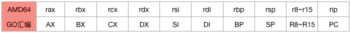

# 1. CPU 寄存器简介

寄存器是CPU内部的存储单元，用于存放从内存读取而来的数据（包括指令）和CPU运算的中间结果，之所以要使用寄存器来临时存放数据而不是直接操作内存，一是因为CPU的工作原理决定了有些操作运算只能在CPU内部进行，二是因为CPU读写寄存器的速度比读写内存的速度快得多。

为了便于交流和使用汇编语言进行编程，CPU厂商为每个寄存器都取了一个名字，比如AMD64 CPU中的rax, rbx, rcx, rdx等等，这样程序员就可以很方便的在汇编代码中使用寄存器的名字来进行编程，为了对寄存器的使用有个直观的感受，我们用个例子来简单的说明一下。

假设有如下go语言编写的一行代码：

```go
c = a + b
```

在AMD64 Linux平台下，使用go编译器编译它可得到如下AT&T格式的汇编代码（如果对汇编代码不熟悉的话可以直接看每一条指令后面的注释，不影响我们理解）：

```assembly
mov   (%rsp),%rdx      // 把变量a的值从内存中读取到寄存器rdx中
mov   0x8(%rsp),%rax   // 把变量b的值从内存中读取到寄存器rax中
add   %rdx,%rax        // 把寄存器rdx和rax中的值相加，并把结果放回rax寄存器中
mov   %rax,0x10(%rsp)  // 把寄存器rax中的值写回变量c所在的内存
```

可以看到，上面的一行go语言代码被编译成了4条汇编指令，指令中出现的rax，rdx和rsp都是寄存器的名字（AT&T格式的汇编代码中所有寄存器名字前面都有一个%符号），虽然这里只有4条指令，但也从一个侧面说明汇编代码其实比较简单，它所做的工作不外乎就是把数据在内存和寄存器中搬来搬去或做一些基础的数学和逻辑运算。

不同体系结构的CPU，其内部寄存器的数量、种类以及名称可能大不相同，这里我们只介绍目前使用最为广泛的AMD64这种体系结构的CPU，这种CPU共有20多个可以直接在汇编代码中使用的寄存器，其中有几个寄存器在操作系统代码中才会见到，而应用层代码一般只会用到如下分为三类的19个寄存器。


## 1.1. 通用寄存器

rax, rbx, rcx, rdx, rsi, rdi, rbp, rsp, r8, r9, r10, r11, r12, r13, r14, r15寄存器。CPU对这16个通用寄存器的用途没有做特殊规定，程序员和编译器可以自定义其用途（下面会介绍，rsp/rbp寄存器其实是有特殊用途的）


### rsp 栈顶寄存器和rbp栈基址寄存器

rsp: stack pointer register 栈顶指针寄存器

rbp: base pointer register 栈基址指针寄存器

这两个寄存器都跟函数调用栈有关，其中rsp寄存器一般用来存放函数调用栈的栈顶地址，而rbp寄存器通常用来存放函数的栈帧起始地址，编译器一般使用这两个寄存器加一定偏移的方式来访问函数局部变量或函数参数，比如：

```assembly
mov    0x8(%rsp),%rdx
```

这条指令把地址为 0x8(%rsp) 的内存中的值拷贝到rdx寄存器，这里的0x8(%rsp) 就利用了 rsp 寄存器加偏移 8 的方式来读取内存中的值。


## 1.2. 程序计数寄存器（PC寄存器/IP寄存器）

rip: instruction pointer register 指令指针寄存器

rip 寄存器里面存放的是CPU即将执行的下一条指令在内存中的地址。看如下汇编语言代码片段：

```assembly
0x0000000000400770: add   %rdx,%rax
0x0000000000400773: mov   $0x0,%ecx
```

假设当前CPU正在执行第一条指令，这条指令在内存中的地址是0x0000000000400770，紧接它后面的下一条指令的地址是0x0000000000400773，所以此时rip寄存器里面存放的值是0x0000000000400773。

**这里需要牢记的就是rip寄存器的值不是正在被CPU执行的指令在内存中的地址，而是紧挨这条正在被执行的指令后面那一条指令的地址。**

读者可能会有疑问，在前面的两个汇编指令片段中并没有指令修改rip寄存器的值，是怎么做到让它一直指向下一条即将执行的指令的呢？其实修改rip寄存器的值是CPU自动控制的，不需要我们用指令去修改，当然CPU也提供了几条可以间接修改rip寄存器的指令，在汇编语言一节中我们会详细介绍CPU自动修改以及用指令修改rip寄存器值的两种方式。


## 1.3. 段寄存器

fs和gs寄存器。一般用它来实现线程本地存储（TLS），比如AMD64 linux平台下go语言和pthread都使用fs寄存器来实现系统线程的TLS，在本章线程本地存储一节和第二章详细分析goroutine调度器的时候我们可以分别看到Linux平台下Pthread线程库和go是如何使用fs寄存器的。


# Go汇编语言使用的寄存器

go汇编语言中使用的寄存器的名字与AMD64不太一样，下表显示了它们之间的对应关系：




## 2.1 虚拟寄存器

除了这些跟AMD64 CPU硬件寄存器一一对应的寄存器外，go汇编还引入了几个没有任何硬件寄存器与之对应的虚拟寄存器，这些寄存器一般用来存放内存地址，引入它们的主要目的是为了方便程序员和编译器用来定位内存中的代码和数据。

- FP虚拟寄存器：主要用来引用函数参数。go语言规定函数调用时参数都必须放在栈上，比如被调用函数使用 `xxx + 0(FP)`  来引用调用者传递进来的第一个参数，用 `xxx + 8(FP)` 来引用第二个参数

- SB虚拟寄存器：保存的是代码区的起始地址，它主要用来定位全局符号。go汇编中的函数定义、函数调用、全局变量定义以及对其引用会用到这个SB虚拟寄存器。


## 2.2 操作码

AT&T格式的寄存器操作码一般使用小写且寄存器的名字前面有个%符号，而go汇编使用大写而且寄存器名字前没有%符号，比如:

```assembly
# AT&T格式
mov %rbp,%rsp

# go汇编格式
MOVQ BP,SP
```


## 2.3 操作数宽度（即操作数的位数）

AT&T格式的汇编指令中如果有寄存器操作数，则根据寄存器的名字（比如rax, eax, ax, al分别代表64，32，16和8位寄存器）就可以确定操作数到底是多少位（8，16，32还是64位），所以不需要操作码后缀，如果没有寄存器操作数又是访存指令的话，则操作码需要加上后缀b、w、l或q来指定到底存取内存中的多少个字节。

而go汇编中，寄存器的名字没有位数之分，比如AX寄存器没有什么RAX, EAX之类的名字，指令中一律只能使用AX。所以如果指令中有操作数寄存器或是指令需要访问内存，则操作码都需要带上后缀B(8位)、W(16位)、D(32位)或Q(64位)。


## 2.4 函数定义

还是以 Go runtime 中的 `gogo` 函数为例：

```assembly
// func gogo(buf *gobuf)
// restore state from Gobuf; longjmp
TEXT runtime·gogo(SB), NOSPLIT, $16-8
......
```

`TEXT runtime·gogo(SB)`：指明在代码区定义了一个名字叫 `gogo` 的全局函数（符号），该函数属于 `runtime` 包。

`NOSPLIT`：指示编译器不要在这个函数中插入检查栈是否溢出的代码。

`$16-8`：数字16说明此函数的栈帧大小为16字节，8说明此函数的参数和返回值一共需要占用8字节内存。因为这里的gogo函数没有返回值，只有一个指针参数，对于AMD64平台来说指针就是8字节。go语言中函数调用的参数和函数返回值都是放在栈上的，而且这部分栈内存是由调用者而非被调用函数负责预留，所以在函数定义时需要说明到底需要在调用者的栈帧中预留多少空间。


#### 原文链接

[张方波 - go语言调度器源代码情景分析之二：CPU寄存器](https://mp.weixin.qq.com/s?__biz=MzU1OTg5NDkzOA==&mid=2247483660&idx=1&sn=ea75d8fdb4b2e0eac03449d63172fe3e&scene=19#wechat_redirect)

[张方波 - go语言调度器源代码情景分析之六：go汇编语言](https://mp.weixin.qq.com/s?__biz=MzU1OTg5NDkzOA==&mid=2247483704&idx=1&sn=a5e9f1fd2c0de42d5710afbb4553d411&scene=19#wechat_redirect)


