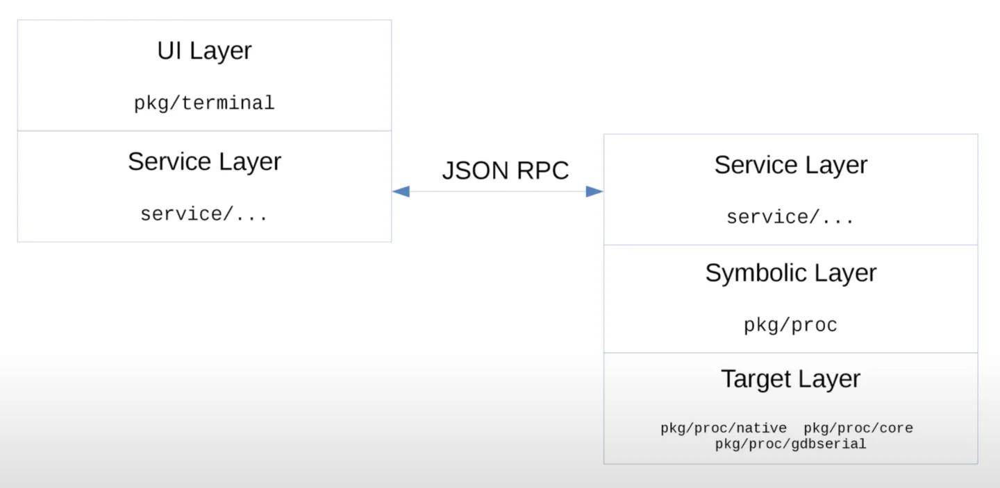

[TOC]

# 背景

目前 `Go` 语言支持 `GDB`、`LLDB`、`Delve` 调试器，其中 GDB 是最早支持的调试工具，LLDB 是 macOS 系统推荐的标准调试工具。只有 `Delve` 是专门为 `Go` 语言设计开发的调试工具（比如优化了 `error, channel` 结构体的打印、针对协程栈扩容做了优化等），所以使用 `Delve`可以轻松调试 `Go` 汇编程序。

delve 的安装：`go install github.com/go-delve/delve/cmd/dlv@latest`


# dlv 使用

dlv 有如下常见使用方法：

1. debug: `dlv debug ${源代码.go}`，调试 go 源码文件
1. attach: `dlv attach ${进程pid}`，调试正在运行的进程，断点会阻塞进程，因此不建议线上使用
1. core: `dlv core ${bin} ${core_file}`，分析转储文件，可用于分析程序 panic 时的现场、原因
1. api: `./dlv --listen=127.0.0.1:26953 --headless=true --api-version=2 --check-go-version=false --only-same-user=false attach ${pid}`，可用于远程调试


以 debug  方式为例，看一看如何调试 `Go` 源码

大家都知道向一个 `nil` 的切片追加元素，不会有任何问题，在源码中是怎么实现的呢？接下来我们使用 `dlv` 调试跟踪一下，先写一个 `playground.go`:

```go
package main

import "fmt"

func main() {
    var s []int
    s = append(s, 1)
    fmt.Println(s)
}
```


进入命令行包目录，然后输入 `dlv debug` 进入调试

```bash
dlv debug playground.go
```


因为这里我们想看到 `append` 的内部实现，所以在 `append` 那行加上断点，执行 `break` 命令：

```bash
(dlv) break ./playground.go:7
Breakpoint 1 set at 0x100255268 for main.main() ./playground.go:7
```


执行 `continue` 命令，运行到断点处：

```go
(dlv) continue
> main.mwatchain() ./playground.go:7 (hits goroutine(1):1 total:1) (PC: 0x100255268)
     2: 
     3: import "fmt"
     4: 
     5: func main() {
     6:     var s []int
=>   7:     s = append(s, 1)
     8:     fmt.Println(s)
     9: }

```


接下来我们执行 `disassemble` 反汇编命令查看 `main` 函数对应的汇编代码：

```assembly
(dlv) disassemble
TEXT main.main(SB) /.../playground.go
        ...
=>      playground.go:7 0x10aba57*      488d05a2740000  lea rax, ptr [rip+0x74a2]
        ...
        playground.go:7 0x100255280     d097fe97        CALL runtime.growslice(SB)
        playground.go:8 0x1002552b8     76a0fd97        CALL runtime.convTslice(SB)
```


从以上内容我们看到调用了 `runtime.growslice` 方法，我们在这里加一个断点：

```bash
(dlv) break runtime.growslice
Breakpoint 2 set at 0x1001fb1d0 for runtime.growslice() /usr/local/go/src/runtime/slice.go:166
```


之后我们再次执行  `continue`  执行到该断点处：

```go
(dlv) continue
> runtime.growslice() /usr/local/go/src/runtime/slice.go:157 (hits goroutine(1):1 total:1) (PC: 0x10225fd3c)
...
=> 166: func growslice(et *_type, old slice, cap int) slice {
   167:         if raceenabled {
   168:                 callerpc := getcallerpc()
   169:                 racereadrangepc(old.array, uintptr(old.len*int(et.size)), callerpc, abi.FuncPCABIInternal(growslice))
   170:         }
```

点进 `/usr/local/go/src/runtime/slice.go:157` 就可以看到完整的切片扩容策略；到这里大家也就明白了为啥向 `nil` 的切片追加数据不会有问题了，因为在容量不够时会调用 `growslice` 函数进行扩容


## 常用命令

`dlv --help`：可看到 dlv 命令行支持的命令

`dlv debug ${xxx.go}`：调试源代码

`dlv exec ${bin}`：调试可执行文件

`dlv attach ${pid}`：调试指定 pid 进程


通过 `dlv debug ${xxx.go}` 进入交互模式后，可通过 `help/h` 命令查看支持的交互命令


**控制流**

`continue/c`：执行函数到下一断点

`next/n`：跳到下一个断点

`step/s`：单步调试

`stepout/so`：跳出当前单步调试到下一个断点


**断点管理**

`break/b ${文件名:行号} 或 ${包名.函数名}` ：打断点

`breakpoints/bp`：列出所有断点

`clear ${断点号}`：清除断点

`condition/cond ${断点号} ${条件表达式}`：为断点添加条件

`watch -[r/w/rw] ${变量名}`：在变量读/写时打断点


**查看状态**

`print/p ${表达式}`：打印

`stack/bt` ：查看当前函数调用栈信息

`locals` ：查看当前函数所有变量值

`funcs ${关键词}`：列出包含关键词的函数


**协程相关命令**

`goroutines/grs` 命令查看所有协程

`goroutine/gr` 命令查看当前协程

`gr ${goid}` 进入指定协程


下面放另一个例子看下上述命令的用法，先放源代码：

```go
// dlv/demo.go

package main

import "fmt"

func appendNums(s []int, totalRound int) []int {
	c := 1

	go func() {
		println("hi")
	}()

	for c <= totalRound {
		s = append(s, c)
		c++
	}
	return s
}

func main() {
	var s []int
	s = appendNums(s, 3)
	fmt.Println(s)
}
```


然后进入 `dlv`：

```bash
➜  dlv git:(master) dlv debug demo.go

# 在第11、15行打断点
(dlv) b demo.go:11
(dlv) b demo.go:15

# 设置断点2条件：c==2 时才打断点
(dlv) cond 2 c==2

# 运行到断点1
(dlv) c
> main.appendNums.func1() ./demo.go:11 (hits goroutine(6):1 total:1) (PC: 0x100ca44b4)
     6: 
     7: func appendNums(s []int, totalRound int) []int {
     8:         c := 1
     9: 
    10:         go func() {
=>  11:                 c = 0

# 查看协程列表
(dlv) grs
  Goroutine 1 - User: ./demo.go:15 main.appendNums (0x100ca43dc) (thread 18123103)
  Goroutine 2 - User: /usr/local/go/src/runtime/proc.go:382 runtime.gopark (0x100c34f68) [force gc (idle)]
  Goroutine 3 - User: /usr/local/go/src/runtime/proc.go:382 runtime.gopark (0x100c34f68) [GC sweep wait]
  Goroutine 4 - User: /usr/local/go/src/runtime/proc.go:382 runtime.gopark (0x100c34f68) [GC scavenge wait]
  Goroutine 5 - User: /usr/local/go/src/runtime/proc.go:382 runtime.gopark (0x100c34f68) [finalizer wait]
* Goroutine 6 - User: ./demo.go:11 main.appendNums.func1 (0x100ca44b4) (thread 18124501)
[6 goroutines]

# 在变量c发生读时打断点
(dlv) watch -w c

# 查看所有断点
(dlv) bp
Breakpoint runtime-fatal-throw (enabled) at 0x100c32710,0x100c327d0 for (multiple functions)() <multiple locations>:0 (0)
Breakpoint unrecovered-panic (enabled) at 0x100c32a70 for runtime.fatalpanic() /usr/local/go/src/runtime/panic.go:1141 (0)
        print runtime.curg._panic.arg
Breakpoint 1 (enabled) at 0x100ca44b4 for main.appendNums.func1() ./demo.go:11 (1)
Breakpoint 2 (enabled) at 0x100ca43dc for main.appendNums() ./demo.go:15 (0)
        cond c == 2
Watchpoint c (enabled) at 0x1400001a0b8 (0)

(dlv) c
> watchpoint on [c] main.appendNums() ./demo.go:12 (hits goroutine(1):1 total:1) (PC: 0x1022b03c4)

(dlv) c
> watchpoint on [c] main.appendNums() ./demo.go:12 (hits goroutine(1):2 total:2) (PC: 0x1022b03c4)

(dlv) locals
c = 3

(dlv) p s
[]int len: 3, cap: 4, [1,2,3]
```


# 远程调试

其实很多 Golang IDE 的 debugger 使用的就是 dlv，以  IntelliJ IDEA 的 为例，点击 debug 图标后，可以在控制台输出看到它使用的 dlv 路径：
```bash
"/Users/xxx/Library/Application Support/JetBrains/IntelliJIdea2023.1/plugins/go-plugin/lib/dlv/macarm/dlv" --listen=127.0.0.1:51683 --headless=true --api-version=2 --check-go-version=false --only-same-user=false exec /Users/xxx/Library/Caches/JetBrains/IntelliJIdea2023.1/tmp/GoLand/___go_build_github_com_WTIFS_project_diva_src_myGo --
```

 其中的 `--listen` 参数表示将 dlv 作为一个服务启动，可通过其后面指定的地址交互。这样可以在生产环境机器上启动 dlv，然后在 IDE 的 debugger 里配置这个地址，就可以远程 debug、短点调试了


# 基本原理

delve 的源码可以看这里：https://github.com/go-delve/delve

其基本原理是：

1. 将断点这一地址的指令覆盖掉，替换成一条新的指令：当执行该指令时，线程停止运行并发送信号
2. 将 dlv 进程作为被调试程序的父进程，子进程执行到断点时会发信号给 dlv 进程，dlv 进程等待用户的进一步指令


# 架构

Delve的整体架构如下：

- UI Layer，直接与用户交互，接受用户输入的指令；各 IDE 实现的就是这层
- （Service Layer）抽象出的一个服务层，作为 UI 和 Symbolic 层中间的层，通过 RPC 交互
  - 通过这样的架构可以分离客户端和被调试程序，从而支持远端调试
- Symbolic Layer，转换源码和内存地址，拥有代码行号、数据类型、变量名等信息
- Target Layer，控制被调试进程，读写目标进程的寄存器




## Symbol layer

编译器会向可执行文件中写入一些用于调试的信息，我们称为 debug symbol，Symbolic Layer 所做的事情就是从可执行文件中读取这些符号

Go语言采用的 debug symbol 规范是 DWARFv4 (2018年)，DWARF 中比较重要的有三种：

- debug_line：这是一个表，它将指令地址映射到文件:行号
- debug_frame：堆栈解压信息。
- debug_info：描述程序中的所有函数、类型和变量

Delve通过 debug_info 找到函数名，通过 debug_line 找到某条指令对应的代码在哪个文件的哪一行，再通过 debug_frame 获取指令地址


## Target Layer

作用是控制目标进程。在delve 中提供了对 target layer 的三种实现方式：

- pkg/proc/native: 使用 os API call 控制目标进程， Linux 和Windows 的默认实现方式
- pkg/proc/core: 读取linuxs 的core dump 文件。
- pkg/proc/gdbserial: 通过 TCP/IP 连接服务器。采用的协议叫做 GDB Remote Serial Protocol，GDB的标准远程通信协议

这里展开看下 `pkg/proc/native/proc_linux.go`：

```go
// pkg/proc/native/proc_linux.go
func Attach(pid int, debugInfoDirs []string) (*proc.TargetGroup, error) {
    dbp := newProcess(pid) // 新建 dlv 进程
    dbp.execPtraceFunc(func() { err = ptraceAttach(dbp.pid) })
}

// pkg/proc/native/ptrace_linux.go
// 实际调用 linux 的 ptrace 命令
func ptraceAttach(pid int) error {
	  return sys.PtraceAttach(pid)
}
```


可以看到  linux 下的 dlv attach 命令实际调用了 linux 提供的 `ptrace` API。

ptrace 系统调从名字上看是用于进程跟踪的，它提供了父进程可以观察和控制其子进程执行的能力，并允许父进程检查和替换子进程的内核镜像 (包括寄存器)的值。其基本原理是: 当使用了ptrace跟踪后，所有发送给被跟踪的子进程的信号(除了SIGKILL)，都会被转发给父进程，而子进程则会被阻塞，这时子进程的状态就会被系统标注为TASK_TRACED。而父进程收到信号后，就可以对停止下来的子进程进行检查和修改，然后让子进程继续运行。


当我们用 dlv 设置断点时, dlv 会把断点处的指令修改成 int 3, 同时把断点信息及修改前的指令保存起来. 当被调试子进程运行到断点处时, 便会执行 int 3命令, 从而产生 SIGTRAP 信号. 由于 dlv 已经用 ptrace 和调试进程建立了跟踪关系, 此时的 SIGTRAP 信号会被发送给 dlv, dlv 通过和已有的断点信息做对比 (通过指令位置) 来判断这次 SIGTRAP 是不是一个断点。
如果是断点的话, 就回等待用户的输入以做进一步的处理. 如果用户的命令是继续执行的话, dlv 就会先恢复断点处的指令, 然后执行对应的代码。


# 参考

[AsongGo - 分享如何阅读Go源码](https://mp.weixin.qq.com/s/c2yPBbDLjiSrpYP62p-uKQ)

[曹春晖 - Delve 调试器](https://chai2010.cn/advanced-go-programming-book/ch3-asm/ch3-09-debug.html)

[mercury - Dlv 深入探究](https://zhuanlan.zhihu.com/p/364346530)

[日天不吃糖 - Delve的内部架构与实现](https://zhuanlan.zhihu.com/p/538725747)