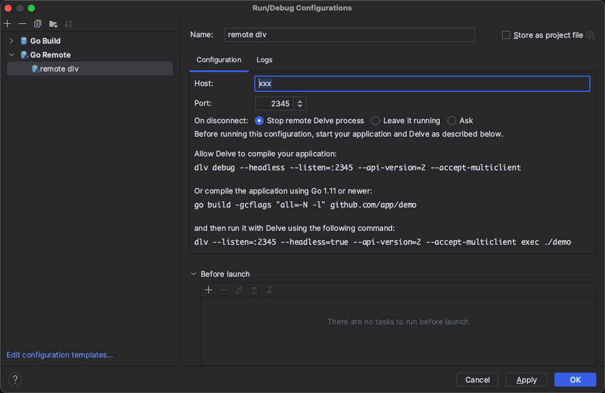
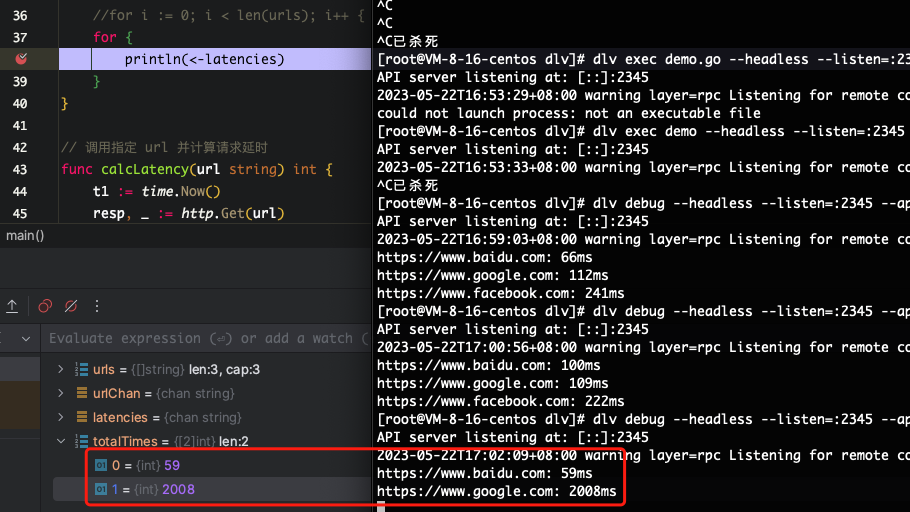
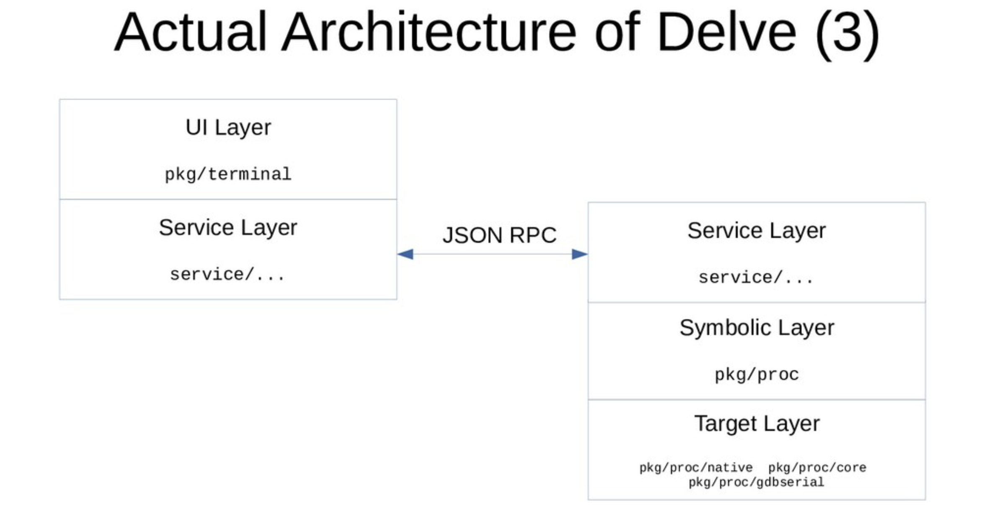
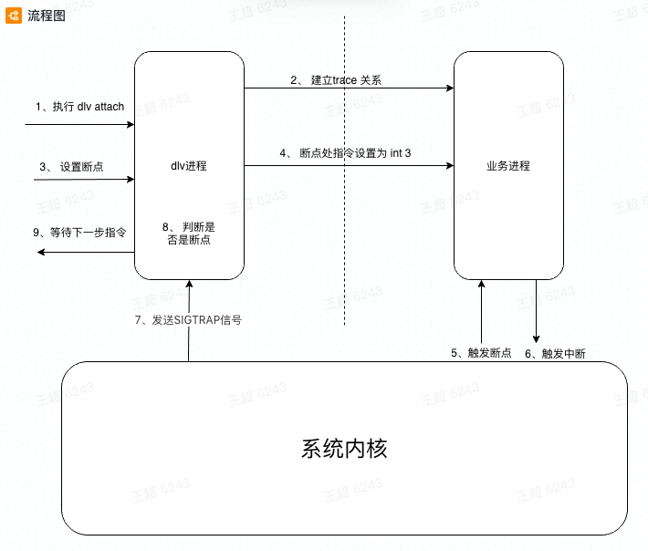

[TOC]

# 背景

目前 `Go` 语言支持 `GDB`、`LLDB`、`Delve` 调试器，其中 GDB 是最早支持的调试工具，LLDB 是 macOS 系统推荐的标准调试工具。只有 `Delve` 是专门为 `Go` 语言设计开发的调试工具（比如优化了 `error, channel` 结构体的打印、针对协程栈扩容做了优化等），所以使用 `Delve`可以轻松调试 `Go` 汇编程序。

delve 的安装：`go install github.com/go-delve/delve/cmd/dlv@latest`

验证安装：`dlv version`


# dlv 使用

dlv 有如下常见使用方法：

1. debug: `dlv debug ${源代码.go}`，调试 go 源码文件
1. attach: `dlv attach ${进程pid}`，调试正在运行的进程，断点会hang住进程，导致上游健康检查失败，因此不建议线上使用
1. core: `dlv core ${bin} ${core_file}`，分析转储文件，可用于分析程序 panic 时的现场、原因
1. api: `./dlv --listen=127.0.0.1:26953 --headless=true --api-version=2 --check-go-version=false --only-same-user=false attach ${pid}`，可用于远程调试


## 常用命令

`dlv --help`：可看到 dlv 命令行支持的命令

`dlv debug ${xxx.go}`：调试源代码

`dlv exec ${bin}`：调试可执行文件

`dlv attach ${pid}`：调试指定 pid 进程

`dlv core ${bin} ${core_file}`：分析转储文件 


通过 `dlv` 命令进入交互模式后，可通过 `help/h` 命令查看支持的交互命令


**控制流**

`continue/c`：执行函数到下一断点

`next/n`：跳到下一个断点

`step/s`：单步调试

`step-instruction/si`：执行单步 CPU 指令

`stepout/so`：跳出当前单步调试到下一个断点


**断点管理**

`break/b ${文件名:行号} 或 ${包名.函数名}` ：打断点

`breakpoints/bp`：列出所有断点

`clear ${断点号}`：清除断点

`condition/cond ${断点号} ${条件表达式}`：为断点添加条件

`watch -[r/w/rw] ${变量名}`：在变量读/写时打断点


**查看状态**

`print/p ${表达式}`：打印

`stack/bt` ：查看当前函数调用栈信息

`locals` ：查看当前函数所有变量值

`funcs ${关键词}`：列出包含关键词的函数


**协程相关命令**

`goroutines/grs` 命令查看所有协程

`goroutine/gr` 命令查看当前协程

`gr ${goid}` 进入指定协程


# 使用样例

## 样例一

下面以 `debug`  方式为例，看一看如何调试 `Go` 源码

下面这段代码起了2个协程，爬取指定网站计算耗时，最后打印耗时：

```go
// dlv_demo/demo2.go
package main

import (
    "fmt"
    "net/http"
    "time"
)

// 这段代码起了2个协程，计算耗时，最后打印耗时
func demo2() {
    urls := []string{"https://www.google.com", "https://www.baidu.com", "https://www.facebook.com"}
    urlChan := make(chan string, len(urls))
    for _, url := range urls {
        urlChan <- url
    }

    // 管道 latencies 存放各协程计算的结果
    latencies := make(chan string, 2)
    // totalTimes 存放各协程累积耗时
    totalTimes := [2]int{}

    // for 循环起 2 个协程
    for i := 0; i < 2; i++ {
        go func(i int) {
            // 协程内通过 for 循环不断取目标网址并调用 calcLatency 函数计算延时
            for url := range urlChan {
                latency := calcLatency(url)
                latencies <- fmt.Sprintf("%s: %d ms", url, latency)
                totalTimes[i] += latency
            }
        }(i)
    }

    for i := 0; i < len(urls); i++ {
        println(<-latencies)
    }
    
    close(urlChan)
	close(latencies)
}

// 调用指定 url 并计算请求延时
func calcLatency(url string) int {
    t1 := time.Now()
    resp, _ := http.Get(url)
    defer resp.Body.Close()

    return int(time.Since(t1).Milliseconds())
}
```

然后写个 `main.go` 调用上面的 demo：

```go
package main

func main() {
    demo2()
}
```


然后进入 `dlv`：

```bash
➜  dlv git:(master) dlv debug

# break/b 命令：打断点
(dlv) b demo2.go:21

# continue/c 命令：执行到下一个断点
(dlv) c

# step in/s 命令：向下执行一步
(dlv) s
=>  24:		for i := 0; i < 2; i++ {

# watch 命令：在变量被读写时打断点；-w：在变量被写入时打断点
(dlv) watch -w totalTimes[0]
Watchpoint totalTimes[0] set at 0x1400001c180

# 在 main.calcLatency 函数打断点
(dlv) b main.calcLatency
Breakpoint 3 set at 0x103084480 for main.calcLatency() ./demo2.go:42

# cond 命令：可以根据条件断点
(dlv) cond 3 url=="https://www.baidu.com"

# 运行到断点3
(dlv) c
> main.calcLatency() ./demo2.go:42 (hits goroutine(18):1 total:1) (PC: 0x105218860)
    37:			println(<-latencies)
    38:		}
    39:	}
    40:
    41:	// 调用指定 url 并计算请求延时
=>  42:	func calcLatency(url string) int {

# args 命令：查看函数参数
(dlv) args
url = "https://www.baidu.com"
~r0 = 1374389806568

# grs 命令：查看协程列表
(dlv) grs
  Goroutine 1 - User: ./demo2.go:37 main.demo2 (0x1052185b0) [chan receive]
  Goroutine 2 - User: /usr/local/go/src/runtime/proc.go:382 runtime.gopark (0x104f8c108) [force gc (idle)]
  Goroutine 3 - User: /usr/local/go/src/runtime/proc.go:382 runtime.gopark (0x104f8c108) [GC sweep wait]
  Goroutine 4 - User: /usr/local/go/src/runtime/proc.go:382 runtime.gopark (0x104f8c108) [GC scavenge wait]
  Goroutine 17 - User: /usr/local/go/src/runtime/proc.go:382 runtime.gopark (0x104f8c108) [finalizer wait]
* Goroutine 18 - User: ./demo2.go:42 main.calcLatency (0x105218860) (thread 299030)
  Goroutine 19 - User: ./demo2.go:42 main.calcLatency (0x105218860) (thread 297552)
[7 goroutines]

# gr + 协程号：切换协程
(dlv) gr 19
Switched from 18 to 19 (thread 297552)

# p 命令：打印变量
(dlv) p url
"https://www.google.com"

# bp 命令：查看所有断点
(dlv) bp
Breakpoint runtime-fatal-throw (enabled) at 0x104f898b0,0x104f89970 for (multiple functions)() <multiple locations>:0 (0)
Breakpoint unrecovered-panic (enabled) at 0x104f89c10 for runtime.fatalpanic() /usr/local/go/src/runtime/panic.go:1141 (0)
    print runtime.curg._panic.arg
Breakpoint 1 (enabled) at 0x105218438 for main.demo2() ./demo2.go:21 (1)
Watchpoint totalTimes[0] (enabled) at 0x1400010e0e0 (0)
Breakpoint 3 (enabled) at 0x105218860 for main.calcLatency() ./demo2.go:42 (1)
    cond url == "https://www.baidu.com"

# 继续执行到 watch 断点
(dlv) c
https://www.baidu.com: 102ms
> watchpoint on [totalTimes[0]] main.demo2.func1() ./demo2.go:30 (hits goroutine(18):1 total:1) (PC: 0x105218804)
    25:			go func(i int) {
    26:				// 协程内通过 for 循环不断取目标网址并调用 calcLatency 函数计算延时
    27:				for url := range urlChan {
    28:					latency := calcLatency(url)
    29:					latencies <- fmt.Sprintf("%s: %dms", url, latency)
=>  30:					totalTimes[i] += latency

(dlv) s
(dlv) p totalTimes
[2]int [102,0]

# q 命令：退出
(dlv) q
```


## 样例二

这个样例演示一下分析 core dump 转储文件。

这个样例中的源代码起了多个协程并发读写一个 `string` 变量，并不严谨，仅用于做 dlv 的演示。代码如下：

```go
// dlv_demo/demo3.go
package main

func demo3() {
    var s string

    concurrency := 10000
    for i := 0; i < concurrency; i++ {
        go func() {
            s = ""
        }()
        go func() {
            s = "bc"
            println(s)
        }()
    }
}
```

`main.go` 中也修改下调用的函数为 `demo3`

```go
package main

func main() {
    demo3()
}
```


然后到服务器上配置一下，在程序崩溃时生成 core 文件。[dlv core](https://github.com/go-delve/delve/blob/master/Documentation/usage/dlv_core.md) 目前只支持 Linux 和 Windows 系统，不支持 Mac。以 Linux 为例，配置如下：

```bash
# 设置环境变量，在崩溃时生成转储文件
export GOTRACEBACK=crash
# 修改转储文件大小限制为 不限制
ulimit -c unlimited
```


然后执行代码：

```bash
go run -gcflags="all=-N -l" .
```


多运行几次，直到看到有协程 panic：

```bash
fatal error: unexpected signal during runtime execution
[signal SIGSEGV: segmentation violation code=0x1 addr=0x0 pc=0x46a25c]

goroutine 4196 [running]:
runtime.throw({0x60da3f?, 0x0?})
    /usr/lib/golang/src/runtime/panic.go:992 +0x71 fp=0xc000527ee8 sp=0xc000527eb8 pc=0x43a171
runtime.sigpanic()
    /usr/lib/golang/src/runtime/signal_unix.go:802 +0x225 fp=0xc000527f18 sp=0xc000527ee8 pc=0x44fe25
runtime.memmove()
    /usr/lib/golang/src/runtime/memmove_amd64.s:149 +0xfc fp=0xc000527f20 sp=0xc000527f18 pc=0x46a25c
runtime.recordForPanic({0x0, 0x2, 0x2})
    /usr/lib/golang/src/runtime/print.go:46 +0x10e fp=0xc000527f58 sp=0xc000527f20 pc=0x43b8ce
runtime.gwrite({0x0, 0x2, 0x2})
    /usr/lib/golang/src/runtime/print.go:90 +0x3d fp=0xc000527f90 sp=0xc000527f58 pc=0x43ba5d
runtime.printstring({0x0?, 0x0?})
    /usr/lib/golang/src/runtime/print.go:247 +0x25 fp=0xc000527fb8 sp=0xc000527f90 pc=0x43c265
main.demo3.func2()
    /workspace/go/src/github.com/wtifs/project-diva/src/myGo/dlv_demo/demo3.go:14 +0x65 fp=0xc000527fe0 sp=0xc000527fb8 pc=0x5ccdc5
runtime.goexit()
    /usr/lib/golang/src/runtime/asm_amd64.s:1571 +0x1 fp=0xc000527fe8 sp=0xc000527fe0 pc=0x469301
created by main.demo3
    /workspace/go/src/github.com/wtifs/project-diva/src/myGo/dlv_demo/demo3.go:12 +0x113	
```


此时目录下应该生成了一个 `core` 文件，使用 `dlv core` 分析它：

```bash
[root@VM-8-16-centos dlv]# ll
-rw------- 1 root root 84828160 5月  24 14:13 core.32630

dlv core dlv_demo core.32630

# 查看栈
(dlv) bt -full
 0  0x000000000046ac41 in runtime.raise
    at /usr/lib/golang/src/runtime/sys_linux_amd64.s:168

 1  0x00000000004670e0 in runtime.systemstack_switch
    at /usr/lib/golang/src/runtime/asm_amd64.s:436

 2  0x000000000043a3b0 in runtime.fatalthrow
    at /usr/lib/golang/src/runtime/panic.go:1044
        pc = (unreadable empty OP stack)
        sp = (unreadable empty OP stack)
        gp = (unreadable read out of bounds)

 3  0x000000000043a171 in runtime.throw
    at /usr/lib/golang/src/runtime/panic.go:992
        s = (unreadable could not find loclist entry at 0x3f544 for address 0x43a171)
        gp = (unreadable could not find loclist entry at 0x3f593 for address 0x43a171)

 4  0x000000000044fe25 in runtime.sigpanic
    at /usr/lib/golang/src/runtime/signal_unix.go:802
        g = (*runtime.g)(0xc000845a00)

 5  0x000000000046a25c in runtime.memmove
    at /usr/lib/golang/src/runtime/memmove_amd64.s:146

 6  0x000000000043b8ce in runtime.recordForPanic
    at /usr/lib/golang/src/runtime/print.go:46
        b = (unreadable non-zero length array with nil base)
        i = (unreadable could not find loclist entry at 0x40a61 for address 0x43b8ce)

 7  0x000000000043ba5d in runtime.gwrite
    at /usr/lib/golang/src/runtime/print.go:90
        b = []uint8 len: 0, cap: 2, nil

 8  0x000000000043c265 in runtime.printstring
    at /usr/lib/golang/src/runtime/print.go:247
        s = (unreadable could not find loclist entry at 0x41109 for address 0x43c265)

 9  0x00000000005ccdc5 in main.demo3.func2
    at ./demo3.go:14
        s = "bc"

10  0x0000000000469301 in runtime.goexit
    at /usr/lib/golang/src/runtime/asm_amd64.s:1571
```

可以看到在第 9 帧时，s 的值是 `bc`，使用 `frame 9` 命令进入第 9 帧：

```bash
(dlv) frame 9
> runtime.raise() /usr/lib/golang/src/runtime/sys_linux_amd64.s:168 (PC: 0x46ac41)
Warning: debugging optimized function
# 从上方的 Warning 可以看到尽管使用了 `-gcflags="all=-N -l"` 参数编译文件，但有些优化并未被关闭，导致有些变量调试不出值
Frame 9: ./demo3.go:14 (PC: 5ccdc5)
     9:			go func() {
    10:				s = ""
    11:			}()
    12:			go func() {
    13:				s = "bc"
=>  14:				println(s)

# 打印 s
(dlv) p s
"bc"
```

使用 `down` 命令逐帧向下查看：

```bash
(dlv) down
Frame 8: /usr/lib/golang/src/runtime/print.go:247 (PC: 43c265)
   242:	func printuintptr(p uintptr) {
   243:		printhex(uint64(p))
   244:	}
   245:
   246:	func printstring(s string) {
=> 247:		gwrite(bytes(s))

(dlv) down
Frame 7: /usr/lib/golang/src/runtime/print.go:90 (PC: 43ba5d)
    85:	// or else standard error.
    86:	func gwrite(b []byte) {
    87:		if len(b) == 0 {
    88:			return
    89:		}
=>  90:		recordForPanic(b)

# 打印 b
(dlv) p b
[]uint8 len: 0, cap: 2, nil
```

到这一步可以发现原本值为 `bc` 的 `s` 变量，转成 `[]byte` 结构传到 `gwrite` 方法后长度变为了 0。长度为 0 时应在 `87` 行就进入返回分支的，实际上没有，说明 `b` 的内容时在第 `87` 行之后发生了修改

继续向下可以看到导致 `panic` 的原因：

```bash
(dlv) down
Frame 6: /usr/lib/golang/src/runtime/print.go:46 (PC: 43b8ce)
    41:		printlock()
    42:
    43:		if atomic.Load(&panicking) == 0 {
    44:			// Not actively crashing: maintain circular buffer of print output.
    45:			for i := 0; i < len(b); {
=>  46:				n := copy(printBacklog[printBacklogIndex:], b[i:])

# 打印 b
(dlv) p b
(unreadable non-zero length array with nil base)
# 打印 b 的长度
(dlv) p len(b)
2
```

打印 `b` 的值和长度可以看出，切片 `b` 的长度为 2，但引用的数据对象却是空值，导致后续按下标取切片时出错，触发 `panic`

`b` 长度为2、数据却为空值的原因，是因为在 go 中，`string` 结构在运行时实际上是由如下结构体构成的：

```go
// reflect/value.go
type StringHeader struct {
    Data uintptr
    Len  int
}
```

该结构体包含两个字段：`Data` 是一个指针，指向实际的字符串，`Len` 表示长度。

为变量赋值时，实际上会分为两步操作，一步写指针，一步写长度。

而在多个协程并发写入的环境下，最终可能写入的就是协程1的指针与协程2的长度，导致指针指向的字符串与长度字段不匹配，便可能产生上述例子中字符串为空、长度为2的情况。

可以在 `dlv` 中验证一下上述推论，先回到第 9 帧，然后定位到 `demo.go:13` 行看下 `s = "bc"` 赋值语句对应的汇编代码。

`dlv core` 模式下 `disassemble` 命令使用的是 Intel格式的汇编指令，指令格式为：`操作码 目标操作数 源操作数`。`qword ptr` 表示 8字节大小的地址，中括号 `[]` 表示 指针引用。这里截取汇编代码中关于 `demo.go:13` 相关的部分，并逐行解释：

```go
// 进入第 9 帧
(dlv) frame 9
// 查看汇编代码
(dlv) disass
    // 将数值 2 写入 [rdi+0x8] 地址上开始的 8 字节中，即设置 s 的 Len 长度字段为 2
    demo3.go:13	0x5ccd7d	48c7470802000000	mov qword ptr [rdi+0x8], 0x2
    // 比较 [runtime.writeBarrier] 地址上的值是否为0，判断是否开启写屏障
    demo3.go:13	0x5ccd85	833da440160000		cmp dword ptr [runtime.writeBarrier], 0x0
    // 如果前面的比较结果为0，表示不需要开启写屏障，跳转至 0x5ccd90 行（下下行）
    demo3.go:13	0x5ccd8c	7402			    jz 0x5ccd90
    // 否则跳转至 0x5ccd9c 行
    demo3.go:13	0x5ccd8e	eb0c			    jmp 0x5ccd9c
    // 将 [rip+0x36f6d] 地址上的值 写入 rax 寄存器，即实际字符串的地址
    demo3.go:13	0x5ccd90	488d056d6f0300		lea rax, ptr [rip+0x36f6d]
    // 将前面 rax 寄存器中的值写入 [rdi] 地址，即设置 s 的 Data 属性为实际字符串的地址
    demo3.go:13	0x5ccd97	488907			    mov qword ptr [rdi], rax
    // 跳转至下方 0x5ccdaa 行，即 print 函数
    demo3.go:13	0x5ccd9a	eb0e			    jmp 0x5ccdaa
 	// 下面都是写屏障相关逻辑，不是本次研究的重点，忽略
    demo3.go:13	0x5ccd9c	488d05616f0300		lea rax, ptr [rip+0x36f61]
    demo3.go:13	0x5ccda3	e898c5e9ff		    call $runtime.gcWriteBarrier
    demo3.go:13	0x5ccda8	eb00			    jmp 0x5ccdaa
    // 进入 print 方法
    demo3.go:14	0x5ccdaa    e891ebe6ff          call $runtime.printlock
```

可以看到在汇编代码中对 `s` 变量的赋值分成了先写长度、再写字符串地址两步，不是原子操作，因此在并发环境下可能会产生问题。


# 远程调试

其实有些 Golang IDE 的 debugger 使用的就是 dlv，以  IntelliJ IDEA 的 为例，点击 debug 图标后，可以在控制台输出看到它使用的 dlv 路径：
```bash
"/Users/xxx/Library/Application Support/JetBrains/IntelliJIdea2023.1/plugins/go-plugin/lib/dlv/macarm/dlv" --listen=127.0.0.1:51683 --headless=true --api-version=2 --check-go-version=false --only-same-user=false exec /Users/xxx/Library/Caches/JetBrains/IntelliJIdea2023.1/tmp/GoLand/___go_build_github_com_WTIFS_project_diva_src_myGo --
```

其中的 `--listen` 参数表示将 dlv 作为一个服务启动，可通过其后面指定的地址交互。这样可以在生产环境机器上启动 dlv，然后在 IDE 的 debugger 里配置这个地址，就可以远程 debug、断点调试了

在 IDE 里新建远程配置，然后按提示在远端机器上安装好 dlv 环境后 执行如下命令：

```bash
dlv debug --headless --listen=:2345 --api-version=2 --accept-multiclient
```




之后在 IDE 里打断点并启动 debug，便可以像在本地一样调试了。



实践中，由于生产环境往往和本地环境是隔离的，中间有层跳板机，需要配置跳板机做转发，比较麻烦和不安全，因此这个功能不是很经常用


# 基本原理

delve 的源码可以看这里：https://github.com/go-delve/delve

其基本原理是：

1. 将断点这一地址的指令覆盖掉，替换成一条新的指令：当执行该指令时，线程暂停运行并发送信号
2. 将 dlv 进程作为被调试程序的父进程，子进程执行到断点时会发信号给 dlv 进程，dlv 进程等待用户的进一步指令


# 架构

Delve的整体架构如下：

- UI Layer，直接与用户交互，接受用户输入的指令；各 IDE 实现的就是这层
- Service Layer抽象出的一个服务层，作为 UI 和 Symbolic 层中间的层，通过 RPC 交互
- Symbolic Layer，转换源码和内存地址，拥有代码行号、数据类型、变量名等信息
- Target Layer，控制被调试进程，读写目标进程的寄存器、内存




## Service Layer

- 提供 `FindLocation`（根据函数名找代码地址）、`CreateBreakpoint`（创建断点）这样的 API
- 通过这样的架构可以分离客户端和被调试程序，从而支持远端调试、支持多种客户端
- API 支持 `JSON/DAP` 两种协议，后者主要被 `VS Code` 使用。基于这些 API 你也可以自己写一个客户端，API文档[在这里](https://github.com/go-delve/delve/blob/master/Documentation/api/README.md)


## Symbol Layer

编译器会向可执行文件中写入一些用于调试的信息，我们称为 debug symbol，Symbolic Layer 所做的事情就是从可执行文件中读取这些符号

Go语言采用的 debug symbol 规范是 DWARFv4 (2018年)，DWARF 中比较重要的有三种：

- debug_line：这是一个表，它将指令地址映射到文件:行号
- debug_frame：堆栈解压信息
- debug_info：描述程序中的所有函数、类型和变量

dlv 通过 debug_info 找到函数名，通过 debug_line 找到某条指令对应的代码在哪个文件的哪一行，再通过 debug_frame 获取指令地址


## Target Layer

作用是控制目标进程。在delve 中提供了对 target layer 的三种实现方式：

- pkg/proc/native: 使用 OS API call 控制目标进程， 如 Linux 下调用了 `ptrace, waitpid, tgkill` API
- pkg/proc/core: 读取 Linux 的 core dump 文件
- pkg/proc/gdbserial: 通过 TCP/IP 连接服务器。采用的协议叫做 GDB Remote Serial Protocol，GDB的标准远程通信协议

这里展开看下 `pkg/proc/native/proc_linux.go` 里对 `Attach` 的实现：

```go
// pkg/proc/native/proc_linux.go
func Attach(pid int, debugInfoDirs []string) (*proc.TargetGroup, error) {
    dbp := newProcess(pid) // 新建 dlv 进程
    dbp.execPtraceFunc(func() { err = ptraceAttach(dbp.pid) })
}

// pkg/proc/native/ptrace_linux.go
func ptraceAttach(pid int) error {
      return sys.PtraceAttach(pid)
}

// 调用 linux 的 ptrace API
// golang.org/x/sys/unix/syscall_linux.go
func PtraceAttach(pid int) (err error) { return ptrace(PTRACE_ATTACH, pid, 0, 0) }

// golang.org/x/sys/unix/zsyscall_linux.go
func ptrace(request int, pid int, addr uintptr, data uintptr) (err error) {
    _, _, e1 := Syscall6(SYS_PTRACE, uintptr(request), uintptr(pid), uintptr(addr), uintptr(data), 0, 0)
    if e1 != 0 {
        err = errnoErr(e1)
    }
    return
}
```


可以看到  Linux 下的 `dlv attach` 命令实际调用了 Linux 提供的 `ptrace` API。

`ptrace` 系统调用用于进程跟踪，它提供了父进程可以观察和控制其子进程执行的能力，并允许父进程检查和替换子进程的内核镜像（包括寄存器）的值。其基本原理是：当使用了 `ptrace` 跟踪后，所有发送给被跟踪的子进程的信号（除了 `SIGKILL`），都会被转发给父进程，而子进程则会被阻塞，这时子进程的状态就会被系统标注为 `TASK_TRACED`。父进程收到信号后，就可以对停止下来的子进程进行检查和修改，然后让子进程继续运行。

当我们用 dlv 设置断点时, dlv 会把断点处的指令修改成中断指令（`amd/386` 架构下为 `int 3 (0xCC) ` 3 号中断，可以触发 debugger，这是一种约定），同时把断点信息及修改前的指令保存起来。当被调试子进程运行到断点处时，便会执行中断命令产生 `SIGTRAP` 信号。由于 dlv 已经用 `ptrace` 和调试进程建立了跟踪关系，此时的 `SIGTRAP` 信号会被发送给 dlv，dlv 通过和已有的断点信息做对比 （通过指令位置）来判断这次 `SIGTRAP` 是不是一个断点。如果是的话，就等待用户的输入以做进一步的处理





# 源码解读

下面梳理了 `delve` 项目的部分目录，结构如下：

```
├── Documentation：各种文档
├── cmd：程序入口
├── pkg：对不同操作系统 系统调用的封装
│   ├── proc：target 层的不同实现
│   │   ├── core
│   │   ├── gdbserial
│   │   ├── native
├── service：比较核心的部分，较多服务层实现都在这里
│   ├── api：接口支持
│   ├── dap：对 dap 协议的支持
│   ├── debugger
│   ├── rpc1：v1版本 rpc 客户端及服务端实现
│   ├── rpc2：v2版本 rpc 客户端及服务端实现
│   ├── rpccommon
└── vendor
```


程序入口可以看根目录下的 Makefile 文件：

```go
// Makefile
build: $(GO_SRC)
    @go run _scripts/make.go build
```

 `make.go` 中可以看到命令行工具是用 `cobra` 构建的，以及入口文件是 `DelveMainPackagePath` 常量，其值为 `cmd/dlv` 

```go
// _scripts/make.go
import "github.com/spf13/cobra"

const DelveMainPackagePath = "github.com/go-delve/delve/cmd/dlv"

buildCmd := &cobra.Command{
    Use:   "build",
    Short: "Build delve",
    Run: func(cmd *cobra.Command, args []string) {
        execute("go", "build", "-ldflags", "-extldflags -static", tagFlags(), buildFlags(), DelveMainPackagePath)
    },
}
```

```go
// cmd/dlv/main.go
func main() {
    // 启动RPC服务、创建终端
    cmds.New(false).Execute()
}
```


进入 `cmds.New` 方法查看，里面不同的命令走了不同分支逻辑。这里以 `attach` 命令为例向下追踪，可以看到起了一个 RPC 服务：

```go
// cmd/dlv/cmds/commands.go
func New(docCall bool) *cobra.Command {
    attachCommand := &cobra.Command{
        Run: attachCmd,
    }
}

func attachCmd(cmd *cobra.Command, args []string) {
    pid, err := strconv.Atoi(args[0])
    os.Exit(execute(pid, args[1:], conf, "", debugger.ExecutingOther, args, buildFlags))
}

// 启动服务、创建终端
func execute(attachPid int, processArgs []string, conf *config.Config, coreFile string, kind debugger.ExecuteKind, dlvArgs []string, buildFlags string) int {
    server = rpccommon.NewServer(...)
    server.Run()
    return connect(listener.Addr().String(), clientConn, conf, kind)
}
```


`Run` 方法里注册了 RPC 方法，并路由了请求：

```go
// service/rpccommon/server.go
func (s *ServerImpl) Run() error {
    // v1/v2 RPC 服务
    s.s1 = rpc1.NewServer(s.config, s.debugger)
    s.s2 = rpc2.NewServer(s.config, s.debugger)
    rpcServer := &RPCServer{s}
    
    // 注册 RPC 方法路由
    s.methodMaps = make([]map[string]*methodType, 2)
    s.methodMaps[0] = map[string]*methodType{}
    suitableMethods(s.s1, s.methodMaps[0], s.log)
    
    // 监听并处理连接
    go func() {
        for {
            c, err := s.listener.Accept()
            // 路由连接并处理
            go s.serveConnectionDemux(c)
        }
    }
}

// 路由并分发请求
func (s *ServerImpl) serveConnectionDemux(c io.ReadWriteCloser) {
    if b[0] == 'C' { // C is for DAP's Content-Length
        ds := dap.NewSession(conn, &dap.Config{Config: s.config, StopTriggered: s.stopChan}, s.debugger)
        go ds.ServeDAPCodec()
    } else {
        go s.serveJSONCodec(conn)
    }
}
```


终端部分的代码在 `connect` 方法里：


```go
// 创建终端
func connect(addr string, clientConn net.Conn, conf *config.Config, kind debugger.ExecuteKind) int {
    term := terminal.New(client, conf)
}
```

```go
// pkg/terminal/terminal.go
// 创建终端
func New(client service.Client, conf *config.Config) *Term {
    cmds := DebugCommands(client)
}
```

```go
// pkg/terminal/command.go
// 终端命令实现
func DebugCommands(client service.Client) *Commands {
    c := &Commands{client: client}

    c.cmds = []command{
        {aliases: []string{"help", "h"}, cmdFn: c.help},
        {aliases: []string{"break", "b"}, group: breakCmds, cmdFn: breakpoint}
    }
}
```


接下来以 `break` 命令为例，看下命令是如何从客户端传递到服务端并执行的。

客户端这边，在上面的代码里将 `break` 命令和 `breakpoint` 函数做了注册。`breakpoint` 方法的实现如下：

```go
// pkg/terminal/command.go
func breakpoint(t *Term, ctx callContext, args string) error {
    _, err := setBreakpoint(t, ctx, false, args)
    return err
}

func setBreakpoint(t *Term, ctx callContext, tracepoint bool, argstr string) ([]*api.Breakpoint, error) {
    // spec 为要打的断点，格式可为包名.函数名、文件名:行号等
    spec = argstr
    
    // RPC调用，调用 FindLocation 查找断点对应的代码的地址、程序计数器、进程id
    locs, findLocErr := t.client.FindLocation(ctx.Scope, spec, true, t.substitutePathRules())
    
    for _, loc := range locs {
        requestedBp.Addr = loc.PC
        requestedBp.Addrs = loc.PCs
        requestedBp.AddrPid = loc.PCPids
        // RPC调用，实际调用 CreateBreakpoint 方法
        bp, err := t.client.CreateBreakpointWithExpr(requestedBp, spec, t.substitutePathRules(), false)
    }
}

// RPC调用，实际调用 CreateBreakpoint 方法
func (c *RPCClient) CreateBreakpointWithExpr(breakPoint *api.Breakpoint, locExpr string, substitutePathRules [][2]string, suspended bool) (*api.Breakpoint, error) {
    err := c.call("CreateBreakpoint", CreateBreakpointIn{*breakPoint, locExpr, substitutePathRules, suspended}, &out)
}
```


看一下 RPC 侧对 `CreateBreakpoint` 方法的实现，这里以 v2 版的实现为例：

```go
// service/rpc2/server.go
func (s *RPCServer) CreateBreakpoint(arg CreateBreakpointIn, out *CreateBreakpointOut) error {
    createdbp, err := s.debugger.CreateBreakpoint(&arg.Breakpoint, arg.LocExpr, arg.SubstitutePathRules, arg.Suspended)
}
```

```go
// service/debugger/debugger.go
func (d *Debugger) CreateBreakpoint(requestedBp *api.Breakpoint, locExpr string, substitutePathRules [][2]string, suspended bool) (*api.Breakpoint, error) {
    createdBp, err := createLogicalBreakpoint(d, requestedBp, &setbp, suspended)
}

func createLogicalBreakpoint(d *Debugger, requestedBp *api.Breakpoint, setbp *proc.SetBreakpoint, suspended bool) (*api.Breakpoint, error) {
    err = d.target.EnableBreakpoint(lbp)
}
```

```go
// pkg/proc/target_group.go
func (grp *TargetGroup) EnableBreakpoint(lbp *LogicalBreakpoint) error {
    for _, p := range grp.targets {
        err := enableBreakpointOnTarget(p, lbp)
    }
}

func enableBreakpointOnTarget(p *Target, lbp *LogicalBreakpoint) error {
    for _, addr := range addrs {
        _, err = p.SetBreakpoint(lbp.LogicalID, addr, UserBreakpoint, nil)
    }
}
```

```go
// pkg/proc/breakpoints.go
func (t *Target) SetBreakpoint(logicalID int, addr uint64, kind BreakpointKind, cond ast.Expr) (*Breakpoint, error) {
    return t.setBreakpointInternal(logicalID, addr, kind, 0, cond)
}

func (t *Target) setBreakpointInternal(logicalID int, addr uint64, kind BreakpointKind, wtype WatchType, cond ast.Expr) (*Breakpoint, error) {
    err := t.proc.WriteBreakpoint(newBreakpoint)
}
```

`WriteBreakpoint` 是一个 `interface`，在 target 层有不同的实现：

```go
// pkg/proc/interface.go
WriteBreakpoint(*Breakpoint) error
```

```go
// pkg/proc/native/proc.go
func (dbp *nativeProcess) WriteBreakpoint(bp *proc.Breakpoint) error {
}
```

```go
// pkg/proc/core/core.go
func (dbp *nativeProcess) WriteBreakpoint(bp *proc.Breakpoint) error {
}
```

```go
// pkg/proc/gdbserial/gdbserver.go
func (dbp *nativeProcess) WriteBreakpoint(bp *proc.Breakpoint) error {
}
```

这里追一下 native 里的实现：

```go
// pkg/proc/native/proc.go
func (dbp *nativeProcess) WriteBreakpoint(bp *proc.Breakpoint) error {
    // 如果是 watch 类型断点，使用硬中断
    if bp.WatchType != 0 {
        for _, thread := range dbp.threads {
            err := thread.writeHardwareBreakpoint(bp.Addr, bp.WatchType, bp.HWBreakIndex)
        }
        return nil
    }

    // 读取断点地址的原数据
    bp.OriginalData = make([]byte, dbp.bi.Arch.BreakpointSize())
    _, err := dbp.memthread.ReadMemory(bp.OriginalData, bp.Addr)
    // 其他类型断点使用软中断
    return dbp.writeSoftwareBreakpoint(dbp.memthread, bp.Addr)
}
```

硬中断分支逻辑如下，最后实际调用 Linux ptrace 系统调用：

```go
// pkg/proc/native/threads_linux_arm64.go
// 硬中断断点
func (t *nativeThread) writeHardwareBreakpoint(addr uint64, wtype proc.WatchType, idx uint8) error {
    return t.setWatchpoints(wpstate)
}

// 实际调用 Linux ptrace 系统调用
func (t *nativeThread) setWatchpoints(wpstate *watchpointState) error {
    _, _, err = syscall.Syscall6(syscall.SYS_PTRACE, sys.PTRACE_SETREGSET, uintptr(t.ID), _NT_ARM_HW_WATCH, uintptr(unsafe.Pointer(&iov)), 0, 0)
}
```

软中断分支逻辑如下：

```go
// pkg/proc/native/proc.go
func (dbp *nativeProcess) writeSoftwareBreakpoint(thread *nativeThread, addr uint64) error {
    _, err := thread.WriteMemory(addr, dbp.bi.Arch.BreakpointInstruction())
    return err
}
```

`dbp.bi.Arch.BreakpointInstruction()` 根据不同的 CPU架构有不同的取值：

```go
// pkg/proc/amd64_arch.go
var amd64BreakInstruction = []byte{0xCC}

// pkg/proc/arm64_arch.go
var arm64BreakInstruction = []byte{0x0, 0x0, 0x20, 0xd4}

// pkg/proc/i386_arch.go
var arm64WindowsBreakInstruction = []byte{0x0, 0x0, 0x3e, 0xd4}
i386BreakInstruction = []byte{0xCC}
```

`WriteMemory` 方法底层调用的也是 Linux ptrace 系统调用：

```go
// pkg/proc/native/threads_linux.go
func (t *nativeThread) WriteMemory(addr uint64, data []byte) (written int, err error) {
    t.dbp.execPtraceFunc(func() { written, err = sys.PtracePokeData(t.ID, uintptr(addr), data) })
}
```

```go
// golang.org/x/sys/unix/syscall_linux.go
func PtracePokeData(pid int, addr uintptr, data []byte) (count int, err error) {
    return ptracePoke(PTRACE_POKEDATA, PTRACE_PEEKDATA, pid, addr, data)
}

func ptracePoke(pokeReq int, peekReq int, pid int, addr uintptr, data []byte) (count int, err error) {
    err = ptrace(...)
}

func ptrace(request int, pid int, addr uintptr, data uintptr) (err error) {
    _, _, e1 := Syscall6(SYS_PTRACE, uintptr(request), uintptr(pid), uintptr(addr), uintptr(data), 0, 0)
}
```


# 参考

[AsongGo - 分享如何阅读Go源码](https://mp.weixin.qq.com/s/c2yPBbDLjiSrpYP62p-uKQ)

[曹春晖 - Delve 调试器](https://chai2010.cn/advanced-go-programming-book/ch3-asm/ch3-09-debug.html)

[mercury - Dlv 深入探究](https://zhuanlan.zhihu.com/p/364346530)

[日天不吃糖 - Delve的内部架构与实现](https://zhuanlan.zhihu.com/p/538725747)

[Alessandro Arzilli - Internal Architecture of Delve](https://speakerdeck.com/aarzilli/internal-architecture-of-delve)