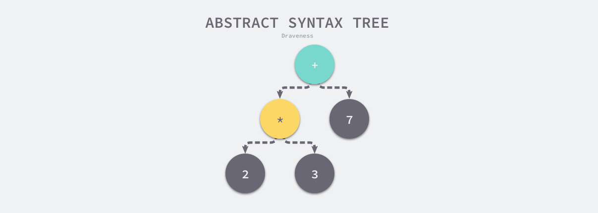
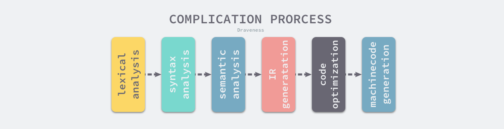
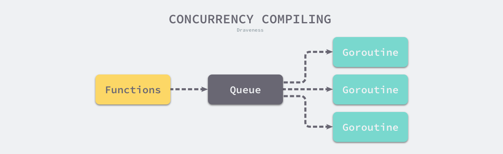

在 `Go` 中，我们可以使用 `go tool compile -S main.go` 工具将一个 `Go` 程序转换为汇编代码

在 `Go` 代码和最终的汇编代码中，还有一种中间的代码结构，这个结构叫做 SSA (Static Single Assignment) 静态单赋值。

这个中间的代码结构是有必要存在的，Go源码解析后是一个AST树，是一个树形结构，而最终的汇编是一条一条的线性命令。将树形结构转化拆分优化为汇编命令是比较复杂的。所以这里将这么一个大的步骤分成两步走，能大大降低编译器优化的难度。

可以使用命令 `GOSSAFUNC=目标函数 go build 目标文件` 生成一个 `ssa.html` 文件，用浏览器打开这个文件后就能看到代码优化的每一个步骤

该文件是可以交互的。点击左侧的原始函数，页面会使用相同的颜色在 SSA 中间代码生成的不同阶段高亮出相关的代码行。


# 2.1 编译过程

## 2.1.1 预备知识

### 抽象语法树

[抽象语法树](https://en.wikipedia.org/wiki/Abstract_syntax_tree)（Abstract Syntax Tree、AST），是源代码语法的结构的一种抽象表示，它用树状的方式表示编程语言的语法结构[1](https://draveness.me/golang/docs/part1-prerequisite/ch02-compile/golang-compile-intro/#fn:1)。抽象语法树中的每一个节点都表示源代码中的一个元素，每一棵子树都表示一个语法元素，以表达式 `2 * 3 + 7` 为例，编译器的语法分析阶段会生成如下图所示的抽象语法树。



**图 2-1 简单表达式的抽象语法树**

作为编译器常用的数据结构，抽象语法树抹去了源代码中不重要的一些字符 - 空格、分号或者括号等等。编译器在执行完语法分析之后会输出一个抽象语法树，这个抽象语法树会辅助编译器进行语义分析，我们可以用它来确定语法正确的程序是否存在一些类型不匹配的问题。

### 静态单赋值

[静态单赋值](https://en.wikipedia.org/wiki/Static_single_assignment_form)（Static Single Assignment、SSA）是中间代码的特性，如果中间代码具有静态单赋值的特性，那么每个变量就只会被赋值一次[<sup>2</sup>]。在实践中，我们通常会用下标实现静态单赋值，这里以下面的代码举个例子：

```go
x := 1
x := 2
y := x
```

经过简单的分析，我们就能够发现上述的代码第一行的赋值语句 `x := 1` 不会起到任何作用。下面是具有 SSA 特性的中间代码，我们可以清晰地发现变量 `y_1` 和 `x_1` 是没有任何关系的，所以在机器码生成时就可以省去 `x := 1` 的赋值，通过减少需要执行的指令优化这段代码。

```go
x_1 := 1
x_2 := 2
y_1 := x_2
```

因为 SSA 的主要作用是对代码进行优化，所以它是编译器后端[<sup>3</sup>]的一部分；当然代码编译领域除了 SSA 还有很多中间代码的优化方法，编译器生成代码的优化也是一个古老并且复杂的领域，这里就不会展开介绍了。

### 指令集

最后要介绍的一个预备知识就是[指令集](https://en.wikipedia.org/wiki/Instruction_set_architecture)<sup>4</sup>了，很多开发者在都会遇到在本地开发环境编译和运行正常的代码，在生产环境却无法正常工作，这种问题背后会有多种原因，而不同机器使用的不同指令集可能是原因之一。

以 x86_64 的 Macbook 为例，在命令行中输入 `uname -m` 就能获得当前机器的硬件信息：

```bash
$ uname -m
x86_64
```

x86 是目前比较常见的指令集，除了 x86 之外，还有 arm 等指令集，M1 Macbook 的自研芯片就使用了 arm 指令集，不同的处理器使用了不同的架构和机器语言，所以很多编程语言为了在不同的机器上运行需要将源代码根据架构翻译成不同的机器代码。

复杂指令集计算机（CISC）和精简指令集计算机（RISC）是两种遵循不同设计理念的指令集，从名字我们就可以推测出这两种指令集的区别：

- 复杂指令集：通过增加指令的类型减少需要执行的指令数；
- 精简指令集：使用更少的指令类型完成目标的计算任务；

早期的 CPU 为了减少机器语言指令的数量一般使用复杂指令集完成计算任务，这两者并没有绝对的优劣，它们只是在一些设计上的选择不同以达到不同的目的，我们会在后面的[机器码生成](https://draveness.me/golang/docs/part1-prerequisite/ch02-compile/golang-machinecode/)一节中详细介绍指令集架构，不过各位读者也可以主动了解相关的内容。

## 2.1.2 编译原理

Go 语言编译器的源代码在 [`src/cmd/compile`](https://github.com/golang/go/tree/master/src/cmd/compile) 目录中，目录下的文件共同组成了 Go 语言的编译器，学过编译原理的人可能听说过编译器的前端和后端，编译器的前端一般承担着词法分析、语法分析、类型检查和中间代码生成几部分工作，而编译器后端主要负责目标代码的生成和优化，也就是将中间代码翻译成目标机器能够运行的二进制机器码。



**图 2-2 编译原理的核心过程**

Go 的编译器在逻辑上可以被分成四个阶段：词法与语法分析、类型检查和 AST 转换、通用 SSA 生成、和最后的机器代码生成，在这一节我们会使用比较少的篇幅分别介绍这四个阶段做的工作，后面的章节会具体介绍每一个阶段的具体内容。

### 词法与语法分析

所有的编译过程其实都是从解析代码的源文件开始的，词法分析的作用就是解析源代码文件，它将文件中的字符串序列转换成 Token 序列（一般一个单词或符号称为一个 Token），方便后面的处理和解析，我们一般会把执行词法分析的程序称为词法解析器（lexer）。

接下来语法分析器会按顺序解析 Token 序列，该过程会将 Token 按照编程语言定义好的文法（Grammar）自下而上或者自上而下的规约，每一个 Go 的源代码文件最终会被归纳成一个 [SourceFile](https://golang.org/ref/spec#Source_file_organization) 结构<sup>5</sup>：

```go
SourceFile = PackageClause ";" { ImportDecl ";" } { TopLevelDecl ";" } .
```

词法分析会返回一个不包含空格、换行等字符的 Token 序列，例如：`package`, `json`, `import`, `(`, `io`, `)`, …，而语法分析会把 Token 序列转换成有意义的结构体，即语法树：

```go
"json.go": SourceFile {
    PackageName: "json",
    ImportDecl: []Import{
        "io",
    },
    TopLevelDecl: ...
}
```

Token 到上述抽象语法树（AST）的转换过程会用到语法解析器，每一个 AST 都对应着一个单独的 Go 语言文件，这个抽象语法树中包括当前文件属于的包名、定义的常量、结构体和函数等。

> Go 语言的语法解析器使用的是 LALR(1)[<sup>6</sup>](https://draveness.me/golang/docs/part1-prerequisite/ch02-compile/golang-compile-intro/#fn:6) 的文法，对解析器文法感兴趣的读者可以在推荐阅读中找到编译器文法的相关资料。

语法解析的过程中发生的任何语法错误都会被语法解析器发现并将消息打印到标准输出上，整个编译过程也会随着错误的出现而被中止。[词法与语法分析](https://draveness.me/golang/docs/part1-prerequisite/ch02-compile/golang-lexer-and-parser/)一节会详细介绍 Go 语言的文法、词法解析和语法解析过程。

### 类型检查

当拿到一组文件的抽象语法树之后，Go 语言的编译器会对语法树中定义和使用的类型进行检查，类型检查会按照以下的顺序分别验证和处理不同类型的节点：

1. 常量、类型和函数名及类型；
2. 变量的赋值和初始化；
3. 函数和闭包的主体；
4. 哈希键值对的类型；
5. 导入函数体；
6. 外部的声明；

通过对整棵抽象语法树的遍历，我们在每个节点上都会对当前子树的类型进行验证，以保证节点不存在类型错误，所有的类型错误和不匹配都会在这一个阶段被暴露出来，其中包括：结构体对接口的实现。

类型检查阶段不止会对节点的类型进行验证，还会展开和改写一些内建的函数，例如 make 关键字在这个阶段会根据子树的结构被替换成 [`runtime.makeslice`](https://draveness.me/golang/tree/runtime.makeslice) 或者 [`runtime.makechan`](https://draveness.me/golang/tree/runtime.makechan) 等函数。

类型检查这一过程在整个编译流程中还是非常重要的，Go 语言的很多关键字都依赖类型检查期间的展开和改写，我们在[类型检查](https://draveness.me/golang/docs/part1-prerequisite/ch02-compile/golang-typecheck/)中会详细介绍这一步骤。

### 中间代码生成

当我们将源文件转换成了抽象语法树、对整棵树的语法进行解析并进行类型检查之后，就可以认为当前文件中的代码不存在语法错误和类型错误的问题了，Go 语言的编译器就会将输入的抽象语法树转换成中间代码。

在类型检查之后，编译器会通过 [`cmd/compile/internal/gc.compileFunctions`](https://draveness.me/golang/tree/cmd/compile/internal/gc.compileFunctions) 编译整个 Go 语言项目中的全部函数，这些函数会在一个编译队列中等待几个 Goroutine 的消费，并发执行的 Goroutine 会将所有函数对应的抽象语法树转换成中间代码。



**图 2-5 并发编译过程**

由于 Go 语言编译器的中间代码使用了 SSA 的特性，所以在这一阶段我们能够分析出代码中的无用变量和片段并对代码进行优化，[中间代码生成](https://draveness.me/golang/docs/part1-prerequisite/ch02-compile/golang-ir-ssa/)一节会详细介绍中间代码的生成过程并简单介绍 Go 语言中间代码的 SSA 特性。

### 机器码生成 

Go 语言源代码的 [`src/cmd/compile/internal`](https://github.com/golang/go/tree/master/src/cmd/compile/internal) 目录中包含了很多机器码生成相关的包，不同类型的 CPU 分别使用了不同的包生成机器码，其中包括 amd64、arm、arm64、mips、mips64、ppc64、s390x、x86 和 wasm，其中比较有趣的就是 WebAssembly（Wasm）[<sup>7</sup>](https://draveness.me/golang/docs/part1-prerequisite/ch02-compile/golang-compile-intro/#fn:7)了。

作为一种在栈虚拟机上使用的二进制指令格式，它的设计的主要目标就是在 Web 浏览器上提供一种具有高可移植性的目标语言。Go 语言的编译器既然能够生成 Wasm 格式的指令，那么就能够运行在常见的主流浏览器中。

```bash
$ GOARCH=wasm GOOS=js go build -o lib.wasm main.go
```

## 2.1.3 编译器入口

Go 语言的编译器入口在 [`src/cmd/compile/internal/gc/main.go`](https://github.com/golang/go/blob/master/src/cmd/compile/internal/gc/main.go) 文件中，其中 600 多行的 [`cmd/compile/internal/gc.Main`](https://draveness.me/golang/tree/cmd/compile/internal/gc.Main) 就是 Go 语言编译器的主程序，该函数会先获取命令行传入的参数并更新编译选项和配置，随后会调用 [`cmd/compile/internal/gc.parseFiles`](https://draveness.me/golang/tree/cmd/compile/internal/gc.parseFiles) 对输入的文件进行词法与语法分析得到对应的抽象语法树：

```go
func Main(archInit func(*Arch)) {
	...

	lines := parseFiles(flag.Args())
```

得到抽象语法树后会分九个阶段对抽象语法树进行更新和编译，就像我们在上面介绍的，抽象语法树会经历类型检查、SSA 中间代码生成以及机器码生成三个阶段：

1. 检查常量、类型和函数的类型；
2. 处理变量的赋值；
3. 对函数的主体进行类型检查；
4. 决定如何捕获变量；
5. 检查内联函数的类型；
6. 进行逃逸分析；
7. 将闭包的主体转换成引用的捕获变量；
8. 编译顶层函数；
9. 检查外部依赖的声明；

对整个编译过程有一个顶层的认识之后，我们重新回到词法和语法分析后的具体流程，在这里编译器会对生成语法树中的节点执行类型检查，除了常量、类型和函数这些顶层声明之外，它还会检查变量的赋值语句、函数主体等结构：

```go
	for i := 0; i < len(xtop); i++ {
		n := xtop[i]
		if op := n.Op; op != ODCL && op != OAS && op != OAS2 && (op != ODCLTYPE || !n.Left.Name.Param.Alias) {
			xtop[i] = typecheck(n, ctxStmt)
		}
	}
	...
```

类型检查会遍历传入节点的全部子节点，这个过程会展开和重写 `make` 等关键字，在类型检查会改变语法树中的一些节点，不会生成新的变量或者语法树，这个过程的结束也意味着源代码中已经不存在语法和类型错误，中间代码和机器码都可以根据抽象语法树正常生成。

```go
	initssaconfig()

	peekitabs()

	for i := 0; i < len(xtop); i++ {
		n := xtop[i]
		if n.Op == ODCLFUNC {
			funccompile(n)
		}
	}

	compileFunctions()

	for i, n := range externdcl {
		if n.Op == ONAME {
			externdcl[i] = typecheck(externdcl[i], ctxExpr)
		}
	}

	checkMapKeys()
}
```

在主程序运行的最后，编译器会将顶层的函数编译成中间代码并根据目标的 CPU 架构生成机器码，不过在这一阶段也有可能会再次对外部依赖进行类型检查以验证其正确性。


## 2.1.5 延伸阅读

- [Go 1.5 Bootstrap Plan](https://docs.google.com/document/d/1OaatvGhEAq7VseQ9kkavxKNAfepWy2yhPUBs96FGV28/edit)

## 引用

1. 抽象语法树 https://en.wikipedia.org/wiki/Abstract_syntax_tree [↩︎](https://draveness.me/golang/docs/part1-prerequisite/ch02-compile/golang-compile-intro/#fnref:1)

2. 静态单赋值 https://en.wikipedia.org/wiki/Static_single_assignment_form [↩︎](https://draveness.me/golang/docs/part1-prerequisite/ch02-compile/golang-compile-intro/#fnref:2)

3. 编译器一般分为前端和后端，其中前端的主要工作是将源代码翻译成编程语言无关的中间表示，而后端主要负责目标代码的优化和生成。 [↩︎](https://draveness.me/golang/docs/part1-prerequisite/ch02-compile/golang-compile-intro/#fnref:3)

4. 指令集架构是计算机的抽象模型，也被称作架构或者计算架架构 https://en.wikipedia.org/wiki/Instruction_set_architecture [↩︎](https://draveness.me/golang/docs/part1-prerequisite/ch02-compile/golang-compile-intro/#fnref:4)

5. `SourceFile` 表示一个 Go 语言源文件，它由 `package` 定义、多个 `import` 语句以及顶层的声明组成 https://golang.org/ref/spec#Source_file_organization [↩︎](https://draveness.me/golang/docs/part1-prerequisite/ch02-compile/golang-compile-intro/#fnref:5)

6. 关于 Go 语言文法的是不是 LALR(1) 的讨论 https://groups.google.com/forum/#!msg/golang-nuts/jVjbH2-emMQ/UdZlSNhd3DwJ

   LALR 的全称是 Look-Ahead LR，大多数的通用编程语言都会使用 LALR 的文法 https://en.wikipedia.org/wiki/LALR_parser [↩︎](https://draveness.me/golang/docs/part1-prerequisite/ch02-compile/golang-compile-intro/#fnref:6)

7. WebAssembly 是基于栈的虚拟机的二进制指令，简称 Wasm https://webassembly.org/ [↩︎](https://draveness.me/golang/docs/part1-prerequisite/ch02-compile/golang-compile-intro/#fnref:7)

8. plugin: add Windows support #19282 https://github.com/golang/go/issues/19282 [↩︎](https://draveness.me/golang/docs/part1-prerequisite/ch02-compile/golang-compile-intro/#fnref:8)

## 原文链接

[左书祺 - 2.1 编译过程](https://draveness.me/golang/docs/part1-prerequisite/ch02-compile/golang-compile-intro/)
