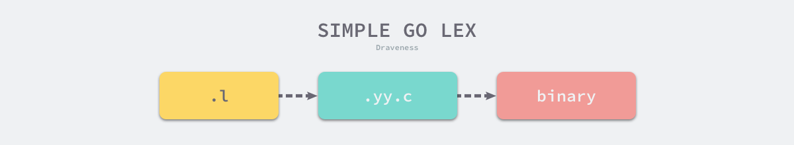
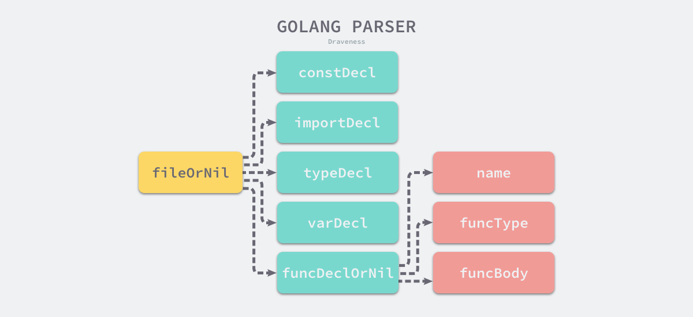
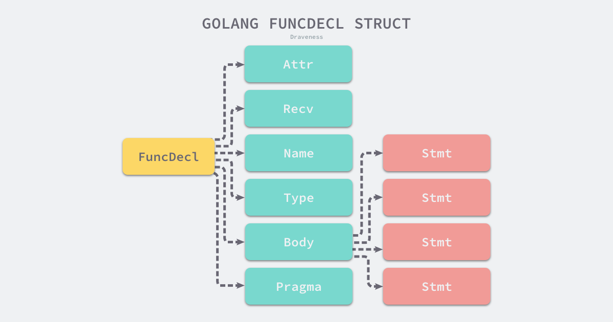
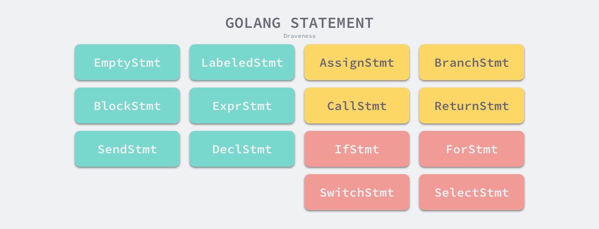

# 2.2 词法分析和语法分析

## 2.2.1 词法分析

源代码在计算机『眼中』其实是一团乱麻，一个由字符组成的、无法被理解的字符串，所有的字符在计算器看来并没有什么区别，为了理解这些字符我们需要做的第一件事情就是**将字符串分组**，这能够降低理解字符串的成本，简化源代码的分析过程。

```go
make(chan int)
```

哪怕是不懂编程的人看到上述文本的第一反应也应该会将上述字符串分成几个部分 - `make`、`chan`、`int` 和括号，这个凭直觉分解文本的过程就是[词法分析](https://en.wikipedia.org/wiki/Lexical_analysis)，词法分析是将字符序列转换为标记（token）序列的过程[<sup>2</sup>](https://draveness.me/golang/docs/part1-prerequisite/ch02-compile/golang-lexer-and-parser/#fn:2)。

### lex

[lex](http://dinosaur.compilertools.net/lex/index.html)<sup>3</sup> 是用于生成词法分析器的工具，lex 生成的代码能够将一个文件中的字符分解成 Token 序列，很多语言在设计早期都会使用它快速设计出原型。lex 作为一个代码生成器，使用了类似 C 语言的语法，我们将 lex 理解为正则匹配的生成器，它会使用正则匹配扫描输入的字符流，下面是一个 lex 文件 `simplego.l` 的示例：

```c
%{
#include <stdio.h>
%}

%%
package      printf("PACKAGE ");
import       printf("IMPORT ");
\.           printf("DOT ");
\{           printf("LBRACE ");
\}           printf("RBRACE ");
\(           printf("LPAREN ");
\)           printf("RPAREN ");
\"           printf("QUOTE ");
\n           printf("\n");
[0-9]+       printf("NUMBER ");
[a-zA-Z_]+   printf("IDENT ");
%%
```

这个定义好的文件能够解析 `package` 和 `import` 关键字、常见的特殊字符、数字以及标识符，虽然这里的规则可能有一些简陋和不完善，但是用来解析下面的这一段代码还是比较轻松的：

```go
package main

import (
	"fmt"
)

func main() {
	fmt.Println("Hello")
}
```

`.l` 结尾的 lex 代码并不能直接运行，我们首先需要通过 `lex` 命令将上面的 `simplego.l` 展开成 C 语言代码，这里可以直接执行如下所示的命令编译并打印文件中的内容：

```c
$ lex simplego.l
$ cat lex.yy.c
...
int yylex (void) {
	...
	while ( 1 ) {
		...
yy_match:
		do {
			register YY_CHAR yy_c = yy_ec[YY_SC_TO_UI(*yy_cp)];
			if ( yy_accept[yy_current_state] ) {
				(yy_last_accepting_state) = yy_current_state;
				(yy_last_accepting_cpos) = yy_cp;
			}
			while ( yy_chk[yy_base[yy_current_state] + yy_c] != yy_current_state ) {
				yy_current_state = (int) yy_def[yy_current_state];
				if ( yy_current_state >= 30 )
					yy_c = yy_meta[(unsigned int) yy_c];
				}
			yy_current_state = yy_nxt[yy_base[yy_current_state] + (unsigned int) yy_c];
			++yy_cp;
		} while ( yy_base[yy_current_state] != 37 );
		...

do_action:
		switch ( yy_act )
			case 0:
    			...

			case 1:
    			YY_RULE_SETUP
    			printf("PACKAGE ");
    			YY_BREAK
			...
}
```

[lex.yy.c](https://gist.github.com/draveness/85db6ec4a4088b63ccccf7f09424f474)<sup>4</sup> 的前 600 行基本都是宏和函数的声明和定义，后面生成的代码大都是为 `yylex` 这个函数服务的，这个函数使用[有限自动机（Deterministic Finite Automaton、DFA）](https://en.wikipedia.org/wiki/Deterministic_finite_automaton)<sup>5</sup> 的程序结构来分析输入的字符流，上述代码中 `while` 循环就是这个有限自动机的主体，你如果仔细看这个文件生成的代码会发现当前的文件中并不存在 `main` 函数，`main` 函数是在 liblex 库中定义的，所以在编译时其实需要添加额外的 `-ll` 选项：

```bash
$ cc lex.yy.c -o simplego -ll
$ cat main.go | ./simplego
```

当我们将 C 语言代码通过 gcc 编译成二进制代码之后，就可以使用管道将上面提到的 Go 语言代码作为输入传递到生成的词法分析器中，这个词法分析器会打印出如下的内容：

```go
PACKAGE  IDENT

IMPORT  LPAREN
	QUOTE IDENT QUOTE
RPAREN

IDENT  IDENT LPAREN RPAREN  LBRACE
	IDENT DOT IDENT LPAREN QUOTE IDENT QUOTE RPAREN
RBRACE
```

从上面的输出我们能够看到 Go 源代码的影子，lex 生成的词法分析器 lexer 通过正则匹配的方式将机器原本很难理解的字符串进行分解成很多的 Token，有利于后面的处理。



**图 2-7 从 .l 文件到二进制**

到这里我们已经为各位读者展示了从定义 `.l` 文件、使用 lex 将 `.l` 文件编译成 C 语言代码以及二进制的全过程，而最后生成的词法分析器也能够将简单的 Go 语言代码进行转换成 Token 序列。lex 的使用还是比较简单的，我们可以使用它快速实现词法分析器。

### Go

Go 语言的词法解析是通过 [`src/cmd/compile/internal/syntax/scanner.go`](https://github.com/golang/go/tree/master/src/cmd/compile/internal/syntax/scanner.go)<sup>6</sup> 文件中的 [`cmd/compile/internal/syntax.scanner`](https://draveness.me/golang/tree/cmd/compile/internal/syntax.scanner) 结构体实现的，这个结构体会持有当前扫描的数据源文件、启用的模式和当前被扫描到的 Token：

```go
type scanner struct {
	source
	mode   uint
	nlsemi bool

	// current token, valid after calling next()
	line, col uint
	blank     bool // line is blank up to col
	tok       token
	lit       string   // valid if tok is _Name, _Literal, or _Semi ("semicolon", "newline", or "EOF"); may be malformed if bad is true
	bad       bool     // valid if tok is _Literal, true if a syntax error occurred, lit may be malformed
	kind      LitKind  // valid if tok is _Literal
	op        Operator // valid if tok is _Operator, _AssignOp, or _IncOp
	prec      int      // valid if tok is _Operator, _AssignOp, or _IncOp
}
```

[`src/cmd/compile/internal/syntax/tokens.go`](https://github.com/golang/go/tree/master/src/cmd/compile/internal/syntax/tokens.go)<sup>7</sup> 文件中定义了 Go 语言中支持的全部 Token 类型，所有的 `token` 类型都是正整数，你可以在这个文件中找到一些常见 Token 的定义，例如：操作符、括号和关键字等：

```go
const (
	_    token = iota
	_EOF       // EOF

	// operators and operations
	_Operator // op
	...

	// delimiters
	_Lparen    // (
	_Lbrack    // [
	...

	// keywords
	_Break       // break
	...
	_Type        // type
	_Var         // var

	tokenCount //
)
```

从 Go 语言中定义的 Token 类型，我们可以将语言中的元素分成几个不同的类别，分别是名称和字面量、操作符、分隔符和关键字。词法分析主要是由 [`cmd/compile/internal/syntax.scanner`](https://draveness.me/golang/tree/cmd/compile/internal/syntax.scanner) 这个结构体中的 [`cmd/compile/internal/syntax.scanner.next`](https://draveness.me/golang/tree/cmd/compile/internal/syntax.scanner.next) 方法驱动，这个 250 行函数的主体是一个 `switch/case` 结构：

```go
func (s *scanner) next() {
	...
	s.stop()
	startLine, startCol := s.pos()
	for s.ch == ' ' || s.ch == '\t' || s.ch == '\n' && !nlsemi || s.ch == '\r' {
		s.nextch()
	}

	s.line, s.col = s.pos()
	s.blank = s.line > startLine || startCol == colbase
	s.start()
	if isLetter(s.ch) || s.ch >= utf8.RuneSelf && s.atIdentChar(true) {
		s.nextch()
		s.ident()
		return
	}

	switch s.ch {
	case -1:
		s.tok = _EOF

	case '0', '1', '2', '3', '4', '5', '6', '7', '8', '9':
		s.number(false)
	...
	}
}
```

[`cmd/compile/internal/syntax.scanner`](https://draveness.me/golang/tree/cmd/compile/internal/syntax.scanner) 每次都会通过 [`cmd/compile/internal/syntax.source.nextch`](https://draveness.me/golang/tree/cmd/compile/internal/syntax.source.nextch) 函数获取文件中最近的未被解析的字符，然后根据当前字符的不同执行不同的 case，如果遇到了空格和换行符这些空白字符会直接跳过，如果当前字符是 0 就会执行 [`cmd/compile/internal/syntax.scanner.number`](https://draveness.me/golang/tree/cmd/compile/internal/syntax.scanner.number) 方法尝试匹配一个数字。

```go
func (s *scanner) number(seenPoint bool) {
	kind := IntLit
	base := 10        // number base
	digsep := 0
	invalid := -1     // index of invalid digit in literal, or < 0

	s.kind = IntLit
	if !seenPoint {
		digsep |= s.digits(base, &invalid)
	}

	s.setLit(kind, ok)
}

func (s *scanner) digits(base int, invalid *int) (digsep int) {
	max := rune('0' + base)
	for isDecimal(s.ch) || s.ch == '_' {
		ds := 1
		if s.ch == '_' {
			ds = 2
		} else if s.ch >= max && *invalid < 0 {
			_, col := s.pos()
			*invalid = int(col - s.col) // record invalid rune index
		}
		digsep |= ds
		s.nextch()
	}
	return
}
```

上述的 [`cmd/compile/internal/syntax.scanner.number`](https://draveness.me/golang/tree/cmd/compile/internal/syntax.scanner.number) 方法省略了很多的代码，包括如何匹配浮点数、指数和复数，我们只是简单看一下词法分析匹配整数的逻辑：在 for 循环中不断获取最新的字符，将字符通过 [`cmd/compile/internal/syntax.source.nextch`](https://draveness.me/golang/tree/cmd/compile/internal/syntax.source.nextch) 方法追加到 [`cmd/compile/internal/syntax.scanner`](https://draveness.me/golang/tree/cmd/compile/internal/syntax.scanner) 持有的缓冲区中；

当前包中的词法分析器 [`cmd/compile/internal/syntax.scanner`](https://draveness.me/golang/tree/cmd/compile/internal/syntax.scanner) 也只是为上层提供了 [`cmd/compile/internal/syntax.scanner.next`](https://draveness.me/golang/tree/cmd/compile/internal/syntax.scanner.next) 方法，词法解析的过程都是惰性的，只有在上层的解析器需要时才会调用 [`cmd/compile/internal/syntax.scanner.next`](https://draveness.me/golang/tree/cmd/compile/internal/syntax.scanner.next) 获取最新的 Token。

Go 语言的词法元素相对来说还是比较简单，使用这种巨大的 `switch/case` 进行词法解析也比较方便和顺手，早期的 Go 语言虽然使用 lex 这种工具来生成词法解析器，但是最后还是使用 Go 来实现词法分析器，用自己写的词法分析器来解析自己<sup>8</sup>。

## 2.2.2 语法分析

[语法分析](https://en.wikipedia.org/wiki/Parsing)是根据某种特定的形式文法（Grammar）对 Token 序列构成的输入文本进行分析并确定其语法结构的过程<sup>9</sup>。从上面的定义来看，词法分析器输出的结果（Token 序列）即为语法分析器的输入。

语法分析的过程会使用自顶向下或者自底向上的方式进行推导，在介绍 Go 语言语法分析之前，我们会先来介绍语法分析中的文法和分析方法。

### 文法

[上下文无关文法](https://en.wikipedia.org/wiki/Context-free_grammar)是用来形式化、精确描述某种编程语言的工具，我们能够通过文法定义一种语言的语法，它主要包含一系列用于转换字符串的生产规则（Production rule）<sup>10</sup>。上下文无关文法中的每一个生产规则都会将规则左侧的非终结符转换成右侧的字符串，文法都由以下的四个部分组成：

- 𝑁 有限个非终结符的集合；
- Σ 有限个终结符的集合；
- 𝑃 有限个生产规则<sup>12</sup>的集合；
- 𝑆 非终结符集合中唯一的开始符号；

> 终结符是文法中无法再被展开的符号，而非终结符与之相反，还可以通过生产规则进行展开，例如 “id”、“123” 等标识或者字面量<sup>11</sup>。

文法被定义成一个四元组 (𝑁,Σ,𝑃,𝑆)，这个元组中的几部分是上面提到的四个符号，其中最为重要的就是生产规则，每个生产规则都会包含非终结符、终结符或者开始符号，我们在这里可以举个简单的例子：

1. 𝑆→𝑎𝑆𝑏
2. 𝑆→𝑎𝑏
3. 𝑆→𝜖

上述规则构成的文法就能够表示 ab、aabb 以及 aaa..bbb 等字符串，编程语言的文法就是由这一系列的生产规则表示的，在这里我们可以从 [`src/cmd/compile/internal/syntax/parser.go`](https://github.com/golang/go/blob/master/src/cmd/compile/internal/syntax/parser.go)<sup>13</sup> 文件中摘抄一些 Go 语言文法的生产规则：

```go
SourceFile = PackageClause ";" { ImportDecl ";" } { TopLevelDecl ";" } .
PackageClause  = "package" PackageName .
PackageName    = identifier .

ImportDecl       = "import" ( ImportSpec | "(" { ImportSpec ";" } ")" ) .
ImportSpec       = [ "." | PackageName ] ImportPath .
ImportPath       = string_lit .

TopLevelDecl  = Declaration | FunctionDecl | MethodDecl .
Declaration   = ConstDecl | TypeDecl | VarDecl .
```

> Go 语言更详细的文法可以从 [Language Specification](https://golang.org/ref/spec)<sup>14</sup> 中找到，这里不仅包含语言的文法，还包含词法元素、内置函数等信息。

因为每个 Go 源代码文件最终都会被解析成一个独立的抽象语法树，所以语法树最顶层的结构或者开始符号都是 SourceFile：

```go
SourceFile = PackageClause ";" { ImportDecl ";" } { TopLevelDecl ";" } .
```

从 SourceFile 相关的生产规则我们可以看出，每一个文件都包含一个 `package` 的定义以及可选的 `import` 声明和其他的顶层声明（TopLevelDecl），每一个 SourceFile 在编译器中都对应一个 [`cmd/compile/internal/syntax.File`](https://draveness.me/golang/tree/cmd/compile/internal/syntax.File) 结构体，你能从它们的定义中轻松找到两者的联系：

```go
type File struct {
	Pragma   Pragma
	PkgName  *Name
	DeclList []Decl
	Lines    uint
	node
}
```

顶层声明有五大类型，分别是常量、类型、变量、函数和方法，你可以在文件 [`src/cmd/compile/internal/syntax/parser.go`](https://github.com/golang/go/blob/master/src/cmd/compile/internal/syntax/parser.go) 中找到这五大类型的定义。

```go
ConstDecl = "const" ( ConstSpec | "(" { ConstSpec ";" } ")" ) .
ConstSpec = IdentifierList [ [ Type ] "=" ExpressionList ] .

TypeDecl  = "type" ( TypeSpec | "(" { TypeSpec ";" } ")" ) .
TypeSpec  = AliasDecl | TypeDef .
AliasDecl = identifier "=" Type .
TypeDef   = identifier Type .

VarDecl = "var" ( VarSpec | "(" { VarSpec ";" } ")" ) .
VarSpec = IdentifierList ( Type [ "=" ExpressionList ] | "=" ExpressionList ) .
```

上述的文法分别定义了 Go 语言中常量、类型和变量三种常见的结构，从文法中可以看到语言中的很多关键字 `const`、`type` 和 `var`，稍微回想一下我们日常接触的 Go 语言代码就能验证这里文法的正确性。

除了三种简单的语法结构之外，函数和方法的定义就更加复杂，从下面的文法我们可以看到 Statement 总共可以转换成 15 种不同的语法结构，这些语法结构就包括我们经常使用的 switch/case、if/else、for 循环以及 select 等语句：

```go
FunctionDecl = "func" FunctionName Signature [ FunctionBody ] .
FunctionName = identifier .
FunctionBody = Block .

MethodDecl = "func" Receiver MethodName Signature [ FunctionBody ] .
Receiver   = Parameters .

Block = "{" StatementList "}" .
StatementList = { Statement ";" } .

Statement =
	Declaration | LabeledStmt | SimpleStmt |
	GoStmt | ReturnStmt | BreakStmt | ContinueStmt | GotoStmt |
	FallthroughStmt | Block | IfStmt | SwitchStmt | SelectStmt | ForStmt |
	DeferStmt .

SimpleStmt = EmptyStmt | ExpressionStmt | SendStmt | IncDecStmt | Assignment | ShortVarDecl .
```

这些不同的语法结构共同定义了 Go 语言中能够使用的语法结构和表达式，对于 Statement 展开的更多内容这篇文章就不会详细介绍了，感兴趣的读者可以直接查看 [Go 语言说明书](https://golang.org/ref/spec#Statement)或者直接从 [`src/cmd/compile/internal/syntax/parser.go`](https://github.com/golang/go/blob/master/src/cmd/compile/internal/syntax/parser.go) 文件中找到想要的答案。

### 分析方法

语法分析的分析方法一般分为自顶向下和自底向上两种，这两种方式会使用不同的方式对输入的 Token 序列进行推导：

- [自顶向下分析](https://en.wikipedia.org/wiki/Top-down_parsing)：可以被看作找到当前输入流最左推导的过程，对于任意一个输入流，根据当前的输入符号，确定一个生产规则，使用生产规则右侧的符号替代相应的非终结符向下推导<sup>15</sup>
- [自底向上分析](https://en.wikipedia.org/wiki/Bottom-up_parsing)：语法分析器从输入流开始，每次都尝试重写最右侧的多个符号，这其实是说解析器会从最简单的符号进行推导，在解析的最后合并成开始符号<sup>16</sup>

#### 自顶向下 

[LL 文法](https://en.wikipedia.org/wiki/LL_grammar)<sup>17</sup>是一种使用自顶向下分析方法的文法，下面给出了一个常见的 LL 文法：

1. 𝑆→𝑎𝑆1
2. 𝑆1→𝑏𝑆1
3. 𝑆1→𝜖

假设我们存在以上的生产规则和输入流 abb，如果这里使用自顶向下的方式进行语法分析，我们可以理解为每次解析器会通过新加入的字符判断应该使用什么方式展开当前的输入流：

1. 𝑆 （开始符号）
2. 𝑎𝑆1（规则 1)
3. 𝑎𝑏𝑆1（规则 2)
4. 𝑎𝑏𝑏𝑆1（规则 2)
5. 𝑎𝑏𝑏（规则 3)

这种分析方法一定会从开始符号分析，通过下一个即将入栈的符号判断应该如何对当前堆栈中最右侧的非终结符（𝑆 或 𝑆1）进行展开，直到整个字符串中不存在任何的非终结符，整个解析过程才会结束。

#### 自底向上

但是如果我们使用自底向上的方式对输入流进行分析时，处理过程就会完全不同了，常见的四种文法 LR(0)、SLR、LR(1) 和 LALR(1) 使用了自底向上的处理方式<sup>18</sup>，我们可以简单写一个与上一节中效果相同的 LR(0) 文法：

1. 𝑆→𝑆1
2. 𝑆1→𝑆1𝑏
3. 𝑆1→𝑎

使用上述等效的文法处理同样地输入流 abb 会使用完全不同的过程对输入流进行展开：

1. 𝑎a（入栈）
2. 𝑆1（规则 3）
3. 𝑆1𝑏（入栈）
4. 𝑆1（规则 2）
5. 𝑆1𝑏（入栈）
6. 𝑆1（规则 2）
7. 𝑆（规则 1）

自底向上的分析过程会维护一个栈用于存储未被归约的符号，在整个过程中会执行两种不同的操作，一种叫做入栈（Shift），也就是将下一个符号入栈，另一种叫做归约（Reduce），也就是对最右侧的字符串按照生产规则进行合并。

上述的分析过程和自顶向下的分析方法完全不同，这两种不同的分析方法其实也代表了计算机科学中两种不同的思想 — 从抽象到具体和从具体到抽象。

#### Lookahead

在语法分析中除了 LL 和 LR 这两种不同类型的语法分析方法之外，还存在另一个非常重要的概念，就是[向前查看（Lookahead）](https://en.wikipedia.org/wiki/Lookahead)，在不同生产规则发生冲突时，当前解析器需要通过预读一些 Token 判断当前应该用什么生产规则对输入流进行展开或者归约<sup>19</sup>，例如在 LALR(1) 文法中，需要预读一个 Token 保证出现冲突的生产规则能够被正确处理。

### Go

Go 语言的解析器使用了 LALR(1) 的文法来解析词法分析过程中输出的 Token 序列<sup>20</sup>，最右推导加向前查看构成了 Go 语言解析器的最基本原理，也是大多数编程语言的选择。

我们在[概述](https://draveness.me/golang/docs/part1-prerequisite/ch02-compile/golang-compile-intro/)中已经介绍了编译器的主函数，该函数调用的 [`cmd/compile/internal/gc.parseFiles`](https://draveness.me/golang/tree/cmd/compile/internal/gc.parseFiles) 会使用多个 Goroutine 来解析源文件，解析的过程会调用 [`cmd/compile/internal/syntax.Parse`](https://draveness.me/golang/tree/cmd/compile/internal/syntax.Parse)，该函数初始化了一个新的 [`cmd/compile/internal/syntax.parser`](https://draveness.me/golang/tree/cmd/compile/internal/syntax.parser) 结构体并通过 [`cmd/compile/internal/syntax.parser.fileOrNil`](https://draveness.me/golang/tree/cmd/compile/internal/syntax.parser.fileOrNil) 方法开启对当前文件的词法和语法解析：

```go
func Parse(base *PosBase, src io.Reader, errh ErrorHandler, pragh PragmaHandler, mode Mode) (_ *File, first error) {
	var p parser
	p.init(base, src, errh, pragh, mode)
	p.next()
	return p.fileOrNil(), p.first
}
```

[`cmd/compile/internal/syntax.parser.fileOrNil`](https://draveness.me/golang/tree/cmd/compile/internal/syntax.parser.fileOrNil) 方法其实是对上面介绍的 Go 语言文法的实现，该方法首先会解析文件开头的 `package` 定义：

```go
// SourceFile = PackageClause ";" { ImportDecl ";" } { TopLevelDecl ";" } .
func (p *parser) fileOrNil() *File {
	f := new(File)
	f.pos = p.pos()

	if !p.got(_Package) {
		p.syntaxError("package statement must be first")
		return nil
	}
	f.PkgName = p.name()
	p.want(_Semi)
```

从上面的这一段方法中我们可以看出，当前方法会通过 [`cmd/compile/internal/syntax.parser.got`](https://draveness.me/golang/tree/cmd/compile/internal/syntax.parser.got) 来判断下一个 Token 是不是 `package` 关键字，如果是 `package` 关键字，就会执行 [`cmd/compile/internal/syntax.parser.name`](https://draveness.me/golang/tree/cmd/compile/internal/syntax.parser.name) 来匹配一个包名并将结果保存到返回的文件结构体中。

```go
for p.got(_Import) {
	f.DeclList = p.appendGroup(f.DeclList, p.importDecl)
	p.want(_Semi)
}
```

确定了当前文件的包名之后，就开始解析可选的 `import` 声明，每一个 `import` 在解析器看来都是一个声明语句，这些声明语句都会被加入到文件的 `DeclList` 中。

在这之后会根据编译器获取的关键字进入 switch 的不同分支，这些分支调用 [`cmd/compile/internal/syntax.parser.appendGroup`](https://draveness.me/golang/tree/cmd/compile/internal/syntax.parser.appendGroup) 方法并在方法中传入用于处理对应类型语句的 [`cmd/compile/internal/syntax.parser.constDecl`](https://draveness.me/golang/tree/cmd/compile/internal/syntax.parser.constDecl)、[`cmd/compile/internal/syntax.parser.typeDecl`](https://draveness.me/golang/tree/cmd/compile/internal/syntax.parser.typeDecl) 函数。

```go
	for p.tok != _EOF {
		switch p.tok {
		case _Const:
			p.next()
			f.DeclList = p.appendGroup(f.DeclList, p.constDecl)

		case _Type:
			p.next()
			f.DeclList = p.appendGroup(f.DeclList, p.typeDecl)

		case _Var:
			p.next()
			f.DeclList = p.appendGroup(f.DeclList, p.varDecl)

		case _Func:
			p.next()
			if d := p.funcDeclOrNil(); d != nil {
				f.DeclList = append(f.DeclList, d)
			}
		default:
			...
		}
	}

	f.Lines = p.source.line

	return f
}
```

[`cmd/compile/internal/syntax.parser.fileOrNil`](https://draveness.me/golang/tree/cmd/compile/internal/syntax.parser.fileOrNil) 使用了非常多的子方法对输入的文件进行语法分析，并在最后会返回文件开始创建的 [`cmd/compile/internal/syntax.File`](https://draveness.me/golang/tree/cmd/compile/internal/syntax.File) 结构体。

读到这里的人可能会有一些疑惑，为什么没有看到词法分析的代码，这是因为词法分析器 [`cmd/compile/internal/syntax.scanner`](https://draveness.me/golang/tree/cmd/compile/internal/syntax.scanner) 作为结构体被嵌入到了 [`cmd/compile/internal/syntax.parser`](https://draveness.me/golang/tree/cmd/compile/internal/syntax.parser) 中，所以这个方法中的 `p.next()` 实际上调用的是 [`cmd/compile/internal/syntax.scanner.next`](https://draveness.me/golang/tree/cmd/compile/internal/syntax.scanner.next) 方法，它会直接获取文件中的下一个 Token，所以词法和语法分析一起进行的。

[`cmd/compile/internal/syntax.parser.fileOrNil`](https://draveness.me/golang/tree/cmd/compile/internal/syntax.parser.fileOrNil) 与在这个方法中执行的其他子方法共同构成了一棵树，这棵树根节点是 [`cmd/compile/internal/syntax.parser.fileOrNil`](https://draveness.me/golang/tree/cmd/compile/internal/syntax.parser.fileOrNil)，子节点是 [`cmd/compile/internal/syntax.parser.importDecl`](https://draveness.me/golang/tree/cmd/compile/internal/syntax.parser.importDecl)、[`cmd/compile/internal/syntax.parser.constDecl`](https://draveness.me/golang/tree/cmd/compile/internal/syntax.parser.constDecl) 等方法，它们与 Go 语言文法中的生产规则一一对应。



**图 2-8 Go 语言解析器的方法**

[`cmd/compile/internal/syntax.parser.fileOrNil`](https://draveness.me/golang/tree/cmd/compile/internal/syntax.parser.fileOrNil)、[`cmd/compile/internal/syntax.parser.constDecl`](https://draveness.me/golang/tree/cmd/compile/internal/syntax.parser.constDecl) 等方法对应了 Go 语言中的生产规则，例如 [`cmd/compile/internal/syntax.parser.fileOrNil`](https://draveness.me/golang/tree/cmd/compile/internal/syntax.parser.fileOrNil) 实现的是：

```go
SourceFile = PackageClause ";" { ImportDecl ";" } { TopLevelDecl ";" } .
```

我们根据这个规则能很好地理解语法分析器的实现原理 - 将编程语言的所有生产规则映射到对应的方法上，这些方法构成的树形结构最终会返回一个抽象语法树。

因为大多数方法的实现都非常相似，所以这里就仅介绍 [`cmd/compile/internal/syntax.parser.fileOrNil`](https://draveness.me/golang/tree/cmd/compile/internal/syntax.parser.fileOrNil) 方法的实现了，想要了解其他方法的实现原理，读者可以自行查看 [`src/cmd/compile/internal/syntax/parser.go`](https://github.com/golang/go/blob/master/src/cmd/compile/internal/syntax/parser.go) 文件，该文件包含了语法分析阶段的全部方法。

#### 辅助方法

虽然这里不会展开介绍其他类似方法的实现，但是解析器运行过程中有几个辅助方法我们还是要简单说明一下，首先就是 [`cmd/compile/internal/syntax.parser.got`](https://draveness.me/golang/tree/cmd/compile/internal/syntax.parser.got) 和 [`cmd/compile/internal/syntax.parser.want`](https://draveness.me/golang/tree/cmd/compile/internal/syntax.parser.want) 这两个常见的方法：

```go
func (p *parser) got(tok token) bool {
	if p.tok == tok {
		p.next()
		return true
	}
	return false
}

func (p *parser) want(tok token) {
	if !p.got(tok) {
		p.syntaxError("expecting " + tokstring(tok))
		p.advance()
	}
}
```

[`cmd/compile/internal/syntax.parser.got`](https://draveness.me/golang/tree/cmd/compile/internal/syntax.parser.got) 只是用于快速判断一些语句中的关键字，如果当前解析器中的 Token 是传入的 Token 就会直接跳过该 Token 并返回 `true`；而 [`cmd/compile/internal/syntax.parser.want`](https://draveness.me/golang/tree/cmd/compile/internal/syntax.parser.want) 就是对 [`cmd/compile/internal/syntax.parser.got`](https://draveness.me/golang/tree/cmd/compile/internal/syntax.parser.got) 的简单封装了，如果当前 Token 不是我们期望的，就会立刻返回语法错误并结束这次编译。

这两个方法的引入能够帮助工程师在上层减少判断关键字的大量重复逻辑，让上层语法分析过程的实现更加清晰。

另一个方法 [`cmd/compile/internal/synctax.parser.appendGroup`](https://draveness.me/golang/tree/cmd/compile/internal/syntax.parser.appendGroup) 的实现就稍微复杂了一点，它的主要作用就是找出批量的定义，我们可以简单举一个例子：

```go
var (
   a int
   b int
)
```

这两个变量其实属于同一个组（Group），各种顶层定义的结构体 [`cmd/compile/internal/syntax.parser.constDecl`](https://draveness.me/golang/tree/cmd/compile/internal/syntax.parser.constDecl)、[`cmd/compile/internal/syntax.parser.varDecl`](https://draveness.me/golang/tree/cmd/compile/internal/syntax.parser.varDecl) 在进行语法分析时有一个额外的参数 [`cmd/compile/internal/syntax.Group`](https://draveness.me/golang/tree/cmd/compile/internal/syntax.Group)，这个参数是通过 [`cmd/compile/internal/syntax.parser.appendGroup`](https://draveness.me/golang/tree/cmd/compile/internal/syntax.parser.appendGroup) 方法传递进去的：

```go
func (p *parser) appendGroup(list []Decl, f func(*Group) Decl) []Decl {
	if p.tok == _Lparen {
		g := new(Group)
		p.list(_Lparen, _Semi, _Rparen, func() bool {
			list = append(list, f(g))
			return false
		})
	} else {
		list = append(list, f(nil))
	}

	return list
}
```

[`cmd/compile/internal/syntax.parser.appendGroup`](https://draveness.me/golang/tree/cmd/compile/internal/syntax.parser.appendGroup) 方法会调用传入的 `f` 方法对输入流进行匹配并将匹配的结果追加到另一个参数 [`cmd/compile/internal/syntax.File`](https://draveness.me/golang/tree/cmd/compile/internal/syntax.File) 结构体中的 `DeclList` 数组中，`import`、`const`、`var`、`type` 和 `func` 声明语句都是调用 [`cmd/compile/internal/syntax.parser.appendGroup`](https://draveness.me/golang/tree/cmd/compile/internal/syntax.parser.appendGroup) 方法解析的。

#### 节点

语法分析器最终会使用不同的结构体来构建抽象语法树中的节点，其中根节点 [`cmd/compile/internal/syntax.File`](https://draveness.me/golang/tree/cmd/compile/internal/syntax.File) 我们已经在上面介绍过了，其中包含了当前文件的包名、所有声明结构的列表和文件的行数：

```go
type File struct {
	Pragma   Pragma
	PkgName  *Name
	DeclList []Decl
	Lines    uint
	node
}
```

[`src/cmd/compile/internal/syntax/nodes.go`](https://github.com/golang/go/blob/master/src/cmd/compile/internal/syntax/nodes.go) 文件中也定义了其他节点的结构体，其中包含全部声明类型的，这里简单看一下函数声明的结构：

```go
type (
	Decl interface {
		Node
		aDecl()
	}

	FuncDecl struct {
		Attr   map[string]bool
		Recv   *Field     // 接受者
		Name   *Name      // 函数名
		Type   *FuncType  // 函数类型
		Body   *BlockStmt // 函数体
		Pragma Pragma
		decl
	}
}
```

从函数定义中我们可以看出，函数在语法结构上主要由接受者、函数名、函数类型和函数体几个部分组成，函数体 [`cmd/compile/internal/syntax.BlockStmt`](https://draveness.me/golang/tree/cmd/compile/internal/syntax.BlockStmt) 是由一系列的表达式组成的，这些表达式共同组成了函数的主体：



**图 2-9 Go 语言函数定义的结构体**

函数的主体其实是一个 [`cmd/compile/internal/syntax.Stmt`](https://draveness.me/golang/tree/cmd/compile/internal/syntax.Stmt) 数组，[`cmd/compile/internal/syntax.Stmt`](https://draveness.me/golang/tree/cmd/compile/internal/syntax.Stmt) 是一个接口，实现该接口的类型其实也非常多，总共有 14 种不同类型的 [`cmd/compile/internal/syntax.Stmt`](https://draveness.me/golang/tree/cmd/compile/internal/syntax.Stmt) 实现：



**图 2-9 Go 语言的 14 种声明**

这些不同类型的 [`cmd/compile/internal/syntax.Stmt`](https://draveness.me/golang/tree/cmd/compile/internal/syntax.Stmt) 构成了全部命令式的 Go 语言代码，从中我们可以看到很多熟悉的控制结构，例如 if、for、switch 和 select，这些命令式的结构在其他的编程语言中也非常常见。

## 2.2.4 延伸阅读

- [Lexical Scanning in Go - Rob Pike](https://www.youtube.com/watch?v=HxaD_trXwRE)

------

1. 通用编程语言 General-purpose programming language https://en.wikipedia.org/wiki/General-purpose_programming_language [↩︎](https://draveness.me/golang/docs/part1-prerequisite/ch02-compile/golang-lexer-and-parser/#fnref:1)
2. 词法分析 Lexical analysis https://en.wikipedia.org/wiki/Lexical_analysis [↩︎](https://draveness.me/golang/docs/part1-prerequisite/ch02-compile/golang-lexer-and-parser/#fnref:2)
3. 词法分析生成器 http://dinosaur.compilertools.net/lex/index.html [↩︎](https://draveness.me/golang/docs/part1-prerequisite/ch02-compile/golang-lexer-and-parser/#fnref:3)
4. 生成的 simplego.lex.c 文件 https://gist.github.com/draveness/85db6ec4a4088b63ccccf7f09424f474 [↩︎](https://draveness.me/golang/docs/part1-prerequisite/ch02-compile/golang-lexer-and-parser/#fnref:4)
5. 有限自动机 DFA https://en.wikipedia.org/wiki/Deterministic_finite_automaton [↩︎](https://draveness.me/golang/docs/part1-prerequisite/ch02-compile/golang-lexer-and-parser/#fnref:5)
6. https://github.com/golang/go/tree/master/src/cmd/compile/internal/syntax/scanner.go [↩︎](https://draveness.me/golang/docs/part1-prerequisite/ch02-compile/golang-lexer-and-parser/#fnref:6)
7. https://github.com/golang/go/tree/master/src/cmd/compile/internal/syntax/tokens.go [↩︎](https://draveness.me/golang/docs/part1-prerequisite/ch02-compile/golang-lexer-and-parser/#fnref:7)
8. Go 1.5 Bootstrap Plan https://docs.google.com/document/d/1OaatvGhEAq7VseQ9kkavxKNAfepWy2yhPUBs96FGV28/edit [↩︎](https://draveness.me/golang/docs/part1-prerequisite/ch02-compile/golang-lexer-and-parser/#fnref:8)
9. 语法分析 Syntactic analysis https://en.wikipedia.org/wiki/Parsing [↩︎](https://draveness.me/golang/docs/part1-prerequisite/ch02-compile/golang-lexer-and-parser/#fnref:9)
10. https://en.wikipedia.org/wiki/Context-free_grammar [↩︎](https://draveness.me/golang/docs/part1-prerequisite/ch02-compile/golang-lexer-and-parser/#fnref:10)
11. 终结符和非终结符 https://en.wikipedia.org/wiki/Terminal_and_nonterminal_symbols [↩︎](https://draveness.me/golang/docs/part1-prerequisite/ch02-compile/golang-lexer-and-parser/#fnref:11)
12. 生产规则在计算机科学领域是符号替换的重写规则，S -> aSb 就是可以用右侧的 aSb 将左侧的符号进行展开 https://en.wikipedia.org/wiki/Production_(computer_science) [↩︎](https://draveness.me/golang/docs/part1-prerequisite/ch02-compile/golang-lexer-and-parser/#fnref:12)
13. https://github.com/golang/go/blob/master/src/cmd/compile/internal/syntax/parser.go [↩︎](https://draveness.me/golang/docs/part1-prerequisite/ch02-compile/golang-lexer-and-parser/#fnref:13)
14. The Go Programming Language Specification https://golang.org/ref/spec [↩︎](https://draveness.me/golang/docs/part1-prerequisite/ch02-compile/golang-lexer-and-parser/#fnref:14)
15. 自顶向下解析 https://en.wikipedia.org/wiki/Top-down_parsing [↩︎](https://draveness.me/golang/docs/part1-prerequisite/ch02-compile/golang-lexer-and-parser/#fnref:15)
16. 自底向上解析 https://en.wikipedia.org/wiki/Bottom-up_parsing [↩︎](https://draveness.me/golang/docs/part1-prerequisite/ch02-compile/golang-lexer-and-parser/#fnref:16)
17. LL 文法是一种上下文无关文法，可以使用 LL 解析器解析 https://en.wikipedia.org/wiki/LL_grammar [↩︎](https://draveness.me/golang/docs/part1-prerequisite/ch02-compile/golang-lexer-and-parser/#fnref:17)
18. LR 解析器是一种自底向上的解析器，它有很多 SLR、LALR、等变种 https://en.wikipedia.org/wiki/LR_parser [↩︎](https://draveness.me/golang/docs/part1-prerequisite/ch02-compile/golang-lexer-and-parser/#fnref:18)
19. https://en.wikipedia.org/wiki/Lookahead [↩︎](https://draveness.me/golang/docs/part1-prerequisite/ch02-compile/golang-lexer-and-parser/#fnref:19)
20. 关于 Go 语言文法的讨论 https://groups.google.com/forum/#!msg/golang-nuts/jVjbH2-emMQ/UdZlSNhd3DwJ [↩︎](https://draveness.me/golang/docs/part1-prerequisite/ch02-compile/golang-lexer-and-parser/#fnref:20)


## 原文链接

[左书祺 - 2.3 类型检查](https://draveness.me/golang/docs/part1-prerequisite/ch02-compile/golang-typecheck)