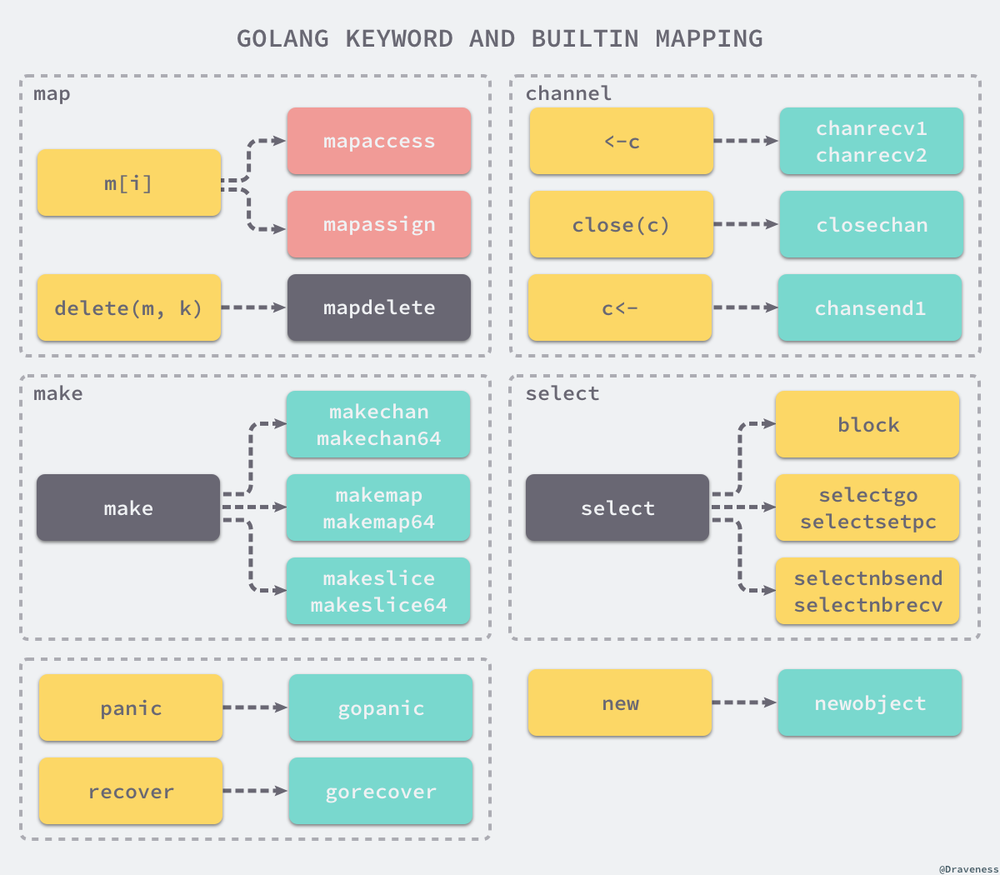
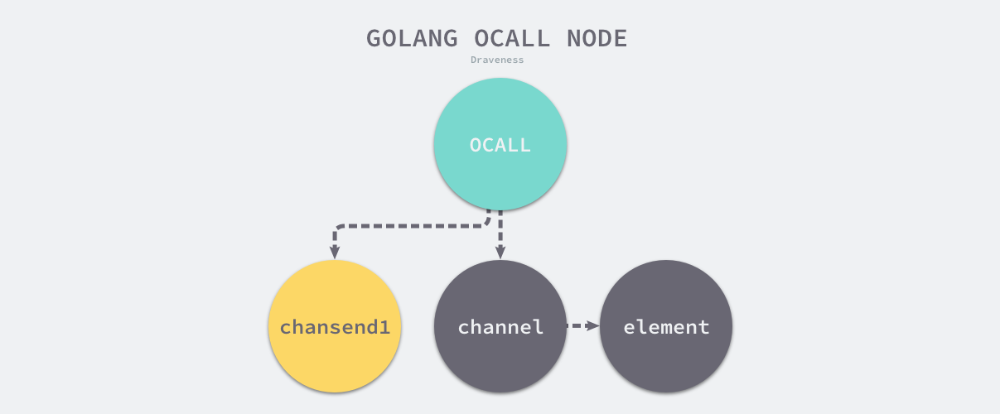
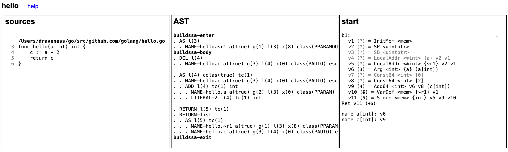

# 2.4 中间代码生成

## 2.4.1 概述

[中间代码](https://en.wikipedia.org/wiki/Intermediate_representation)是编译器或者虚拟机使用的语言，它可以来帮助我们分析计算机程序。在编译过程中，编译器会在将源代码转换到机器码的过程中，先把源代码转换成一种中间的表示形式，即中间代码<sup>1</sup>。

很多读者可能认为中间代码没有太多价值，我们可以直接将源代码翻译成目标语言，这种看起来可行的办法实际上有很多问题，其中最主要的是：它忽略了编译器面对的复杂场景，很多编译器需要将源代码翻译成多种机器码，直接翻译高级编程语言相对比较困难。

将编程语言到机器码的过程拆成中间代码生成和机器码生成两个简单步骤可以简化该问题，中间代码是一种更接近机器语言的表示形式，对中间代码的优化和分析相比直接分析高级编程语言更容易。

我们再来回忆一下编译阶段入口的主函数 [`cmd/compile/internal/gc.Main`](https://draveness.me/golang/tree/cmd/compile/internal/gc.Main) 中关于中间代码生成的部分，这一段代码会初始化 SSA 生成的配置，在配置初始化结束后会调用 [`cmd/compile/internal/gc.funccompile`](https://draveness.me/golang/tree/cmd/compile/internal/gc.funccompile) 编译函数：

```go
func Main(archInit func(*Arch)) {
	...

	initssaconfig() // 初始化 SSA 生成的配置

	for i := 0; i < len(xtop); i++ {
		n := xtop[i]
		if n.Op == ODCLFUNC {
			funccompile(n)
		}
	}

	compileFunctions()
}
```

这一节将分别介绍配置的初始化以及函数编译两部分内容，我们会以 [`cmd/compile/internal/gc.initssaconfig`](https://draveness.me/golang/tree/cmd/compile/internal/gc.initssaconfig) 和 [`cmd/compile/internal/gc.funccompile`](https://draveness.me/golang/tree/cmd/compile/internal/gc.funccompile) 这两个函数作为入口来分析中间代码生成的具体过程和实现原理。


## 2.4.2 配置初始化

SSA 配置的初始化过程是中间代码生成之前的准备工作，在该过程中，我们会缓存可能用到的类型指针、初始化 SSA 配置和一些之后会调用的运行时函数，例如：用于处理 `defer` 关键字的 [`runtime.deferproc`](https://draveness.me/golang/tree/runtime.deferproc)、用于创建 Goroutine 的 [`runtime.newproc`](https://draveness.me/golang/tree/runtime.newproc) 和扩容切片的 [`runtime.growslice`](https://draveness.me/golang/tree/runtime.growslice) 等，除此之外还会根据当前的目标设备初始化特定的 ABI<sup>2</sup>。我们以 [`cmd/compile/internal/gc.initssaconfig`](https://draveness.me/golang/tree/cmd/compile/internal/gc.initssaconfig) 作为入口开始分析配置初始化的过程。

```go
func initssaconfig() {
	types_ := ssa.NewTypes()

	_ = types.NewPtr(types.Types[TINTER])                             // *interface{}
	_ = types.NewPtr(types.NewPtr(types.Types[TSTRING]))              // **string
	_ = types.NewPtr(types.NewPtr(types.Idealstring))                 // **string
	_ = types.NewPtr(types.NewSlice(types.Types[TINTER]))             // *[]interface{}
	..
	_ = types.NewPtr(types.Errortype)                                 // *error
```

这个函数的执行过程总共可以分成三个部分，首先就是调用 [`cmd/compile/internal/ssa.NewTypes`](https://draveness.me/golang/tree/cmd/compile/internal/ssa.NewTypes) 初始化 [`cmd/compile/internal/ssa.Types`](https://draveness.me/golang/tree/cmd/compile/internal/ssa.Types) 结构体并调用 [`cmd/compile/internal/types.NewPtr`](https://draveness.me/golang/tree/cmd/compile/internal/types.NewPtr) 函数缓存类型的信息，[`cmd/compile/internal/ssa.Types`](https://draveness.me/golang/tree/cmd/compile/internal/ssa.Types) 中存储了所有 Go 语言中基本类型对应的指针，比如 `Bool`、`Int8`、以及 `String` 等。

[`cmd/compile/internal/types.NewPtr`](https://draveness.me/golang/tree/cmd/compile/internal/types.NewPtr) 函数的主要作用是根据类型生成指向这些类型的指针，同时它会根据编译器的配置将生成的指针类型缓存在当前类型中，优化类型指针的获取效率：

```go
func NewPtr(elem *Type) *Type {
	if t := elem.Cache.ptr; t != nil {
		if t.Elem() != elem {
			Fatalf("NewPtr: elem mismatch")
		}
		return t
	}

	t := New(TPTR)
	t.Extra = Ptr{Elem: elem}
	t.Width = int64(Widthptr)
	t.Align = uint8(Widthptr)
	if NewPtrCacheEnabled {
		elem.Cache.ptr = t
	}
	return t
}
```

配置初始化的第二步是根据当前的 CPU 架构初始化 SSA 配置，我们会向 [`cmd/compile/internal/ssa.NewConfig`](https://draveness.me/golang/tree/cmd/compile/internal/ssa.NewConfig) 函数传入目标机器的 CPU 架构、上述代码初始化的 [`cmd/compile/internal/ssa.Types`](https://draveness.me/golang/tree/cmd/compile/internal/ssa.Types) 结构体、上下文信息和 Debug 配置：

```go
	ssaConfig = ssa.NewConfig(thearch.LinkArch.Name, *types_, Ctxt, Debug['N'] == 0)
```

[`cmd/compile/internal/ssa.NewConfig`](https://draveness.me/golang/tree/cmd/compile/internal/ssa.NewConfig) 会根据传入的 CPU 架构设置用于生成中间代码和机器码的函数，当前编译器使用的指针、寄存器大小、可用寄存器列表、掩码等编译选项：

```go
func NewConfig(arch string, types Types, ctxt *obj.Link, optimize bool) *Config {
	c := &Config{arch: arch, Types: types}
	c.useAvg = true
	c.useHmul = true
	switch arch {
	case "amd64":
		c.PtrSize = 8
		c.RegSize = 8
		c.lowerBlock = rewriteBlockAMD64
		c.lowerValue = rewriteValueAMD64
		c.registers = registersAMD64[:]
		...
	case "arm64":
	...
	case "wasm":
	default:
		ctxt.Diag("arch %s not implemented", arch)
	}
	c.ctxt = ctxt
	c.optimize = optimize

	...
	return c
}
```

所有的配置项一旦被创建，在整个编译期间都是只读的并且被全部编译阶段共享，也就是中间代码生成和机器码生成这两部分都会使用这一份配置完成自己的工作。在 [`cmd/compile/internal/gc.initssaconfig`](https://draveness.me/golang/tree/cmd/compile/internal/gc.initssaconfig) 方法调用的最后，会初始化一些编译器可能用到的 Go 语言运行时的函数：

```go
	assertE2I = sysfunc("assertE2I")
	assertE2I2 = sysfunc("assertE2I2")
	assertI2I = sysfunc("assertI2I")
	assertI2I2 = sysfunc("assertI2I2")
	deferproc = sysfunc("deferproc")
	Deferreturn = sysfunc("deferreturn")
	...
```

[`cmd/compile/internal/ssa.sysfunc`](https://draveness.me/golang/tree/cmd/compile/internal/ssa.sysfunc) 函数会在对应的运行时包结构体 [`cmd/compile/internal/types.Pkg`](https://draveness.me/golang/tree/cmd/compile/internal/types.Pkg) 中创建一个新的符号 [`cmd/compile/internal/obj.LSym`](https://draveness.me/golang/tree/cmd/compile/internal/obj.LSym)，表示该方法已经注册到运行时包中。后面的中间代码生成阶段中直接使用这些方法，例如：上述代码片段中的 [`runtime.deferproc`](https://draveness.me/golang/tree/runtime.deferproc) 和 [`runtime.deferreturn`](https://draveness.me/golang/tree/runtime.deferreturn) 就是 Go 语言用于实现 defer 关键字的运行时函数，你能从后面的章节中了解更多内容。


## 2.4.3 遍历和替换

在生成中间代码之前，编译器还需要替换抽象语法树中节点的一些元素，这个替换的过程是通过 [`cmd/compile/internal/gc.walk`](https://draveness.me/golang/tree/cmd/compile/internal/gc.walk) 和以相关函数实现的，这里简单展示几个函数的签名：

```go
func walk(fn *Node)
func walkappend(n *Node, init *Nodes, dst *Node) *Node
...
func walkrange(n *Node) *Node
func walkselect(sel *Node)
func walkselectcases(cases *Nodes) []*Node
func walkstmt(n *Node) *Node
func walkstmtlist(s []*Node)
func walkswitch(sw *Node)
```

这些用于遍历抽象语法树的函数会将一些关键字和内建函数转换成函数调用，例如： 上述函数会将 `panic`、`recover` 两个内建函数转换成 [`runtime.gopanic`](https://draveness.me/golang/tree/runtime.gopanic) 和 [`runtime.gorecover`](https://draveness.me/golang/tree/runtime.gorecover) 两个真正运行时函数，而关键字 `new` 也会被转换成调用 [`runtime.newobject`](https://draveness.me/golang/tree/runtime.newobject) 函数。




**图 2-13 关键字和操作符和运行时函数的映射**

上图是从关键字或内建函数到运行时函数的映射，其中涉及 Channel、哈希、`make`、`new` 关键字以及控制流中的关键字 `select` 等。转换后的全部函数都属于运行时包，我们能在 [`src/cmd/compile/internal/gc/builtin/runtime.go`](https://github.com/golang/go/blob/master/src/cmd/compile/internal/gc/builtin/runtime.go) 文件中找到函数对应的签名和定义。

```go
func makemap64(mapType *byte, hint int64, mapbuf *any) (hmap map[any]any)
func makemap(mapType *byte, hint int, mapbuf *any) (hmap map[any]any)
func makemap_small() (hmap map[any]any)
func mapaccess1(mapType *byte, hmap map[any]any, key *any) (val *any)
...
func makechan64(chanType *byte, size int64) (hchan chan any)
func makechan(chanType *byte, size int) (hchan chan any)
...
```

这里的定义只是让 Go 语言完成编译，它们的实现都在另一个 [`runtime`](https://github.com/golang/go/tree/master/src/runtime) 包中。简单总结一下，编译器会将 Go 语言关键字转换成运行时包中的函数，也就是说关键字和内置函数的功能是由编译器和运行时共同完成的。

这里简单了解一下遍历节点时几个 Channel 操作是如何转换成运行时对应方法的，首先介绍向 Channel 发送消息或者从 Channel 接收消息两个操作，编译器会分别使用 `OSEND` 和 `ORECV` 表示发送和接收消息两个操作，在 [`cmd/compile/internal/gc.walkexpr`](https://draveness.me/golang/tree/cmd/compile/internal/gc.walkexpr) 函数中会根据节点类型的不同进入不同的分支：

```go
func walkexpr(n *Node, init *Nodes) *Node {
	...
	case OSEND:
		n1 := n.Right
		n1 = assignconv(n1, n.Left.Type.Elem(), "chan send")
		n1 = walkexpr(n1, init)
		n1 = nod(OADDR, n1, nil)
		n = mkcall1(chanfn("chansend1", 2, n.Left.Type), nil, init, n.Left, n1)
	...
}
```

当遇到 `OSEND` 操作时，会使用 [`cmd/compile/internal/gc.mkcall1`](https://draveness.me/golang/tree/cmd/compile/internal/gc.mkcall1) 创建一个操作为 `OCALL` 的节点，这个节点包含当前调用的函数 [`runtime.chansend1`](https://draveness.me/golang/tree/runtime.chansend1) 和参数，新的 `OCALL` 节点会替换当前的 `OSEND` 节点，这就完成了对 `OSEND` 子树的改写。



**图 2-14 改写后的 Channel 发送操作**

编译器会在编译期间将 Channel 的这些内置操作转换成几个运行时函数，很多人都想要了解 Channel 底层的实现，但是并不知道函数的入口，通过本节的分析我们就知道 [`runtime.chanrecv1`](https://draveness.me/golang/tree/runtime.chanrecv1)、[`runtime.chansend1`](https://draveness.me/golang/tree/runtime.chansend1) 和 [`runtime.closechan`](https://draveness.me/golang/tree/runtime.closechan) 几个函数分别实现了 Channel 的接收、发送和关闭操作。


## 2.4.4 SSA 生成

经过 `walk` 系列函数的处理之后，抽象语法树就不会改变了，Go 语言的编译器会使用 [`cmd/compile/internal/gc.compileSSA`](https://draveness.me/golang/tree/cmd/compile/internal/gc.compileSSA) 函数将抽象语法树转换成中间代码，我们可以先看一下该函数的简要实现：

```go
func compileSSA(fn *Node, worker int) {
	f := buildssa(fn, worker)
	pp := newProgs(fn, worker)
	genssa(f, pp)

	pp.Flush()
}
```

[`cmd/compile/internal/gc.buildssa`](https://draveness.me/golang/tree/cmd/compile/internal/gc.buildssa) 负责生成具有 SSA 特性的中间代码，我们可以使用命令行工具来观察中间代码的生成过程，假设我们有以下的 Go 语言源代码，其中只包含一个简单的 `hello` 函数：

```go
package hello

func hello(a int) int {
	c := a + 2
	return c
}
```

我们可以使用 `GOSSAFUNC` 环境变量构建上述代码并获取从源代码到最终的中间代码经历的几十次迭代，其中所有的数据都存储到了 `ssa.html` 文件中：

```go
$ GOSSAFUNC=hello go build hello.go
# command-line-arguments
dumped SSA to ./ssa.html
```

Go

上述文件中包含源代码对应的抽象语法树、几十个版本的中间代码以及最终生成的 SSA，在这里截取文件的一部分让各位读者简单了解该文件的内容：



**图 2-15 SSA 中间代码生成过程**

如上图所示，其中最左侧就是源代码，中间是源代码生成的抽象语法树，最右侧是生成的第一轮中间代码，后面还有几十轮，感兴趣的读者可以自己尝试编译一下。`hello` 函数对应的抽象语法树会包含当前函数的 `Enter`、`NBody` 和 `Exit` 三个属性，[`cmd/compile/internal/gc.buildssa`](https://draveness.me/golang/tree/cmd/compile/internal/gc.buildssa) 函数会输出这些属性，你能从这个简化的逻辑中看到上述输出的影子：

```go
func buildssa(fn *Node, worker int) *ssa.Func {
	name := fn.funcname()
	var astBuf *bytes.Buffer
	var s state

	fe := ssafn{
		curfn: fn,
		log:   printssa && ssaDumpStdout,
	}
	s.curfn = fn

	s.f = ssa.NewFunc(&fe)
	s.config = ssaConfig
	s.f.Type = fn.Type
	s.f.Config = ssaConfig

	...

  // 第一阶段：生成中间代码
	s.stmtList(fn.Func.Enter) // Enter属性
	s.stmtList(fn.Nbody) // NBody属性

  // 第二阶段：多轮迭代更新SSA中间代码
	ssa.Compile(s.f)
	return s.f
}
```

`ssaConfig` 是我们在这里的第一小节初始化的结构体，其中包含了与 CPU 架构相关的函数和配置，随后的中间代码生成其实也分成两个阶段，第一阶段使用 [`cmd/compile/internal/gc.state.stmtList`](https://draveness.me/golang/tree/cmd/compile/internal/gc.state.stmtList) 以及相关函数将抽象语法树转换成中间代码，第二阶段调用 [`cmd/compile/internal/ssa`](https://github.com/golang/go/tree/master/src/cmd/compile/internal/ssa) 包的 [`cmd/compile/internal/ssa.Compile`](https://draveness.me/golang/tree/cmd/compile/internal/ssa.Compile) 通过多轮迭代更新 SSA 中间代码。

### AST 到 SSA

[`cmd/compile/internal/gc.state.stmtList`](https://draveness.me/golang/tree/cmd/compile/internal/gc.state.stmtList) 会为传入数组中的每个节点调用 [`cmd/compile/internal/gc.state.stmt`](https://draveness.me/golang/tree/cmd/compile/internal/gc.state.stmt) 方法，编译器会根据节点操作符的不同将当前 AST 节点转换成对应的中间代码：

```go
func (s *state) stmt(n *Node) {
	...
	switch n.Op {
	case OCALLMETH, OCALLINTER:
		s.call(n, callNormal)
		if n.Op == OCALLFUNC && n.Left.Op == ONAME && n.Left.Class() == PFUNC {
			if fn := n.Left.Sym.Name; compiling_runtime && fn == "throw" ||
				n.Left.Sym.Pkg == Runtimepkg && (fn == "throwinit" || fn == "gopanic" || fn == "panicwrap" || fn == "block" || fn == "panicmakeslicelen" || fn == "panicmakeslicecap") {
				m := s.mem()
				b := s.endBlock()
				b.Kind = ssa.BlockExit
				b.SetControl(m)
			}
		}
		s.call(n.Left, callDefer)
	case OGO:
		s.call(n.Left, callGo)
	...
	}
}
```

从上面节选的代码中我们会发现，在遇到函数调用、方法调用、使用 defer 或者 go 关键字时都会执行 [`cmd/compile/internal/gc.state.callResult`](https://draveness.me/golang/tree/cmd/compile/internal/gc.state.callResult) 和 [`cmd/compile/internal/gc.state.call`](https://draveness.me/golang/tree/cmd/compile/internal/gc.state.call) 生成调用函数的 SSA 节点，这些在开发者看来不同的概念在编译器中都会被实现成静态的函数调用，上层的关键字和方法只是语言为我们提供的语法糖：

```go
func (s *state) callResult(n *Node, k callKind) *ssa.Value {
	return s.call(n, k, false)
}

func (s *state) call(n *Node, k callKind) *ssa.Value {
	...
	var call *ssa.Value
	switch {
	case k == callDefer:
		call = s.newValue1A(ssa.OpStaticCall, types.TypeMem, deferproc, s.mem())
	case k == callGo:
		call = s.newValue1A(ssa.OpStaticCall, types.TypeMem, newproc, s.mem())
	case sym != nil:
		call = s.newValue1A(ssa.OpStaticCall, types.TypeMem, sym.Linksym(), s.mem())
	..
	}
	...
}
```

首先，从 AST 到 SSA 的转化过程中，编译器会生成将函数调用的参数放到栈上的中间代码，处理参数之后才会生成一条运行函数的命令 `ssa.OpStaticCall`：

1. 当使用 defer 关键字时，插入 [`runtime.deferproc`](https://draveness.me/golang/tree/runtime.deferproc) 函数；
2. 当使用 go 关键字时，插入 [`runtime.newproc`](https://draveness.me/golang/tree/runtime.newproc) 函数符号；
3. 在遇到其他情况时会插入表示普通函数对应的符号；

[`cmd/compile/internal/gc/ssa.go`](https://github.com/golang/go/blob/master/src/cmd/compile/internal/gc/ssa.go) 这个拥有将近 7000 行代码的文件包含用于处理不同节点的各种方法，编译器会根据节点类型的不同在一个巨型 switch 语句处理不同的情况，这也是我们在编译器这种独特的场景下才能看到的现象。

```go
compiling hello
hello func(int) int
  b1:
    v1 = InitMem <mem>
    v2 = SP <uintptr>
    v3 = SB <uintptr> DEAD
    v4 = LocalAddr <*int> {a} v2 v1 DEAD
    v5 = LocalAddr <*int> {~r1} v2 v1
    v6 = Arg <int> {a}
    v7 = Const64 <int> [0] DEAD
    v8 = Const64 <int> [2]
    v9 = Add64 <int> v6 v8 (c[int])
    v10 = VarDef <mem> {~r1} v1
    v11 = Store <mem> {int} v5 v9 v10
    Ret v11
```

上述代码就是在这个过程生成的，你可以看到中间代码主体中的每一行都定义了一个新的变量，这是我们在前面提到的具有静态单赋值（SSA）特性的中间代码。

### 多轮转换

虽然我们在 [`cmd/compile/internal/gc.state.stmt`](https://draveness.me/golang/tree/cmd/compile/internal/gc.state.stmt) 以及相关方法中生成了 SSA 中间代码，但是这些中间代码仍然需要编译器优化以去掉无用代码并精简操作数，编译器优化中间代码的过程都是由 [`cmd/compile/internal/ssa.Compile`](https://draveness.me/golang/tree/cmd/compile/internal/ssa.Compile) 函数执行的：

```go
func Compile(f *Func) {
	if f.Log() {
		f.Logf("compiling %s\n", f.Name)
	}

	phaseName := "init"

	for _, p := range passes {
		f.pass = &p
		p.fn(f)
	}

	phaseName = ""
}
```

上述函数删除了很多打印日志和性能分析的代码，SSA 需要经历的多轮处理也都保存在了 `passes` 变量中，这个变量中存储了每一轮处理的名字、使用的函数以及表示是否必要的 `required` 字段：

```go
var passes = [...]pass{
	{name: "number lines", fn: numberLines, required: true},
	{name: "early phielim", fn: phielim},
	{name: "early copyelim", fn: copyelim},
	...
	{name: "loop rotate", fn: loopRotate},
	{name: "stackframe", fn: stackframe, required: true},
	{name: "trim", fn: trim},
}
```

经过将近 50 轮处理的中间代码相比处理之前有了非常大的改变，执行效率会有比较大的提升，多轮的处理已经包含了一些机器特定的修改，包括根据目标架构对代码进行改写，不过这里就不会展开介绍每一轮处理的内容了。

## 2.4.5 小结

中间代码的生成过程是从 AST 抽象语法树到 SSA 中间代码的转换过程，在这期间会对语法树中的关键字再进行改写，改写后的语法树会经过多轮处理转变成最后的 SSA 中间代码，相关代码中包括了大量 switch 语句、复杂的函数和调用栈，阅读和分析起来也非常困难。

很多 Go 语言中的关键字和内置函数都是在这个阶段被转换成运行时包中方法的，作者在后面的章节会从具体的语言关键字和内置函数的角度介绍一些数据结构和内置函数的实现。

从具体的语言关键字和内置函数的角度介绍一些数据结构和内置函数的实现。

------

1. 中间代码，也被翻译成中间表示，即 Intermediate representation https://en.wikipedia.org/wiki/Intermediate_representation [↩︎](https://draveness.me/golang/docs/part1-prerequisite/ch02-compile/golang-ir-ssa/#fnref:1)
2. 应用程序二进制接口，Application Binary Interface（ABI） https://en.wikipedia.org/wiki/Application_binary_interface [↩︎](https://draveness.me/golang/docs/part1-prerequisite/ch02-compile/golang-ir-ssa/#fnref:2)


#### 原文链接

https://draveness.me/golang/docs/part1-prerequisite/ch02-compile/golang-machinecode/