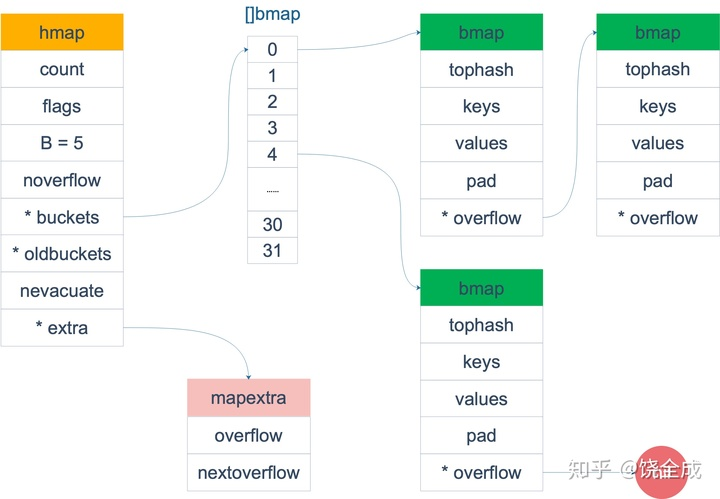

# map hash 冲突的常见解决方案

1. 开放地址法
   - 放入元素，如果发生冲突，就往后找没有元素的位置
   - 底层数据结构就是数组
   - `index := hash("xxx") % len(array); for (冲突) index++;`
   - 开放寻址法中对性能影响最大的是**装载因子**，它是数组中元素的数量与数组大小的比值。随着装载因子的增加，线性探测的平均用时就会逐渐增加，这会影响哈希表的读写性能。当装载率达到 100%，整个哈希表就会完全失效，这时查找和插入元素的时间复杂度退化为 𝑂(𝑛) ，这时需要遍历数组中的全部元素，所以在实现哈希表时一定要关注装载因子的变化。
2. 链表法 / 拉链法
   - `hashcode` 相同的串成链表。`Go、JAVA` 采用的方法
   - 一般数据结构为数组+链表
3. 再哈希
   - 用另一个方法计算 `hashcode`。布谷鸟过滤器使用的方法
4. 公共溢出区
   - 发生冲突的元素，一律填入溢出表


# 数据结构

Go 语言运行时同时使用了多个数据结构组合表示哈希表，其中 [`runtime.hmap`](https://draveness.me/golang/tree/runtime.hmap) 是最核心的结构体，我们先来了解一下该结构体的内部字段：

```go
// src/runtime/map.go
type hmap struct {
    count     int    // 元素个数，调用 len(map) 时，直接返回此值
    flags     uint8  // 并发读写的状态标志，如果 =1 时读写这个 map，会 panic
    B         uint8  // 桶数量的log2对数（因为哈希表中桶的数量都 2 的倍数）。也就是说 buckets 数组的长度是 2^B
    noverflow uint16 // 溢出的 bucket 个数
    hash0     uint32 // 哈希种子，为哈希函数的结果引入随机性。在创建哈希表时确定，并在调用哈希函数时作为参数传入

    buckets    unsafe.Pointer // 指向桶数组，大小为 2^B
    oldbuckets unsafe.Pointer // 旧桶的地址，用于扩容时保存扩容前的数据
    nevacuate  uintptr        // 指示扩容进度，小于此地址的 buckets 迁移完成
    extra *mapextra     // map 里不含指针时，用这个存 buckets 和 oldbuckets 的溢出区。这样 GC 时只扫描这里就可以知道哪些溢出桶还在使用，需要保留空间，而不用扫描整个所有 buckets，减少GC耗时
}

type mapextra struct {
    overflow    *[]*bmap
    oldoverflow *[]*bmap
    nextOverflow *bmap
}
```

`buckets` 是一个指针，指向的是一个 `bmap` 数组。下文将 `bmap` 称为 **桶**。每个桶里有 `8` 个位置可以放 `key` 和 `value`，下文称这 8 个位置为 **格子**.

这个结构有点像火车，每个 `map` 里有 `2^B` 辆火车 `buckets`，每条火车由一堆车厢 `bmap` 串联。每个车厢里 `8` 个座位。


源码里的 bmap 结构只有一行：

```golang
// runtime/map.go
// 源码里的 bmap 结构只有一行：
type bmap struct {
	tophash [bucketCnt]uint8
}
```

编译时会根据 `map` 的元素类型推导，这是实际编译以后的结构：

```go
// cmd/compile/internal/gc.bmap
type bmap struct {
    topbits  [8]uint8     // hash值的高8位，用于排序
    keys     [8]keytype   // 8个key
    values   [8]valuetype // 8个value
    pad      uintptr
    overflow uintptr      // 溢出桶。如果bmap里的元素超过8个，那就需要再构建一个bmap，这个字段会指向这个新bmap，相当于多个bmap用链表串起来
}

// 编译期间构建 map 的函数
// cmd/compile/internal/gc.bmap
func bmap(t *types.Type) *types.Type {
    //(BUCKETSIZE = 8)
    arr = types.NewArray(keytype, BUCKETSIZE) // 根据key类型新建 key数组
    keys := makefield("keys", arr)
	  field = append(field, keys)
  
    arr = types.NewArray(elemtype, BUCKETSIZE) // 根据value类型新建 value数组
    ...
}
```

`bmap` 就是我们常说的桶，桶里面会最多装 `8` 个 `key`。在桶内，又会根据 `key` 计算出来的 `hash` 值的高 `B` 位来查找 `key`，这高 `B` 位称为 `tophash`。

如果桶里的元素要超过 `8` 个了，这时候需要在桶后面挂上 **溢出桶**  `overflow bucket`。溢出桶是在 Go 语言还使用 C 语言实现时使用的设计，由于它能够减少扩容的频率所以一直使用至今。但一般来说一个 `map` 中不会有太多溢出桶，因为桶中元素超过8个才挂溢出桶，而 Go 的设计里平均超过 6.5 个时就会触发扩容。

注意到 `key` 和 `value` 是各自放在一起 `k/k/.../v/v/...` 这样的形式，并不是 `k/v/k/v/...` 这样的。这样的好处是在某些情况下可以避免内存对齐，节省空间。

比如 `map[int64]int8` 这样的 `map`，如果按照 `k/v/k/v/...` 这样的模式存储，那在每一个 `key/value` 对之后都要额外对齐 7 个字节；而 `k/k/.../v/v/...` 这种形式则只需要在最后添加对齐空格。




## 初始化

使用 `make` 创建哈希，Go 语言编译器都会在[类型检查](https://draveness.me/golang/docs/part1-prerequisite/ch02-compile/golang-typecheck/)期间将它们转换成 [`runtime.makemap`](https://draveness.me/golang/tree/runtime.makemap)。这个函数会按照下面的步骤执行：

1. 计算哈希占用的内存是否溢出或者超出能分配的最大值；
2. 调用 [`runtime.fastrand`](https://draveness.me/golang/tree/runtime.fastrand) 获取一个随机的哈希种子；
3. 根据传入的 `hint` 计算出需要的最小需要的桶的数量；
4. 使用 [`runtime.makeBucketArray`](https://draveness.me/golang/tree/runtime.makeBucketArray) 创建用于保存桶的数组；


# 访问

在编译的[类型检查](https://draveness.me/golang/docs/part1-prerequisite/ch02-compile/golang-typecheck/)期间，`hash[key]` 以及类似的操作都会被转换成哈希的 `OINDEXMAP` 操作，[中间代码生成](https://draveness.me/golang/docs/part1-prerequisite/ch02-compile/golang-ir-ssa/)阶段会在 [`cmd/compile/internal/gc.walkexpr`](https://draveness.me/golang/tree/cmd/compile/internal/gc.walkexpr) 函数中将这些 `OINDEXMAP` 操作根据一个还是两个接收参数转换成 `mapaccess1` 或 `mapaccess2` 函数：

```go
v     := hash[key] // => v     := *mapaccess1(maptype, hash, &key)
v, ok := hash[key] // => v, ok := mapaccess2(maptype, hash, &key)
```

[`runtime.mapaccess1`](https://draveness.me/golang/tree/runtime.mapaccess1) 会先通过哈希表设置的哈希函数、种子获取当前键对应的哈希，再通过 [`runtime.bucketMask`](https://draveness.me/golang/tree/runtime.bucketMask) 和 [`runtime.add`](https://draveness.me/golang/tree/runtime.add) 对哈希的低B位进行与操作，拿到该键值对所在的桶序号。

如果遇到 `map` 正在扩容的情况，那查到的桶需要可能是旧桶，则去旧桶里查找。

找到桶后，再取 `hashcode` 的高8位（`tophash`），遍历桶中的元素，逐个比较 `tophash`。如果 `tophash` 相同，再比较 `key` 的字面值


```go
func mapaccess1(t *maptype, h *hmap, key unsafe.Pointer) unsafe.Pointer {
    // 计算哈希
  	hash := t.hasher(key, uintptr(h.hash0)) // hash0 是新建 map 时 fastrand 得到的哈希种子
  
    m := bucketMask(h.B) // 低B位遮罩
	  b := (*bmap)(add(h.buckets, (hash&m)*uintptr(t.bucketsize))) // hash&m 作为桶下标。根据下标直接定位桶
    
	  // 计算出哈希高8位，用于快速比对key
	  top := tophash(hash)
    
    // 如果正在搬迁，查到的key在旧桶里，则从旧桶遍历
    if c := h.oldbuckets; c != nil {
        //...
        b = oldb
    }
	
  
bucketloop:
    // 依次遍历正常桶和溢出桶
  	for ; b != nil; b = b.overflow(t) {
      　// 遍历桶中的 8 个位置
        for i := uintptr(0); i < bucketCnt; i++ {
	          // tophash 不匹配，继续
	          if b.tophash[i] != top {
	              continue
	          }
	          // tophash 匹配，定位到 key 的位置
	          k := add(unsafe.Pointer(b), dataOffset+i*uintptr(t.keysize))
	           
	          // 进一步比较 key 原值
	          if alg.equal(key, k) {
	              // 定位到 value 的位置
	              v := add(unsafe.Pointer(b), dataOffset+bucketCnt*uintptr(t.keysize)+i*uintptr(t.valuesize))
	              return v
	          }
	      }
	
	      // bucket 找完（还没找到），继续到 overflow bucket 里找
	      b = b.overflow(t)
	      // overflow bucket 也找完了，说明没有目标 key
	      // 返回零值
	      if b == nil {
	          return unsafe.Pointer(&zeroVal[0])
	      }
    }
}
```

例如，现在有一个 `key `经过哈希函数计算后，得到的哈希结果是：

```shell
hash高8位   hash                                                  hash低5位
10010111     | 000011110110110010001111001010100010010110010101010 │ 00110
```

用最后的 `5` 个 `bit` 位 `00110` 作为桶下标，也就是10进制下的 `6` 号桶。

再用哈希值的高 `8` 位，快速比较桶内各格子的 `tophash`。如果找到一样的，再进一步比较 `key` 的原值。

如果在桶中没找到，并且 `overflow` 不为空，则循环继续去桶链表里的下一个，即溢出桶中寻找。

> 为什么是 `2^B` 个桶？
>
> 这样取低 `B` 位可以直接通过与操作得到桶下标，计算简单快速，不用取模；扩容搬迁时也只需根据扩容多出来的二进制位，将原桶元素分流到两个，详见后面。


另外，根据 `key` 的不同类型，编译器还会将查找、插入、删除的函数用更具体的函数替换，以优化效率。由于提前知晓了 `key` 的类型，所以内存布局是很清楚的，能节省很多操作，提高效率。

```go
// src/runtime/hashmap_fast.go
key的类型  函数
uint32	   mapaccess1_fast32(t *maptype, h *hmap, key uint32) unsafe.Pointer
uint64	   mapaccess1_fast64(t *maptype, h *hmap, key uint64) unsafe.Pointer
string	   mapaccess1_faststr(t *maptype, h *hmap, ky string) unsafe.Pointer
```


# 扩容

### 时机

可以看到，一个桶后面可能串了好几个溢出桶。查找时需要先定位桶，再遍历溢出桶。如果溢出桶过多，会导致查询性能下降。因此，需要有一个指标来衡量前面描述的情况，这就是**负载因子**。`Go` 里的 **负载因子** = **元素个数 / 桶数**

```go
loadFactor := count / (2^B)
```

扩容的时机：在向 `map` 插入新 `key` 后，会进行条件检测，符合下面这 2 个条件，就会触发扩容：

1. 装载因子超过阈值，源码里定义的阈值是 `6.5`。
2. 溢出的桶数量过多，超过正常桶数量或 `2^15` 个（插入很多元素、再删除时，可能导致溢出桶很多，即稀疏。因为删除元素时不会删桶）
   1. `B < 15 && noverflow >= 2^B`
   2. `B >= 15 && noverflow >= 2^15`

```go
func mapassign(t *maptype, h *hmap, key unsafe.Pointer) unsafe.Pointer {
    if !h.growing() && (overLoadFactor(h.count+1, h.B) || tooManyOverflowBuckets(h.noverflow, h.B)) {
        hashGrow(t, h)
        goto again // Growing the table invalidates everything, so try again
    }
}
```

这两种条件下都会发生扩容。但是扩容的策略并不相同，毕竟两种条件应对的场景不同。

1. 对于条件1，元素太多，而桶数量太少，很简单：将 `B` 加 `1`，新申请一个 `2^(B+1)` 的桶数组，桶数量直接变成原来的 `2` 倍。这种扩容叫 **增量扩容**。

2. 对于条件2，其实元素没那么多，但是溢出桶数量特别多，说明很多桶都没装满。解决办法就是新建一个相同大小的新桶数组，将老桶数组中的元素移动到新 桶数组，使得同一个桶中的 `key` 排列地更紧密。这种叫 **等量扩容**。严格上说其实不算扩容，算整理碎片。

由于扩容需要将原有的 `key/value` 重新搬迁到新的内存地址，如果有大量的 `key/value` 需要搬迁，会非常影响性能。因此 `Go map` 的扩容采取了 **渐进式扩容** 的方式，类似 `redis` 的扩容，原有的 `key` 并不会一次性搬迁完毕。

> 为啥负载因子是 6.5 ?
>
> 太小会导致极易触发扩容，造成空间浪费；太多会导致极不易触发扩容，造成 `overflow` 过多。
>
> 作者测试了各负载因子下的平均 `overflow` 数、命中率、`miss` 率等指标，最终取了一个中间数 6.5。


### 扩容过程

扩容其实分为两步：`hashGrow()` 扩容 和 `growWork()` 搬迁。

 `hashGrow()` 函数实际上并没有真正地搬迁，它只是分配好了新的 `buckets`，并将老的 `buckets` 挂到了 `oldbuckets` 字段上。

```go
func hashGrow(t *maptype, h *hmap) {
    bigger := uint8(1)
    if !overLoadFactor(h.count+1, h.B) {  // 如果是等量扩容，设置标记
        bigger = 0
        h.flags |= sameSizeGrow
    }
        
    oldbuckets := h.buckets                           // 将buckets赋值给oldbuckets
    newbuckets, nextOverflow := makeBucketArray(t, h.B+bigger, nil) // 申请新桶
  
    // 更新hmap的变量
    h.B += bigger             // 更新 B           
    h.flags = flags
    h.oldbuckets = oldbuckets // 将旧桶赋值给oldbuckets
    h.buckets = newbuckets
    h.nevacuate = 0
    h.noverflow = 0
  
    h.extra.oldoverflow = h.extra.overflow
  	h.extra.overflow = nil
  	h.extra.nextOverflow = nextOverflow
}
```


### 搬迁过程

搬迁的动作在 `growWork()` 函数中，而调用 `growWork()` 函数的动作是在 `mapassign` 和 `mapdelete` 函数中。

也就是插入或修改、删除 `key` 的时候，都会尝试进行搬迁 `buckets` 的工作。先检查 `key` 所在的 `oldbuckets` 是否搬迁完毕，如果没有，则先对其进行搬迁。然后再检查其他搬迁状态过程中的桶，如果有，协助进行搬迁。

```go
func growWork(t *maptype, h *hmap, bucket uintptr) {
    evacuate(t, h, bucket&h.oldbucketmask()) // 搬迁旧桶，这样 assign 和 delete 都直接在新桶集合中进行
    if h.growing() {
        evacuate(t, h, h.nevacuate)          // 再协助搬迁一次其他桶
    }
}
```


搬迁的关键函数是 `evacuate`：

这里面比较主要的逻辑是增量扩容时的分流，比如原来桶中8个kv，增量扩容后分到2个新桶中，那么要解决2个问题：1. 如何定位新桶位置，2. 如何将原桶里的kv分流到2个新桶中。

如何定位新桶：比如原来有4个桶，扩容后变为8个桶，原来的1号桶变为新的1号和5号桶。这个5号地址怎么得呢，用原来的1号 + (旧桶大小) 就可得到

然后是桶元素如何摊到新的2个桶里：这里使用 `2^B` 作为掩码，和 `hashcode` 进行与操作，根据与结果是否为 0 判断落入1还是5号桶里。

```golang
// runtime/map.go
func evacuate(t *maptype, h *hmap, oldbucket uintptr) {
    b := (*bmap)(add(h.oldbuckets, oldbucket*uintptr(t.bucketsize))) // 定位老的 bucket 地址
    newbit := h.noldbuckets()                                        // 结果是 2^B，如 B = 5，结果为32
    
    if !evacuated(b) {            // 如果 b 没有被搬迁过
    
        // 声明2个变量 xy，存储目标搬迁地址，等量扩容用, 增量扩容用 y
        var xy [2]evacDst
    
        // 默认是等量扩容，前后 bucket 序号不变，使用 x 来进行搬迁
        x := &xy[0]
        x.b = (*bmap)(add(h.buckets, oldbucket*uintptr(t.bucketsize)))
        x.k = add(unsafe.Pointer(x.b), dataOffset)
        x.v = add(x.k, bucketCnt*uintptr(t.keysize))

        // 增量扩容，前后 bucket 序号有变，则增加一个 y 来进行分流。即被搬迁的元素可能搬到 x，也可能搬到 y，根据 hash & 2^B 是否为0决定搬到 x 还是 y
        if !h.sameSizeGrow() { 
              y := &xy[1]
              y.b = (*bmap)(add(h.buckets, (oldbucket+newbit)*uintptr(t.bucketsize)))
              y.k = add(unsafe.Pointer(y.b), dataOffset)
              y.v = add(y.k, bucketCnt*uintptr(t.keysize))
        }

        // 迁移老的 b 及其 overflow 链表
        for ; b != nil; b = b.overflow(t) {
            k := add(unsafe.Pointer(b), dataOffset)
            v := add(k, bucketCnt*uintptr(t.keysize))

            // 遍历 bucket 中的所有 cell
            for i := 0; i < bucketCnt; i, k, v = i+1, add(k, uintptr(t.keysize)), add(v, uintptr(t.valuesize)) {
                top := b.tophash[i]
                //...
                k2 := k // 如果 key 是指针，则解引用
                //...

                var useY uint8 // 默认使用 X，等量扩容                                   
                if !h.sameSizeGrow() {                             // 如果不是等量扩容
                    hash := t.hasher(k2, uintptr(h.hash0))           // rehash
                    //...
                    if hash&newbit != 0 {
                        useY = 1
                    }
                    //...
                    dst := &xy[useY] // 目标搬迁地址
                    
                    // 如果目标搬迁地址已经有8个kv了，新建一个溢出桶
                    if dst.i == bucketCnt {
                        dst.b = h.newoverflow(t, dst.b)
                        dst.i = 0
                        dst.k = add(unsafe.Pointer(dst.b), dataOffset)
                        dst.v = add(dst.k, bucketCnt*uintptr(t.keysize))
                    }
                    //...
                    typedmemmove(t.key, dst.k, k)  // 从 k 拷贝至 dst.k
                    typedmemmove(t.elem, dst.v, v)
                    dst.i++                        // kv计数器
                    dst.k = add(dst.k, uintptr(t.keysize))   // 修改 k 的最新地址
                    dst.v = add(dst.v, uintptr(t.valuesize))
                }
            }            
        }
    }
    // 搬迁完成，更新搬迁进度计数器。并在所有的旧桶都被分流后清空 oldbuckets 和 oldoverflow
    if oldbucket == h.nevacuate {
        advanceEvacuationMark(h, t, newbit)
    }
}
```

搬迁期间，如果查询时发现 `key` 落入旧桶，则会从旧桶中查找。


## 遍历

理解了上面桶序号的变化，我们就可以回答另一个问题了：为什么遍历 `map` 是无序的？

1. `map` 根本就没有维护 `key` 的顺序，计算 `key` 的桶时是用 `hash` 低 `B` 位算的，本来有序的 `key`，`hash` 后就无序了。
2. `map` 在扩容后，会发生 `key` 的搬迁。有的 `key` 在旧桶里，有的在新桶里。并且有的 `key` 桶序号也会变，会加上 `2^B`。因此，遍历、修改 `map`、再遍历，两次得到的遍历顺序就可能不一样了。

当然，`Go` 做得更绝，遍历 `map` 时，并不是固定地从 `0` 号桶开始遍历，而是通过 `fastrand` 算了个随机数，从一个随机桶开始，并且是从这个桶内的随机格子开始遍历。特意设计成了无序迭代的结果，以避免程序员依赖 `map` 有序遍历的结果。


# 写

对 `key` 计算 `hash` 值，根据 `hash` 值按照之前的流程，找到要赋值的位置。源码大体和查找的类似。核心还是一个双层循环，外层遍历 `bucket` 和它的 `overflow bucket`，内层遍历整个 `bucket` 的各个 `cell`。如果 `key` 上有值，就执行 `update`，否则执行 `insert`。

函数首先会检查 `map` 的标志位 `flags`。如果 `flags` 的写标志位此时被置 `1` 了，说明有其他协程在执行写操作，进而导致程序 `panic`。这也说明了 `map` 对协程是不安全的。

另外通过前文我们知道扩容是渐进式的，如果 `map` 处在扩容的过程中，那么这次会先协助扩容，完了才向新桶里写数据。

插入元素后，会计算负载因子，并判断是否需要扩容。


# 删

在编译期间，`delete` 关键字会被转换成操作为 `ODELETE` 的节点，而 [`cmd/compile/internal/gc.walkexpr`](https://draveness.me/golang/tree/cmd/compile/internal/gc.walkexpr) 会将 `ODELETE` 节点转换成 [`runtime.mapdelete`](https://draveness.me/golang/tree/runtime.mapdelete) 函数簇中的一个，包括 [`runtime.mapdelete`](https://draveness.me/golang/tree/runtime.mapdelete)、`mapdelete_faststr`、`mapdelete_fast32` 和 `mapdelete_fast64`。

删除逻辑和写类似，只不过删除逻辑是把元素置为 `nil`。并将 `tophash` 置为 **已删除** 状态。

```go
// 清空 key
if t.indirectkey() {
    *(*unsafe.Pointer)(k) = nil
} else if t.key.ptrdata != 0 {
    memclrHasPointers(k, t.key.size)
}

// 清空 value
e := add(unsafe.Pointer(b), dataOffset+bucketCnt*uintptr(t.keysize)+i*uintptr(t.elemsize))
if t.indirectelem() {
    *(*unsafe.Pointer)(e) = nil
} else if t.elem.ptrdata != 0 {
    memclrHasPointers(e, t.elem.size)
} else {
    memclrNoHeapPointers(e, t.elem.size)
}

// 修改 tophash
b.tophash[i] = emptyOne
```

删除并不会释放 `cell`，只是将 `cell` 的 `tophash` 标记为了 `emptyOne` 状态。

后续写入新元素时，可以复用 `emptyOne` 状态的 `cell` 。

```go
// 判断cell是否可写入。删除状态的cell，可以复用
func isEmpty(x uint8) bool {
	return x <= emptyOne
}

// 写map
func mapassign(t *maptype, h *hmap, key unsafe.Pointer) unsafe.Pointer {
	for i := uintptr(0); i < bucketCnt; i++ {
		if isEmpty(b.tophash[i]) {
			if insertb == nil { // 写到新的位置，或者之前已删除的cell
				insertb = b
				inserti = i
			}
        }
	}
}
```


# 和 redis 哈希表的异同

##### 数据结构

`redis` 的 `kv` 是包装在 `dictEntry` 结构里的，`go` 的 `kv` 是长度为 8 的 `kkkkkkkk/vvvvvvvv` 数组。

##### 冲突解决

均为拉链法。但 `redis` 每个桶没有格子数限制， `dictEntry` 通过链表相连。`go` 里每个桶有固定的 8 个格子，超过后存到溢出桶里。

##### 哈希查找

均为根据 `hash` 查桶。`go` 里多了个通过 `tophash` 快速试错的优化。

##### 扩容时机

`redis`：每个桶存储 >= 1 个 `key ` 时扩容。<= 0.1 个 `key` 时缩容。

`go`：每个桶存储 >= 6.5 个 `key` 时扩容。溢出桶 >= 正常桶数量时 等量扩容。不支持缩容。插入元素后检查。

##### 渐进式扩容

扩容期间查找时均为先查找老桶。判断老桶无数据才去新桶找。

`redis`：增删改查时均会触发。

`go`：仅在增删时触发。


# 总结

数据结构：`Go` 语言中，通过数组+链表实现 `map`，用链表法解决哈希冲突。利用将 8个 `key` / 8个`value` 依次放置的做法减少了对齐所需的空间。

查找：通过 `key` 的哈希值将 `key` 散落到不同的桶中。比如说有 `2^5=32` 个桶，就用哈希值的低 `5` 位判断落入哪个桶。再用哈希值的高 `8` 位和 `key` 值比对桶中元素

扩容：当向桶中添加了很多 `key`，造成元素过多（每个桶内的元素数超过 `6.5`），或者溢出桶太多（超过桶数量或 `2^15`），就会触发扩容。

- 对前一种情况，加桶的个数就可以了，对应的是 `2` 倍容量的 **增量扩容**，扩容期间需要 `rehash` 重新分桶。
- 后者是由于大量写入和删除元素造成的数据空洞，只需要重新整理下溢出桶里的数据就可以，称为 **等量扩容**。

扩容过程是渐进的，主要是防止一次扩容需要搬迁的 `key` 数量过多，引发性能问题。触发扩容的时机是增加了新元素，搬迁的时机则发生在赋值/删除期间，每次最多搬迁两个 `bucket`。


#### 问题

##### 删除掉map中的元素是否会释放内存？

不会，删除操作仅仅将对应的 `tophash[i]` 设置为 `empty`，并非释放内存。若要释放内存只能等待指针无引用后被系统 `GC`


##### map 的 iterator 是否安全？

`for k, v := range map` 会复制 `map` 的 `key` 和 `value`，迭代期间修改 `map` 不会影响 `range` 里的 `value`，但会影响 `map[k]` 得到的数据。


##### map如何缩容？

`go` 里的 `map` 不会缩容，最多等量扩容。因此如果大量插入、再大量删除 `key` 的话，会浪费内存。


#### 参考

> [Stefno - 深度解密Go语言之 map](https://zhuanlan.zhihu.com/p/66676224)
>
> [健 の 随笔 - 你不知道的Golang map](https://www.cnblogs.com/sunsky303/p/11815172.html)
>
> [tptppp - Redis和Go中map的异同](https://blog.csdn.net/tptpppp/article/details/103510214)
>
> [darveness - 3.3 哈希表](https://draveness.me/golang/docs/part2-foundation/ch03-datastructure/golang-hashmap/)

