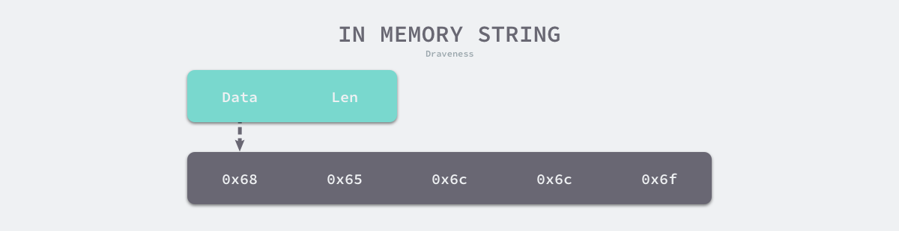

字符串是由字符组成的数组，C 语言中的字符串使用字符数组 `char[]` 表示。数组会占用一片连续的内存空间，而内存空间存储的字节共同组成了字符串，Go 语言中的字符串只是一个只读的字节数组，下图展示了 `"hello"` 字符串在内存中的存储方式：



如果是代码中存在的字符串，编译器会将其标记成只读数据 `SRODATA`，假设我们有以下代码，其中包含了一个字符串，当我们将这段代码编译成汇编语言时，就能够看到 `hello` 字符串有一个 `SRODATA` 的标记：

```bash
$ cat main.go
package main

func main() {
	str := "hello"
	println([]byte(str))
}

$ GOOS=linux GOARCH=amd64 go tool compile -S main.go
...
go.string."hello" SRODATA dupok size=5
	0x0000 68 65 6c 6c 6f                                   hello
...
```

只读只意味着字符串会分配到只读的内存空间，但是 Go 语言只是不支持直接修改 `string` 类型变量的内存空间，我们仍然可以通过在 `string` 和 `[]byte` 类型之间反复转换实现修改这一目的：

1. 先将这段内存拷贝到堆或者栈上；
2. 将变量的类型转换成 `[]byte` 后并修改字节数据；
3. 将修改后的字节数组转换回 `string`；

Java、Python 以及很多编程语言的字符串也都是不可变的，这种不可变的特性可以保证我们不会引用到意外发生改变的值，而因为 Go 语言的字符串可以作为哈希的键，所以如果哈希的键是可变的，不仅会增加哈希实现的复杂度，还可能会影响哈希的比较。


## 数据结构

字符串在 Go 语言中的接口其实非常简单，每一个字符串在运行时都会使用如下的 [`reflect.StringHeader`](https://draveness.me/golang/tree/reflect.StringHeader) 表示，其中包含指向字节数组的指针和数组的大小：

```go
type StringHeader struct {
	Data uintptr
	Len  int
}
```

与切片的结构体相比，字符串只少了一个表示容量的 `Cap` 字段，而正是因为切片在 Go 语言的运行时表示与字符串高度相似，所以我们经常会说字符串是一个只读的切片类型。

```go
type SliceHeader struct {
	Data uintptr
	Len  int
	Cap  int
}
```

因为字符串作为只读的类型，我们并不会直接向字符串直接追加元素改变其本身的内存空间，所有在字符串上的写入操作都是通过拷贝实现的。


## 类型转换

当我们使用 Go 语言解析和序列化 JSON 等数据格式时，经常需要将数据在 `string` 和 `[]byte` 之间来回转换，类型转换的开销并没有想象的那么小，我们经常会看到 [`runtime.slicebytetostring`](https://draveness.me/golang/tree/runtime.slicebytetostring) 等函数出现在火焰图[1](https://draveness.me/golang/docs/part2-foundation/ch03-datastructure/golang-string/#fn:1)中，成为程序的性能热点。

从字节数组到字符串的转换需要使用 [`runtime.slicebytetostring`](https://draveness.me/golang/tree/runtime.slicebytetostring) 函数，例如：`string(bytes)`

```go
func slicebytetostring(buf *tmpBuf, b []byte) (str string) {
    l := len(b)
    //...
    // 根据传入的缓冲区大小决定是否需要为新字符串分配一片内存空间
    var p unsafe.Pointer
  	if buf != nil && len(b) <= len(buf) {
		    p = unsafe.Pointer(buf)
  	} else {
	    	p = mallocgc(uintptr(len(b)), nil, false) // 申请新空间
  	}
    
    stringStructOf(&str).str = p
  	stringStructOf(&str).len = len(b)
	  memmove(p, (*(*slice)(unsafe.Pointer(&b))).array, uintptr(len(b))) // 内存拷贝
}
```


字符串和 `[]byte` 中的内容虽然一样，但是字符串的内容是只读的，我们不能通过下标或者其他形式改变其中的数据，而 `[]byte` 中的内容是可以读写的。不过无论从哪种类型转换到另一种都需要拷贝数据，而内存拷贝的性能损耗会随着字符串和 `[]byte` 长度的增长而增长。


## 原文链接

https://draveness.me/golang/docs/part2-foundation/ch03-datastructure/golang-string/