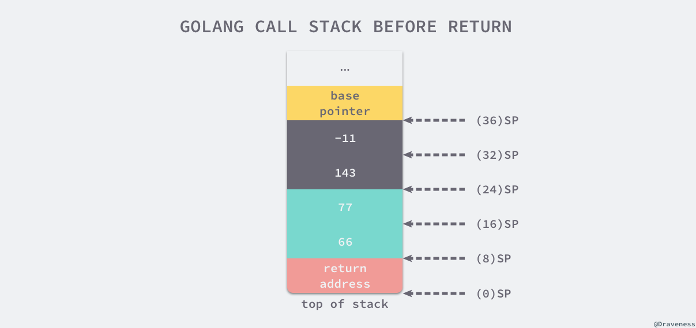

# 函数调用

## 调用惯例

无论是系统级编程语言 C 和 Go，还是脚本语言 Ruby 和 Python，这些编程语言在调用函数时往往都使用相同的语法：

```c
somefunction(arg0, arg1)
```

虽然它们调用函数的语法很相似，但是它们的调用惯例却可能大不相同。调用惯例是调用方和被调用方对于参数和返回值传递的约定，本节将为各位读者介绍 C 和 Go 语言的调用惯例。


### C 语言

我们先来研究 C 语言的调用惯例，这里使用 gcc 将 C 语言编译成汇编代码，从中可以了解函数调用的具体过程。

假设我们有以下的 C 语言代码，代码中只包含两个函数，其中一个是主函数 `main`，另一个是我们定义的函数 `my_function`：

```c
// ch04/my_function.c
int my_function(int arg1, int arg2) {
    return arg1 + arg2;
}

int main() {
    int i = my_function(1, 2);
}
```

我们可以使用 `cc -S my_function.c` 命令将上述文件编译成如下所示的汇编代码：

```c
main:
	pushq	%rbp
	movq	%rsp, %rbp // rsp 和 rbp 都是栈寄存器
	subq	$16, %rsp
	movl	$2, %esi  // 将第二个参数存入 esi 寄存器
	movl	$1, %edi  // 将第一个参数存入 edi 寄存器（注意是 edi 不是 esi，和上面不一样
	call	my_function
	movl	%eax, -4(%rbp)
my_function:
	pushq	%rbp
	movq	%rsp, %rbp
	movl	%edi, -4(%rbp)    // 从 edi 寄存器取出第一个参数，放到 rbq 寄存器（即栈）上
	movl	%esi, -8(%rbp)    // 从 esi 金铲铲取出第二个参数，放到栈上
	movl	-8(%rbp), %eax    // 从栈中取出第二个参数 放到 eax 寄存器上
	movl	-4(%rbp), %edx    // 从栈中取出第一个参数 放到 eax 寄存器上
	addl	%edx, %eax        // 将 edx 中的值加给 eax：eax += edx = 1 + 2 = 3
	popq	%rbp
```

- 在 `my_function` 调用前，调用方 `main` 函数将 `my_function` 的两个参数分别存到 edi 和 esi 寄存器中；
- 在 `my_function` 调用时，它会将寄存器 edi 和 esi 中的数据存储到 eax 和 edx 两个寄存器中，随后通过汇编指令 `addl` 计算两个入参之和；
- 在 `my_function` 调用后，使用寄存器 eax 传递返回值，`main` 函数将 `my_function` 的返回值存储到栈上的 `i` 变量中；

当 `my_function` 函数的入参增加至八个时，重新编译当前程序可以会得到不同的汇编代码：

```c
int my_function(int arg1, int arg2, int ... arg8) {
    return arg1 + arg2 + ... + arg8;
}
```

```c
main:
	pushq	%rbp
	movq	%rsp, %rbp
	subq	$16, %rsp     // 为参数传递申请 16 字节的栈空间
	movl	$8, 8(%rsp)   // 传递第 8 个参数
	movl	$7, (%rsp)    // 传递第 7 个参数
	movl	$6, %r9d
	movl	$5, %r8d
	movl	$4, %ecx
	movl	$3, %edx
	movl	$2, %esi
	movl	$1, %edi
	call	my_function
```

`main` 函数调用 `my_function` 时，前六个参数会使用 edi、esi、edx、ecx、r8d 和 r9d 六个寄存器传递。寄存器的使用顺序也是调用惯例的一部分，函数的第一个参数一定会使用 edi 寄存器，第二个参数使用 esi 寄存器，以此类推。

最后的两个参数与前面的完全不同，调用方 `main` 函数通过栈传递这两个参数，下图展示了 `main` 函数在调用 `my_function` 前的栈信息：


上图中 rbp 寄存器会存储函数调用栈的基址指针，即属于 `main` 函数的栈空间的起始位置，而另一个寄存器 rsp 存储的是 `main` 函数调用栈结束的位置，这两个寄存器共同表示了函数的栈空间。

在调用 `my_function` 之前，`main` 函数通过 `subq $16, %rsp` 指令分配了 16 个字节的栈地址，随后将第六个以上的参数按照从右到左的顺序存入栈中，即第八个和第七个，余下的六个参数会通过寄存器传递，接下来运行的 `call my_function` 指令会调用 `my_function` 函数：

```c
my_function:
	pushq	%rbp
	movq	%rsp, %rbp
	movl	%edi, -4(%rbp)    // rbp-4 = edi = 1
	movl	%esi, -8(%rbp)    // rbp-8 = esi = 2
	...
	movl	-8(%rbp), %eax    // eax = 2
	movl	-4(%rbp), %edx    // edx = 1
	addl	%eax, %edx        // edx = eax + edx = 3
	...
	movl	16(%rbp), %eax    // eax = 7
	addl	%eax, %edx        // edx = eax + edx = 28
	movl	24(%rbp), %eax    // eax = 8
	addl	%edx, %eax        // edx = eax + edx = 36
	popq	%rbp
```

`my_function` 会先将寄存器中的全部数据转移到栈上，然后利用 eax 寄存器计算所有入参的和并返回结果。

我们可以将本节的发现和分析简单总结成 — 当我们在 x86_64 的机器上使用 C 语言中调用函数时，参数都是通过寄存器和栈传递的，其中：

- 六个以及六个以下的参数会按照顺序分别使用 edi、esi、edx、ecx、r8d 和 r9d 六个寄存器传递；
- 六个以上的参数会使用栈传递，函数的参数会以从右到左的顺序依次存入栈中；

而函数的返回值是通过 eax 寄存器进行传递的，由于只使用一个寄存器存储返回值，所以 C 语言的函数不能同时返回多个值。


### Go 语言

分析了 C 语言函数的调用惯例之后，我们再来剖析一下 Go 语言函数的调用惯例。我们以下面这个非常简单的代码片段为例简单分析一下：

```go
package main

func myFunction(a, b int) (int, int) {
	return a + b, a - b
}

func main() {
	myFunction(66, 77)
}
```

上述的 `myFunction` 函数接受两个整数并返回两个整数，`main` 函数在调用 `myFunction` 时将 66 和 77 两个参数传递到当前函数中，使用 `go tool compile -S -N -l main.go` 编译上述代码可以得到如下所示的汇编指令：

> 如果编译时不使用 -N -l 参数，编译器会对汇编代码进行优化，编译结果会有较大差别

```go
"".main STEXT size=68 args=0x0 locals=0x28
	0x0000 00000 (main.go:7)	MOVQ	(TLS), CX
	0x0009 00009 (main.go:7)	CMPQ	SP, 16(CX)   // SP为栈
	0x000d 00013 (main.go:7)	JLS	61
	0x000f 00015 (main.go:7)	SUBQ	$40, SP      // 分配 40 字节栈空间
	0x0013 00019 (main.go:7)	MOVQ	BP, 32(SP)   // 将基址指针存储到栈上
	0x0018 00024 (main.go:7)	LEAQ	32(SP), BP
	0x001d 00029 (main.go:8)	MOVQ	$66, (SP)    // 第一个参数推入栈
	0x0025 00037 (main.go:8)	MOVQ	$77, 8(SP)   // 第二个参数推入栈
	0x002e 00046 (main.go:8)	CALL	"".myFunction(SB)
	0x0033 00051 (main.go:9)	MOVQ	32(SP), BP
	0x0038 00056 (main.go:9)	ADDQ	$40, SP
	0x003c 00060 (main.go:9)	RET
```

根据 `main` 函数生成的汇编指令，我们可以分析出 `main` 函数调用 `myFunction` 之前的栈：


`main` 函数通过 `SUBQ $40, SP` 指令一共在栈上分配了 40 字节的内存空间：

| 空间          | 大小    | 作用                           |
| ------------- | ------- | ------------------------------ |
| SP+32 ~ BP    | 8 字节  | `main` 函数的栈基址指针        |
| SP+16 ~ SP+32 | 16 字节 | 函数 `myFunction` 的两个返回值 |
| SP ~ SP+16    | 16 字节 | 函数 `myFunction` 的两个参数   |

`myFunction` 入参的压栈顺序和 C 语言一样，都是从右到左，即第一个参数 66 在栈顶的 SP ~ SP+8，第二个参数存储在 SP+8 ~ SP+16 的空间中。

当我们准备好函数的入参之后，会调用汇编指令 `CALL "".myFunction(SB)`，这个指令首先会将 `main` 的返回地址存入栈中，然后改变当前的栈指针 SP 并执行 `myFunction` 的汇编指令：

```go
"".myFunction STEXT nosplit size=49 args=0x20 locals=0x0
	0x0000 00000 (main.go:3)	MOVQ	$0, "".~r2+24(SP) // 初始化栈顶+24地址（即第一个返回值）为0
	0x0009 00009 (main.go:3)	MOVQ	$0, "".~r3+32(SP) // 初始化栈顶+32地址（第二个返回值）为0
	0x0012 00018 (main.go:4)	MOVQ	"".a+8(SP), AX    // 将栈顶+8地址的元素写入 AX 寄存器 AX = 66
	0x0017 00023 (main.go:4)	ADDQ	"".b+16(SP), AX   // 将栈顶+16地址的元素加给 AX 寄存器 AX += 77 = 143
	0x001c 00028 (main.go:4)	MOVQ	AX, "".~r2+24(SP) // AX寄存器的值入栈 (24)SP = AX = 143
	0x0021 00033 (main.go:4)	MOVQ	"".a+8(SP), AX    // 将栈顶+8地址的元素写入 AX 寄存器 AX = 66
	0x0026 00038 (main.go:4)	SUBQ	"".b+16(SP), AX   // 将栈顶+16地址的元素减给 AX 寄存器AX = AX - 77 = -11
	0x002b 00043 (main.go:4)	MOVQ	AX, "".~r3+32(SP) // AX寄存器值入栈 (32)SP = AX = -11
	0x0030 00048 (main.go:4)	RET
```

从上述的汇编代码中我们可以看出，当前函数在执行时首先会将 `main` 函数中预留的两个返回值地址置成 `int` 类型的默认值 0，然后根据栈的相对位置获取参数并进行加减操作并将值存回栈中，在 `myFunction` 函数返回之间，栈中的数据如下图所示：



在 `myFunction` 返回后，`main` 函数会通过以下的指令来恢复栈基址指针并销毁已经失去作用的 40 字节栈内存：

```go
    0x0033 00051 (main.go:9)    MOVQ    32(SP), BP
    0x0038 00056 (main.go:9)    ADDQ    $40, SP
    0x003c 00060 (main.go:9)    RET
```

通过分析 Go 语言编译后的汇编指令，我们发现 Go 语言使用栈传递参数和接收返回值，所以它只需要在栈上多分配一些内存就可以返回多个值。


### 对比

C 语言和 Go 语言在设计函数的调用惯例时选择了不同的实现。C 语言同时使用寄存器和栈传递参数，使用 eax 寄存器传递返回值；而 Go 语言使用栈传递参数和返回值。我们可以对比一下这两种设计的优点和缺点：

- C 语言的方式能够极大地减少函数调用的额外开销，但是也增加了实现的复杂度；
  - 需要单独处理函数参数过多的情况；
- Go 语言的方式能够降低实现的复杂度并支持多返回值，但是牺牲了函数调用的性能；
  - 不需要考虑超过寄存器数量的参数应该如何传递；
  - 不需要考虑不同架构上的寄存器差异；
  - 函数入参和出参的内存空间需要在栈上进行分配，CPU 访问栈的开销比访问寄存器高几十倍

Go 语言使用栈作为参数和返回值传递的方法是综合考虑后的设计，选择这种设计意味着编译器会更加简单、更容易维护。


## 参数传递

除了函数的调用惯例之外，Go 语言在传递参数时是传值还是传引用也是一个有趣的问题，不同的选择会影响我们在函数中修改入参时是否会影响调用方看到的数据。我们先来介绍一下传值和传引用两者的区别：

- 传值：函数调用时会对参数进行拷贝，被调用方和调用方两者持有不相关的两份数据；
- 传引用：函数调用时会传递参数的指针，被调用方和调用方两者持有相同的数据，任意一方做出的修改都会影响另一方。

不同语言会选择不同的方式传递参数，Go 语言选择了传值的方式，**无论是传递基本类型、结构体还是指针，都会对传递的参数进行拷贝**。

将指针作为参数传入某个函数时，函数内部会复制指针，也就是会同时出现两个指针指向原有的内存空间，所以 Go 语言中传指针也是传值。


## 方法

在Go语言中，方法和函数是两个概念。函数的写法是 `func Eat()`, 方法的写法是 `func (a A) Eat()`。

其实方法是函数的语法糖。上面的 `func (a A) Eat()` 方法实际会转为 `Eat(a A)` 函数。函数调用时，会发生对 `a` 的拷贝。

因此很多初学者迷惑的应该是 `func (a A) Eat()` 写法还是 `func (a *A) Eat()` 写法转成函数后就很容易看出区别：一个传的值，一个传的指针。在调用方法时，会复制变量，一个复制变量值，一个复制变量地址的值。

> 大结构体建议用  `func (a *A) Eat()` 这种指针写法，避免参数拷贝带来的性能影响


## 小结

Go 通过栈传递函数的参数和返回值，在调用函数之前会在栈上为返回值分配合适的内存空间，随后将入参从右到左按顺序压栈并拷贝参数，返回值会被存储到调用方预留好的栈空间上，我们可以简单总结出以下几条规则：

1. 通过堆栈传递参数，入栈的顺序是从右到左，而参数的计算是从左到右；
2. 函数返回值通过堆栈传递并由调用者预先分配内存空间；
3. 调用函数时都是传值，接收方会对入参进行复制再计算


## 原文链接

https://draveness.me/golang/docs/part2-foundation/ch04-basic/golang-function-call/