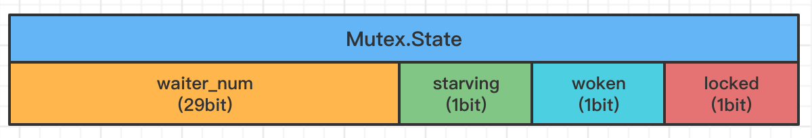

# 1. 基本原语

## 1.1 Mutex

### 数据结构

`Mutex` 的结构非常简单，只有两个字段，一个 `state` 字段表示上锁的状态以及等待获取锁的协程数量；另一个 `sema` 字段表示信号量，用于控制等待锁的协程

```go
// mutex 是一种互斥锁
// mutex 的零值是未锁状态，加锁就是赋值操作
// mutex 在第一次使用之后不能进行复制。因为要在不同函数中传递，一般以指针的方式使用；复制的话把指针也复制走了，在别处修改可能会破坏使用锁的地方
type Mutex struct {
    state int32  // 表示锁状态的状态位
    sema  uint32 // 信号量，用来控制等待的 goroutine 的阻塞、休眠、唤醒
}

// 上面 state 的可选值
const (
    mutexLocked = 1 << iota     // 锁定标记，表示锁是否处于锁定状态
    mutexWoken                  // 唤醒标记，表示从正常模式被从唤醒
    mutexStarving               // 饥饿标记，表示当前的互斥锁进入饥饿状态
    mutexWaiterShift = iota     // 阻塞等待的数量
    starvationThresholdNs = 1e6 // 饥饿阈值 1ms
)
```

通过 `1<<iota` 的语法可以看出，`state` 字段通过各位置的二进制 `01` 表示状态。最低三位分别表示 `mutexLocked`、`mutexWoken` 和 `mutexStarving`，剩下的位置用来表示当前有多少个 Goroutine 在等待互斥锁的释放。




`state` 字段也可以视为一层缓存，当申请锁时先尝试修改 `state` 字段，如果修改成功则可以直接返回

修改失败才使用处理逻辑更为复杂的 `sema` 字段。`sema` 也是先 `CAS` 修改，修改失败则将当前协程 `park` 并放入一个等待队列。


### Lock函数

加锁时，先通过 `CAS` 尝试修改 `state` 字段为 `1`，如果修改成功则视为成功获取锁，直接返回；否则进入慢路径：阻塞当前协程，等到获取锁为止。

分成快慢两部分，这样快速路径在一些情况下可以直接优化为内联函数。

```go
// 如果锁已经被别的协程获取，则阻塞当前协程，直到锁可用
func (m *Mutex) Lock() {
    // 快速路径：没有竞争直接获取到锁，修改状态位为加锁
    if atomic.CompareAndSwapInt32(&m.state, 0, mutexLocked) {
        return
    }
    // 慢路径（分成快慢两部分，这样快速路径在一些情况下可以直接优化为内联函数）
    m.lockSlow()
}
```


#### 慢路径

如果快速路径加锁失败，则进入慢路径，大家排队阻塞等待加锁，每个等待者叫 `waiter`，放入一个队列里等待。


##### 1. 正常模式

正常模式下等待锁的协程是先入先出，从队列中弹出一个等待者唤醒。


##### 2. 饥饿模式

如果协程等待锁的时间超过 `1ms`，会进入饥饿模式。

正常模式下 `waiter` 是先入先出。但该 `waiter` 不会直接获取锁，而是与新来的协程进行竞争。通常新来的协程更易获取锁（新协程正在 `CPU` 上运行，而被唤醒的 `waiter` 还要进行调度才能进入状态），所以 `waiter` 大概率抢不过，这个时候 `waiter` 会被放回队列的头部重新等待。

为了减少这种情况的出现，如果等待的时间超过了 `1ms`，这个时候 `Mutex` 就会进入饥饿模式，防止部分协程被饿死。新来的协程会直接放入队列的尾部，不和老的 `waiter` 竞争，这样很好的解决了老的 `goroutine` 一直抢不到锁的场景。

饥饿模式下释放锁后，锁直接给队列里的第一个等待者。

当队列只剩一个 `goroutine` 并且等待时间没有 `<= 1ms` 时，互斥锁便会重新恢复到正常模式。


该方法的主体是一个非常大 for 循环，这里将它分成几个部分介绍获取锁的过程：

1. 判断当前 Goroutine 能否进入自旋，尝试通过自旋等待互斥锁的释放；
2. 计算互斥锁的最新状态；
3. 更新互斥锁的状态并获取锁；

```go
func (m *Mutex) lockSlow() {
    var waitStartTime int64 // 记录请求锁的初始时间
    starving := false       // 饥饿标记
    awoke := false          // 唤醒标记
    iter := 0               // 自旋次数
    old := m.state          // 当前锁的状态
    for {
        // 1. 正常模式
        // 1. 尝试自旋获取锁
        if old&(mutexLocked|mutexStarving) == mutexLocked && runtime_canSpin(iter) {		
            runtime_doSpin() // 自旋4次
            iter++
            old = m.state 
            continue
        }
        
        // 2. 处理了自旋相关的特殊逻辑之后，互斥锁会根据上下文计算当前互斥锁最新的状态
        // 几个不同的条件分别会更新 state 字段中存储的不同信息: mutexLocked、mutexStarving、mutexWoken 和 mutexWaiterShift
        new := old
        if old&mutexStarving == 0 { // 非饥饿状态进行加锁
            new |= mutexLocked
        }
        
        if old&(mutexLocked|mutexStarving) != 0 { // 等待者数量+1
            new += 1 << mutexWaiterShift
        }
        
        // 饥饿模式下修改饥饿标记
        if starving && old&mutexLocked != 0 {
            new |= mutexStarving
        }
        // goroutine 唤醒的时候进行重置标志
        if awoke {
            new &^= mutexWoken
        }
                
        // 3. 计算了新的互斥锁状态之后，会使用 CAS 函数 sync/atomic.CompareAndSwapInt32 更新状态
        // 设置新的状态
        if atomic.CompareAndSwapInt32(&m.state, old, new) {
            if old&(mutexLocked|mutexStarving) == 0 {
                break 
            }
            // 判断是不是第一次加入队列
            // 如果之前就在队列里面等待了，加入到队头
            queueLifo := waitStartTime != 0
            if waitStartTime == 0 {
                waitStartTime = runtime_nanotime()
            }
            // 调用 runtime.semacquire1() 阻塞等待
            runtime_SemacquireMutex(&m.sema, queueLifo, 1)
            // 等待时间超过1ms：修改饥饿状态变量
            starving = starving || runtime_nanotime()-waitStartTime > starvationThresholdNs
            old = m.state
            // 如果锁处于饥饿状态，直接给它锁
            if old&mutexStarving != 0 {
                // 设置标志，进行加锁并且waiter-1
                delta := int32(mutexLocked - 1<<mutexWaiterShift)
                // 如果是最后一个的话清除饥饿标志
                if !starving || old>>mutexWaiterShift == 1 { // old右移三位 = 等待锁的协程数量，数量为1时退出饥饿模式
                    delta -= mutexStarving
                }
                atomic.AddInt32(&m.state, delta)
                break
            }
            awoke = true
            iter = 0
        } else {
            old = m.state
        }
    }
}
```

自旋 = 死循环持续占用 CPU。是一种多线程同步机制，当前的进程在进入自旋的过程中会一直保持 CPU 的占用，持续检查某个条件是否为真。在多核的 CPU 上，自旋可以避免 Goroutine 的切换，使用恰当会对性能带来很大的增益，但是使用的不恰当就会拖慢整个程序。`Lock()` 通过 `runtime_canSpin` 函数检查自旋条件，条件非常苛刻：

1. 互斥锁只有在普通模式才能进入自旋

2. `runtime.sync_runtime_canSpin`  需要返回 `true` 
   1. CPU核数大于1
   2. 当前 Goroutine 为了获取该锁进入自旋的次数小于4次
   3. P和M的数量足够并且当前协程绑定的P的本地队列为空
3. 可以进入自旋的话，会执行4次自旋，自旋通过汇编的 `PAUSE` 指令实现


当加锁仍然失败时，会调用 `runtime_SemacquireMutex(&m.sema, queueLifo, 1)` 将当前协程休眠并放入一个等待队列。这部分逻辑参考 [2-1.runtime.sema信号量](./2-1.runtime.sema信号量.md)


### Unlock函数

先尝试直接 `CAS` 解锁，如果解锁不成功进入慢路径：

- 正常模式下：
  - 如果互斥锁不存在等待者或者互斥锁的 `mutexLocked`、`mutexStarving`、`mutexWoken` 状态不都为 0，那么当前方法可以直接返回，不需要唤醒其他等待者；
  - 如果互斥锁存在等待者，会通过 [`sync.runtime_Semrelease`](https://draveness.me/golang/tree/sync.runtime_Semrelease) 唤醒等待者并移交锁的所有权；
- 饥饿模式下，调用 [`sync.runtime_Semrelease`](https://draveness.me/golang/tree/sync.runtime_Semrelease) 将当前锁交给下一个正在尝试获取锁的等待者，等待者被唤醒后会得到锁，在这时互斥锁还不会退出饥饿状态

```go
func (m *Mutex) Unlock() {
    new := atomic.AddInt32(&m.state, -mutexLocked)
    if new != 0 {
        m.unlockSlow(new)
    }
}

func (m *Mutex) unlockSlow(new int32) {
  // unlockSlow 会先校验锁状态的合法性: 如果当前互斥锁已经被解锁过了会直接抛出异常 
    if (new+mutexLocked)&mutexLocked == 0 {
        throw("sync: unlock of unlocked mutex")
    }
    if new&mutexStarving == 0 { // 正常模式
        old := new
        for {
            if old>>mutexWaiterShift == 0 || old&(mutexLocked|mutexWoken|mutexStarving) != 0 { // 等待着数量为0，或锁的状态不为0，直接返回
                return
            }
            new = (old - 1<<mutexWaiterShift) | mutexWoken
            if atomic.CompareAndSwapInt32(&m.state, old, new) {
                runtime_Semrelease(&m.sema, false, 1) // sync.runtime_Semrelease 唤醒等待者
                return
            }
            old = m.state
        }
    } else { // 饥饿模式
        runtime_Semrelease(&m.sema, true, 1)
    }
}
```


### 小结

互斥锁的加锁过程比较复杂，它涉及自旋、信号量以及调度等概念：

- 如果互斥锁处于初始化状态，会通过置位 `mutexLocked` 加锁；
- 如果互斥锁处于 `mutexLocked` 状态并且在普通模式下工作，会进入自旋，执行 30 次 `PAUSE` 指令消耗 CPU 时间等待锁的释放；
- 如果当前 Goroutine 等待锁的时间超过了 1ms，互斥锁就会切换到饥饿模式；饥饿模式下等待锁的协程比新来的协程有更高优先级
- 互斥锁在正常情况下会通过 [`runtime.sync_runtime_SemacquireMutex`](https://draveness.me/golang/tree/runtime.sync_runtime_SemacquireMutex) 将尝试获取锁的 Goroutine 切换至休眠状态，等待锁的持有者唤醒；
- 如果当前 Goroutine 是互斥锁上的最后一个等待的协程或者等待的时间小于 1ms，那么它会将互斥锁切换回正常模式；

互斥锁的解锁过程与之相比就比较简单，其代码行数不多、逻辑清晰，也比较容易理解：

- 当互斥锁已经被解锁时，调用 [`sync.Mutex.Unlock`](https://draveness.me/golang/tree/sync.Mutex.Unlock) 会直接抛出异常；
- 当互斥锁处于饥饿模式时，将锁的所有权交给队列中的下一个等待者，等待者会负责设置 `mutexLocked` 标志位；
- 当互斥锁处于普通模式时，如果没有 Goroutine 等待锁的释放或者已经有被唤醒的 Goroutine 获得了锁，会直接返回；在其他情况下会通过 [`sync.runtime_Semrelease`](https://draveness.me/golang/tree/sync.runtime_Semrelease) 唤醒对应的 Goroutine；


## 1.2 RWMutex

读写互斥锁 [`sync.RWMutex`](https://draveness.me/golang/tree/sync.RWMutex) 是细粒度的互斥锁，它允许资源的并发读（读读），但是读写、写写操作无法并行执行。

常见服务的资源读写比例会非常高，因为大多数的读请求之间不会相互影响，所以我们可以分离读写操作，以此来提高服务的性能。


### 结构体

在 `Mutex` 的基础上，加些变量存储并发读的数量即可：

```go
type RWMutex struct {
    w           Mutex   // 嵌套 Mutex, 复用互斥锁提供的能力
    writerSem   uint32  // 信号量，用于写等待读
    readerSem   uint32  // 读等待写
    readerCount int32   // 正在执行的读操作数量
    readerWait  int32   // 写操作被阻塞时等待的读操作个数
}
```


### 写锁

当资源的使用者想要获取写锁时，使用 [`sync.RWMutex.Lock`](https://draveness.me/golang/tree/sync.RWMutex.Lock) 方法：

```go
func (rw *RWMutex) Lock() {
    // 1. 调用底层嵌套的 Mutex 的 Lock() 方法，阻塞后续的【写】操作
    rw.w.Lock() 
    // 2. 修改 readerCount 字段为负数，阻塞后续的【读】操作
    // const rwmutexMaxReaders = 1 << 30
    r := atomic.AddInt32(&rw.readerCount, -rwmutexMaxReaders) + rwmutexMaxReaders 
    // 3. 如果有其他 Goroutine 持有互斥锁的读锁，该协程会进入休眠状态等待所有读锁所有者执行结束后释放 writerSem 信号量将当前协程唤醒
    if r != 0 && atomic.AddInt32(&rw.readerWait, r) != 0 {
        runtime_SemacquireMutex(&rw.writerSem, false, 0)
    }
}
```

写锁的释放使用 [`sync.RWMutex.Unlock`](https://draveness.me/golang/tree/sync.RWMutex.Unlock)

```go
func (rw *RWMutex) Unlock() {
    // 1. readerCount 字段变回正数，释放读锁
    r := atomic.AddInt32(&rw.readerCount, rwmutexMaxReaders)
    if r >= rwmutexMaxReaders {
        throw("sync: Unlock of unlocked RWMutex")
    }
    // 2. 通过 for 循环释放所有因为获取读锁而陷入等待的协程
    for i := 0; i < int(r); i++ {
        runtime_Semrelease(&rw.readerSem, false, 0)
    }
    // 3. 调用 sync.Mutex.Unlock 释放写锁
    rw.w.Unlock()
}
```


### 读锁

读锁的加锁方法 [`sync.RWMutex.RLock`](https://draveness.me/golang/tree/sync.RWMutex.RLock) 很简单，该方法会通过 [`sync/atomic.AddInt32`](https://draveness.me/golang/tree/sync/atomic.AddInt32) 将 `readerCount` 加一：

```go
func (rw *RWMutex) RLock() {
    if atomic.AddInt32(&rw.readerCount, 1) < 0 {
        // 如果该方法返回负数，说明其他 Goroutine 获得了写锁，当前协程就会陷入休眠
        runtime_SemacquireMutex(&rw.readerSem, false, 0)
    }
}
```

读锁的释放会调用 [`sync.RWMutex.RUnlock`](https://draveness.me/golang/tree/sync.RWMutex.RUnlock) 方法：

```go
func (rw *RWMutex) RUnlock() {
        // 1. 先减少正在读资源的 readerCount 整数
    if r := atomic.AddInt32(&rw.readerCount, -1); r < 0 {
        // 2. 如果返回值 < 0，说明有一个正在执行的写操作（写操作会把 readerCount 改成负数），进入慢路径
        rw.rUnlockSlow(r)
    }
}

func (rw *RWMutex) rUnlockSlow(r int32) {
    if r+1 == 0 || r+1 == -rwmutexMaxReaders {
        throw("sync: RUnlock of unlocked RWMutex")
    }
        // 1. 减少获取锁的写操作等待的读操作数 readerWait
    if atomic.AddInt32(&rw.readerWait, -1) == 0 {
        // 2. 在所有读操作都被释放之后触发写操作的信号量 writerSem，该信号量被触发时，调度器就会唤醒等待写锁的协程
        runtime_Semrelease(&rw.writerSem, false, 1)
    }
}
```


### 小结

虽然读写互斥锁 [`sync.RWMutex`](https://draveness.me/golang/tree/sync.RWMutex) 提供的功能比较复杂，但是因为它建立在 [`sync.Mutex`](https://draveness.me/golang/tree/sync.Mutex) 上，所以实现会简单很多。我们总结一下读锁和写锁的关系：

- 调用 `sync.RWMutex.Lock` 尝试获取写锁时；
  - 每次 [`sync.RWMutex.RUnlock`](https://draveness.me/golang/tree/sync.RWMutex.RUnlock) 都会将 `readerCount` 其减一，当它归零时该 Goroutine 会获得写锁；
  - 将 `readerCount` 减成负数以阻塞后续的读操作；
- 调用 [`sync.RWMutex.Unlock`](https://draveness.me/golang/tree/sync.RWMutex.Unlock) 释放写锁时，会先通知所有的读操作，然后才会释放持有的互斥锁；

读写互斥锁在互斥锁之上提供了额外的更细粒度的控制，能够在读操作远远多于写操作时提升性能。


# 参考

> [crabman - golang-浅析mutex](https://zhuanlan.zhihu.com/p/340536378)
>
> https://draveness.me/golang/docs/part3-runtime/ch06-concurrency/golang-sync-primitives
