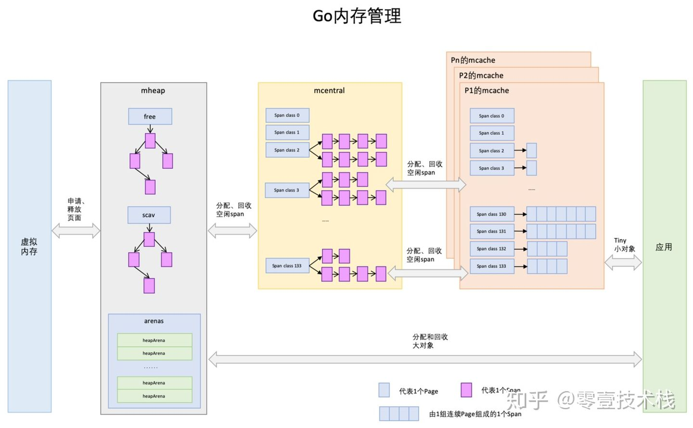
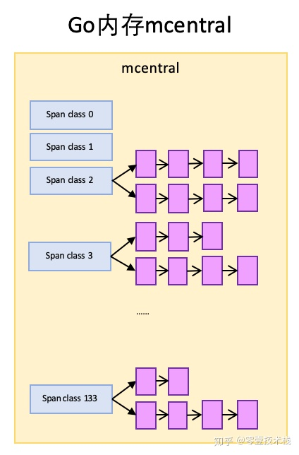
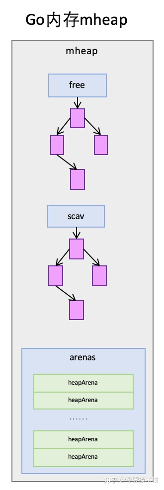

# Go内存管理

Go 的 `runtime` 抛弃了传统的内存分配方式，改为自主管理，这样可以完成内存池、预分配等操作，不用每次内存分配都进行系统调用。另外也可以更好的配合垃圾回收。


## 简述

1. 内存管理分栈和堆两部分。栈由 `goroutine` 管理，每个 `goroutine` 初始有 `2KB` 的栈，不够时自动扩容，`goroutine` 结束时自动销毁，无需垃圾回收关心。
2. 对于堆，Go 借鉴了 `TCMalloc` 的设计。首先会在初始化的时候从操作系统直接申请一大块内存，（而不是用一次申请一次），以减少系统调用。
3. 分配方法上，使用了空闲链表分配器：通过链表维护空闲的内存块；申请内存时，遍历链表寻找空闲内存
4. 为提高遍历效率，分大小管理链表：
   1. 将内存分割成多个链表，每个链表中的内存块大小相同，申请内存时先找到满足条件的链表，再从链表中选择合适的内存块

5. 为提高管理效率，分多级管理内存：
   1. 分线程缓存、中心缓存、页堆三级。
   2. 先从线程缓存分配，线程缓存和 `P` 绑定，使用时无需加锁，以此提高性能。
   3. 线程缓存不够时，再依次从上层申请空间。

6. 回收对象内存时，放回原链表，以便复用。如闲置内存过多，归还部分给操作系统，降低整体开销。


## 概念

Go 内存管理的许多概念在 `TCMalloc` 中已经有了，含义是相同的，只是名字有一些变化。先上一幅宏观的图：



先简单介绍下图中出现的概念，后面再详细介绍其作用。


**Page**

图中蓝色方格。与 `TCMalloc` 中的 `Page` 相同，`x64` 架构下 1 个 `Page` 的大小是 `8KB`。


**Span**

图中紫色方格。`Span` 与 `TCMalloc` 中的 `Span` 相同，`Span` 是 **内存管理的基本单位**，代码中为 `mspan`。一组连续的 `Page` 组成 1个 `Span`，上图一组连续的浅蓝色长方形代表的是一组 `Page` 组成的 1 个 `Span` 。`span` 有各种不同的尺寸，类似快递盒。


**mcache 线程缓存**

对应 `TCMalloc` 中的 `ThreadCache` ，保存的是各种大小的 `Span`，并将其按 `Span class` 分类，小对象从 `mcache` 分配内存，它起到了缓存的作用，并且可以无锁访问。


**mcentral 中心缓存**

对应 `TCMalloc` 中的 `CentralCache` ，是所有线程共享的缓存，需要加锁访问。它按 `Span` 级别对 `Span` 分类，然后串联成链表，当 `mcache` 的某个级别 `Span` 的内存被分配光时，它会向 `mcentral` 申请1个当前级别的 `Span`。

但是 `mcentral` 与 `CentralCache` 也有不同点，`CentralCache` 每个级别的 `Span` 有1个链表，`mcache` 每个级别有2个，这个稍后解释。

因为多数的对象都是小对象，多数情况下可以通过以上两级缓存提供足够的内存空间，资源不足时再从上一级组件中获取。


**mheap 页堆**

对应 `TCMalloc` 中的 `PageHeap` 。

当 `mcentral` 的 `Span` 不够用时会向 `mheap` 申请内存，而 `mheap` 的 `Span` 不够用时会向OS申请内存。`mheap` 向OS的内存申请是按页来的，然后把申请来的内存页生成 `Span` 组织起来，同样也是需要加锁访问的。

但是 `mheap` 与 `PageHeap` 也有不同点：`mheap` 把 `Span` 组织成了树结构，而不是链表，并且还是2棵树，然后把 `Span` 分配到 `heapArena`进行管理，它包含地址映射和 `Span` 是否包含指针等位图，这样做的主要原因是为了更高效的利用内存：分配、回收和再利用。


### 虚拟内存布局

在 Go 语言 1.10 以前的版本，堆区的内存空间都是连续的；但是在 1.11 版本，Go 团队使用稀疏的堆内存空间替代了连续的内存，解决了连续内存带来的限制以及在特殊场景下可能出现的问题。


#### 线性内存

Go 语言程序的 1.10 版本在启动时会初始化整片虚拟内存区域，如下所示的三个区域 `spans`、`bitmap` 和 `arena` 分别预留了 512MB、16GB 以及 512GB 的内存空间，这些内存并不是真正存在的物理内存，而是虚拟内存


- `spans` 区域存储了指向内存管理单元 `runtime.mspan` 的指针，每个内存单元会管理几页的内存空间，每页大小为 8KB
- `bitmap` 用于标识 `arena` 区域中的哪些地址保存了对象，位图中的每个字节都会表示堆区中的 32 字节是否空闲
- `arena` 区域是真正的堆区，运行时会将 `8KB` 看做一页，这些内存页中存储了所有在堆上初始化的对象

对于任意一个地址，我们都可以根据 `arena` 的基地址计算该地址所在的页数并通过 `spans` 数组获得管理该片内存的管理单元 `runtime.mspan`。

线性内存在 GC 时需要通过标记压缩回收。在 C 和 Go 混合使用时也可能会产生地址冲突。


#### 稀疏内存

稀疏内存是 Go 语言在 1.11 中提出的方案，使用稀疏的内存布局不仅能移除堆大小的上限，还能解决 C 和 Go 混合使用时的地址空间冲突问题。不过因为基于稀疏内存的内存管理失去了内存的连续性这一假设，这也使内存管理变得更加复杂：


如上图所示，运行时使用二维的 `runtime.heapArena` 数组管理所有的内存，每个单元都会管理 64MB 的内存空间：

```go
type heapArena struct {
	bitmap       [heapArenaBitmapBytes]byte
	spans        [pagesPerArena]*mspan
	pageInUse    [pagesPerArena / 8]uint8
	pageMarks    [pagesPerArena / 8]uint8
	pageSpecials [pagesPerArena / 8]uint8
	checkmarks   *checkmarksMap
	zeroedBase   uintptr
}
```

该结构体中的 `bitmap` 和 `spans` 与线性内存中的 `bitmap` 和 `spans` 区域一一对应，`zeroedBase` 字段指向了该结构体管理的内存的基地址。上述设计将原有的连续大内存切分成稀疏的小内存，而用于管理这些内存的元信息也被切成了小块。

不同平台和架构的二维数组大小可能完全不同，如果我们的 Go 语言服务在 Linux 的 x86-64 架构上运行，二维数组的一维大小会是 1，而二维大小是 4,194,304，因为每一个指针占用 8 字节的内存空间，所以元信息的总大小为 32MB。由于每个 `runtime.heapArena` 都会管理 64MB 的内存，整个堆区最多可以管理 256TB 的内存，这比之前的 512GB 多好几个数量级。


### Go内存分配

`Go` 中的内存分类并不像 `TCMalloc` 那样分成小、中、大对象，而是只分大、小对象，但小对象里又细分了一个 `Tiny` 微对象。


微对象指大小在 `1B` 到 `16B` 之间并且不包含指针的对象。主要使用它来分配较小的字符串以及逃逸的临时变量。

小对象和大对象只用大小划定。小对象是在 `mcache` 中分配的，而大对象是直接从 `mheap` 分配的。


### 小对象的内存分配

#### 分配流程

1. 计算对象对应的尺寸规格 `size class`
2. 从 `mcache.alloc` 数组找到规格相同的 `span`。从 `mspan.freelist` 链表提取可用的 `object`
3. 如果 `mspan.freelist` 为空，从 `mcentral` 获取新 `span`
4. 如果 `mcentral.noneempty` 为空，从 `mheap.free` / `mheap.freelarge` 获取，并切分成 `object` 链表
5. 如果 `mheap` 没有大小合适的闲置 `span` ，向 `OS` 申请新内存块。 


#### 释放流程

1. 将标记为可回收的 `object` 交还给所属 `mspan.freelist`
2. 该 `mspan` 被收回 `mcentral`，可供任意 `mcache` 重新获取使用
3. 如 `mspan` 已收回全部 `object`，则将其交还给 `mheap`，以便重新切分复用
4. 定期扫描 `mheap` 里长时间闲置的 `span`，释放其占用的内存给 `OS`


- 作为工作线程私有且不被共享的 `mcache` 是实现高性能无锁分配的核心。

- `mcentral` 的作用是在多个 `mcache` 间提高 `object` 利用率，避免内存浪费。

- 将 `object` 还给 `heap` ，是为了在不同规格的 `object` 需求间平衡。


#### 初始化

内存分配器初始化时，会申请一块很大的虚拟内存。并将其划分为3个区域：`spans`，`bitmap` 和 `arena`。

- `spans`：`span` 链表
- `bitmap`：`GC` 标记位图，为每个对象提供 `4bit` 标记位，主要用来标记对象是否被分配出去了，`GC` 扫描时根据这个标记判断是否需要回收
- `arena`：记录了从操作系统申请来的内存的 起止地址


#### 从 span 分配对象空间

`span` 可以按对象大小切成很多份，这些都可以从映射表上计算出来，以 `size class 3` 对应的 `span` 为例，`span` 总大小是 `8KB`，这个 `class` 下每个对象所占空间为 `32B`，这个 `span` 就被分成了 `8KB / 32B = 256` 块，可以根据 `span` 的起始地址计算出每个对象块的内存地址。


随着内存的分配，`span` 中的对象内存块，有些被占用，有些未被占用，比如上图，整体代表1个 `span`，蓝色块代表已被占用内存，绿色块代表未被占用内存。当分配内存时，只要快速找到第一个可用的绿色块，并计算出内存地址即可。

`Go` 里面预定义了 `67` 种对象的尺寸 `size class`，为对象分配内存时，会先做一次大小转换，向上寻找大小最近的标准的尺寸。

1个 `size class` 对应 2 个 `span class` (一个给指针，一个给非指针)，因此共 `67 * 2 = 134` 个 `span class`。分配过程如下：

1. 计算对象所需内存大小 `size`
2. 根据 `size` 到 `size class` 映射，计算出所需的 `size class`
3. 根据 `size class` 和对象是否包含指针计算出 `span class`
4. 获取该 `span class` 指向的 `span`，并从 `mspan.freelist` 里分配空间
5. 如果对象小于 `16B` 且无指针，会直接从 `mcache` 的 `tiny` 字段里分配空间给对象

```go
const (
    _NumSizeClasses = 68                  // 1~68, 0不用
    numSpanClasses = _NumSizeClasses << 1 // 每种尺寸2个spanClass，一个给指针，一个给非指针，非指针在GC时无需扫描
)

// 根据尺寸找span
func makeSpanClass(sizeclass uint8, noscan bool) spanClass {
    return sizeclass<<1 | bool2int(noscan) // 尺寸左移一位，空出来的那位用于标记是否有指针
}
```

当 `span` 内所有内存块都被占用时，没有剩余空间继续分配，`mcache` 会向 `mcentral` 申请1个 `span`，再继续分配。


#### mcache 向 mcentral 申请 span

`mcentral` 和 `mcache` 一样，都是 `0~133` 这 `134` 个 `span class` 级别，但每个级别都保存了 `2` 个 `span list`：

1. `nonempty`：所有未被使用的空闲 `mspan`。
2. `empty`：被 `mcache` 拿走、未归还的 `mspan`。归还后会再挂载到 `nonempty`上。

`mcache` 向 `mcentral` 申请 `span` 时，`mcentral` 会先从 `nonempty` 搜索满足条件的 `span`，如果没有找到再从 `emtpy` 搜索。



 

#### mheap 的 span 管理

`mheap` 里保存了两棵二叉排序树，按 `span` 的 `page` 数量进行排序：

1. `free`：保存空闲并且非垃圾回收的 `span`。
2. `scav`：(scavenge, 垃圾回收) 保存空闲并且已经垃圾回收的 `span`。

如果是垃圾回收导致的 `span` 释放，`span` 会被加入到 `scav`，否则加入到 `free`，比如刚从OS申请的的内存组成的 `span`。

`mheap` 中还有 `arenas`，由一组 `heapArena` 组成，每一个 `heapArena` 都包含了连续的 `pagesPerArena` 个 `span`，这个主要是为 `mheap` 管理 `span` 和垃圾回收服务。 




#### mcentral 向 mheap 申请 span

当 `mcentral` 向 `mcache` 提供 `span` 时，如果 `empty` 里也没有符合条件的 `span`，`mcentral` 会向 `mheap` 申请 `span`。

此时，`mcentral` 需要向 `mheap` 提供需要的内存页数和 `span class` 级别，然后它优先从 `free` 中搜索可用的 `span`。如果没有找到，会从`scav` 中搜索。如果还没有找到，它会向OS申请内存，再重新搜索2棵树。如果找到的 `span` 比需要的 `span` 大，则把 `span` 进行分割成 2个 `span`，其中1个刚好是需求大小，把剩下的`span` 再加入到 `free` 中去，然后设置需要的 `span` 的基本信息，再交给 `mcentral`。


#### mheap 向 OS 申请内存

当 `mheap` 没有足够的内存时，会向OS申请内存，把申请的内存页保存为 `span`，然后把 `span` 插入到 `free` 树。

> 在32位系统中，`mheap` 还会预留一部分空间，当 `mheap` 没有空间时，先从预留空间申请，如果预留空间也没有了，才向OS申请。


### 大对象的内存分配

大对象的分配比小对象省事多了，不涉及 `mcache`，流程与 `mcentral` 向 `mheap` 申请内存的相同，所以不重复介绍了。不同的一点在于 `mheap` 会记录一点大对象的统计信息，详情见 `mheap.alloc_m()`。


## Go的栈内存

最后提一下栈内存。从一个宏观的角度看，内存管理不应当只有堆，也应当有栈。

Go 里的栈是各个 `goroutine` 自己管理的。每个 `goroutine` 都有自己的栈，栈的初始大小是 `2KB` (Go1.4前为 `8KB`)，不够用时自动扩容（申请新栈，复制数据到新栈）。一个方法开始结束对应一次栈帧的入栈出栈，因此方法结束栈空间是立即回收的。


#### 栈内存分配

新建 `G` 时就会为 `G` 分配 `2KB` 的栈，并设置 `stackguard0` 字段，用于判断栈容量是否需要扩张。

分配的算法和堆的差不多，`mcache` 里有个 `stackcache` 字段，给栈分配空间时先从这里找。没有的话，再依次从 `mcentral`、`mheap` 里申请 `span`。


#### 栈的扩容 

编译器会在每个函数头部插入一些代码，用于扩栈检测。做法是比较 `stackguard0` 字段与 `SP`。如果 `SP` 指针地址小于 `stackguard0`（栈从高位向低位地址分配），说明已经溢出，需要扩容。

扩容的基本过程就是申请一个 `2x` 大小的新栈，然后将数据复制过去，替换掉旧栈。当然，期间需要堆指针等内容做些调整。

扩容后会调用 `stackfree` ，触发栈空间释放。


#### 栈的释放

回收的栈空间会被放回缓存链表 `mache.stackcache`，用于下次复用。如果缓存过多，则转移一批到全局链表 `sched.stackcache`，或者直接将自己的 `span` 还给 `heap`。

除了扩容会调用 `stackfree` 释放栈空间外，`GC` 时 、`G` 结束时将 `G` 放回空闲 `G` 链表，也会触发这个操作。


# 源码

#### mspan

```go
// runtime/malloc.go
_PageShit = 13
_PagegSize = 1 << _PageShft // 一页8KB

// runtime/mheap.go
type mspan struct {
    next     *mspan     // 双向链表
    prev     *mspan
    start    pageID     // 起始页地址 (=address >> _PageShift)
    npages   uintptr    // 页数
    
    freeindex uintptr   // 可分配的起始游标，其值等于 allocBits 里第一个 0 出现的位置
    freelist gclinkptr  // 待分配的 object 链表
    
    allocBits  *gcBits  // 标记内存的使用状况，bitmap
    gcmarkBits *gcBits  // 标记可gc的内存，bitmap
}
```


#### mcache

```go
// runtime/mcache.go
type mcache struct {
    tiny       uintptr // 用于微小对象（<16B且不含指针）分配的空间
    tinyoffset uintptr // tiny 可用于分配的起始地址
    tinyAllocs uintptr // 已分配的 tiny 对象数量

    alloc [numSpanClasses]*mspan             // 各种尺寸的 span
  
    stackcache [_NumStackOrdes]stackfreelist // 给栈用的空间
}
```

`alloc` 字段按 8 字节倍数分为 `n` 种。比如大小为 24 字节的可用来存储范围在17 ~ 24 字节的对象。这种方式虽然会造成一些浪费，但分配器只需要处理有限几种规格的小块内存，优化了分配和复用管理策略。

若对象大小超过特定阈值 (32KB)，会被当做大对象处理。


#### mheap

```go
// runtime/mheap.go
type mheap strcut {
    spans           **mspan   // span链表
    spans_mapped    uintptr
    
    bitmap          uintptr   // GC标记位
    bitmap_mapped   uintptr
    
    arena_start     uintptr   // 空间起始地址
    arena_used      uintptr   // 已用空间结束地址
    arena_end       uintptr   // 空间结束地址
    arena_reserved  bool
}    
```


#### 空间分配

`mallocgc` 这个函数名一看还以为是做 GC 的，实际做的是 malloc + GC 两件事情，大部分代码都是处理空间分配

```go
// runtime/malloc.go
func mallocgc(size uintptr, typ *_type, needzero bool) unsafe.Pointer {
    
    // 先做一次辅助 GC 检查
  ...

    mp := acquirem() // 获取M
    mp.mallocing = 1 // 更新M状态
  
    shouldhelpgc := false
    dataSize := size
    c := getMCache() // mcache
    
    var span *mspan
    var x unsafe.Pointer
    noscan := typ == nil || typ.ptrdata == 0
  
  // 小于 32KB 的算小对象
    if size <= maxSmallSize {
    
    // 小于 16B 的使用 tiny 字段 分配空间
        if noscan && size < maxTinySize { 
            // 小于 16B 的统一使用 tiny 分配器处理，主要用于处理小字符串、单独的逃逸变量
            // 可以减少 ~12% 的分配次数，节约 ~20% 的堆空间
            // 选 16B 是权衡过的，8B 不浪费空间，但使得两个 object 公用一块内存的概率降低了；32B 太浪费空间
            // 不能含指针，因为多个小对象被组合到同一个 tiny 字段里，无法应对垃圾扫描
            off := c.tinyoffset // tiny 被分配的偏移量
            if size&7 == 0 {    // 向上对齐
                off = alignUp(off, 8)
            } else if size&... == 0 {
                off = alignUp(off, ...)
            }
      
            // tiny 有空间，就分配到 tiny 上
            if off+size <= maxTinySize && c.tiny != 0 { 
                x = unsafe.Pointer(c.tiny + off)          // 起始分配地址
                c.tinyoffset = off + size                 // 更新偏移量
                c.tinyAllocs++                            // 分配数 +1
                mp.mallocing = 0                          // 更新 M 状态
                releasem(mp)
                return x
            }
      
            // tiny 空间不够，获取新的 tiny 块
            span = c.alloc[tinySpanClass]
            v := nextFreeFast(span)
      if v == 0 {
                v, span, shouldhelpgc = c.nextFree(tinySpanClass)
            }
            x = unsafe.Pointer(v)
            (*[2]uint64)(x)[0] = 0
            (*[2]uint64)(x)[1] = 0
            size = maxTinySize
      
        // 非 tiny 的小对象
        } else {
            var sizeclass uint8 // 转换成标准尺寸
            if size <= smallSizeMax-8 {
                sizeclass = size_to_class8[divRoundUp(size, smallSizeDiv)]
            } else {
                sizeclass = size_to_class128[divRoundUp(size-smallSizeMax, largeSizeDiv)]
            }
            size = uintptr(class_to_size[sizeclass])
            spc := makeSpanClass(sizeclass, noscan)
            span = c.alloc[spc]
            v := nextFreeFast(span)
            if v == 0 {
                v, span, shouldhelpgc = c.nextFree(spc)
            }
            x = unsafe.Pointer(v)
            if needzero && span.needzero != 0 {
                memclrNoHeapPointers(unsafe.Pointer(v), size)
            }
        }
    
    // 大于 32KB 的，走 allocLarge 方法
    } else {
        shouldhelpgc = true
        span = c.allocLarge(size, needzero, noscan)
        span.freeindex = 1
        span.allocCount = 1
        x = unsafe.Pointer(span.base())
        size = span.elemsize
    }

    // pprof 内存分配采样
    if rate := MemProfileRate; rate > 0 {
        if rate != 1 && size < c.nextSample {
            c.nextSample -= size
        } else {
            mp := acquirem() // 新起了个 M 做采样工作
            profilealloc(mp, x, size)
            releasem(mp)
        }
    }

    // 再次进行 GC 检查
    ...

    return x
}
```


### 空值的内存分配

`Go` 里大小为 `0` 的变量，均指向 `runtime.zerobase` 这个变量的地址

```go
// base address for all 0-byte allocations
var zerobase uintptr
```

因此，两个空 `struct{}{}` ，其地址和值都是相等的


#### 参考

> [零壹技术栈 - 详解Go语言的内存模型及堆的分配管理](https://zhuanlan.zhihu.com/p/76802887)
>
> [draveness - 7.1 内存分配器](https://draveness.me/golang/docs/part3-runtime/ch07-memory/golang-memory-allocator/)
