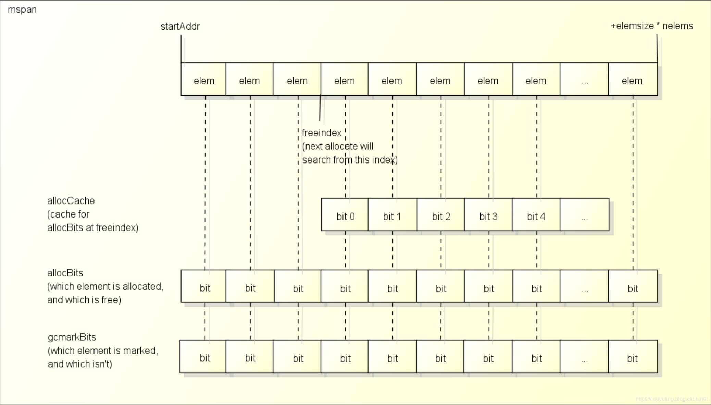
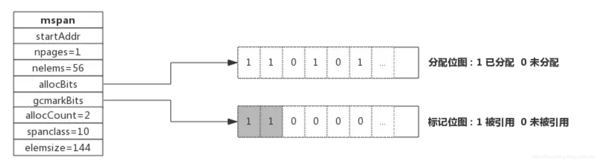
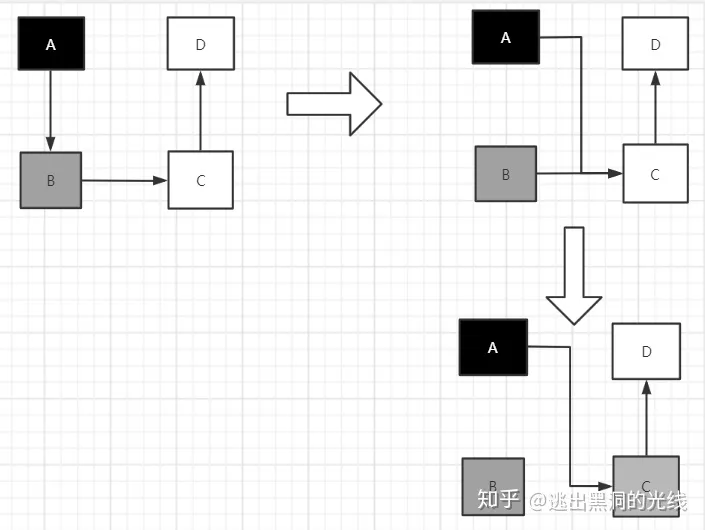
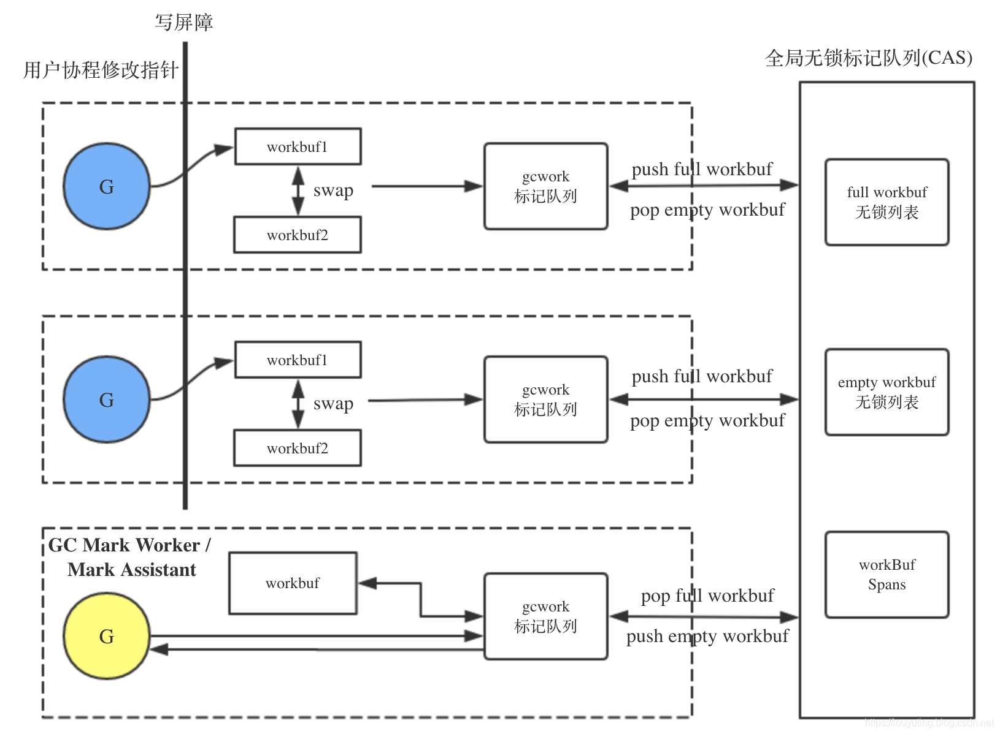
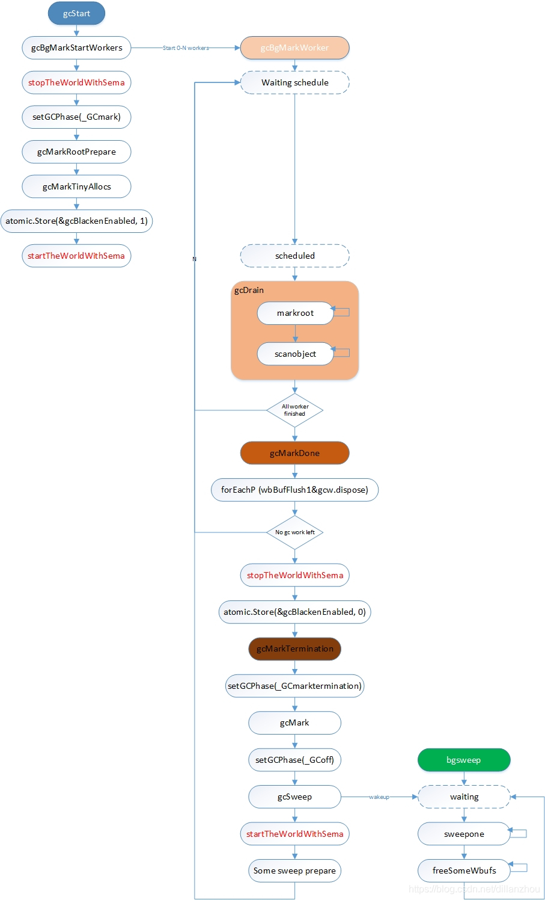

# 概述
- 标记垃圾
  - 引用计数法
  - 根可达算法
- 常用的垃圾回收算法
  - `Go` 使用三色标记法
- 混合写屏障
- GC 优化
  - 减少内存逃逸，变量尽量分配在栈空间
  - 切片/map 结构提前预估和分配足够的内存来降低多余的拷贝、扩容
  - 减少对象分配数量：复用同一个对象；使用 `sync.Pool` 
  - 减少协程数量：多路复用的思路：利用固定数量的协程从任务队列里取任务，而不是每个任务一个协程处理
  - `GOGC/GOMEMLIMIT` 环境变量减少 GC 频率


# 1. 垃圾标记算法

今天的编程语言通常会使用手动和自动两种方式管理内存，C、C++ 以及 Rust 等编程语言使用手动的方式管理内存，工程师需要主动申请或者释放内存。而 Python、Ruby、Java 和 Go 等语言使用自动的内存管理系统。垃圾收集包括标记和回收两步，常用的标记算法有两种：

1. 引用计数法：Objective-C 使用
2. 根可达算法：Go、Java 使用


## 1.1 引用计数法 

在对象的结构体里额外内置一个计数器，当对象被引用时引用计数加一，解除引用时减一。当引用计数归零时，自动销毁对象。

以 `Python` 为例，其对象结构体为：

```python
typedef struct_object {
    int ob_refcnt;              // 引用计数
    struct_typeobject *ob_type;
} PyObject;
```

当执行创建对象、赋值、传参等操作时，引用 +1。销毁、赋新的值（旧值引用 -1）、脱离作用域等时机，引用 -1。


#### 优点

引用计数法有其明显的优点，如高效、实现逻辑简单、具备实时性。

1. 一旦一个对象的引用计数归零，内存就直接释放了。不用像其他机制等到特定时机。
2. 将垃圾回收随机分配到运行的阶段，正常程序的运行比较平稳，不像 `Go` 每隔一段时间做一次 GC，导致 CPU 占用不稳定。


#### 缺点

1. 循环引用的场景：如 `a.next = b; b.next = a`。这是引用计数的致命伤，引用计数对此是无解的，因此必须使用其它的 GC 算法进行补充。

2. 维护计数麻烦。每个对象需要分配单独的空间来统计引用计数，增加空间占用量不说，需要对引用计数进行维护，在维护的时候很容易会出错。
3. 释放一个大的对象时，比如字典，需要对引用的所有对象循环嵌套调用，从而可能会花费比较长的时间。


## 1.2 根可达算法
从根对象往下查找引用，可以查找到的引用标记成可达，直到算法结束之后，没有被标记的对象就是不可达的、未使用的，可以被回收。


#### 根对象

根对象在垃圾回收的术语中又叫做根集合，它是垃圾回收器在标记过程时最先检查的对象，包括：

1. 全局变量：程序在编译期就能确定的那些存在于程序整个生命周期的变量。
2. 栈：每个 goroutine 都包含自己的执行栈，里面包含栈上的变量，以及指向堆对象的指针。
3. 寄存器：寄存器的值可能表示一个指针，参与计算的这些指针可能指向某些赋值器分配的堆内存区块。


# 2. 基于根可达的垃圾回收算法

1. 标记 - 清除
   - 标记：从根对象出发，将确定存活的对象进行标记，这样未被标记的就是可以回收的对象
   - 将可以回收的内存加入空闲内存链表
   - STW 时间较长；会产生内存碎片
2. 标记 - 整理（复制）
   - 将在用的对象复制到一块新对象上，这样他们就在一块连续的内存上了，不会有碎片
   - 复制性能消耗大、浪费空间（总有一半的处于浪费状态）、STW 时间长
3. 标记 - 压缩
   - 为在用的对象计算前面可用的新地址，移动到新地址上
4. 增量式
    - 将标记与清扫的过程分批执行，每次执行很小的部分，从而增量的推进垃圾回收，达到近似实时、几乎无停顿的目的
5. 分代模型
6. 三色标记法


## 分代模型

将对象根据存活时间的长短进行分类，存活时间小于某个值的为年轻代，存活时间大于某个值的为老年代，永远不会参与回收的对象为永久代。并根据分代假设（如果一个对象存活时间不长则倾向于被回收，如果一个对象已经存活很长时间则倾向于存活更长时间）对对象进行回收。

`jdk1.8` 之前使用这个算法。将对象分为年轻代和老年代，年轻代使用**复制算法**，老年代使用**标记压缩**或者**标记清除**。

`jdk1.8` 可以用上面的分代模型，也可以使用不分代模型，用 `G1、ZGC` 等算法。

性能优秀，实现复杂。


## 三色标记法

三色标记法是传统标记 - 清除算法的一个改进，能够减少原始算法过长的 STW 时间


步骤：

1. 首先初始状态下所有对象都是 **白色** 的
2. 从根对象开始遍历所有对象，将遍历到的对象从白色集合放到 **灰色** 集合（灰色为中间临时状态）
3. 遍历灰色集合中的对象，将灰色对象引用的子对象放到灰色集合里面，自身移动到 **黑色** 集合
4. 重复 3 直到灰色集合为空
5. 在标记开始时会开启写屏障。然后在标记期间发生变化的对象，会被直接标记为 **灰色**，扔进灰色集合，重复上面操作
6. 清除阶段：清除所有剩余的 **白色** 对象


#### 三色标记的问题

1. 多标（浮动垃圾)
   1. 假设现有 `A 黑 -> B 灰 -> C 白` 的引用，现正准备将 `C` 标记为灰
   2. 这时 `B` 解除了 对 `C` 的引用，那 `C` 虽然后面被标记为灰色，但它实际是应该被回收的
   3. 这种情况不碍事，大不了下次 GC 再收集
2. 漏标（悬挂指针）
   1. 还是 `A 黑 -> B 灰 -> C 白`，假设程序又新建了个 `A -> D` 的引用
   2. 因为 `A` 是黑色的，不会再被扫描，因此检测不到 `D`，`D` 会被视为白色而被清理，造成空指针异常
   3.  `Go` 使用写屏障来解决这个问题


#### 三色标记状态的记录

`runtime` 并没有真正的三个集合来分别装三色对象。如果真的用三个集合来存储，性能肯定是堪忧的。

这里先回顾下 `mspan` 的结构：



`span` 中有一个 `freeindex` 标记下一次分配对象时应该开始搜索的地址, 分配后 `freeindex` 会增加, 在 `freeindex` 之前的元素都是已分配的, 在 `freeindex` 之后的元素有可能已分配，也有可能未分配。

`allocBits` 用于标记哪些元素是已分配的 (1)，哪些元素是未分配的 (0)。分配空间时，从 `freeindex` 向后检索，检索 `allocBits` 为 0 的空间。

因为每次都去访问 `allocBits` 效率会比较慢, 又用了一个 `allocCache` 变量缓存 `freeindex` 之后的 `allocBits`。

`gcmarkBits` 用于在 `GC` 时标记哪些对象存活。每次执行垃圾标记时，标记的都是 `gcmarkBits` 这个变量。



回到 GC 中的三色表示，`Go` 内部对象并没有保存颜色的属性, 三色只是对它们的状态的描述。

白色的对象的 `gcmarkBits` 中对应的 `bit` 为 `0`,
灰色的对象的 `gcmarkBits` 中对应的 `bit` 为 `1`，并且对象在标记队列中,
黑色的对象的 `gcmarkBits` 中对应的 `bit` 为 `1`，并且对象已经从标记队列中取出并处理。

扫描完成后，`gcmarkBits` 里为 `0` 的就可以清理掉。清理后将 `gcmarkBits` 赋值给 `allocBits` 字段。


# 写屏障

`Go` 的写屏障和操作系统的内存写屏障是两个概念，不要搞混了。

`Go` 的编译器在函数执行时插了段代码（类似于栈扩容检测的代码），并用一个变量来标记是否开启了写屏障。函数执行时，先判断一下这个写屏障标记，如果为 `true`，就执行写屏障相关的逻辑：将新分配的对象直接视为灰色，放入标记队列，解决漏标问题。

写屏障主要有两种：Dijkstra 实现的插入写屏障，和 Yuasa 实现的删除写屏障。

`Go 1.8` 之前是用的是插入写屏障，执行完标记后需要重新扫描一次栈。 `1.8` 之后这两种一起使用，不需要多扫一次，称为混合写屏障。


#### 三色不变性

想要在并发或者增量的标记算法中保证正确性，我们需要达成以下两种三色不变性（Tri-color invariant）中的任意一种：

- 强三色不变性：黑色对象不会指向白色对象
- 弱三色不变性：黑色对象可以指向白色对象，但必须包含一条经过灰色对象到该白色对象的路径

插入写屏障满足强三色不变性，删除写屏障满足弱三色不变性。


#### 插入写屏障

如果两个对象之间新建立引用，那么引用指向的对象就会被标记为灰色。

比如：用户程序修改 A 对象的指针，将原本指向 B 对象的指针指向 C 对象，这时触发写屏障将 C 对象标记成灰色。

Dijkstra 的插入写屏障是一种相对保守的屏障技术，它会将**有存活可能的对象都标记成灰色**以满足强三色不变性。

它也有明显的缺点。因为栈上的对象在垃圾收集中也会被认为是根对象，所以为了保证内存的安全，必须 为栈上的对象增加写屏障（goroutine多时开销很大）或者 在标记阶段进入 STW，重新对栈上的对象进行扫描。`Go 1.8` 前采用的是后者；`1.8` 及之后采用混合写屏障 + 将新建对象直接标记为黑色的做法，只对堆上的对象开启插入写屏障，就不需要重新扫描栈和暂停程序了。

```go
// 将 slot 指向 ptr
func writePointer(slot, ptr) {
    shade(ptr)  // 若 ptr 为白色，先将 ptr 染为灰色
    *slot = ptr // 将 slot 指向 ptr
}

// 如A为灰色，用户增加了 A.Next = B 的引用，则实际调用为
writePointer(A.Next, B) // 将 B 直接染为灰色
```


#### 删除写屏障

用户程序删除了 B -> C 的引用，这时触发写屏障将 C 对象标记成灰色。（因为之后可能还有 黑色A->C 的引用，此时保留C，就不需要为A开启插入写屏障）

一旦该写屏障开始工作，它会保证开启写屏障那一时刻堆上所有对象的可达，所以也被称作快照垃圾收集（Snapshot GC）

```go
// slot 为当前引用，ptr 为新增的引用
func writePointer(slot, ptr) {
    shade(slot)  // 将 slot 原本指向的对象标记为灰色
    *slot = ptr  // 更新 slot 为新的 ptr
}

// 如 A 为灰色，用户删除了 A.Next = B 的引用，改成了 A.Next = C，则实际调用为
writePointer(A.Next, C) // 这里会将原本的 A.Next 即 B 染为灰色
```

上述代码会在老对象的引用被删除时，将白色的老对象涂成灰色，这样删除写屏障就可以保证弱三色不变性，老对象引用的下游对象一定可以被灰色对象引用。




# Golang GC 发展

| 版本 | GC                       | STW     |
| ---- | ------------------------ | ------- |
| 1.1  | STW，单线程处理          | > 100ms |
| 1.3  | Mark STW，并行清扫       | > 100ms |
| 1.5  | 三色标记法，并发标记清除 | < 10ms  |
| 1.8  | 混合写屏障               | < 0.5ms |


# GC时机

`GC` 在满足一定条件之后就会被触发，触发的条件有 3 种：

1. `gcTriggerHeap`: 当前分配的内存达到一定值就触发 `GC`

2. `gcTriggerTime`: 当一定时间没有执行过 `GC` 就触发 `GC`

3. `gcTriggerCycle`: 要求启动新一轮的 `GC`, 已启动则跳过


这三种条件分别对应三处时机：

1. 申请内存调用 `runtime.mallocgc` 时，会判断是否需要触发 `GC`
   - 判断条件是一个触发系数 `triggerRatio`。这个触发系数的计算叫做 `pacer` 算法，总体和 CPU使用率、内存占用增长率、上个触发系数有关。这个系数决定了触发 `GC` 的堆大小的阈值
   
   - 下一次触发 GC 的堆内存 size 的公式如下：
   
     ```
     // Go 1.18版本之前
     目标堆大小 = (1+GOGC/100) * live heap // live heap为上一次GC标记后的堆上的live object的总size
     // 例如 GOGC=100，表示内存使用变为上次的2倍时触发GC
     
     // Go 1.18版本及之后
     目标堆大小 = live heap + (live heap + GC roots) * GOGC / 100
     ```
   
2. 后台监控协程 `sysmon`， 会计算和上次 `GC` 间隔时间，超过 `2 ` 分钟就执行一次 `forcegchelper`

3. 手动在代码里写 `runtime.GC`


通过这些方式的组合，`go runtime` 达到了两个目的：1. 内存使用量控制在一个较稳定的范围；2. `GC` 触发不会太过频繁

这里看下第一种方式的代码：

```go
// runtime/malloc.go
// 这个函数名一看还以为是做 GC 的，实际做的是 malloc + GC 两件事情，大部分代码都是处理空间分配
func mallocgc(size uintptr, typ *_type, needzero bool) unsafe.Pointer {
    
    // 为了防止heap增速太快，在执行GC的过程中如果有用户程序运行的G分配了内存，那么这个G会被要求辅助GC做一部分工作，分配多少内存就需要完成多少标记任务。整个辅助标记模型是一个债务系统，标记扫描程序是还债方，内存分配程序是借债方。通过这个债务系统，既能够让G在正常运行时不会被垃圾回收造成太大的压力，又能保证在达到堆大小目标时完成对象标记。
    var assistG *g                           // 进行辅助GC
    if gcBlackenEnabled != 0 {
        assistG = getg()                     // 获取当前G
        assistG.gcAssistBytes -= int64(size) // 把当前分配对象的size从辅助GC配额里扣除

        if assistG.gcAssistBytes < 0 {       // 如果扣完成负的了，则要进行辅助GC
            gcAssistAlloc(assistG)
        }
    }

    // 空间分配相关
	// 申请小对象、微对象可能触发 GC
    if size <= maxSmallSize { // maxSmallSize = 32KB
        if noscan && size < maxTinySize {
             v, _, shouldhelpgc = c.nextFree(tinySpanClass)
        } else {
             v, span, shouldhelpgc = c.nextFree(spc)
        }
    } else { // 32KB 以上 大对象直接设为 true
        shouldhelpgc = true
    }

    // 如果处于 GC 期间，直接将使用的 span 标记为黑色
    if gcphase != _GCoff {
        gcmarknewobject(span, uintptr(x), size, scanSize)
    }

    // 再次进行 GC 检查
    if assistG != nil {
        assistG.gcAssistBytes -= int64(size - dataSize)
    }
	
    if shouldhelpgc {
		// 判断是否达到触发比例
        if t := (gcTrigger{kind: gcTriggerHeap}); t.test() {
            gcStart(t) // 开始执行 GC
        }
    }

    return x
}
```


# 回收步骤

1. 标记准备（做一些初始化的工作，期间开启 STW、写屏障）
2. 并发标记
3. 标记结束（恢复用户协程、结束写屏障）
4. 清除：触发内存回收


## 第一阶段：标记准备 gcStart()

这个阶段主要是做一些初始化的工作

1. 为每个 `P` 创建一个 `G` 用于后面的并发标记（`gcBgMarkWorker`, 用于第二阶段工作）
2. **stop the world**，`stopTheWorldWithSema`
3. 初始化一些 `GC` 执行参数，用以控制 `GC` 标记占用的 CPU 比例。
   - 这个比例由全局常量 `gcBackgroundUtilization = 0.25` 指定，即不超过 `25%`
4. 将 `GC` 阶段修改为 `_GCmark` 状态，**启动写屏障**
5. 找到所有根节点并计算数量（栈、全局变量等）
6. 标记染色所有 `tiny` 对象
7. 结束 STW，进入第二阶段

```go
func gcStart(trigger gcTrigger) {
    // 确保上一轮清理干净
    for trigger.test() && sweepone() != ^uintptr(0) {
        sweep.nbgsweep++
	}

    // 创建后台标记工作的 goroutines
    // 这些 goroutines 不会马上启动，会阻塞直到进入 mark 阶段才会启动
    gcBgMarkStartWorkers()

    // 重置标记相关的状态
    systemstack(gcResetMarkState)

    // STW, 停止所有运行中的G, 并禁止它们运行
    systemstack(stopTheWorldWithSema)
    
    // 设置全局变量中的GC状态为_GCmark
    // 然后启用写屏障
    setGCPhase(_GCmark)

    // 根节点扫描准备：计算根节点数量
    gcMarkRootPrepare()
    
    // tiny对象是直接在这个阶段标记染色的，里面调用 greyobject() 方法
    gcMarkTinyAllocs()

    // 启用辅助GC
    atomic.Store(&gcBlackenEnabled, 1)

    // START THE WORLD
    systemstack(func() {
        now = startTheWorldWithSema(trace.enabled)
        // 记录停止了多久, 和标记阶段开始的时间
        work.pauseNS += now - work.pauseStart
        work.tMark = now
    })
}
```


这里顺便看一下 STW 部分的代码，和前面的抢占章节相关。里面会调用 `preemptall() -> preemptone()` 函数。`preemptone()` 会发送 `_SIGURG` 抢占信号

```go
func stopTheWorldWithSema() {
    preemptall()
}

func preemptall() bool {
   for _, _p_ := range allp {
       if preemptone(_p_) {
       }
   }
}
```


## 第二阶段：并发标记 gcBgMarkWorker()

并发标记：在垃圾收集启动期间，会启动 `GOMAXPROCS` 个 worker 用于并发标记。但这些协程启动后并不立即执行，而是进入休眠。调度器通过一些策略决定唤醒几个：

```go
func gcBgMarkStartWorkers() {
    for gcBgMarkWorkerCount < gomaxprocs {
        go gcBgMarkWorker()
    }
}

func gcBgMarkWorker() {
    for {
        gopark(...)  // worker 新建后休眠，等待唤醒
    }   
    
    // 根据后台标记任务的模式执行对应的工作策略
    switch _p_.gcMarkWorkerMode {
        case gcMarkWorkerDedicatedMode:  // 专门执行标记，不会被抢占
            gcDrain(...)                 // 唤醒后执行 gcDrain 标记
        case gcMarkWorkerFractionalMode: // 该模式下P会适量的执行标记，直到被抢占
        case gcMarkWorkerIdleMode:       // 该模式下P只会在空闲时执行标记
    }
    
    gcMarkDone() // 标记完成
}
```


在调度函数 `schedule()` 里，会检查 `gcBlackenEnabled`，如果启用，则通过 `gcController.findRunnableGCWorker()` 唤醒 worker。

```go
func schedule() {
    if gp == nil && gcBlackenEnabled != 0 {
	    gp = gcController.findRunnableGCWorker(_g_.m.p.ptr())
	}
}
```

在GC标记阶段会将 25% 的CPU用于垃圾回收，也就是说只有 25% P 中的 worker 会运行，其他 P 中的 worker 不会运行。考虑到 25% P 的数量不一定是一个整数，小数部分会用 P 的部分时间进行标记，该 P 上运行的 worker 协程是可以被抢占的。促成了GC worker 协程有三种不同的工作模式，分别是：

1. `gcMarkWorkerDedicatedMode`：标为该模式的P专门标记对象，不会被调度器抢占，直到标记阶段结束。
2. `gcMarkWorkerFractionalMode`：标为该模式的P只占用一个CPU的部分资源，可以被抢占。当25%P的数有小数时，会存在该模式，帮助GC时标记工作CPU使用率到达整体的25%的目标。
3. `gcMarkWorkerIdleMode`：P为空闲模式，即P没有运行任何协程，它也会进行对象标记，直到被抢占。因为闲着也是闲着，可以用来帮助干点GC的事情。


#### gcDrain

这些 worker 在被唤醒后，执行的是 `gcDrain()` 函数，这个函数是用于扫描和标记堆内存中对象的核心方法，主要做两件事：

1. 标记根对象，将根对象引用的对象加入到 `gcw` 队列（根对象扫描）
2. 从 `gcw` 中取出对象，对该对象进行扫描，将其引用的对象加入到 `gcw` 中（染色）

实际上是个 BFS 广度优先搜索

```go
func gcDrain(gcw *gcWork, flags gcDrainFlags) {
    for !(preemptible && gp.preempt) {
        markroot(gcw, job)    // 标记根对象到队列里。里面依次扫描全局变量、G 的栈等
    }
    for !(preemptible && gp.preempt) {
        b := gcw.tryGetFast() // 从队列里取出根对象
        scanobject(b, gcw)    // 扫描对象b，找出对象b哪些字段是指针类型，并将这些指针类型指向的对象加入到待扫描队列
    }
}
```


##### markroot()

依次从内存的全局变量区、各个G的栈等位置标记根对象，将根对象放入 `gcw` 队列

```go
func markroot(gcw *gcWork, i uint32) {
    switch {
    ...

	  // 扫描全局变量的 data 段（已经初始化、可以读写的）
	  case baseData <= i && i < baseBSS:
        for _, datap := range activeModules() {
            markrootBlock(datap.data, datap.edata-datap.data, datap.gcdatamask.bytedata, gcw, int(i-baseData))
        }
        
    // 全局变量的BSS段（未初始化、只读的）
    case baseBSS <= i && i < baseSpans:
        for _, datap := range activeModules() {
            markrootBlock(datap.bss, datap.ebss-datap.bss, datap.gcbssmask.bytedata, gcw, int(i-baseBSS))
        }

    // i为0，扫描析构器队列
    case i == fixedRootFinalizers:
        for fb := allfin; fb != nil; fb = fb.alllink {
            cnt := uintptr(atomic.Load(&fb.cnt))
            scanblock(uintptr(unsafe.Pointer(&fb.fin[0])), cnt*unsafe.Sizeof(fb.fin[0]), &finptrmask[0], gcw, nil)
        }

    // i为1，释放已终止的G的栈
    case i == fixedRootFreeGStacks:
        systemstack(markrootFreeGStacks)

    // 扫描根span对象，每次会标记处理一个span对象
    case baseSpans <= i && i < baseStacks:
        markrootSpans(gcw, int(i-baseSpans)) 
        
    // 扫描各个G的栈    
    default:
        gp = allgs[i-baseStacks]
        scanstack(gp, gcw)
}
    
// scanblock 扫描从 [b0 ~ b0+n0) 地址范围内的指针对象
// 每次先判断一个较大的范围内是否不为0（有指针），如果有指针的话再以 8byte（64位系统下一个指针大小） 步进扫描
func scanblock(b0, n0 uintptr, ptrmask *uint8, gcw *gcWork, stk *stackScanState) {
    b := b0
    n := n0

    for i := uintptr(0); i < n; {
        bits := uint32(*addb(ptrmask, i/(sys.PtrSize*8))) // 用这个 mask 先做大范围判断
        if bits == 0 {
            i += sys.PtrSize * 8
            continue
        }
        p := *(*uintptr)(unsafe.Pointer(b + i))
        for j := 0; j < 8 && i < n; j++ { // 逐个字节检查
            p := *(*uintptr)(unsafe.Pointer(b + i))
            if p != 0 {
                if obj, span, objIndex := findObject(p, b, i); obj != 0 {
                    greyobject(obj, b, i, span, gcw, objIndex) // 染色
                }
            }
        }
    }
}
 
// greyobject 染色
// 代码里并没有颜色这个字段，只是将 span 中第 objIndex 个对象加入到队列 gcw。放入队列的就视为灰色
func greyobject(obj, base, off uintptr, span *mspan, gcw *gcWork, objIndex uintptr) {
    mbits := span.markBitsForIndex(objIndex)
    mbits.setMarked() // 将对象obj所在的span中的gcmarkBits对应的bit位设置为1
    
    // 放入 gcw 队列
    if !gcw.putFast(obj) { // 有两级队列，先放入 P 的本地队列
        gcw.put(obj)       // 不行再放入全局队列
    }
}
```


##### scanobject()

`scanobject()` 的核心功能就是扫描对象b，找出对象b哪些字段是指针类型，并将这些指针类型指向的对象加入到待扫描队列中。代码逻辑和上面的 `scanblock()` 差不多，就不贴了


##### 工作池

每个 `P` 上都有一个 `gcw` 对象，作为灰色对象标记队列。

然而这会遇到与调度器一样的问题：不同 `P` 的资源不平均，导致部分 `P` 无事可做。调度器引入了工作窃取来解决这个问题，垃圾收集器也使用了差不多的机制平衡不同处理器上的待处理任务：`P` 里的标记队列分成两个交替使用，且可和全局队列交换。

```go
// runtime/mgcwork.go
type struct p {
    gcw gcWork
}

type gcWork struct {
    wbuf1, wbuf2 *workbuf // 主缓冲区和备缓冲区，交替使用
}

type workbuf struct {
    workbufhdr
    obj [(_WorkbufSize - unsafe.Sizeof(workbufhdr{})) / sys.PtrSize]uintptr
}
```

`P` 的 `gcWork` 是一个典型的生产者和消费者模型，`gcWork` 队列里面保存的就是灰色对象的地址。写屏障、根节点发现、栈扫描、对象扫描、 都是生产者，向 `gcwork` 里生产数据，队列满后转移到全局队列里。

这里 `gcWork` 使用了两个 `workbuf` ，为的是提高效率。这样在一个被 `get` 期间，另一个能并发的与全局队列做交换（`put`）。

`put` 操作的时候会优先 `put` 进 `wbuf1`，如果 `wbuf1` 满了，就将 `wbuf1` 和 `wbuf2` 交换。如果交换之后 `wbuf1` 还是满的，就将 `wbuf1` `push` 到全局的 `work.full list`, 并从全局 `work.empty list` 里面取出一个空的 `wbuf`。最后执行 `put` 操作。





## 第三阶段：标记结束 gcMarkDone()

在所有后台标记任务都把标记队列消费完毕时，会执行 `gcMarkDone()` 函数准备进入完成标记终止阶段 (mark termination)。

在代码中通过 `work.nwait` 和 `work.nproc` 是否相等来判断标记的G是否已标记完。这个阶段主要是检查标记是否结束、关闭写屏障、恢复用户协程

1. STW
2. 恢复之前因为辅助 GC 而暂停的 `G`
3. 关闭写屏障
4. 唤醒后台清扫任务, 将在 STW 结束后开始运行
5. 结束 STW

```go
func gcMarkDone() {
    // STW 
    systemstack(stopTheWorldWithSema)
    
    // 禁止辅助GC和后台标记任务的运行
    atomic.Store(&gcBlackenEnabled, 0)

    // 唤醒所有因为辅助标记而休眠的G
    gcWakeAllAssists()

    // 计算下一次触发gc需要的heap大小
    nextTriggerRatio := gcController.endCycle()

    // 进入完成标记阶段,
    gcMarkTermination(nextTriggerRatio)
}

func gcMarkTermination(nextTriggerRatio float64) {
    setGCPhase(_GCmarktermination)

    // 唤醒后台清扫任务, 将在STW结束后开始运行
    systemstack(func() {
        setGCPhase(_GCoff)
        gcSweep(work.mode)
    })
    
    // 更新下一次触发gc需要的heap大小(gc_trigger)
    gcSetTriggerRatio(nextTriggerRatio)

    // 结束 STW
    systemstack(func() { startTheWorldWithSema(true) })

    // 遍历 P，开始清扫
    systemstack(func() {
        forEachP(func(_p_ *p) {
            _p_.mcache.prepareForSweep()
        })
    })
}

```


## 第四阶段：回收清理

到这一阶段，所有内存要么是黑色的要么是白色的，清除所有白色的即可。

清扫也并不是直接归还内存，而是将这些内存标记为可用（表示空间的 bit 位设为0），下次分配空间时可以分配给别的对象。只有当整块 `mspan` 都空闲时，才归还给上一级。

后台清扫任务的函数是`bgsweep`，对于并行式清扫，在 `GC` 初始化的时候就会启动 `bgsweep()`，然后在后台一直循环，等待唤醒。

底层会调用 `mspan.sweep`，修改 `span` 的 `bitmap`，并执行将空间归还给 `mcache`、`mheap` 等逻辑。

```go
func (s *mspan) sweep(preserve bool) bool {
    nalloc := uint16(s.countAlloc())         // 统计已分配的数量，用于判断是否要归还空间
    if spc.sizeclass() == 0 && nalloc == 0 { // 分配的数量为 0 了，可以归还给 heap
        s.needzero = 1
        freeToHeap = true
    }
    nfreed := s.allocCount - nalloc          // 统计空闲的数量
    
    s.freeindex = 0                          // 重置 freeindex 下标
    s.allocBits = s.gcmarkBits               // 将 gcmarkBits 的值赋给 allocBits
    s.gcmarkBits = newMarkBits(s.nelems)     // 重置 gcmarkBits
    s.refillAllocCache(0)                    // 重置 allocCache 缓存
    
    if nfreed > 0 && spc.sizeclass() != 0 {
        c.local_nsmallfree[spc.sizeclass()] += uintptr(nfreed)
        res = mheap_.central[spc].mcentral.freeSpan(s, preserve, wasempty) // 归还给 mcentral
    } else if freeToHeap {
        mheap_.freeSpan(s, true)                                           // 归还给 mheap
        c.local_nlargefree++
        c.local_largefree += size
    }

}
```


# 总结




# 其他

##### 为什么 Go 不采用标记整理？

整理的优势是解决内存碎片问题以及 "允许" 使用顺序内存分配器。但 Go 运行时的分配算法基于 `tcmalloc`，使用了分多级的空闲链表分配器而没有使用顺序分配器，基本上没有碎片问题。并且顺序内存分配器在多线程的场景下并不适用。对对象进行整理不会带来实质性的性能提升。


##### 为什么 Go 不采用分代算法？

分代是假设多数对象在新生代的基础上的。 Go Team 由于实现了逃逸分析，绝大部分新生代直接分配在栈上，随 `goroutine` 结束直接回收，不需要 GC 参与，因此分代没那么大收益。另外分代也是有代价的，比如跨代引用，为了解决这个问题还需要设立 rset 集合。 go nuts有个邮件说明了问题，简单说团队认为分代的收益没那么大，依据是他们的一些测试。


##### 栈的空间是怎么回收的？

垃圾回收都是针对堆的，栈指针在方法调用结束后会自然重置至栈底，释放栈帧，原栈内的对象就不可达了，因此无需 `GC` 干预

至于栈空间，`goroutine` 结束时，会被放回 `P` 或全局的 `G` 缓存池，栈空间跟随 `G`。如果栈超过 `2KB`，则直接归还给 `mcache`


##### **如果内存分配速度超过了标记清除的速度怎么办？**

在标记开始的时候，收集器会默认抢占 25% 的 CPU 性能，剩下的75%会分配给程序执行。

但是一旦收集器认为来不及进行标记任务了，就会在 `malloc` 函数里要求这个协程也协助进行 `GC`，这部分被抢占的协程有个名字叫 **Mark Assist**。

除此以外 GC 还有一个额外的优化，一旦某次 GC 中用到了 Mark Assist，下次 GC 就会提前开始，目的是尽量减少 Mark Assist 的使用，从而避免影响正常的程序执行。


##### 为什么有了垃圾回收还会发生内存泄露？

1. goroutine 结束后会放回空闲池，占用内存
2. map 删除 key 后不会释放内存
3. 没有关闭 `Close()` 资源，如文件、网络连接、requestBody
4. 向 channel 发送数据但没有接收，浪费缓冲区空间
5. 循环引用：两个对象互相引用，且这两个对象的生命周期没有结束
6. 变量逃逸、没必要的全局变量：

```go
var cache = map[interface{}]interface{}{}

func keepalloc() {
    for i := 0; i < 10000; i++ {
        m = make([]byte, 1<<10)
        cache[i] = m
    }
}
```


##### GC调优有哪些思路？

1. 减少堆上对象数量
   - 减少分配并复用内存，例如复用同一个对象而不是每次新建；使用 `sync.Pool` 来复用需要频繁创建临时对象
   - 提前预估和分配足够的内存来降低多余的拷贝、扩容
2. 减少GC频率
   - 调大 GOGC 环境变量的值（Go1.19之前）。默认值是 100，也就是下次 GC 触发的堆的大小是这次 GC 之后的堆的一倍。调大 GOGC 值，降低 GC 的运行频率
   - 压舱石：初始化一个超大的对象用于内存占位，使得堆大小难以达到 GC 所需的堆大小阈值
   - Go1.19 可通过 `GOMEMLIMIT` 变量设定触发 `GC` 的阈值大小
3. 手动管理：Go1.20 可通过 arena 实验特性手动分配和管理内存，绕过 GC


计算下一次触发GC的堆内存size的公式如下：

```
// Go 1.18版本之前
目标堆大小 = (1+GOGC/100) * live heap // live heap为上一次GC标记后的堆上的live object的总size

// Go 1.18版本及之后
目标堆大小 = live heap + (live heap + GC roots) * GOGC / 100
```

以 Go 1.18 之前的版本为例，当GOGC=100(默认值)时，如果某一次GC后的live heap为10M，那么下一次GC开启的目标堆heap size为20M，即在两次GC之间，应用程序可以分配10M的新堆对象。

可以说 `GOGC` 控制着GC的运行频率。当GOGC值设置的较小时，GC运行的就频繁一些，参与GC工作的cpu的比重就多一些；当GOGC的值设置的较大时，GC运行的就不那么频繁，相应的参与GC工作的cpu的比重就小一些，但要承担内存分配接近资源上限的风险。

上面这个触发阈值的叫做 `pacer` 算法，它有个问题，比如已用内存 400M，机器最大内存 500M，那么到 800M 才会触发 GC，此时已经 OOM 了。

Go 1.19 在 `runtime/debug` 包中添加了一个名为 `SetMemoryLimit` 的函数以及 `GOMEMLIMIT` 环境变量，可以指定到达多少内存后触发GC，避免上述问题。

Go 1.20 可以通过 `arena` 包手动分配和回收内存，不走 GC。


#### 参考

> [逃出黑洞的光线 - 那位大神讲解一下golang gc机制](https://www.zhihu.com/question/403065438/answer/1426765597)
>
> [luoziyun - Go语言GC实现原理及源码分析](https://www.luozhiyun.com/archives/475)
>
> [lizhihua - golang gc 简明过程（基于go 1.14）](https://zhuanlan.zhihu.com/p/92210761)
>
> [惜暮 - golang垃圾回收浅析](https://blog.csdn.net/u010853261/article/details/103359762)
>
> [dillanzhou - golang gc实现分析（go1.14.4）](https://blog.csdn.net/dillanzhou/article/details/107148686)
>
> [欧长坤 - Go GC 20 问](https://mp.weixin.qq.com/s/o2oMMh0PF5ZSoYD0XOBY2Q)
>
> [KevinYan11 - 白话Go的垃圾回收原理](https://mp.weixin.qq.com/s/IxbJx_m4zRxmc_vcuCoWEQ)
>
> [恰饭民工 - Golang垃圾回收简明教程3--插入删除写屏障机制](https://zhuanlan.zhihu.com/p/340832838)
>
> [draveness - 7.2 垃圾收集器](https://draveness.me/golang/docs/part3-runtime/ch07-memory/golang-garbage-collector/)
>
> [数据小冰 - 2万字深入分析GC源码和实现原理](https://cloud.tencent.com/developer/article/2072910)
>
> [tonybai - 万字长文告诉你Go 1.19中值得关注的几个变化](https://www.imooc.com/article/328309)
>
> [薯条的编程修养 - Golang GC 从原理到优化](https://cloud.tencent.com/developer/article/2211387)
