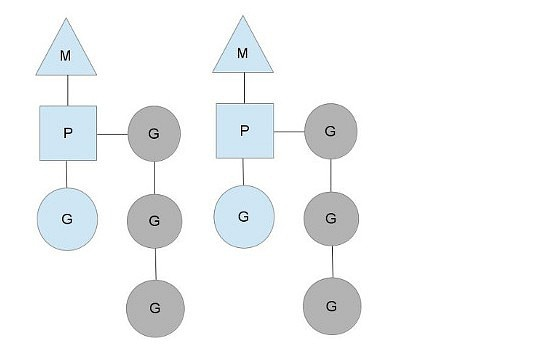

[原文：The Go scheduler](https://morsmachine.dk/go-scheduler)

[译文](https://www.douban.com/note/300631999/)

Go 1.1 的特性之一就是引入了一个新的调度器（由 Dmitry Vyukov 提交）。新调度器极大的提升了 `Go` 的并发性能。

本文大部分的内容在[这里](https://docs.google.com/document/d/1TTj4T2JO42uD5ID9e89oa0sLKhJYD0Y_kqxDv3I3XMw/edit)已经介绍过了。

# 为什么Go要自己做调度

研究新调度器之前，我们需要先了解调度器存在的必要性。既然操作系统就可以调度线程了，为什么我们还要自己创建一个用户空间下的调度器呢？

`POSIX` 线程API为现有的 `UNIX` 进程模型提供了极强的扩展，线程获得了非常多的跟进程相同的控制，有着他们自己的信号掩码，有CPU亲和性，可以被放入 `cgroups` 并获得所需的资源，线程所用到的资源也可以被查询到。

但这些控制会增大系统的开销，特别是线程数很多的情况下，开销会急剧增长。如果使用 `goroutine` 的话，很多特性根本不需要（从而节省开销）。

另外一个问题是，基于 G o模型，操作系统不能给出特别好的决策。比如，当运行一次垃圾收集的时候，Go 的垃圾收集器要求所有线程都被停止而且内存要处于一致状态。这个涉及到要等待全部运行时线程到达一个临界点，在这个临界点下，我们可以确定内存是一致的。

当很多被调度的线程分散在随机的点上的时候，结果就是你不得不等待他们中的大多数到达一致状态。Go 调度器能够作出这样的决策，就是只在内存保持一致的点上进行调度。这就意味着，当我们为垃圾收集而停止的时候，我们只须等待在一个 CPU 核上处于活跃运行状态的线程即可。

# 来看看里面的各个角色

目前有三个常见的线程模型。

- 一个是 `N：1` 的，即多个用户空间线程运行在一个OS线程上。这个模型可以很快的进行上下文切换，但是不能利用多核系统的优势。

- 另一个模型是 `1：1` 的，即可执行程序的一个线程匹配一个 OS线程。这个模型能够利用机器上的所有核心的优势，但是上下文切换非常慢，因为它必须切到内核态做切换。

- Go 试图通过 `M：N` 的调度器去获取这两种模型的全部优势。它在任意数目的 OS线程上调用任意数目的 goroutines。你可以快速进行上下文切换，并且还能利用你系统上所有的核心的优势。这个模型主要的缺点是它增加了调度器的复杂性。

为了完成调度任务，Go调度器使用了三个实体：M、P、G

- `M (Machine，机器)` 表示OS线程，它是由OS管理的可执行程序的一个线程，而且工作起来特别像你的标准POSIX线程。

- `G` 表示一个 `goroutine`。它包括栈、指令指针以及对于调用协程很重要的其它信息，比如阻塞它的任何 `channel`。

- `P （Processor，处理器）` 表示用于调用的上下文。你可以把它看作在一个单线程上运行代码的调度器的一个本地化版本。它是让我们从 `N：1` 调度器转到 `M：N` 调度器的重要部分。

我们可以从上面的图里看到两个线程 (`M`)，每个线程都拥有一个上下文 (`P`)，每个线程都正在运行一个goroutine (`G`)。为了运行 `goroutines`，一个线程必须拥有一个上下文。

上下文的数目在启动时被设置为环境变量 `GOMAXPROCS` 的值，或者通过运行时函数 `GOMAXPROCS()` 来设置。一般在程序运行期间它不会发生变化。我们可以利用这一点来调优单机上的 Go程序，比如一个4核的PC，可以在4个线程上运行Go代码。

灰色的节点表示没在运行、但是已经准备好被调度的 `goroutine`。它们被安排成一个叫做 `runqueue` 的列表。当我们通过 `go func()` 的方式新建一个 `goroutine` 时，这个 `goroutine` 就被添加到 `runqueue` 的队尾。当上下文运行 `goroutine` 一段时间后，到调度点了，它就会从 `runqueue` 中 `pop` 一个新的 `goroutine` 出来，设置栈和指令指针并且开始运行这个 `goroutine`。

为了减少 `mutex` 竞争，每一个上下文都有它自己的 `local runqueue`。Go调度器曾经的一个版本只有一个通过 `mutex` 来保护的全局 `runqueue`，线程们经常被阻塞来等待 `mutex` 被解锁。当你有许多32核的机器而且想尽可能地压榨它们的性能时，情况就会变得相当坏。

只要所有的上下文都有 `goroutines` 要运行，调度器就能在一个稳定的状态下保持调度。但是有些场景能改变这种状态。

# 你打算（系统）调用谁？

你现在可能想知道，为什么一定要有 `P` ? 我们不能直接把 `runqueue` 放到线程上、不使用 `P` 吗? 不尽然。我们用 `P` 的原因是如果正在运行的线程因为某种原因阻塞了，我们可以把这些 `P` 移交给其它线程。

需要阻塞的一个例子是，当我们执行一个系统调用 `(syscall)` 的时候。因为一个线程不能既执行代码同时又阻塞到一个系统调用上，我们需要移交这个线程的上下文使之保持调度。

从上图我们能够看出，一个线程 `(M0)` 放弃了它的 `P` 以让另外的线程可以运行它。调度器确保有足够的线程来运行所有的上下文。上图中的 `M1` 可能仅仅为了让它处理图中的系统调用 `(syscall)` 而被创建出来，或者来自一个线程池。这个处于系统调用中的线程将会保持在这个导致系统调用的 `goroutine` 上，因为从技术上来说，它仍然在执行，虽然阻塞在 OS里了。

当这个系统调用返回的时候，这个线程 `M0` 必须尝试获取一个 `P` 来运行这个返回的 `goroutine`，操作的正常模式是从其它所有线程中的其中一个线程中"偷"一个上下文。如果"偷"不成功，它就会把它的 `goroutine` 放到一个全局队列`global runqueue` 中，然后把自己放到线程池中或者转入睡眠状态。

这个全局队列是各个 `P` 在运行完自己的`local runqueue` 后用来获取新 `goroutine` 的地方。`P` 也会周期性的检查这个全局队列上的 `goroutine`，否则，全局队列上的 `goroutines` 可能得不到执行而饿死。

这种处理 `syscall` 的方式正是Go程序要在多线程上运行的原因，那怕 `GOMAXPROCS` 等于1。`runtime` 使用 `syscall` 调用 `goroutines`，而不是线程。

# 偷窃算法

系统的稳定状态改变的另外一个时机是 `P` 把所有 `goroutine` 的都执行完了。在各个 `P` 的 `runqueue` 里的工作的数目不均衡时，这种情况就会发生。这可能会导致一个 `P` 在执行完它的本地队列后就会结束，尽管系统中仍然有许多工作要执行。所以为了保持程序的正常运行，一个 `P` 可以从全局队列中获取`goroutines`，但是如果全局队列中也没有 `goroutines`了，那么 `P` 就不得不从其它 `P` 那里获取`goroutines`了。

当一个 `P` 完成自己的任务后，它就会尝试"偷窃"另一个 `P 的 runqueue` 中工作量的一半。这将确保每个 `P` 总是有活干，然后反过来确保所有线程尽可能处于最大负荷。

