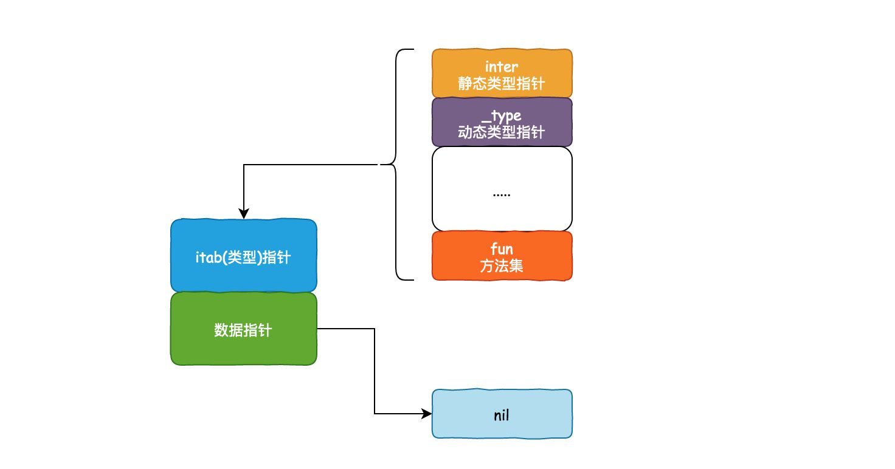

# Go语言中的静态类型与动态类型


## 1. 静态类型

所谓的静态类型（即 static type），就是变量声明的时候的类型。

它是你在编码时，肉眼可见的类型。


## 2. 动态类型

所谓的 动态类型（即 concrete type，也叫具体类型）是 程序运行时系统才能看见的类型。

比如下面这几行代码

```go
var i interface{}  // i 的静态类型就是 interface{} 
i = 18             // 静态类型还是 interface{}，但动态类型变成了 int
i = "Go编程时光"    // 动态类型变成了 string
```


## 3. 接口组成

每个接口变量，实际上都是由一对（类型 和 值）组合而成。其设计类似如下结构：
```go
type interface struct {
    type     // 类型描述符
    value    // 值，一般为一个指针，指向的结构较小的话，也可能直接存值
}
```


## 4. 接口细分

根据接口是否包含方法，可以将接口分为 `iface` 和 `eface`。


### iface

`iface` 表示带有一组方法的接口。具体结构可用如下一张图来表示：



`iface` 的源码如下：

```go
// runtime/runtime2.go
// 非空接口
type iface struct {
    tab  *itab
    data unsafe.Pointer
}

// 非空接口的类型信息
type itab struct {
    inter  *interfacetype  // 接口定义的类型信息
    _type  *_type          // 接口实际指向值的类型信息
    link   *itab  
    bad    int32
    inhash int32
    fun    [1]uintptr      // 接口方法实现列表，即函数地址列表，按字典序排序。虽然声明大小为1，但使用时会用 offset 取值，实际可以存多个
}

// runtime/type.go
// 非空接口类型，接口定义，包路径等。
type interfacetype struct {
   typ     _type
   pkgpath name           // 包路径
   mhdr    []imethod      // 接口方法声明列表，按字典序排序
}

// 接口的方法声明 
type imethod struct {
   name nameOff           // 方法名
   ityp typeOff           // 描述方法参数返回值等细节
}

type nameOff int32
type typeOff int32
```


#### interface 参数传递与函数调用

```go
type Binary uint64

func (i Binary) String() string {
    return strconv.FormatUint(uint64(i), 10)
}

type Stringer interface {
    String() string
}

func main() {
    b := Binary(0x123)
    b.String()
}
```

在上面的代码中，参数传递过程是：

1. 分配一块内存 `p`， 并且将对象 `b` 的内容拷贝到 `p` 中
2. 创建 `iface` 对象 `i`，将 `i.tab` 赋值为 `itab<Stringer, Binary>`，将 `i.data` 赋值为 `p`
3. 使用 `i` 作为参数调用 `String()` 函数
4. 执行 `i.String()` 时，实际上是在 `s.tab` 的 `fun` 中索引（索引由编译器在编译时生成）到 `String` 函数，并且调用它


#### 如何判断类型是否实现了某接口

判断某类型是否实现了某接口是编译器自动实现的，即在将类型显式或隐式的转换成某接口的过程中，编译器会自动对比其方法集，以确定该类型是否实现了接口的所有方法。

GO语言在实际执行的过程中，接口的方法集和类型的方法集都是排了序的。假设接口方法集的长度是m，类型方法集的长度是n，那么判断该类型方法集是否包含 接口的方法的时间复杂度是 `O(m+n)`。


### eface

第二种：`eface`，表示不带有方法的接口。源码如下：

```go
// src/runtime/runtime2.go
// 空接口
type eface struct {
    _type *_type
    data  unsafe.Pointer
}
```


## reflect

`reflect` 包基本是依赖 `interface` 来实现的。里面定义了一个接口和一个结构体，即 `reflect.Type` 和 `reflect.Value`，提供很多函数来获取存储在接口里的类型信息。

`reflect.Type` 主要提供关于类型相关的信息，所以它和 `_type` 关联比较紧密；`reflect.Value` 则结合 `_type` 和 `data` 两者，因此程序员可以获取甚至改变类型的值。

`reflect` 包中提供了两个基础的关于反射的函数来获取上述的接口和结构体：

```text
func TypeOf(i interface{}) Type 
func ValueOf(i interface{}) Value
```

调用这两个函数时，实参会先被转化为 `interface{}` 类型。这样，实参的类型信息、方法集、值信息都存储到 `interface{}` 变量里了。


#### 参考

[王炳明 - Go语言中的静态类型与动态类型](https://zhuanlan.zhihu.com/p/258617170)

[老虎来了 - 浅析 golang interface 实现原理](https://zhuanlan.zhihu.com/p/60983066)

[Stefno - 深度解密Go语言之反射](https://zhuanlan.zhihu.com/p/64884660)

