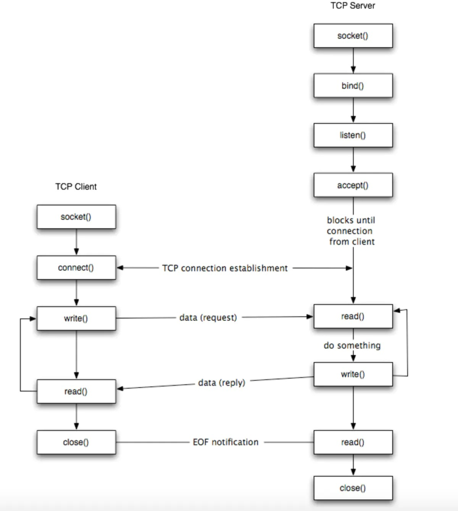

Go语言值得称道的一点就是用很简单的几行代码就可以写出支持高并发的服务器程序。那么 Go语言里的 TCP 连接是怎样建立的呢？

这里分客户端和服务端两部分看





# 客户端

客户端一般通过如下代码发送请求：

```go
func main() {
    conn, err := net.Dial("tcp", "127.0.0.1:3000")
    conn.Write([]byte(data)) // 向服务端发送数据
    n,err := conn.Read(buf)  //读取服务端端数据
}
```

`net.Dial()` 底层实际调用的是系统函数 `socket()` 和 `connet()` 创建 socket连接，`write()` 和 `read()` 读写数据。

socket (套接字) 是 Unix系统下抽象出来的一层概念，与 Unix系统 file descriptor (文件描述符) 相整合，使得网络读写数据和本地文件一样容易。一般记录五元组（协议 + 双方地址 + 双方端口）


这里不详细解析，主要看服务端下的实现


# 服务端

服务端一般通过如下代码接收客户端请求：

```go
func main()  {
    listen, err := net.Listen("tcp",":8080") // 创建监听 socket
    for {
        conn, errs := listen.Accept()       // 接收客户端连接
        go handle(conn) 					          // 一个 goroutine 处理一个连接
    }
}
```


## net.Listen() 的实现

`net.Listen()` 经过层层调用，最底层实际调用的是如下系统函数：

1. `socket()` 创建 socket fd
2. `bind()` 绑定 socket 与监听地址
3. `listen()` 监听 socket
   1. `epollcreate()` 创建 epoll 对象
   2. `epollctl()` 将监听 socket fd 加入到 epoll 红黑树里进行监听


```go
// net/dial.go
func Listen(network, address string) (Listener, error) {
    var lc ListenConfig
    return lc.Listen(context.Background(), network, address)
}

// lc.Listen()
func (lc *ListenConfig) Listen(ctx context.Context, network, address string) (Listener, error) {
    sl := &sysListener{}
    case *TCPAddr:
        l, err = sl.listenTCP(ctx, la)
    case *UnixAddr:
        l, err = sl.listenUnix(ctx, la)
    }
}
```


```go
// net/tcpsock_posix
// sysListener.listenTCP()
func (sl *sysListener) listenTCP(ctx context.Context, laddr *TCPAddr) (*TCPListener, error) {
    fd, err := internetSocket(ctx, sl.network, laddr, nil, syscall.SOCK_STREAM, 0, "listen", sl.ListenConfig.Control)
}
```


```go
// net/ipsock_posix.go
func internetSocket(ctx context.Context, net string, laddr, raddr sockaddr, sotype, proto int, mode string, ctrlFn func(string, string, syscall.RawConn) error) (fd *netFD, err error) {
    return socket(ctx, net, family, sotype, proto, ipv6only, laddr, raddr, ctrlFn)
}
```


重点看这个 `net/sock_posix.go/socket()` 函数

```go
// net/sock_posix.go
// socket()
// laddr: local address, radd: remote address
func socket(ctx context.Context, net string, family, sotype, proto int, ipv6only bool, laddr, raddr sockaddr, ctrlFn func(string, string, syscall.RawConn) error) (fd *netFD, err error) {
    s, err := sysSocket(family, sotype, proto) // 调用 syscall.Socket() 创建系统 socket 对象
    fd, err = newFD(s, family, sotype, net)    // new 一个 fd 结构体
    if laddr != nil && raddr == nil {          // 远端地址为空，表示监听。服务端进入这个 if 分支
        switch sotype {
            case syscall.SOCK_STREAM, syscall.SOCK_SEQPACKET:
                fd.listenStream(laddr, listenerBacklog(), ctrlFn) // 绑定端口并监听
        }
    }
}

// listenStream()
func (fd *netFD) listenStream(laddr sockaddr, backlog int, ctrlFn func(string, string, syscall.RawConn) error) error {
    syscall.Bind(fd.pfd.Sysfd, lsa)    // syscall.Bind() 将监听地址绑定到 socket 上
    listenFunc(fd.pfd.Sysfd, backlog)  // syscall.Listen() 监听，backlog 参数控制连接队列长度，取自系统参数 /proc/sys/net/core/somaxconn
    fd.init()                          // epoll 对象初始化和跟踪
}
```

`fd.init()` 里主要是对 epoll 对象的创建和跟踪，实现如下：

```go
// net/fd_unix.go
// fd.init()
func (fd *netFD) init() error {
    return fd.pfd.Init(fd.net, true)
}

func (fd *FD) Init(net string, pollable bool) error {
    err := fd.pd.init(fd)
}
```

```go
// poll/fd_poll_runtime.go
func (pd *pollDesc) init(fd *FD) error {
    serverInit.Do(runtime_pollServerInit) 
    ctx, errno := runtime_pollOpen(uintptr(fd.Sysfd))
}
```

`runtime_pollServerInit()` 函数通过 `go:linkname` 注释由 `runtime/netpoll.go/poll_runtime_pollServerInit()` 实现，底层调用 `epoll_create1()` 函数，创建 epoll 对象，并通过 `atomic` 包保证只创建一次

```go
// runtime/netpoll.go
//go:linkname poll_runtime_pollServerInit internal/poll.runtime_pollServerInit
func poll_runtime_pollServerInit() {
    netpollGenericInit()
}

func netpollGenericInit() {
    if atomic.Load(&netpollInited) == 0 { // 用一个标记变量保证只创建一次
        netpollinit() // 根据操作系统有不同的实现，linux 下是 epoll，MacOS 下是 kqueue
    }
}
```

`netpollinit()` 函数在 linux 系统下的实现文件为 `runtime/netpoll_epoll.go`

```go
// runtime/netpoll_epoll.go
func netpollinit() {
    epfd = epollcreate1(_EPOLL_CLOEXEC) // 创建 epoll 对象；使用汇编实现，实际调用 linux epoll_create1() 函数
}
```

`runtime_pollOpen()` 函数由 `runtime/netpoll.go/net_runtime_pollOpen()` 实现，底层调用 `epoll_ctl()` 函数，将 socket fd 放入 epoll 对象中监听，以便在和客户端的连接建立时得到通知
```go
// runtime/netpoll.go
// go:linkname poll_runtime_pollOpen internal/poll.runtime_pollOpen
func poll_runtime_pollOpen(fd uintptr) (*pollDesc, int) {
    errno := netpollopen(fd, pd)
}
```

```go
// runtime/netpoll_epoll.go
func netpollopen(fd uintptr, pd *pollDesc) int32 {
    return -epollctl(epfd, _EPOLL_CTL_ADD, int32(fd), &ev) // 实际调用 linux epoll_ctl()
}
```


## listen.Accept() 的实现

`listen.Accept()` 的逻辑主要是：

1. 调用系统函数 `accept()` 等待并接收连接
2. 连接到来后，调用 `epollcreate()` 和 `epollctl()` （和上面一样）管理 socket

```go
// net/tcpsock.go
func (l *TCPListener) Accept() (Conn, error) {
    c, err := l.accept() // accept() 函数会阻塞式的等待下一个连接
}

func (ln *TCPListener) accept() (*TCPConn, error) {
    fd, err := ln.fd.accept()
}
```

```go
// net/fd_unix.go
func (fd *netFD) accept() (netfd *netFD, err error) {
    d, rsa, errcall, err := fd.pfd.Accept() // 等待连接

    netfd, err = newFD(d, fd.family, fd.sotype, fd.net) // 为连接新建 fd
    netfd.init() // 这个和前面的 init() 一样，创建和维护 epoll 对象
}
```

```go
// poll/fx_unix.go
func (fd *FD) Accept() (int, syscall.Sockaddr, string, error) {
    for {
        s, rsa, errcall, err := accept(fd.Sysfd) // 系统调用 accept()
        switch err {
        case syscall.EAGAIN:
            if fd.pd.pollable() {
                if err = fd.pd.waitRead(fd.isFile); err == nil { // 没有获取到连接，则阻塞协程，底层调用 gopark()，只阻塞当前 G，不影响 M
                    continue
                }
            }
        }
    }
}
```


## netpoll 的调度

前面可以看到，在 `Listen()` 和 `Accept()` 里创建并维护了 epoll 对象，那么什么时候会调用 `epoll_wait()` 获取就绪的 socket 呢?

Go 里通过 `runtime.netpoll()` 来获取就绪的 socket，这个函数调用的地方主要有两处，在 Go 的调度函数里：

1. 触发调度的函数 `runtime.shcedule()` 里，在 `runtime.findrunable()` 中调用了 `runtime.netpoll()` 获取待执行的协程
2. `sysmon` 监控协程 每次运行会检查距离上一次执行 `netpoll()` 函数是否超过10ms，如果是则会调用一次 `runtime.netpoll()`

```go
// runtime/proc.go
func findrunnable() (gp *g, inheritTime bool) {
    if netpollinited() && atomic.Load(&netpollWaiters) > 0 && atomic.Load64(&sched.lastpoll) != 0 {
        list := netpoll(0)
    }
}

func sysmon() {
	for {
        if netpollinited() && lastpoll != 0 && lastpoll+10*1000*1000 < now {
            list := netpoll(0) 
        }
    }
}
```


### netpoll() 解析

```go
// runtime/netpoll_epoll.go
func netpoll(delay int64) gList {
    // 这里进行了系统调用 epoll_wait()，将就绪的 fd 写入 events 数组，返回 fd 数量
    n := epollwait(epfd, &events[0], int32(len(events)), waitms)

    var toRun gList
    for i := int32(0); i < n; i++ { // 遍历就绪的 fd，放入 toRun 数组并返回给上层函数调度
        ev := &events[i]
		    pd := *(**pollDesc)(unsafe.Pointer(&ev.data))
		
        netpollready(&toRun, pd, mode)
    }
}
```

```go
// runtime/netpoll.go
func netpollready(toRun *gList, pd *pollDesc, mode int32) {
    toRun.push(wg)
}
```


## 总结

netpoll 实际上是 epoll + Go调度器 二者的结合。有如下优缺点：
### 优点
1. 每个 goroutine 监听一个 TCP连接，轻量且支持海量
   1. 当连接上没有数据到达时，goroutine 会被 `gopark()` 函数阻塞。该阻塞不会陷入内核态，也不阻塞 M，M 可以寻找别的 G 执行，开销极小
   2. 有数据到达时，再通过运行时调度处理连接
2. 底层调用 epoll IO多路复用机制，较为高效
### 不足
1. 海量连接场景下，goroutine 及内存使用会暴涨，且当前的垃圾回收机制下不会随连接销毁释放
2. 所有连接维护在一个 epoll 对象里，高频创建和释放连接情况下可能导致性能瓶颈
