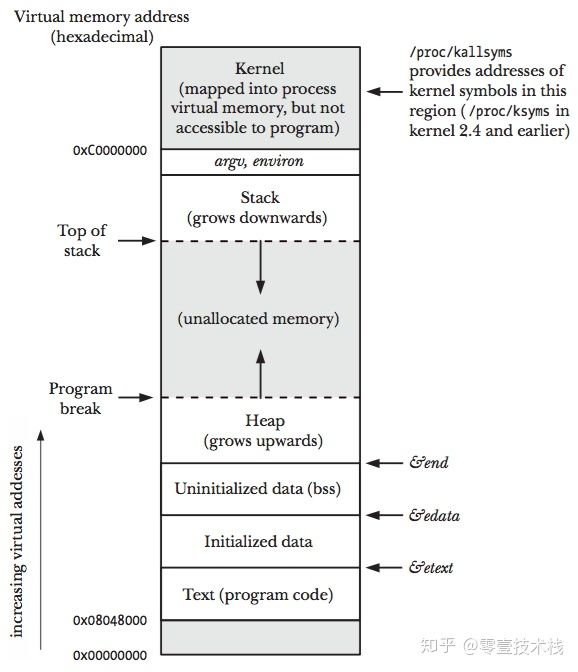
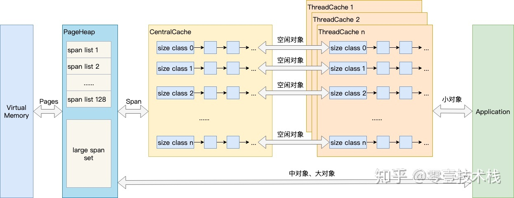
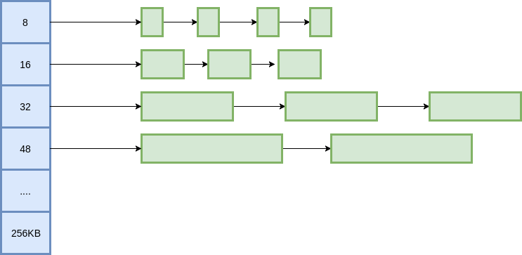
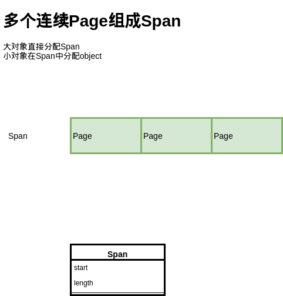
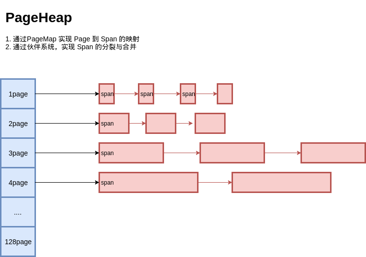
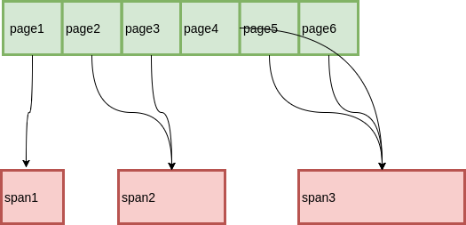
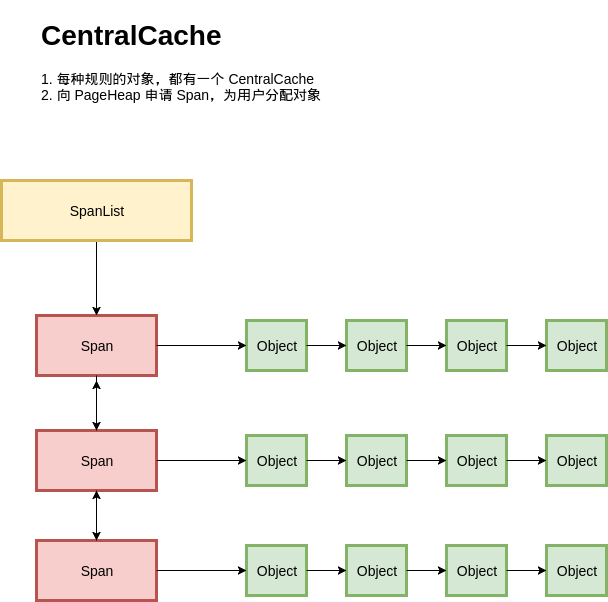
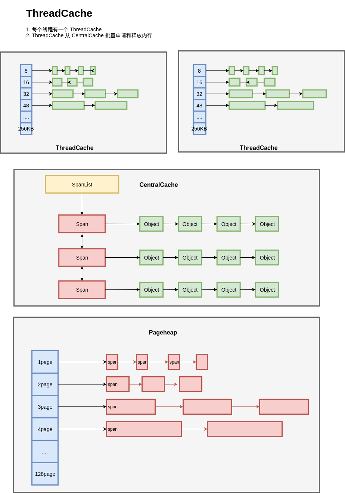

# 栈和堆

上图展示了一个进程的虚拟内存划分，代码中使用的内存地址都是虚拟内存地址，而不是实际的物理内存地址。栈和堆只是虚拟内存上2块不同功能的内存区域：

- 栈在高地址，从高地址向低地址增长
- 堆在低地址，从低地址向高地址增长

栈和堆相比有这么几个好处：

- 栈的内存管理简单，分配比堆上快。
- 栈的内存不需要回收，而堆需要进行回收，无论是主动free，还是被动的垃圾回收，这都需要花费额外的CPU。
- 栈上的内存有更好的局部性，堆上内存访问就不那么友好了，CPU访问的2块数据可能在不同的页上，访问数据可能就比较耗时。

# 堆内存管理

我们说内存管理的时候，主要是指堆内存的管理，因为栈的内存管理不需要程序去操心。堆内存管理主要是3部分，分别是 **分配内存块**，**回收内存块** 和 **组织内存块**。

#### 分配内存块

在一个最简单的内存管理中，堆内存最初会是一个完整的大块，即未分配任何内存。当发现内存申请的时候，堆内存就会从未分配内存分割出一个小内存块 (block)，然后用链表把所有内存块连接起来。需要一些信息描述每个内存块的基本信息，比如大小 (size)、是否使用中(used) 和下一个内存块的地址 (next)，内存块实际数据存储在data中。

#### 回收内存块

释放内存实质是把使用的内存块从链表中取出来，然后标记为未使用，当分配内存块的时候，可以从未使用内存块中优先查找大小相近的内存块，如果找不到，再从未分配的内存中分配内存。

#### 组织内存块

随着内存不断的申请和释放，内存上会存在大量的碎片，降低内存的使用率。为了解决内存碎片，可以将2个连续的未使用的内存块合并，减少碎片。

# TCmalloc

TCMalloc (Thread Cache Malloc)，是 Google 开发的内存分配器，Go 的内存管理正是借鉴了 TCMalloc。随着Go的迭代，Go的内存管理与TCMalloc不一致地方在不断扩大，但其主要思想、原理和概念都是和TCMalloc一致的。

在Linux操作系统中，其实有不少的内存管理库，比如glibc的ptmalloc，FreeBSD的jemalloc，Google的tcmalloc等等，为何会出现这么多的内存管理库？本质都是在多线程编程下，追求更高内存管理效率：更快的分配是主要目的。

同一进程下的所有线程共享相同的内存空间，它们申请内存时需要加锁，如果不加锁就存在同一块内存被2个线程同时访问的问题。

TCMalloc的做法是什么呢？为每个线程预分配一块缓存，线程申请小内存时，可以从缓存分配内存，这样有2个好处：

1. 为线程预分配缓存需要进行1次系统调用，后续线程申请小内存时直接从缓存分配，都是在用户态执行的，没有了系统调用，缩短了内存总体的分配和释放时间。
2. 多个线程同时申请小内存时，从各自的缓存分配，访问的是不同的地址空间，从而无需加锁，把内存并发访问的粒度进一步降低了。

## 基本原理

结合上图，从右往左看，介绍TCMalloc的几个重要概念：

- **Page**

操作系统对内存管理以页为单位，TCMalloc也是这样，只不过TCMalloc里的Page大小与操作系统里的大小并不一定相等，而是倍数关系。《TCMalloc解密》里称x64下Page大小是8KB。

- **Span**

多个Page组成一个Span，比如可以有2个页大小的Span，也可以有16页大小的Span，Span比Page高一个层级，是为了方便管理一定大小的内存区域，Span是TCMalloc中内存管理的基本单位。

- **ThreadCache**

ThreadCache是每个线程各自的Cache，一个Cache包含多个空闲内存块链表，每个链表连接的都是内存块，同一个链表上内存块的大小是相同的，也可以说按内存块大小，给内存块分了个类，这样可以根据申请的内存大小，快速从合适的链表选择空闲内存块。每个线程有自己的ThreadCache，所以ThreadCache访问是无锁的。

- **CentralCache**

CentralCache是所有线程共享的缓存，也是保存的空闲内存块链表，链表的数量与ThreadCache中链表数量相同，当ThreadCache的内存块不足时，可以从CentralCache获取内存块；当ThreadCache内存块过多时，可以放回CentralCache。由于CentralCache是共享的，所以它的访问是要加锁的。

- **PageHeap**

PageHeap是对堆内存的抽象，PageHeap存的也是若干链表，链表保存的是Span。当CentralCache的内存不足时，会从PageHeap获取空闲的内存Span，然后把1个Span拆成若干内存块，添加到对应大小的链表中并分配内存；当CentralCache的内存过多时，会把空闲的内存块放回PageHeap中。

下面将详细介绍这几个概念：

## Page

一个Page 4KB，如果对象小于4KB，分配在这个Page里即可。

### 固定size对象

首先是基本问题，假设所有对象大小固定，如何分配空间？例如，我们有一个 Page 的内存，大小为 4KB，现在已知每个对象大小为 `N字节`, 要以 `N 字节` 为单位进行分配。为了简化问题，假设 `N=16`, 就以 `16 字节` 为单位进行分配。

解法有很多，比如，bitmap。4KB / 16 / 8 = 32, 用 32 字节做 bitmap即可，实现也相当简单。

出于最大化内存利用率的目的，我们使用另一种经典的方式，freelist。将 4KB 的内存划分为 16 字节的单元，每个单元的前8个字节作为节点指针，指向下一个单元。初始化的时候把所有指针指向下一个单元；分配时，从链表头分配一个对象出去；释放时，插入到链表。

由于链表指针直接分配在待分配内存中，因此不需要额外的内存开销，而且分配速度也是相当快。

### 变长size对象

我们把所有的变长记录进行取整，例如分配7字节，就分配8字节，31字节分配32字节，得到多种规格的定长记录。

就像快递盒一样，我们只提供有限几种尺寸的盒子，物品的尺寸有无限多种，但我们只选一个合适的尺寸来包装。

这里带来了内部内存碎片的问题，即分配出去的空间不会被完全利用，有一定浪费。为了减少内部碎片，分配规则按照 8, 16, 32, **48**, 64, 80这样子来。注意到，这里并不是简单地使用2的幂级数，因为按照2的幂级数，内存碎片会相当严重，分配65字节，实际会分配128字节，接近50%的内存碎片。而按照这里的分配规格，只会分配80字节，一定程度上减轻了问题。

## Span

上面讲的是基于 Page，分配小于Page的对象，但是如果分配的对象大于一个 Page，我们就需要用多个 Page 来分配了。

这里提出了 Span 的概念，也就是多个连续的 Page 会组成一个 Span，在 Span 中记录起始 Page 的编号，以及 Page 数量。

分配对象时，大的对象直接分配 Span，小的对象从 Span 中分配。

## PageHeap

对于 Span的管理，我们炮制Page里变长对象的管理方式，便实现了PageHeap。

还是用多种定长 Page 来实现变长 Page 的分配，初始时只有 128 Page 的 Span，如果要分配 1 个 Page 的 Span，就把这个 Span 分裂成两个，1 + 127，把127再记录下来。对于 Span 的回收，需要考虑Span的合并问题，否则在分配回收多次之后，就只剩下很小的 Span 了，也就是带来了**外部碎片** 问题。

为此，释放 Span 时，需要将前后的空闲 Span 进行合并，当然，前提是它们的 Page 要连续。

## 全局对象分配

既然有了基于 Page 的对象分配，和Page本身的管理，我们把它们串起来就可以得到一个简单的内存分配器了：

按照我们之前设计的，每种规格的对象，都从不同的 Span 进行分配；每种规则的对象都有一个独立的内存分配单元：**CentralCache**。在一个CentralCache 内存，我们用链表把所有 Span 组织起来，每次需要分配时就找一个 Span 从中分配一个 Object；当没有空闲的 Span 时，就从 PageHeap 申请 Span。

看起来基本满足功能，但是这里有一个严重的问题，在多线程的场景下，**所有线程都从 CentralCache 分配的话，竞争可能相当激烈**。

## ThreadCache

因此给每个线程分配了一个线程局部的 ThreadCache，来避免多线程下 CentralCache 的竞争问题。按照不同的规格，ThreadCache 维护了对象的链表；如果ThreadCache 的对象不够了，就从 CentralCache 进行批量分配；如果 CentralCache 依然没有，就从PageHeap申请Span；如果 PageHeap没有合适的 Page，就只能从操作系统申请了。

在释放内存的时候，ThreadCache依然遵循批量释放的策略，对象积累到一定程度就释放给 CentralCache；CentralCache发现一个 Span的内存完全释放了，就可以把这个 Span 归还给 PageHeap；PageHeap发现一批连续的Page都释放了，就可以归还给操作系统。

至此，TCMalloc 的大体结构便呈现在我们眼前了。

## 参考

[hellocode - 图解TCMalloc](https://zhuanlan.zhihu.com/p/29216091)
