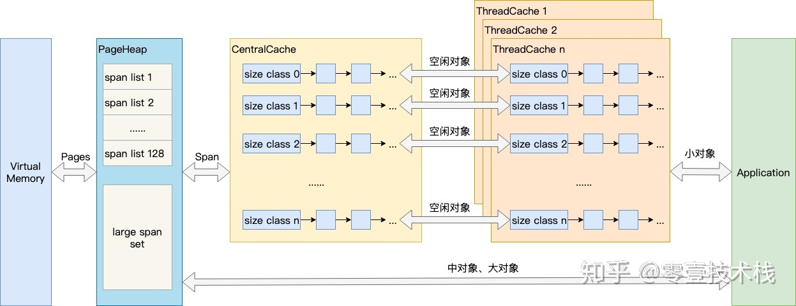

# Go内存管理

Go 的 `runtime` 抛弃了传统的内存分配方式，改为自主管理，这样可以完成内存池、预分配等操作，不会每次内存分配都需要进行系统调用。另外也可以更好的配合垃圾回收。


# 基本策略

1. 每次从操作系统直接申请一大块内存，而不是用一次调用一次，减少系统调用。
2. 将申请到的大块内存按特定大小预先切分成小块，构成链表。
3. 为对象分配内存时，只需从大小合适的链表中提取一个小块即可。
4. 回收对象内存时，放回原链表，以便复用。
5. 如闲置内存过多，归还部分给操作系统，降低整体开销。


# 堆内存管理

我们说内存管理的时候，主要是指堆内存的管理，因为栈的内存管理不需要程序去操心。堆内存管理主要是3部分，分别是 **分配内存块**，**回收内存块** 和 **组织内存块**。

在一个最简单的内存管理中，堆内存最初会是一个完整的大块，即未分配任何内存。当发现内存申请的时候，堆内存就会从未分配内存分割出一个小内存块 (block)，然后用链表把所有内存块连接起来。需要一些信息描述每个内存块的基本信息，比如大小 (size)、是否使用中(used) 和下一个内存块的地址 (next)，内存块实际数据存储在data中。

释放内存实质是把使用的内存块从链表中取出来，然后标记为未使用，当分配内存块的时候，可以从未使用内存块中优先查找大小相近的内存块，如果找不到，再从未分配的内存中分配内存。

随着内存不断的申请和释放，内存上会存在大量的碎片，降低内存的使用率。为了解决内存碎片，可以将2个连续的未使用的内存块合并，减少碎片。


# TCmalloc

TCMalloc 是 Thread Cache Malloc的简称，是Go内存管理的起源，Go的内存管理是借鉴了TCMalloc，随着Go的迭代，Go的内存管理与TCMalloc不一致地方在不断扩大，但其主要思想、原理和概念都是和TCMalloc一致的。

在Linux操作系统中，其实有不少的内存管理库，比如glibc的ptmalloc，FreeBSD的jemalloc，Google的tcmalloc等等，为何会出现这么多的内存管理库？本质都是在多线程编程下，追求更高内存管理效率：更快的分配是主要目的。

同一进程下的所有线程共享相同的内存空间，它们申请内存时需要加锁，如果不加锁就存在同一块内存被2个线程同时访问的问题。

TCMalloc的做法是什么呢？为每个线程预分配一块缓存，线程申请小内存时，可以从缓存分配内存，这样有2个好处：

1. 为线程预分配缓存需要进行1次系统调用，后续线程申请小内存时直接从缓存分配，都是在用户态执行的，没有了系统调用，缩短了内存总体的分配和释放时间。
2. 多个线程同时申请小内存时，从各自的缓存分配，访问的是不同的地址空间，从而无需加锁，把内存并发访问的粒度进一步降低了。


## 基本原理




结合上图，介绍TCMalloc的几个重要概念：

 


## 内存块

分配器将其管理的内存块分为两种。

- span：由多个连续页组成的大块内存（类似快递车）
- object：将 span 按不同的规格切分成多个小块，每个小块可储存一个对象（类似快递盒）

```go
// malloc.go
_PageShit = 13
_PagegSize = 1 << _PageShft // 一页8KB

// mheap.go
type mspan struct {
    next     *mspan     // 双向链表
    prev     *mspan
    start    pageID     // 起始页地址 (=address >> _PageShift)
    npages   uintptr    // 页数
    freelist gclinkptr  // 待分配的 object 链表
}
```

用于储存对象的 object，按 8 字节倍数分为 n 种。比如大小为 24 字节的可用来存储范围在17 ~ 24 字节的对象。这种方式虽然会造成一些浪费，但分配器只需要处理有限几种规格的小块内存，优化了分配和复用管理策略。

若对象大小超过特定阈值 (32KB)，会被当做大对象处理。


## 参考

[零壹技术栈 - 详解Go语言的内存模型及堆的分配管理](https://zhuanlan.zhihu.com/p/76802887)
