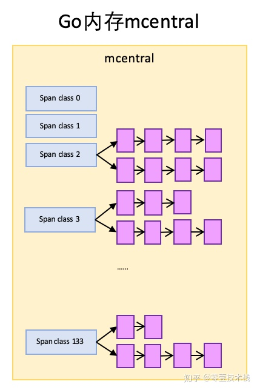

# Go内存管理

Go 的 `runtime` 抛弃了传统的内存分配方式，改为自主管理，这样可以完成内存池、预分配等操作，不会每次内存分配都需要进行系统调用。另外也可以更好的配合垃圾回收。


# 基本策略

1. 每次从操作系统直接申请一大块内存，而不是用一次调用一次，减少系统调用。
2. 将申请到的大块内存按特定大小预先切分成小块，构成链表。
3. 为对象分配内存时，只需从大小合适的链表中提取一个小块即可。
4. 分多级缓存管理，最低级的在多多线程时无需加锁，提高性能。
5. 回收对象内存时，放回原链表，以便复用。
6. 如闲置内存过多，归还部分给操作系统，降低整体开销。


## 基本概念

Go 内存管理的许多概念在 TCMalloc 中已经有了，含义是相同的，只是名字有一些变化。先上一幅宏观的图：


- **Page**

与 TCMalloc中 的 Page 相同，x64 架构下1个 Page 的大小是 `8KB`。上图的最下方，1个浅蓝色的长方形代表1个Page。

- **Span**

Span 与 TCMalloc 中的 Span 相同，Span是 **内存管理的基本单位**，代码中为 `mspan`，一组连续的 Page 组成 1个 Span，所以上图一组连续的浅蓝色长方形代表的是一组 Page 组成的 1 个 Span (对应图中1个淡紫色长方形)。

- **mcache**

`mcache` 与TCMalloc 中的 ThreadCache 类似，保存的是各种大小的 Span，并按 Span class 分类，小对象直接从 `mcache` 分配内存，它起到了缓存的作用，并且可以无锁访问。但是 `mcache` 与 ThreadCache 也有不同点，TCMalloc 中是每个线程 1个ThreadCache，Go 中是每个 `P` 拥有1个 `mcache`。因为在 Go 程序中，当前最多有 `GOMAXPROCS个` 线程在运行，所以最多需要 `GOMAXPROCS` 个 `mcache` 就可以保证各线程对 `mcache` 的无锁访问，线程的运行又是与 P 绑定的，把 `mcache` 交给 P 刚刚好。

- **mcentral**

`mcentral` 与 TCMalloc 中的 CentralCache类似，是所有线程共享的缓存，需要加锁访问。它按 Span 级别对 Span 分类，然后串联成链表，当 `mcache` 的某个级别 Span 的内存被分配光时，它会向 `mcentral` 申请1个当前级别的 Span。

但是 `mcentral` 与 CentralCache 也有不同点，CentralCache 是每个级别的Span有1个链表，`mcache` 是每个级别的Span有2个链表，这和`mcache` 申请内存有关，稍后我们再解释。

- **mheap**

`mheap` 与TCMalloc中的PageHeap类似，它是堆内存的抽象，把从OS申请出的内存页组织成Span，并保存起来。当 `mcentral` 的Span不够用时会向 `mheap` 申请内存，而 `mheap` 的Span不够用时会向OS申请内存。`mheap` 向OS的内存申请是按页来的，然后把申请来的内存页生成Span组织起来，同样也是需要加锁访问的。

但是 `mheap` 与PageHeap也有不同点：`mheap` 把Span组织成了树结构，而不是链表，并且还是2棵树，然后把Span分配到 `heapArena`进行管理，它包含地址映射和span是否包含指针等位图，这样做的主要原因是为了更高效的利用内存：分配、回收和再利用。


### Go内存分配

Go中的内存分类并不像TCMalloc那样分成小、中、大对象，而是只分大、小对象，但小对象里又细分了一个Tiny对象，Tiny对象指大小在1Byte到16Byte之间并且不包含指针的对象。小对象和大对象只用大小划定，无其他区分。


小对象是在 `mcache` 中分配的，而大对象是直接从 `mheap` 分配的，从小对象的内存分配看起。


### 小对象的内存分配

和 TCMalloc 一样，Go 里面预定义了 67 种对象的尺寸 (size class)，会先做一次大小转换，转换成标准的尺寸。

1个 size class 对应 2 个span class (后面介绍)，因此共 67 * 2 = 134 个 span class

1. 计算对象所需内存大小 size
2. 根据 size 到 size class 映射，计算出所需的 size class
3. 根据 size class 和对象是否包含指针计算出 span class
4. 获取该 span class 指向的 span


**从span分配对象空间**

Span可以按对象大小切成很多份，这些都可以从映射表上计算出来，以 `size class 3` 对应的 span 为例，span大小是 `8KB`，每个对象实际所占空间为 `32B`，这个span就被分成了 `8KB / 32B = 256` 块，可以根据span的起始地址计算出每个对象块的内存地址。


随着内存的分配，span 中的对象内存块，有些被占用，有些未被占用，比如上图，整体代表1个span，蓝色块代表已被占用内存，绿色块代表未被占用内存。当分配内存时，只要快速找到第一个可用的绿色块，并计算出内存地址即可，如果需要还可以对内存块数据清零。

当span内的所有内存块都被占用时，没有剩余空间继续分配对象，mcache会向mcentral申请1个span，mcache拿到span后继续分配对象。


**mcache向mcentral申请span**

`mcentral` 和 `mcache` 一样，都是 0~133 这 134 个 span class级别，但每个级别都保存了2个span list：

1. `nonempty`：这个链表里的span，所有span都至少有1个空闲的对象空间。这些span是 `mcache` 释放span时加入到该链表的。
2. `empty`：这个链表里的span，所有的span都不确定里面是否有空闲的对象空间。当一个span从 `mcache` 还给 `mcache` 的时候，就会加入到 `empty` 链表。

这两个东西名称有点绕，可以直接把 `empty` 理解为没有对象空间。

`mcache` 向 `mcentral` 申请span时，`mcentral` 会先从 `nonempty` 搜索满足条件的span，如果没有找到再从 `emtpy` 搜索。



 

**mheap的span管理**

`mheap` 里保存了两棵二叉排序树，按 span 的 page 数量进行排序：

1. `free`：保存空闲并且非垃圾回收的span。
2. `scav`：(scavenge, 垃圾回收) 保存空闲并且已经垃圾回收的span。

如果是垃圾回收导致的 span 释放，span 会被加入到 scav，否则加入到 free，比如刚从OS申请的的内存组成的 span。

mheap 中还有 `arenas`，由一组 `heapArena` 组成，每一个 `heapArena` 都包含了连续的 `pagesPerArena` 个span，这个主要是为 `mheap` 管理span和垃圾回收服务。 


**mcentral向mheap申请span**

当 `mcentral` 向 `mcache` 提供span时，如果 `empty` 里也没有符合条件的span，`mcentral` 会向 `mheap` 申请span。

此时，`mcentral` 需要向 `mheap` 提供需要的内存页数和 span class 级别，然后它优先从 `free` 中搜索可用的 span。如果没有找到，会从`scav` 中搜索。如果还没有找到，它会向OS申请内存，再重新搜索2棵树，必然能找到span。如果找到的span比需要的span大，则把span进行分割成2个span，其中1个刚好是需求大小，把剩下的span再加入到free中去，然后设置需要的span的基本信息，再交给`mcentral`。


**mheap向OS申请内存**

当 `mheap` 没有足够的内存时，会向OS申请内存，把申请的内存页保存为span，然后把span插入到 `free` 树。

> 在32位系统中，`mheap` 还会预留一部分空间，当 `mheap` 没有空间时，先从预留空间申请，如果预留空间也没有了，才向OS申请。


### 大对象的内存分配

大对象的分配比小对象省事多了，99%的流程与 `mcentral` 向 `mheap` 申请内存的相同，所以不重复介绍了。不同的一点在于 `mheap` 会记录一点大对象的统计信息，详情见 `mheap.alloc_m()`。


## Go的栈内存

最后提一下栈内存。从一个宏观的角度看，内存管理不应当只有堆，也应当有栈。

Go 里的栈是各个 `goroutine` 自己管理的。每个 `goroutine` 都有自己的栈，栈的初始大小是 `2KB`，不够用时自动扩容。


# 源码

## 内存块

分配器将其管理的内存块分为两种。

- span：由多个连续页组成的大块内存，Go 内存管理的基本单位
- object：将 span 按不同的规格切分成多个小块，每个小块可储存一个对象（类似快递盒）

```go
// malloc.go
_PageShit = 13
_PagegSize = 1 << _PageShft // 一页8KB

// mheap.go
type mspan struct {
    next     *mspan     // 双向链表
    prev     *mspan
    start    pageID     // 起始页地址 (=address >> _PageShift)
    npages   uintptr    // 页数
    freelist gclinkptr  // 待分配的 object 链表
}
```

用于储存对象的 object，按 8 字节倍数分为 n 种。比如大小为 24 字节的可用来存储范围在17 ~ 24 字节的对象。这种方式虽然会造成一些浪费，但分配器只需要处理有限几种规格的小块内存，优化了分配和复用管理策略。

若对象大小超过特定阈值 (32KB)，会被当做大对象处理。


