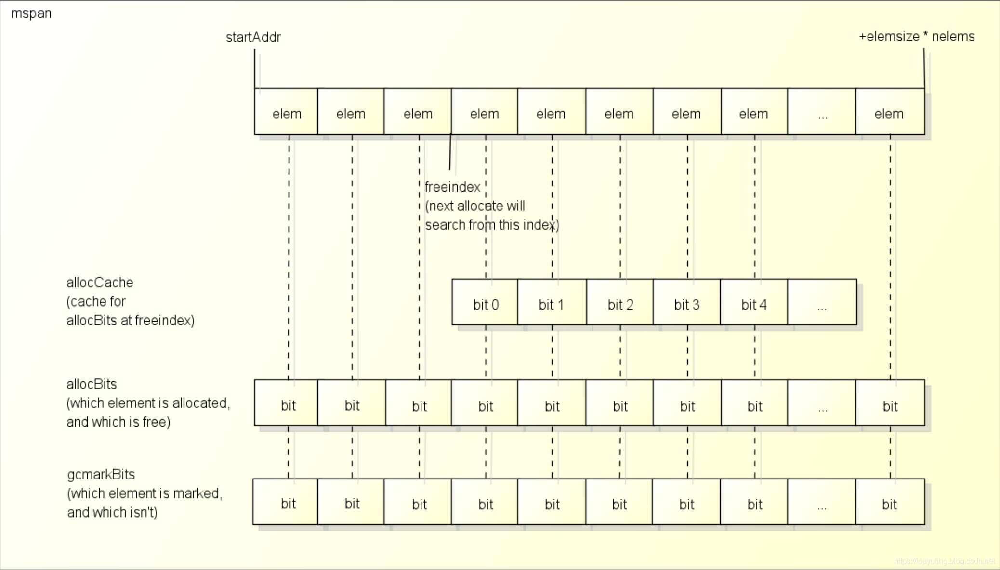
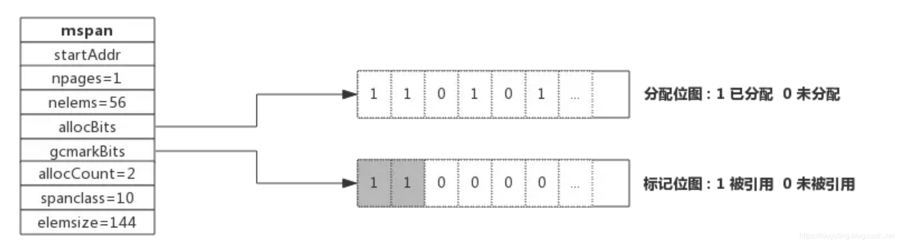
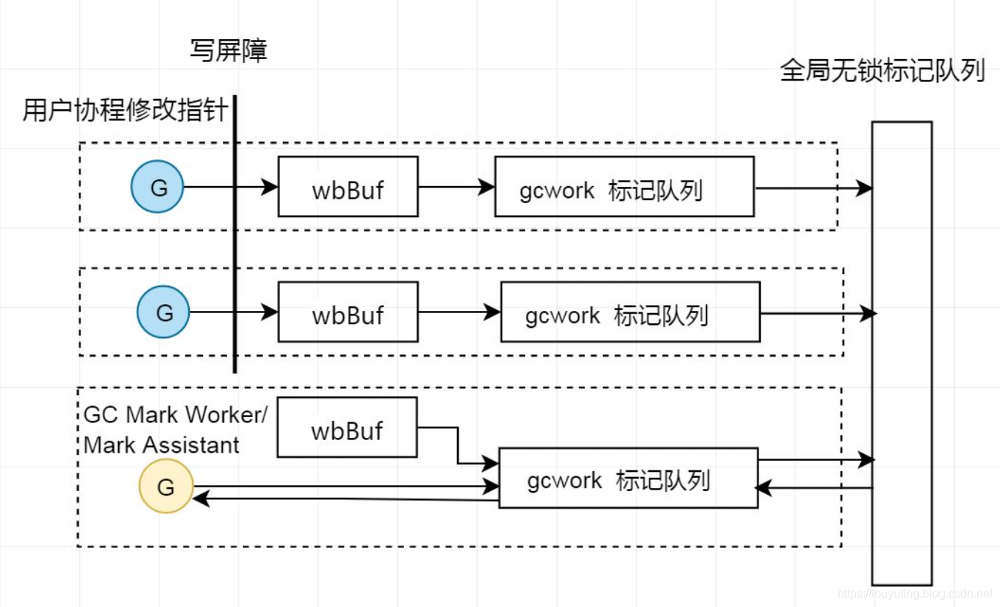
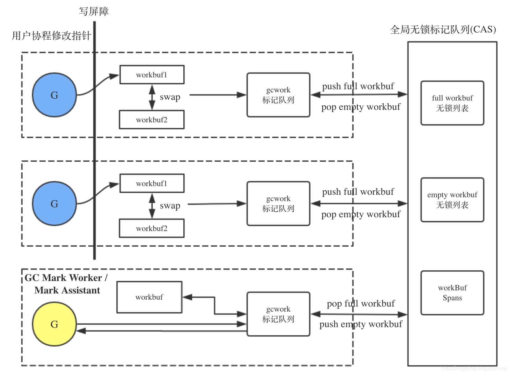
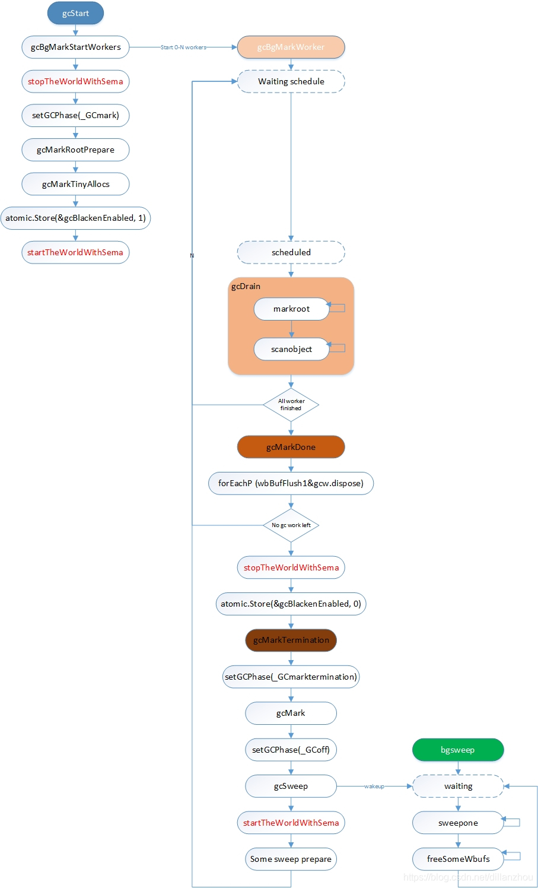

# 概述
- 标记垃圾
  - 引用计数 - `C++` / `Python`
  - 根可达 - `Go` / `JAVA`
- 常用的垃圾回收算法
  - `Go` 使用三色标记法
  - `JVM` 使用分代回收法
- 写屏障有两种写屏障及过程（插入写屏障，删除写屏障）
- 写屏障解决的问题（三色标记法错标或漏标问题）


# 垃圾标记算法

1. 引用计数法
2. 根可达算法


## 引用计数法 

在对象的结构体里额外内置一个计数器，当对象被引用时引用计数加一，解除引用时减一。当引用计数归零时，自动销毁对象。

以 `Python` 为例，其对象结构体为：

```python
typedef struct_object {
    int ob_refcnt;              // 引用计数
    struct_typeobject *ob_type;
} PyObject;
```

当执行创建对象、赋值、传参等操作时，引用 +1。销毁、赋新的值（旧值引用 -1）、脱离作用域等时机，引用 -1。


#### 优点

引用计数法有其明显的优点，如高效、实现逻辑简单、具备实时性。

1. 一旦一个对象的引用计数归零，内存就直接释放了。不用像其他机制等到特定时机。
2. 将垃圾回收随机分配到运行的阶段，正常程序的运行比较平稳，不像 `Go` 每隔一段时间做一次 GC。


#### 缺点

1. 循环引用，如 `a.next = b; b.next = a`。这是引用计数的致命伤，引用计数对此是无解的，因此必须使用其它的 GC 算法进行补充。

2. 维护计数麻烦。每个对象需要分配单独的空间来统计引用计数，增加空间占用量不说，需要对引用计数进行维护，在维护的时候很容易会出错。
3. 释放一个大的对象时，比如字典，需要对引用的所有对象循环嵌套调用，从而可能会花费比较长的时间。


## 根可达算法
简单来讲，从根对象往下查找引用，可以查找到的引用标记成可达，直到算法结束之后，没有被标记的对象就是不可达的、未使用的，可以被回收。


#### 根对象

根对象在垃圾回收的术语中又叫做根集合，它是垃圾回收器在标记过程时最先检查的对象，包括：

1. 全局变量：程序在编译期就能确定的那些存在于程序整个生命周期的变量。
2. 执行栈：每个 goroutine 都包含自己的执行栈，这些执行栈上包含栈上的变量及指向分配的堆内存区块的指针。
3. 寄存器：寄存器的值可能表示一个指针，参与计算的这些指针可能指向某些赋值器分配的堆内存区块。


# 基于根可达的垃圾回收算法

1. 标记 - 清除
   - 从根对象出发，将确定存活的对象进行标记，并清扫可以回收的对象
   - 会产生内存碎片
2. 标记 - 整理（复制）
   - 将在用的对象复制到一块新对象上，这样他们就在一块连续的内存上了，不会有碎片
   - 复制性能消耗大、浪费空间（总有一半的处于浪费状态）、STW 时间长
3. 标记 - 压缩
   - 前两种的结合
4. 增量式
    - 将标记与清扫的过程分批执行，每次执行很小的部分，从而增量的推进垃圾回收，达到近似实时、几乎无停顿的目的
5. 分代模型
6. 三色标记法


## 分代模型

将对象根据存活时间的长短进行分类，存活时间小于某个值的为年轻代，存活时间大于某个值的为老年代，永远不会参与回收的对象为永久代。并根据分代假设（如果一个对象存活时间不长则倾向于被回收，如果一个对象已经存活很长时间则倾向于存活更长时间）对对象进行回收。

`JVM` 做垃圾回收时使用的 GC 算法。将对象分为年轻代和老年代，年轻代使用**复制算法**，老年代使用**标记压缩**或者**标记清除**。

另外 `jdk1.8` 可以用上面的分代模型，也可以使用不分代模型，即G1、ZGC等。

性能优秀，实现复杂。


## 三色标记法

三色标记法是传统标记 - 清除算法的一个改进，它是一个并发的 GC 算法。其实大部分的工作还是在标记垃圾，基本原理基于根可达。

`Go` 的 GC 目前使用的是无分代（对象没有代际之分）、不整理（回收过程中不对对象进行移动与整理）、并发（与用户代码并发执行）的三色标记清扫算法


步骤：

1. 首先初始状态下所有对象都是 **白色** 的
2. 从根对象开始遍历所有对象，将遍历到的对象从白色集合放到 **灰色** 集合
3. 遍历灰色集合中的对象，将灰色对象引用的对象放到灰色集合里面，自身放进 **黑色** 集合
4. 重复 3 直到灰色集合为空
5. 在标记开始时会开启写屏障。然后在标记期间发生变化的对象，会被直接标记为 **灰色**，扔进灰色集合，重复上面操作
6. 清除阶段：清除所有 **白色** 对象


#### 三色标记的问题

1. 多标 (浮动垃圾)
   1. 假设现有 `A 黑 -> B 灰 -> C 白` 的引用，现正准备将 `C` 标记为灰
   2. 这时 `B` 解除了 对 `C` 的引用，那 `C` 虽然后面被标记为灰色，但它实际是应该被回收的
   3. 这种情况不碍事，大不了下次 GC 再收集
2. 漏标（悬挂指针）
   1. 还是 `A 黑 -> B 灰 -> C 白`，假设程序又新建了个 `A -> D` 的引用
   2. 因为 `A` 是黑色的，不会再被扫描，因此检测不到 `D`，`D` 会被视为白色而被清理，造成空指针异常
   3.  `Go` 使用写屏障来解决这个问题


#### 三色标记状态的记录

`runtime` 并没有真正的三个集合来分别装三色对象。如果真的用三个集合来存储，性能肯定是堪忧的。

这里先回顾下 `mspan` 的结构：



`span` 中有一个 `freeindex` 标记下一次分配对象时应该开始搜索的地址, 分配后 `freeindex` 会增加, 在 `freeindex` 之前的元素都是已分配的, 在 `freeindex` 之后的元素有可能已分配, 也有可能未分配。

`allocBits` 用于标记哪些元素是已分配的, 哪些元素是未分配的。分配空间时，从 `freeindex` 向后检索，检索`allocBits` 为 `0` 的空间。

因为每次都去访问 `allocBits` 效率会比较慢, 又用了一个 `allocCache` 变量缓存 `freeindex` 之后的 `allocBits`。

`gcmarkBits` 用于在 `GC` 时标记哪些对象存活。每次执行垃圾标记时，标记的都是 `gcmarkBits` 这个变量。



回到 GC 中的三色表示，`Go` 内部对象并没有保存颜色的属性, 三色只是对它们的状态的描述。

白色的对象的 `gcmarkBits` 中对应的 `bit` 为 `0`,
灰色的对象的 `gcmarkBits` 中对应的 `bit` 为 `1`, 并且对象在标记队列中,
黑色的对象的 `gcmarkBits` 中对应的 `bit` 为 `1`, 并且对象已经从标记队列中取出并处理。

扫描完成后，`gcmarkBits` 里为 `0` 的就可以清理掉。清理后将 `gcmarkBits` 赋值给 `allocBits` 字段。


# 写屏障

`Go` 的写屏障和操作系统的内存写屏障是两个概念，不要搞混了。

简单来说，`Go` 的写屏障就是编译器在函数执行时插了段代码（类似于栈扩容检测的代码），并用一个变量来标记是否开启了写屏障。

函数执行时，先判断一下这个写屏障标记，如果为 `true`，就执行写屏障相关的逻辑（将新分配的对象直接视为灰色，放入标记队列）。

写屏障主要有两种：Dijkstra 实现的插入写屏障，和 Yuasa 实现的删除写屏障。

`Go 1.8` 之前是用的是插入写屏障，执行完标记后需要重新扫描一次写屏障的对象。 `1.8` 之后这两种一起使用，称为混合写屏障。



每个P中都有 `wbBuf(write barrier buffer.) `和 `gcw gcWork` 标记队列, 以及全局的 `workbuf` 标记队列, 来实现生产者 - 消费者模型。扫描期间，每个 `P` 扫描自己的 `span`，将灰色对象放入队列。触发写屏障的直接扔入队列。


# Golang GC 发展

| 版本 | GC                       | STW     |
| ---- | ------------------------ | ------- |
| 1.1  | STW，单线程处理          | > 100ms |
| 1.3  | Mark STW，并行清扫       | > 100ms |
| 1.5  | 三色标记法，并发标记清除 | < 10ms  |
| 1.8  | 混合写屏障               | < 1ms   |


# GC时机

`GC` 在满足一定条件之后就会被触发，触发的条件有 3 种：

1. `gcTriggerHeap`: 当前分配的内存达到一定值就触发 `GC`

2. `gcTriggerTime`: 当一定时间没有执行过 `GC` 就触发 `GC`

3. `gcTriggerCycle`: 要求启动新一轮的 `GC`, 已启动则跳过


这三种条件分别对应三处时机：

1. 申请内存调用 `runtime.mallocgc` 时，会判断是否需要触发 `GC`
   - 判断条件是一个触发系数 `triggerRatio`。这个触发系数的计算比较绕，总体和 CPU使用率、内存占用增长率、上个触发系数有关。这个系数决定了触发 `GC` 的堆大小的阈值。
2. 后台监控协程 `sysmon`，每 `2 `分钟执行一次 `forcegchelper`
3. 手动在代码里写 `runtime.GC`


通过这些方式的组合，`go runtime` 达到了两个目的：1. 内存使用量控制在一个较稳定的范围；2. `GC` 触发不会太过频繁

这里看下第一种方式的代码：

```go
// runtime/malloc.go
// 这个函数名一看还以为是做 GC 的，实际做的是 malloc + GC 两件事情，大部分代码都是处理空间分配
func mallocgc(size uintptr, typ *_type, needzero bool) unsafe.Pointer {
	
	var assistG *g                           // 进行辅助GC
	if gcBlackenEnabled != 0 {
		assistG = getg()                     // 获取当前G
		assistG.gcAssistBytes -= int64(size) // 把当前分配对象的size从辅助GC配额里扣除

		if assistG.gcAssistBytes < 0 {       // 如果扣完成负的了，则要进行辅助GC
			gcAssistAlloc(assistG)
		}
	}

	// 空间分配相关
    // ...
    // 期间可能改变 size 值

	// 如果处于 GC 期间，直接将使用的 span 标记为黑色
	if gcphase != _GCoff {
		gcmarknewobject(span, uintptr(x), size, scanSize)
	}

    // 再次进行 GC 检查
	if assistG != nil {
		assistG.gcAssistBytes -= int64(size - dataSize)
	}
	if shouldhelpgc {
		if t := (gcTrigger{kind: gcTriggerHeap}); t.test() {
			gcStart(t)
		}
	}

	return x
}
```


# 回收步骤


## 第一阶段：标记准备（STW）

1. 为每个 `P` 创建一个 `G` 用于后面的并发标记（`gcBgMarkWorker`, 用于第二阶段工作）
2. **stop the world**，`stopTheWorldWithSema`
3. 初始化一些 `GC` 执行参数，用以控制 `GC` 标记占用的 CPU 比例。
   - 这个比例由全局常量 `gcBackgroundUtilization = 0.25` 指定，即不超过 `25%`
4. 将 `GC` 阶段修改为 `_GCmark` 状态，**启动写屏障**
5. 找到所有根节点并加入标记队列（栈，全局变量等）
6. 标记每个 `P` 的 `tiny` 对象
7. 结束 STW，进入第二阶段

```go
// gcStart starts the GC. It transitions from _GCoff to _GCmark
func gcStart(trigger gcTrigger) {

    // 创建后台标记工作的 goroutines
	// 这些 goroutines 不会马上启动，会阻塞直到进入 mark 阶段才会启动
	gcBgMarkStartWorkers()

	// 重置标记相关的状态
	systemstack(gcResetMarkState)

	// STW, 停止所有运行中的G, 并禁止它们运行
	systemstack(stopTheWorldWithSema)
    
	// 设置全局变量中的GC状态为_GCmark
    // 然后启用写屏障
	setGCPhase(_GCmark)

    // 将根节点放入队列
    // queues root scanning jobs (stacks, globals, and some miscellany)
	gcMarkRootPrepare()
    
	// 标记所有tiny对象
	gcMarkTinyAllocs()

	// 启用辅助GC
	atomic.Store(&gcBlackenEnabled, 1)

    // START THE WORLD
	systemstack(func() {
		// 前面创建的后台 Mark 任务会开始工作, 所有后台标记任务都完成工作后, 进入完成标记阶段
		now = startTheWorldWithSema(trace.enabled)
		// 记录停止了多久, 和标记阶段开始的时间
		work.pauseNS += now - work.pauseStart
		work.tMark = now
	})
}
```


## 第二阶段：并发标记

1. 从标记队列里面取出对象，标记为黑色
   - 根节点标记任务分成 `work.markrootJobs` 份，所有 `worker` 并发获取任务并执行
2. 检查对象是否有指针指向另一个对象，是，则加入标记队列
   - `golang` 中分配对象会根据是否是指针分别放到不同的 `span` 中，如果是指针 `span`，那么就需要继续 `scan` 下一个对象，否则停止该路 `scan`，取队列中下一个对象继续 `scan`
3. 在扫描过程中，如果用户代码修改对象，会触发写屏障，将对象标记为灰色，并加入单独的扫描队列中

注意：

1. 这个阶段是和用户的程序并发一起运行的，不需要 `STW`
2. 从队列中出来的需要 `scan` 的对象被标记为黑色，将 `bitmap` 中对应的 `gcmarkBits` 设为 `1`
   - 每个 `mspan` 中有一个 `gcmarkBits` 对象用于标记 `mspan` 中的每个对象是否需要保留，标记其实只有两个状态，`0` 表示**白色**，`1` 表示**黑色**。可以看到其实并没有**灰色**这个状态。只是把队列里的对象在逻辑上视为灰色，并不是真的用字段把它标记为灰色


每个 `P` 上都有一个 `gcw` 对象，作为灰色对象标记队列。

```go
// runtime/mgcwork.go
type struct p {
	gcw gcWork
}

type gcWork struct {
	wbuf1, wbuf2 *workbuf
}
```

`P` 的 `gcWork` 是一个典型的生产者和消费者模型，`gcWork` 队列里面保存的就是灰色对象。写屏障、根节点发现、栈扫描、对象扫描、 都是生产者，辅助 `GC` 是消费者。

这里 `gcWork` 使用了两个 `workbuf` ，为的是提高效率。为的是在一个被 `get` 期间，另一个能并发的与全局队列做交换（`put`）。

`put` 操作的时候会优先 `put` 进 `wbuf1`，如果 `wbuf1` 满了，就将 `wbuf1` 和 `wbuf2` 交换。如果交换之后 `wbuf1` 还是满的，就将 `wbuf1` `push` 到全局的 `work.full list`, 并从全局 `work.empty list` 里面取出一个空的 `wbuf`。最后执行 `put` 操作。





## 第三阶段：标记结束(STW)

在所有后台标记任务都把标记队列消费完毕时, 会执行 `gcMarkDone` 函数准备进入完成标记阶段 (mark termination)。

1. STW
2. 恢复之前因为辅助 GC 而暂停的 `G`
3. 关闭写屏障
4. 唤醒后台清扫任务, 将在 STW 结束后开始运行
5. 结束 STW

```go
func gcMarkDone() {
	// STW 
	systemstack(stopTheWorldWithSema)
	
	// 禁止辅助GC和后台标记任务的运行
	atomic.Store(&gcBlackenEnabled, 0)

	// 唤醒所有因为辅助GC而休眠的G
	gcWakeAllAssists()

    // 计算下一次触发gc需要的heap大小
	nextTriggerRatio := gcController.endCycle()

	// 进入完成标记阶段, 会重新启动世界
	gcMarkTermination(nextTriggerRatio)
}

func gcMarkTermination(nextTriggerRatio float64) {
    setGCPhase(_GCmarktermination)

    // 唤醒后台清扫任务, 将在STW结束后开始运行
   	systemstack(func() {
		setGCPhase(_GCoff)
		gcSweep(work.mode)
	})
    
   	// 更新下一次触发gc需要的heap大小(gc_trigger)
	gcSetTriggerRatio(nextTriggerRatio)

    // 结束 STW
   	systemstack(func() { startTheWorldWithSema(true) })

    // 遍历 P，开始清扫
	systemstack(func() {
		forEachP(func(_p_ *p) {
			_p_.mcache.prepareForSweep()
		})
	})
}

```


## 第四阶段：并发回收

到这一阶段，所有内存要么是黑色的要么是白色的，清除所有白色的即可。

后台清扫任务的函数是`bgsweep`，对于并行式清扫，在 `GC` 初始化的时候就会启动 `bgsweep()`，然后在后台一直循环，等待环形。

底层会调用 `mspan.sweep`，修改 `span` 的 `bitmap`，并执行将空间归还给 `mcache`、`mheap` 等逻辑。

```go
func (s *mspan) sweep(preserve bool) bool {
   	nalloc := uint16(s.countAlloc())         // 统计已分配的数量，用于判断是否要归还空间
	if spc.sizeclass() == 0 && nalloc == 0 { // 分配的数量为 0 了，可以归还给 heap
		s.needzero = 1
		freeToHeap = true
	}
	nfreed := s.allocCount - nalloc          // 统计空闲的数量
    
    s.freeindex = 0                          // 重置 freeindex 下标
	s.allocBits = s.gcmarkBits               // 将 gcmarkBits 的值赋给 allocBits
	s.gcmarkBits = newMarkBits(s.nelems)     // 重置 gcmarkBits
   	s.refillAllocCache(0)                    // 重置 allocCache 缓存
    
    if nfreed > 0 && spc.sizeclass() != 0 {
        c.local_nsmallfree[spc.sizeclass()] += uintptr(nfreed)
		res = mheap_.central[spc].mcentral.freeSpan(s, preserve, wasempty) // 归还给 mcentral
    } else if freeToHeap {
        mheap_.freeSpan(s, true)                                           // 归还给 mheap
        c.local_nlargefree++
		c.local_largefree += size
    }

}
```


# 总结




# 其他

##### 为什么 Go 不采用标记整理？

对象整理的优势是解决内存碎片问题以及 "允许" 使用顺序内存分配器。但 Go 运行时的分配算法基于 `tcmalloc`，基本上没有碎片问题。并且顺序内存分配器在多线程的场景下并不适用。对对象进行整理不会带来实质性的性能提升。


##### 为什么 Go 不采用分代算法？

分代是假设多数对象在新生代的基础上的。 Go Team 由于实现了逃逸分析，绝大部分新生代直接分配在栈上，随 `goroutine` 结束直接回收，不需要 GC 参与，因此分代没那么大收益。另外分代也是有代价的，比如跨代引用，为了解决这个问题还需要设立 rset 集合。 go nuts有个邮件说明了问题，简单说团队认为分代的收益没那么大，依据是他们的一些测试。


##### 栈的空间是怎么回收的？

垃圾回收都是针对堆的，栈指针在方法调用结束后会自然重置至栈底，释放栈帧，原栈内的对象就不可达了，因此无需 `GC` 干预

至于栈空间，`goroutine` 结束时，会被放回 `P` 或全局的 `G` 缓存池，栈空间跟随 `G`。如果栈超过 `2KB`，则直接归还给 `mcache`


##### **如果内存分配速度超过了标记清除的速度怎么办？**

当存在新的内存分配时，会暂停分配内存过快的那些 `goroutine`，并将其转去执行一些辅助标记（Mark Assist）的工作，从而达到放缓继续分配、辅助 GC 的标记工作的目的。


##### GC调优有哪些思路？

优化内存的申请速度，尽可能的少申请内存，复用已申请的内存

1. 控制内存分配的速度，限制 goroutine 的数量，从而提高赋值器对 CPU 的利用率。
2. 减少并复用内存，例如使用 sync.Pool 来复用需要频繁创建临时对象，例如提前分配足够的内存来降低多余的拷贝。
3. 需要时，调大 GOGC 环境变量的值，降低 GC 的运行频率。


#### 参考

> [逃出黑洞的光线 - 那位大神讲解一下golang gc机制](https://www.zhihu.com/question/403065438/answer/1426765597)
>
> [luoziyun - Go语言GC实现原理及源码分析](https://www.luozhiyun.com/archives/475)
>
> [lizhihua - golang gc 简明过程（基于go 1.14）](https://zhuanlan.zhihu.com/p/92210761)
>
> [惜暮 - golang垃圾回收浅析](https://blog.csdn.net/u010853261/article/details/103359762)
>
> [dillanzhou - golang gc实现分析（go1.14.4）](https://blog.csdn.net/dillanzhou/article/details/107148686)
> 
> [欧长坤 - Go GC 20 问](https://mp.weixin.qq.com/s/o2oMMh0PF5ZSoYD0XOBY2Q)