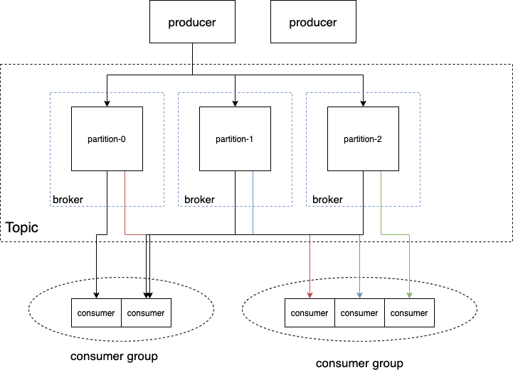

# 概述

`kafka` 通过引入 `partition` 的概念，让 `topic` 能够分散到多台 `broker`上，提高吞吐率。

在内部，每个 `partition` 以多个 `segment` 文件的方式进行存储，新来的消息 `append` 到最新的 `segment log` 文件中，并使用稀疏索引记录消息在 `log` 文件中的位置，方便快速读取消息。当数据过期时，直接删除过期的 `segment` 文件即可。

为了实现高可用，每个 `partition` 都有多个副本，其中一个是 `leader`，其它是 `follower`，分布在不同的 `broker` 上。对 `partition` 的读写都在 `leader` 所在的 `broker` 上完成，`follower` 只会定时地拉取 `leader` 的数据进行同步。当 `leader` 挂了，系统会选出和 `leader` 保持同步的 `follower` 作为新的 `leader`，继续对外提供服务，大大提高可用性。

在消费端，`kafka` 引入了消费组的概念，每个消费组都可以互相独立地消费 `topic`，但一个 `partition` 只能被消费组中的唯一一个消费者消费。消费组通过记录游标，可以实现 `ACK` 机制、重复消费等多种特性。

除了真正的消息记录在 `segment` 中，其它几乎所有 `meta` 信息都保存在全局的 `zookeeper` 中。


# 架构




`topic` 是一个逻辑上的概念，不是一个实体。

一个 `topic` 包含多个 `partition`。每个 `partition` 内部消息的顺序一致。不同 `partition` 直接没有顺序保证。

`partition` 分布在多台机器上。这个机器，`kafka` 中称之为 `broker`。

对于一个 `topic`，可以有多个不同的消费组同时进行消费。一个消费组内部可以有多个消费者实例，这样可以提高消费速率。


但是一个 `partition` 只能被消费组中的一个消费者实例来消费。换句话说，消费组中如果有多个消费者，不能够存在两个消费者同时消费一个 `partition` 的场景。因为两个同组消费者消费同一个 `partition`，会出现乱序的情况。


# 发送数据

注意 `kafka` 中数据复制是依赖 `follower` 主动从 `leader` 拉数据，非 `leader` 主动推，不采用推模式。默认 `500ms` 拉一次。


# 存储

每个 `topic` 的每个 `partition` 在磁盘上对应一个文件夹，该文件夹下存储这个 `partition` 的所有消息和索引文件，目录名就是 `topic-partition`，比如 `topic` 为 `asdf` 的第一个分区，就是 `asdf-1`。

每条消息以磁盘顺序写的方式追到到文件末尾，因此写入速度极快。


### 消息结构

`kafka` 自己实现了一套协议，在 `tcp` 层之上，消息结构如下：

```go
type Message struct {
	offset      int64      // 偏移量
	MessageSize int32      // 消息大小
	data        MessageSet // 消息体
}

type MessageSet struct {
    CRC         int32      // 校验码
    MagicByte   int8       // 版本，向后兼容，没用
    Attributes  int8       // 元数据，包含压缩方式
    Key         []byte
    Value       []byte
}
```


`kafka` 的消费如果只是移动游标并不删除数据，那么随着时间的推移数据肯定会把磁盘打满，这个问题该如何解决呢？这就涉及到 `kafka` 的消息过期机制，类似于 `redis` 中的 `expire`。

假如所有消息都写入一个文件，很快这个文件就到 `200G` 了。现在告诉你，这个文件前 `X` 行过期失效了，你应该怎么删除呢？非常难办，这和让你删除一个数组中的前  `N` 个元素一样，需要把后续的元素向前移动，这涉及到大量的 `CPU copy` 操作，删除的代价非常大。


### 分段

因此，`kafka` 在实际存储 `partition` 时又进行了一个拆分。每个 `parition` 的数据并不是写到一个文件里，而是写到多个 `segment` 文件里。假如设置的一个 `segment` 文件大小上限是 `100M`，写满就会创建新的 `segment` 文件，后续的消息就写到新创建的 `segment` ，就像我们业务系统的日志文件切割一样。这样做的好处是，当 `segment` 中所有消息都过期时，可以很容易地直接删除整个文件。而由于`segment` 中消息是有序的，看是否都过期就看最后一条是否过期就行了。


### 索引 

数据文件分段使得可以在一个较小的数据文件中查找对应 `offset` 的消息了，但是这依然需要顺序扫描才能找到对应 `offset` 的消息。

为了进一步提高查找的效率，`kafka` 为每个分段后的数据文件建立了索引文件，文件名与数据文件的名字是一样的，记录了**相对偏移量**，及在数据文件中的行数 ，文件扩展名为 `.index`。另外还有 `timeindex`，用作时间索引。索引体积小，可以直接全部加载进内存后，进行二分查找。

另外 `index` 文件中并没有为数据文件中的每条消息建立索引，而是采用了稀疏存储的方式，每隔一部分的数据才建立一条索引。这样避免了索引文件占用过多的空间，从而可以将索引文件保留在内存中。


### 查找

1. 首先是用二分查找确定它是在哪个 `segment` 中
2. 打开这个 `segment` 的 `index` 文件，也是用二分查找找到 `offset` 小于或者等于要查找的 `offset` 的索引条目中最大的那个 `offset`
3. 打开数据文件，从第2步找到的 `offset` 顺序扫描直到找到要查找的 `offset`
4. 以查找一个 `offset` 为 368801 的为例：


### 消费

`kafka` 里消费者的消费采用的是 `poll` 模式，即不断轮询 `broker` ，查询是否有新消息到达。

`kafka` 会检查消费者的 `poll` 间隔，如果消费者太长时间没有 `poll`，则会被视为宕机，踢出消费者组，触发 `rebalance`。


### rebalance

当有消费者新加入或被踢出消费者组时，为了让新的消费者能消费到分区 / 被踢出的消费者的分区能被其他消费者消费到，会触发 `rebalance`。

`rebalance` 期间，所有消费者将会停止消费，等待 `rebalance` 完成。


# 优缺点

## 优点

- 高性能、吞吐量：单机测试能达到 100w tps
- 低延时：生产和消费的延时都很低，端到端的延时在正常集群中也很低
- 可用性高：多副本+ isr + 选举 机制保证
- 工具链成熟：监控 运维 管理 方案齐全
- 生态成熟：大数据场景必不可少 kafka stream


## 缺点

- 无法弹性扩容、扩容成本高：对 `partition` 的读写都在 `leader broker`上。如果该 `broker` 压力过大，新增 `broker` 只对新 `topic` 生效，如果要分担老 `partition` 的压力，需要手动迁移 `partition`，这时会占用大量集群带宽
- 消费者新加入和退出会造成整个消费组 `rebalance`：导致数据重复消费，影响消费速度，增加端到端延迟
- `partition` 过多会使得性能显著下降：`zk` 压力大，`broker` 上 `partition` 过多让磁盘顺序写几乎退化成随机写
  - `broker` 上只有一个 `partition` 时，该 `parition` 就是顺序写
  - 如果有 10000 个 `partition`，则要先定位是哪个 `parition`，再顺序写。从全局的角度看就像是随机写入 10000 个分区一样


# Apache Pulsar

顺带提一下 `Apache` 的 `pulsar`，主要是在 `kafka` 的基础上，做了存储计算分离。

`kafka` 的读写和存储都依赖 `broker`，如果 `broker` 挂了上面的数据也没了，也不好扩容，`pulsar` 将存储从 `broker` 分离出去成为 `bookie`，这样 `bookie` 可以随意扩容，只需要额外记录下 `segment` 和 `bookie` 的关系就可以了。


#### 参考
> [平凡之路无尽路 - Kafka的message存储数据结构](https://blog.csdn.net/gududedabai/article/details/80001523)
>
> [刘德恩 - Redis、Kafka 和 Pulsar 消息队列对比](https://mp.weixin.qq.com/s/LNQ1YvhnviKPGNsQx2A4cQ)
>
> [Lovisa Johansson - What does In-Sync Replicas in Apache Kafka Really Mean?](https://www.cloudkarafka.com/blog/what-does-in-sync-in-apache-kafka-really-mean.html)

