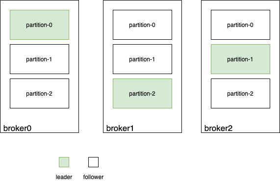

# Kafka高可用：多副本机制

高可用（HA）对于企业的核心系统来说是至关重要的。因为随着业务的发展，集群规模会不断增大，而大规模集群中总会出现故障，硬件、网络都是不稳定的。当系统中某些节点各种原因无法正常使用时，整个系统可以容忍这个故障，继续正常对外提供服务，这就是所谓的高可用性。对于有状态服务来说，容忍局部故障本质上就是容忍丢数据（不一定是永久，但是至少一段时间内读不到数据）。

系统要容忍丢数据，最朴素也是唯一的办法就是做备份，让同一份数据复制到多台机器，所谓的**冗余**，或者说**多副本**。为此，`kafka` 引入 `leader-follower` 的概念。`topic` 的每个 `partition` 都有一个 `leader`，所有对这个 `partition` 的读写都在该 `partition leader` 所在的`broker` 上进行。`partition` 的数据会被复制到其它 `broker` 上的 `follower`

`producer` 在生产消息时，会直接把消息发送到 `partition leader` 上，`leader` 把消息写入自己的 `log` 中，然后等待 `follower` 来拉取数据进行同步。

注意 `kafka` 中数据复制是依赖 `follower` 主动从 `leader` 拉数据，非 `leader` 主动推，不采用推模式。

`producer` 进行 `ack` 的时机非常关键，这直接关系到 `kafka` 集群的可用性和可靠性

- 如果数据到达 `leader` 并成功写入 `leader` 的 `log` 就进行 `ack`

  **优点**：不用等数据同步完成，速度快，吞吐率高，可用性高；

  **缺点**：如果 `follower` 数据同步未完成时 `leader` 挂了，就会造成数据丢失，可靠性低。

- 如果等 `follower` 都同步完数据时进行 `ack`

  **优点**：当 `leader` 挂了之后 `follower` 中也有完备的数据，可靠性高；

  **缺点**：等所有 `follower` 同步完成很慢，性能差，容易造成生产方超时，可用性低。

而具体什么时候进行 `ack` ，对于 `kafka` 来说是可以根据实际应用场景配置的。

## kafka 控制器 controller

在 `kafka` 集群中的 `broker`，其中有一个 `broker` 会被选举为控制器 `controller`，它负责管理整个集群中所有分区和副本的状态，集群中只能有一个控制器

- 某个分区的 `leader` 副本出现故障时，由控制器负责为该分区选举新的 `leader` 副本
- 检测到某个分区的 `ISR` 集合发生变化时，由控制器负责通知所有 `broker` 更新其元数据信息
- 当为某个 `topic` 增加分区数量时，由控制器负责分区的重新分配

## kafka 控制器的选举

`kafka` 中的控制器选举工作依赖于 `zookeeper`，成功竞选成为控制器的 `broker` 会在 `zookeeper` 中创建 `/controller` 临时节点。

- 每个 `broker` 启动的时候会去尝试读取 `/controller` 节点的 `brokerid` 的值。并对该节点注册 `watch` 函数，在控制器挂掉后触发控制器的选举

  - 如果读取到的 `brokerid` 的值不为 -1，表示已经有其他 `broker` 节点成功竞选为控制器，当前 `broker` 就会放弃竞选

  - 如果 `zk` 中不存在 `/controller` 节点，或者这个节点的数据异常，那么就会尝试去创建 `/controller` 节点，创建成功的那个 `broker` 就会成为控制器

- 每个 `broker` 都会在内存中保存当前控制器的 `brokerid` 值，这个值可以标识为 `activeControllerId`

- `Zookeeper` 中还有一个与控制器有关的 `/controller_epoch` 节点，用于记录控制器发生变更的纪元，及轮数

## leader选举

1. `controller` 会在 `zk` 注册对 `broker` 的 `watch` 函数，一旦有 `broker` 宕机导致其在 `zk` 对应的 `znode` 过期被删除，`zk` 会触发 `watch` 函数，通知 `controller`
2. `controller` 会读取本地上该 `broker` 的状态，遍历该 `broker` 上的所有 `partition`，读取每个 `partition` 的 `ISR`
3. 从 `ISR` 中随机选一个 `replica` 作为新 `leader`。如果没有 `ISR`，则从幸存的 `replica` 中随机选一个。如果没有幸存的 `replica` ，将 `leader` 设为 `-1`
4. 将新的 `leader`、`ISR` 和纪元记录到本地

# kafka 2.8

`kafka 2.8` 抛弃了 `zk`，改为使用 `raft` 协议自行实现，称为 `kraft`，主要基于以下考虑：

1. 使用 `zk` 相当于引入了新的外部依赖。导致 `kafka` 可用性不仅取决于自身，还受到外部组件制约。
   1. `zk` 的设计是 `CP` 模型，为了保证一致性，在可用性方面做出了牺牲。选主期间，集群可能不可用（比如正好 `GC`）
   2. `zk` 的 `watch` 机制也有些问题，`watch` 只会通知节点有信息发生了变化，具体是什么变化需要节点再次查询 `zk` 才知道，有时差
2. `raft` 不是外部组件的形式，而是协议，作为一个协议嵌入应用中，与应用本身是一体的
3. 目前还处于测试状态，不建议用于生产环境，因为无法平滑从老版本进行升级

## leader选举

`kafka 2.8` 下的 `leader` 选举不再使用 `zk`，而是自行选举。投票时，按以下优先级：

1. 优先投给 `epoch` 高的
2. 优先投给有最新数据的 ("longest")
3. 存在 `epoch` 高、但数据少的点被选为 `leader`，这种情况下 `follower` 上多出的数据会被清除

#### 参考

> [刘德恩 - Redis、Kafka 和 Pulsar 消息队列对比](https://mp.weixin.qq.com/s/LNQ1YvhnviKPGNsQx2A4cQ)
>
> [小柯贤的摸鱼日记 - Kafka常见的面试题](https://zhuanlan.zhihu.com/p/399185296)
>
> [大数据技术进阶 - kafka leader选举机制原理](https://www.jianshu.com/p/1f02328a4f2e)
>
> [A Kafkaesque Raft Protocol](https://www.confluent.io/events/kafka-summit-europe-2021/a-kafkaesque-raft-protocol/)

