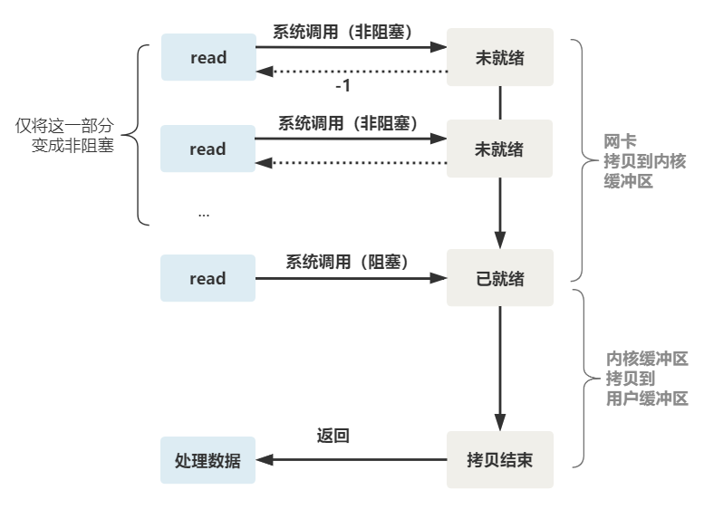
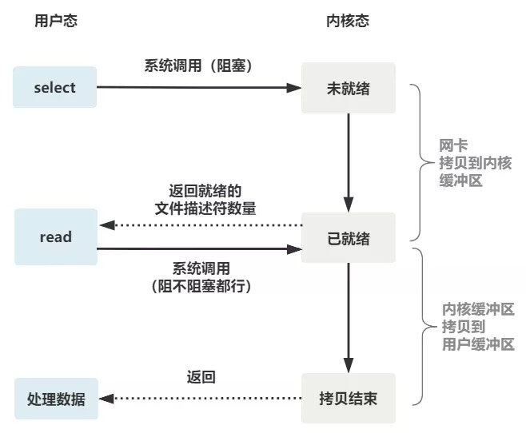

# 阻塞 IO

想一下如果让你来写一个处理网络请求的服务端，你会怎么写？

最基础的做法是，先起一个线程监听所有的网络连接。成功建立连接后，处理该请求。请求处理完成后，建立下一个连接，处理下一个请求。如此串行的、阻塞的处理。

```c
listenfd = socket();   // 打开一个网络通信端口
bind(listenfd);        // 绑定
listen(listenfd);      // 监听
while(1) {
    connfd = accept(listenfd);  // 建立连接（阻塞）
    int n = read(connfd, buf);  // 读数据（阻塞）
    doSomeThing(buf);           // 处理数据
    close(connfd);              // 关闭连接，循环等待下一个连接
}
```


可以看到，服务端的线程阻塞在了两个地方，一个是 accept 函数，一个是 read 函数。

如果再把 read 函数的细节展开，我们会发现其阻塞在了两个阶段：从网卡复制到内核缓冲区，和从内核复制到用户缓冲区。


这就是传统的阻塞 IO。如果这个连接的客户端一直不发数据，那么服务端线程将会一直阻塞在 read 函数上不返回，也无法接受其他客户端连接。

这肯定是不行的。


# 非阻塞IO

为了解决上面的问题，其关键在于改造这个 read 函数。

有一种办法是，每次都创建一个新的进程或线程，去调用 read 函数，并做业务处理。这样当给一个客户端建立好连接后，就可以立刻等待新的客户端连接，而不用阻塞在原客户端的 read 请求上。

不过，这不叫非阻塞 IO，只不过用了多线程的手段使得主线程没有卡在 read 函数上不往下走罢了。操作系统为我们提供的 read 函数仍然是阻塞的。并且无限制的开新线程，很容易导致资源被耗光。

真正的非阻塞 IO，不能是通过我们用户层的小把戏，**而是要恳请操作系统为我们提供一个非阻塞的 read 函数**。

这个 read 函数的效果是，如果没有数据到达时（到达网卡并拷贝到了内核缓冲区），立刻返回一个错误值（-1），而不是阻塞地等待。


操作系统提供了这样的功能，只需要在调用 read 前，将文件描述符设置为非阻塞即可。

```c
fcntl(connfd, F_SETFL, O_NONBLOCK);        // 将文件描述符设置为非阻塞
int n = read(connfd, buffer) != SUCCESS);  // read函数
```

这样，就需要用户线程循环调用 read，直到返回值不为 -1，再开始处理业务。


这里我们注意到一个细节。

非阻塞的 read，指的是在数据到达前，即数据还未到达网卡，或者到达网卡但还没有拷贝到内核缓冲区之前，这个阶段是非阻塞的。

当数据已到达内核缓冲区，此时调用 read 函数仍然是阻塞的，需要等待数据从内核缓冲区拷贝到用户缓冲区，才能返回。

整体流程如下图




# IO 多路复用

为每个客户端创建一个线程，服务器端的线程资源很容易被耗光。有个聪明的办法，我们可以每 accept 一个客户端连接后，将这个文件描述符（connfd）放到一个数组/队列里。

```c
fdlist.add(connfd); // 将连接放入队列
```

然后起一个新的线程去不断遍历这个数组，调用每一个元素的非阻塞 read 方法。

```c
while(1) {
    for (fd <-- fdlist) {      // 循环从队列里取连接
        if (read(fd) != -1) {  // 调用read
            doSomeThing();
        }
    }
}
```

这样我们只需要2个线程（一个把连接放入队列，一个从队列里取连接出来处理），就可以处理多个客户端连接。

你是不是觉得这有些多路复用的意思？

但这和我们用多线程去将阻塞 IO 改造成看起来是非阻塞 IO 一样，这种遍历方式也只是我们用户自己想出的小把戏，每次遍历遇到 read 返回 -1 时仍然是一次浪费资源的系统调用。

所以，还是得恳请操作系统老大，提供给我们一个有这样效果的函数，我们将一批文件描述符通过一次系统调用传给内核，由内核层去遍历，才能真正解决这个问题。


## **select**

`select` 是操作系统提供的系统调用函数，通过它，我们可以把一批文件描述符发给操作系统， 让操作系统去遍历，确定哪个文件描述符可以读写， 然后告诉我们去处理，不需要我们自己通过 `for` 循环来遍历了。


`select` 系统调用的函数定义如下。

```c
int select(
    int nfds,                 // 文件描述符数量
    fd_set *readfds,          // 监控有读数据到达文件描述符集合，传入传出参数
    fd_set *writefds,         // 监控写数据到达文件描述符集合，传入传出参数
    fd_set *exceptfds,        // 监控异常发生达文件描述符集合, 传入传出参数
    struct timeval *timeout); // timeout：定时阻塞监控时间，3种情况
//  1.NULL，永远等下去
//  2.设置timeval，等待固定时间
//  3.设置timeval里时间均为0，检查描述字后立即返回，轮询
```


服务端代码，这样来写。首先一个线程不断接受客户端连接，并把 socket 文件描述符放到一个 list 里。

```c
while(1) {
    connfd = accept(listenfd);          // 建立连接
    fcntl(connfd, F_SETFL, O_NONBLOCK); // 设置非阻塞read
    fdlist.add(connfd);                 // 放到队列里
}
```

然后，另一个线程不再自己遍历，而是调用 select，将这批文件描述符 list 交给操作系统去遍历。

```c
while(1) {
    // 把一堆文件描述符 list 传给 select 函数
    // 有已就绪的文件描述符就返回，nready 表示有多少个就绪的
    nready = select(list);
    ...
}
```

不过，当 select 函数返回后，用户依然需要遍历刚刚提交给操作系统的 list。操作系统只会将准备就绪的文件描述符做上标识，并返回ready的数量。

```c
while(1) {
    nready = select(list);
    // 用户层依然要遍历，只不过少了很多无效的系统调用
    for (fd <-- fdlist) {
        // 原先是if (read(fd) != -1)，这里调用select后，操作系统给就绪的fd做了标记，不需要再通过read判断了
        if (fd != -1) { 
            read(fd, buf);
            if(--nready == 0) break; // 总共只有 nready 个已就绪描述符，不用过多遍历
        }
    }
}
```


可以看出几个细节（这几点将在epoll中的到优化）：

1. select 调用需要传入 fd 数组，需要拷贝一份到内核，高并发场景下这样的拷贝消耗的资源是惊人的。（可优化为不复制）

2. select 在内核层仍然是通过遍历的方式检查文件描述符的就绪状态，是个同步过程，只不过无系统调用切换上下文的开销。（内核层可优化为异步事件通知）

3. select 仅仅返回可读文件描述符的个数，具体哪个可读还是要用户自己遍历。（可优化为只返回给用户就绪的文件描述符，无需用户做无效的遍历）


整个 select 的流程图如下。



可以看到，这种方式，既做到了一个线程处理多个客户端连接（文件描述符），又减少了系统调用的开销（多个文件描述符只有一次 select 的系统调用 + n 次就绪状态的文件描述符的 read 系统调用）。


## **poll**

poll 也是操作系统提供的系统调用函数。

```c
int poll(struct pollfd *fds, nfds_tnfds, int timeout);

struct pollfd {
    intfd;        /*文件描述符*/
    shortevents;  /*监控的事件*/
    shortrevents; /*监控事件中满足条件返回的事件*/
};
```

它和 select 的主要区别就是，去掉了 select 只能监听 1024 个文件描述符的限制。


## **epoll**

 

epoll 是最终的大 boss，它解决了 select 和 poll 的一些问题。

还记得上面说的 select 的三个细节么？

1. select 调用需要传入 fd 数组，需要拷贝一份到内核，高并发场景下这样的拷贝消耗的资源是惊人的。（可优化为不复制）

2. select 在内核层仍然是通过遍历的方式检查文件描述符的就绪状态，是个同步过程，只不过无系统调用切换上下文的开销。（内核层可优化为异步事件通知）

3. select 仅仅返回可读文件描述符的个数，具体哪个可读还是要用户自己遍历。（可优化为只返回给用户就绪的文件描述符，无需用户做无效的遍历）


所以 epoll 主要就是针对这三点进行了改进。

1. 内核中保存一份文件描述符集合，无需用户每次都重新传入，只需告诉内核修改的部分即可。

2. 内核不再通过轮询的方式找到就绪的文件描述符，而是通过异步 IO 事件唤醒。

3. 内核仅会将有 IO 事件的文件描述符返回给用户，用户也无需遍历整个文件描述符集合。


具体，操作系统提供了这三个函数。

第一步，创建一个 epoll 句柄

```c
int epoll_create(int size);
```

第二步，向内核添加、修改或删除要监控的文件描述符。

```c
// 通过该函数，直接向内核中写入文件描述符，不需要像select调用时每次拷贝大批文件描述符
int epoll_ctl(int epfd, int op, int fd, struct epoll_event *event);
```

第三步，类似发起了 select() 调用

```c
int epoll_wait(int epfd, struct epoll_event *events, int max events, int timeout);
```

使用起来，其内部原理就像如下一般丝滑。


# 总结

1. 没有IO多路复用的情况下，我们需要遍历每个连接（fd），调用内核的 `read` 方法判断 `fd` 的就绪状态。对于那些未就绪的 `fd`，每次 `read` 都是无效且耗费资源的操作
2. 通过 `select` 方法，我们可以将一批 `fd` 交给内核，内核来进行遍历。内核会给就绪的 `fd` 打上标记，我们再遍历一次 `fd`列表，处理其中就绪的 `fd` 就可以了。相比1来说，省去了每次循环里用户态切到内核态再调用 `read` 的开销
3. `poll` 方法去掉了 `select` 只能监听 1024 个 `fd` 的限制
4. `epoll`  方法对 `select` 的一些缺点进行了优化，如：
   1. 用户调用时不再需要复制一份 `fd` 列表给内核，而是通过 `epoll_ctl` 方法直接向内核中写入 `fd`
   2. 内核仅会将就绪的 `fd` 返回给用户，不再需要用户自行遍历 `fd` 列表
   3. 内核也不是通过轮询的方式找到就绪的 `fd` 了 ，而是通过异步唤醒机制


# 参考

[闪客sun - 你管这破玩意叫 IO 多路复用？]( https://mp.weixin.qq.com/s/YdIdoZ_yusVWza1PU7lWaw)