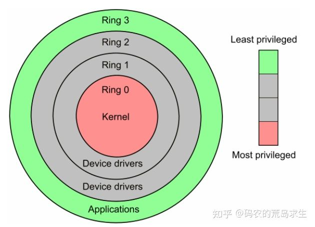

# 内存分配 malloc

## 内核态 VS 用户态

x86 CPU提供了4种工作状态：0,1,2,3，数字越小表示CPU的特权约大，0号下CPU特权最大，可以执行任何指令。

一般情况下系统只使用0和3，即 用户态(3) 以及 内核态(0)。

### 内核态

CPU执行操作系统代码时就处于内核态，在内核态下CPU可以执行任何机器指令、访问所有地址空间、不受限制的访问任何硬件。

### 用户态

CPU执行我们写的程序时就处于用户态。在用户态我们的代码处处受限，不能直接访问硬件、不能访问特定地址空间（比如，尝试写一块属于操作系统的内存），或以错误的类型访问内存区域（比如，尝试写一块只读内存），否则操作系统直接将你 kill 掉，这就是著名的Segmentation fault、不能执行特权指令，等等。

### 系统调用

普通程序永远也去不了内核态，只能以通信的方式从用户态往内核态传递信息。操作系统为普通程序员留了一些特定的暗号，这些暗号就和普通函数一样，程序员通过调用这些暗号就能向操作系统请求服务了，这些像普通函数一样的暗号就被称为系统调用 `System Call`，通过系统调用我们可以让操作系统代替我们完成一些事情，像打开文件、网络通信等等。

你可能有些疑惑，什么，还有系统调用这种东西，为什么我没调用过也可以打开文件、进行网络通信？

## 标准库

虽然我们可以通过系统让操作系统替我们完成一些特定任务，但这些系统调用都是和操作系统强相关的，Linux和Windows的系统调用就完全不同。

如果你直接使用系统调用的话，那么Linux版本的程序就没有办法在Windows上运行，因此我们需要某种标准，该标准对程序员屏蔽底层差异，这样程序员写的程序就无需修改的在不同操作系统上运行了。

在C语言中，这就是所谓的**标准库**。

注意，标准库代码也是运行在用户态的，一般来说，我们调用标准库去打开文件、网络通信等等，标准库再根据操作系统选择对应的系统调用。

从分层的角度看，我们的程序一般都是这样的汉堡包类型：

最上层是应用程序，应用程序一般只和标准库打交道 (当然，我们也可以绕过标准库)，标准库通过系统调用和操作系统交互，操作系统管理底层硬件。

这就是为什么在C语言同样的 `open` 函数既能在Linux下打开文件也能在Windows下打开文件的原因。

说了这么多，这和 `malloc` 又有什么关系呢？

## malloc

原来，我们分配内存时使用的 `malloc` 函数其实不是实现在操作系统里的，而是在标准库中实现的。当我们调用 `malloc` 时实际上是标准库在为我们申请内存。

这里值得注意的是，我们平时在C语言中使用 `malloc` 只是内存分配器的一种，实际上有很多内存分配器，像 `tcmalloc`，`jemalloc` 等等，它们都有各自适用的场景，对于高性能程序来说使用满足特定要求的内存分配器是至关重要的。

我们先来看一下程序在内存中是什么样的：

在堆区和栈区之间有一片空白区域，栈区和堆区的增长需要占用原来的空白区域。

`malloc` 内存不足时要向操作系统申请内存，操作系统才是真大佬，`malloc` 不过是小弟，对每个进程，操作系统 (类Unix系统) 都维护了一个叫做 `brk` 的变量，`brk` 发音 `break`，这个 `brk` 指向了堆区的顶部。

操作系统提供了一个叫做 `brk` 的系统调用，这个 `brk()` 系统调用就是用来增加或者减小堆区的。除了 `brk`，`sbr、mmap` 系统调用也可以实现同样的目的，`mmap` 也更为灵活，但该函数并不是本文重点，就不在这里详细讨论了。

## 虚拟内存

**但是，上述过程根本就没有涉及到哪怕一丁点物理内存。**

实际上，进程看到的内存都是假的，是操作系统给进程的一个幻象，即著名的**虚拟内存**。

所谓虚拟内存就是假的、不是真正的物理内存，虚拟内存是给进程用的，操作系统维护了虚拟内存到物理内存的映射，当 `malloc` 返回后，程序员申请到的内存就是虚拟内存。**此时操作系统根本就没有真正的分配物理内存。**

只有当我们真正使用这段内存时，这时会产生一个缺页错误，操作系统捕捉到该错误后开始真正的分配物理内存，操作系统处理完该错误后我们的程序才能真正的读写这块内存。

### 为啥要设虚拟内存

1. 对进程屏蔽了底层的物理RAM和磁盘，提供了更加简洁和易用的接口以及更加复杂的功能
2. 并向进程提供了远超物理内存大小的内存空间
3. 为不同进程提供互相隔离的内存，每个进程都有各自的虚拟内存，某进程 X 不可随意指定个地址就开始读写，提高安全性&并发性

## 总结

现在，这个故事就可以完整讲出来了，当我们调用 `malloc` 申请内存时：

1. `malloc` 开始搜索空闲内存块，如果能找到一块大小合适的就分配出去
2. 如果 `malloc` 找不到一块合适的空闲内存，那么调用brk等系统调用扩大堆区从而获得更多的空闲内存
3. `malloc` 调用 `brk` 后开始转入内核态，此时操作系统中的虚拟内存系统开始工作，扩大进程的堆区，注意额外扩大的这一部分内存仅仅是虚拟内存，操作系统并没有为此分配真正的物理内存
4. `brk` 执行结束后返回到 `malloc`，从内核态切换到用户态，`malloc` 找到一块合适的空闲内存后返回
5. 程序员拿到新申请的内存，程序继续
6. 当有代码读写新申请的内存时系统内部出现缺页中断，此时再次由用户态切换到内核态，操作系统此时真正的分配物理内存，之后再次由内核态切换回用户态，程序继续。

# 参考

[码农的荒岛求生 - 申请内存时底层发生了什么？](https://zhuanlan.zhihu.com/p/367386292)