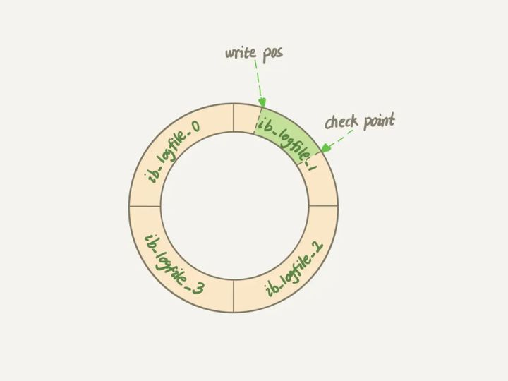

# 事务的特性实现

隔离性 (I)：数据库锁实现（悲观锁 + MVCC 乐观锁）

持久性 (D)：redo log 实现

原子性 (A)：undo log 实现

一致性 (C)：其它3个特性实现

# redo log

MySQL 为实现持久性，所有的写操作都要写进磁盘，直接落盘 IO 成本很高。

为了解决这个问题，MySQL 使用了 **WAL (Write-Ahead Logging)** 技术。它的关键点就是先记录日志到内存，再写磁盘。

具体来说，当有一条记录需要更新的时候，InnoDB 引擎会

1. 先把记录写到 redo log 里面，并更新内存，这个时候更新就算完成了。
2. 同时，InnoDB 引擎会在适当的时候，将这个操作记录更新到磁盘里面，而这个更新往往是在系统比较空闲的时候做，这就像打烊以后掌柜做的事。

InnoDB 的 redo log 是一个固定大小的**循环队列**。比如可以配置为一组 4 个文件，每个文件的大小是 `1GB`，那么总共就可以记录 `4GB` 的操作。从头开始写，写到末尾就又回到开头循环写，如下面这个图所示。

`write pos` 是当前记录的位置，一边写一边后移，写到第 3 号文件末尾后就回到 0 号文件开头。`checkpoint` 是当前要擦除的位置，也是往后推移并且循环的，擦除记录前要把记录更新到数据文件。

`write pos` 和 `checkpoint` 之间的是空闲空间，可以用来记录新的操作。如果 `write pos` 追上 `checkpoint`，表示队列满了，这时候不能再执行新的更新，得停下来先把数据更新到硬盘，然后把 `checkpoint` 推进一下。

有了 redo log，InnoDB 就可以保证即使数据库发生异常重启，之前提交的记录都不会丢失，这个能力称为 **crash-safe**。

# binlog

[MySQL](架构.md) 整体来看，其实就有两块：一块是 Server 层，它主要做的是功能层面的事情；还有一块是引擎层，负责存储相关的具体事宜。

上面我们聊到的 redo log 是 InnoDB 引擎特有的日志，而 Server 层也有自己的日志，称为 binlog（归档日志）。

为什么会有两份日志呢？因为最开始 MySQL 里并没有 InnoDB 引擎。MySQL 自带的引擎是 MyISAM，但 MyISAM 没有 crash-safe 的能力，binlog 日志只能用于归档。而 InnoDB 是另一个公司以插件形式引入 MySQL 的，既然只依靠 binlog 是没有 crash-safe 能力的，所以 InnoDB 使用另外一套日志系统——也就是 redo log 来实现 crash-safe 能力。

这两种日志有以下三点不同：

1. redo log 是 InnoDB 引擎特有的；binlog 是 MySQL 的 Server 层实现的，所有引擎都可以使用。
2. redo log 是**物理日志**，记录的是 **在某个数据页上做了什么修改**；binlog 是**逻辑日志**，记录的是这个语句的原始逻辑，比如 "给 id=2 这一行的 c 字段加 1 "。
3. redo log 是循环写的，空间固定会用完；binlog 是可以追加写入的，写到一定大小后会切换到下一个，并不会覆盖以前的日志。

#### UPDATE 执行流程

有了对这两个日志的概念性理解，我们再来看执行器和 InnoDB 引擎在执行这个简单的 `UPDATE` 语句时的内部流程。

1. 执行器先找引擎取 id=2 这一行。id 是主键，引擎直接用树搜索找到这一行。如果这一行所在的数据页本来就在内存中，就直接返回给执行器；否则，需要先从磁盘读入内存，然后再返回。
2. 执行器拿到引擎给的行数据，把这个值加 1，比如原来是 N，现在就是 N+1，得到新的一行数据，再调用引擎接口写入这行新数据。
3. 引擎将这行新数据更新到内存中，同时将这个更新操作记录到 redo log 里面，此时 redo log 处于 `PREPARE` 状态。然后告知执行器执行完成了，随时可以提交事务。
4. 执行器生成这个操作的 binlog，并把 binlog 写入磁盘。
5. 执行器调用引擎的提交事务接口，引擎把刚刚写入的 redo log 改成提交（`COMMIT`）状态，更新完成。

#### 两阶段提交

最后三步看上去有点绕，将 redo log 的写入拆成了两个步骤：`PREPARE` 和 `COMMIT`，这就是**两阶段提交**。

为什么必须有两阶段提交呢？这是为了让两份日志之间的逻辑一致。如果不采用该逻辑，在第二个日志还没有写完期间发生了 crash，会导致两个日志数据不一致，进而导致数据库的状态就 和 用日志恢复出来的库的状态 不一致。

>1. **先写 redo log 后写 binlog。**假设在 redo log 写完，binlog 还没有写完的时候，MySQL 进程异常重启。由于我们前面说过的，redo log 写完之后，系统即使崩溃，仍然能够把数据恢复回来，所以恢复后这一行 c 的值是 1。但是由于 binlog 没写完就 crash 了，这时候 binlog 里面就没有记录这个语句。因此，之后备份日志的时候，存起来的 binlog 里面就没有这条语句。然后你会发现，如果需要用这个 binlog 来恢复临时库的话，由于这个语句的 binlog 丢失，这个临时库就会少了这一次更新，恢复出来的这一行 c 的值就是 0，与原库的值不同。
>2. **先写 binlog 后写 redo log。**如果在 binlog 写完之后 crash，由于 redo log 还没写，崩溃恢复以后这个事务无效，所以这一行 c 的值是 0。但是 binlog 里面已经记录了“把 c 从 0 改成 1”这个日志。所以，在之后用 binlog 来恢复的时候就多了一个事务出来，恢复出来的这一行 c 的值就是 1，与原库的值不同。

# undo log

#### 参考

> [林晓斌 - 日志系统：一条SQL更新语句是如何执行的](https://zhuanlan.zhihu.com/p/384074147)