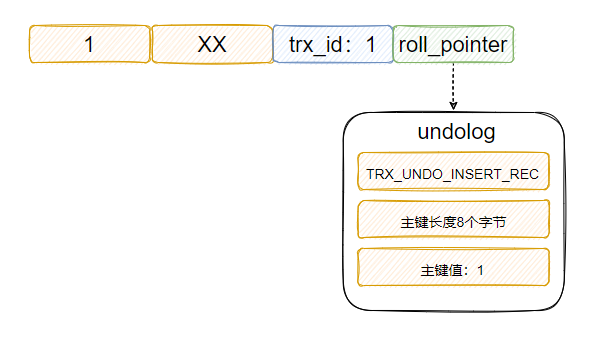

# MVCC

`MVCC` 全称 Multi Version  Concurrency Control 多版本并发控制。

# 基本原理

一条记录会有多个版本，每次修改记录都会存储这条记录被修改之前的版本，多版本之间串联起来就形成了一条版本链。

这样不同时刻启动的事务可以无锁地获得不同版本的数据 (普通读)。此时读 (普通读) 写操作不会阻塞，写操作可以继续写，无非就是多加了一个版本，历史版本记录可供已经启动的事务读取。

**MVCC 用来实现哪几个隔离级别**

用来实现读已提交和可重复读。首先隔离级别如果是读未提交的话，直接读最新版本的数据就行了，压根就不需要保存以前的版本。可串行化隔离级别事务都串行执行了，所以也不需要多版本，因此 MVCC 是用来实现读已提交和可重复读的。

**为什么需要 MVCC ？如果没有 MVCC 会怎样？**

我：如果没有 MVCC 读写操作之间就会冲突。比如，有一个事务1正在执行，此时一个事务2修改了记录A，还未提交，此时事务1要读取记录A，因为事务2还未提交，所以事务1无法读取最新的记录A，强读的话发生脏读的情况，所以应该读记录A被事务2修改之前的数据，但是记录A已经被事务2改了，所以事务1咋办？只能用锁阻塞等待事务2的提交，这种实现叫 LBCC (Lock-Based Concurrent Control)。

如果有多版本的话，就不一样了。事务2修改的记录 A，还未提交，但是记录 A 被修改之前的版本还在，此时事务1就可以读取之前的版本数据，这样读写之间就不会阻塞了，所以说 MVCC 提高了事务的并发度，提升数据库的性能。

实际上 InnoDB 不会真的存储了多个版本的数据，只是借助 undolog 记录每次写操作的反向操作，所以索引上对应的记录只会有一个版本，即最新版本。只不过可以根据 undolog 中的记录反向操作得到数据的历史版本，所以看起来是多个版本。

**MVCC 是如何实现的**

拿上面的 `insert (1，XX)`这条语句举例，成功插入之后数据页的记录上不仅存储 ID 1，name XX，还有 `trx_id` 和 `roll_pointer` 这两个隐藏字段：

- `trx_id`：当前事务ID。
- `roll_pointer`：指向 undo log 的指针。

从图中可以得知此时插入的事务ID是1，此时插入会生成一条 undolog ，并且记录上的 `roll_pointer` 会指向这条 undolog ，而这条 undolog  是一个类型为 `TRX_UNDO_INSERT_REC` 的 log，代表是 insert 生成的，里面存储了主键的长度和值 (还有其他值，不提)。

所以 InnoDB 可以根据 undolog  里的主键的值，找到这条记录，然后把它删除来实现回滚(复原)的效果。因此可以简单地理解 undolog 里面存储的就是当前操作的反向操作，所以认为里面存了个`delete 1` 就行。

此时事务1提交，然后另一个 ID 为 5 的事务再执行 `update NO where id 1` 这个语句，此时的记录和 undolog 就如下图所示：

####  参考

> [是Yes呀 - 关于MySQL的酸与MVCC和面试官小战三十回合](https://mp.weixin.qq.com/s?__biz=MzkxNTE3NjQ3MA==&mid=2247490249&idx=1&sn=4348983da767ff28982324acc1760ce5&chksm=c16277b0f615fea65e1aff38ba209095957a65953018f293ca9a1106e2d56521e09fc121247d&scene=132#wechat_redirect)

