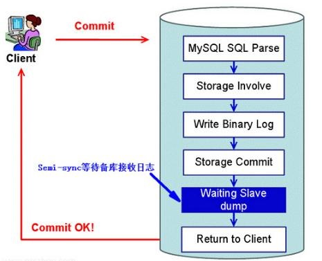

## 基本原理

### 主库

主库上的数据发生变化时，该事件变化会按顺序写入 `binlog` 中。从库连接到主库时，主库会开启 `binlog dump` 线程。当 master 的 `binlog` 发生变化的时候，`bin-log dump` 线程会将相应的 `binlog` 内容发送给 `slave` 。具体流程如下：

1. 协调者准备阶段 (Prepare Phase)
   1. 告诉引擎做 prepare，InnoDB更改事务状态，并将 redo log 刷入磁盘
2. 协调者提交阶段 (Commit Phase)
   1. 记录协调者日志，即 binlog 日志
   2. 告诉引擎做 commit


### 从库

从库生成两个线程，一个I/O线程，一个SQL线程

1. I/O 线程接收主库的 `binlog`，并转发写到 `relay log`（中继日志） 文件中

2. SQL 线程读取 `relay log` 文件中的日志，并解析成具体操作，来实现主从的操作一致，从而最终数据一致


## "推"还是"拉"

首先， MySQL 的复制是"推"的，而不是"拉"的。

"拉"是指 MySQL 的备库不断的循环询问主库是否有数据更新，这种方式资源消耗多，并且效率低。

"推"是指 MySQL 的主库在自己有数据更新的时候推送这个变更给备库，这种方式只有在数据有变更的时候才会发生交互，资源消耗少。如果你是程序员出身，你一定会选择推的方式。

那么 MySQL 具体是怎么推的列，实际上备库在向主库申请数据变更记录的时候，需要指定从主库 `Binlog` 的哪个文件 ( MASTER_LOG_FILE ) 的具体多少个字节偏移位置 ( MASTER_LOG_POS ) 。对应的，主库会启动一个 Binlog dump 的线程，将变更的记录从这个位置开始一条一条的发给备库。备库一直监听主库过来的变更，接收到一条，才会在本地应用这个数据变更。


## 同步方式

#### 1. 异步复制
- MySQL 默认的同步方式。master 将事件写入 binlog，提交事务，自身并不关心 slave 是否接收是否处理

- 缺点：不能保证所有事务都被所有 slave 接收，弱一致性

#### 2. 同步复制
- master 会等待所有 slave 的 ack (slave 写完 relay log)，才会返回客户端事务执行完毕信息
- 缺点：master 写入性能变差，一般 cluster 内部才用

#### 3. 半同步复制

- master 会等待至少一个 slave 回应后提交
- 当半同步复制发生超时时（由参数可配置时长），会暂时关闭半同步复制，转而使用异步复制
- 缺点：造成了至少一个 TCP/IP 往返时长的延时
- 主库宕机时，客户端可能会重试，导致从库执行2次
  - 针对这个问题，MySQL 5.7引入了一种新的半同步方案：Loss-Less半同步复制
  - 这种方案里 Waiting Slave dump 被调整到 Storage Commit 之前。




## 并行复制

在 `MySQL 5.6` 版本之前，Slave 服务器上有两个线程 I/O线程和 SQL线程。I/O线程负责接收二进制日志，SQL线程进行回放。

`MySQL 5.6` 后，可以开启并行复制功能，使用多个 `worker` 执行回放。支持 2 种并行策略：

- 按库并行: 将 `SQL` 按数据库分组并行执行。主库上存在多个DB时才实用
- 组提交优化：将 `commit_id` 相同的分为一组，不同组之间可以并行


## 主从延迟原因

先来看下导致主从延迟的时间点：

- 主库 A 执行完成一个事务，写入 `binlog`，该时刻记为 T1
- 传给从库 B，从库接受完这个 `binlog` 的时刻记为 T2
- 从库 B 执行完这个事务，该时刻记为 T3

那么所谓主从延迟的时间差就是 T3 - T1。主从延迟大的原因可能如下：

1. 网络延迟、堵塞
    - 尽量采用短的链路、带宽
2. 从库回放慢
    - 从库性能差
    - 从库读的流量大，导致 CPU 压力大
3. 事务 / DDL 执行时间较长
    - 主库是在事务执行完毕后才会写 `binlog` 的。当事务执行时间较长，从库再做一遍的耗时也会较长，期间主从数据就会不一致。
4. 主库可以有多个线程并发写，而从库只有一个 `SQL` 线程执行 `relay log`。主库写压力较大时，从库执行起来会更慢。
    - `MySQL 5.6` 后可以开启并发同步优化 


可以通过命令查看主从同步延时：

```mysql
> show slave status
Slave_IO_Running: Yes
Slave_SQL_Running: Yes
Seconds_Behind_Master: 0 // 从属服务器SQL线程和从属服务器I/O线程之间的时间差距，单位以秒计
```


## 主从同步失效的情况

`Seconds_Behind_Master` 为 0 并不一定是主从没有延时，也可能是主的 `Binlog dump` 线程挂了。作为监听的一方，从库一直没有收到任何变更，它会认为主库上长时间没有任何变更，导致没有变更数据推送过来。

从库是无法判断主库上对应的 `Binlog dump` 线程 到底是意外终止了，还是长时间没有任何数据变更的。所以，对这两种情况来说，备库都显示为正常。

当然， MySQL 会尽量避免这种情况。比如：
1. 在 `Binlog dump` 被 kill 掉时通知备库 线程 被 kill 掉了。（但这个消息有可能由于网络堵塞无法发送到从库）
2. 备库如果长时间没有收到从主库过来的变更，它会每隔一段时间重连主库。（默认配置是1小时，这个可以配置短点）


## 多主架构如何同步

MySQL 从 5.7 开始支持多主，但这样很难保证数据的一致性（比如向两主分别写入不同的数据，产生的自增ID可能是冲突的），一般情况下现在都不会这样使用多主的情况了。

或者一个做真实主机，其余做备机，仍然采用主从同步的方式。主机故障时才将备机提升为主，提高集群可用性。


#### 参考
> [Coding-Liu - MySQL中的两阶段(2PC)提交](https://www.cnblogs.com/codingLiu/p/12725789.html)
> 
> [mysql主从同步时关于事务提交和回滚的问题 ](https://bbs.51cto.com/thread-1544611-1.html)
>
> [月伴飞鱼 - 关于主从延迟，一篇文章给你讲明白了](https://mp.weixin.qq.com/s/lR7uUfLfPlMS5qP6m84KTQ)
