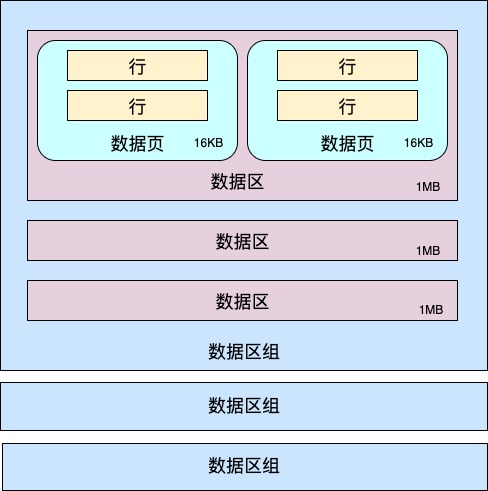

# InnoDB 记录格式

## 页

`InnoDB` 从磁盘中读取数据的最小单位是 **页**，一页默认 `16KB`。就是说，即便我们只查询一条记录，`InnoDB` 也会把至少 `16KB` 的内容从磁盘读到内存中。

页可以存放索引、数据、undo log、buffer 等。

### 记录插入过程

在数据页中，当记录为空时，`User Records` 是不存在的。随着记录的一条条插入，会不断从 `Free Space` 开辟空间分配给记录

## 数据区

同一个表空间内的一组连续的数据页为一个 `extent`（区），默认区的大小为 `1M`B，页的大小为 `16KB`。`16*64=1024`，也就是说一个区里面会有 `64` 个连续的数据页。连续的 `256` 个数据区为一组数据区。

从直观上看，其实不用纳闷为啥 `MySQL` 按照这样的方式组织存储在磁盘上的数据。

这就好比用 `golang` 封装 `struct` 去描述一类对象。最终的目的都是为了方便、管理、控制。

约定好了数据的组织方式，那 `MySQL` 的作用不就是：按照约定数据规则将数据文件中的数据加载进内存，然后展示给用户看，以及提供其他能力吗？

### 页分裂与页合并

这个过程类似 `redis` 的 `quicklist`。

当向写满的数据页里插入数据行时，就需要创建一个新页、移动部分行到新页、修改指针将新页和前后页串联起来。

这样逻辑上水平方向的一致性仍然满足。然而从物理存储上讲页是乱序的，而且大概率会落到不同的区。（即错位）

当你删了一行记录时，实际上记录并没有被物理删除，记录被标记（flaged）为删除并且它的空间变得允许被其他记录声明使用。

当页中删除的记录达到 `MERGE_THRESHOLD`（默认页体积的50%），`InnoDB` 会开始寻找最靠近的页（前或后）看看是否可以将两个页合并以优化空间使用。

## 行

`InnoDB` 的行格式有四种，分别是 `Compact`、`Redundant`、`Dynamic` 和 `Compressed`，它们在原理上大体都是相同的。

`Compact` 行格式的结构大概如图所示：

#### 变长字段长度列表

MySQL 中有些类型的字段长度是不固定的，比如 VARCHAR(M) 类型、TEXT 等，这就导致每条记录中该字段的「实际」长度可能是不一样的。

为此，MySQL 在存储这些变长类型的数据时，实际上分成了两部分存储，分别是：

1. 真实的数据
2. 数据占用的字节数

其中数据占用的字节数就保存在「变长字段长度列表」中。它是以列的「逆序」存储表中变长字段的实际长度的。

#### 参考

> [赐我白日梦 - MySQL数据页以及页分裂机制](https://www.cnblogs.com/ZhuChangwu/p/14041410.html)
> 
> [WriteOnRead - InnoDB的一条记录长什么样子](https://zhuanlan.zhihu.com/p/147387036)

