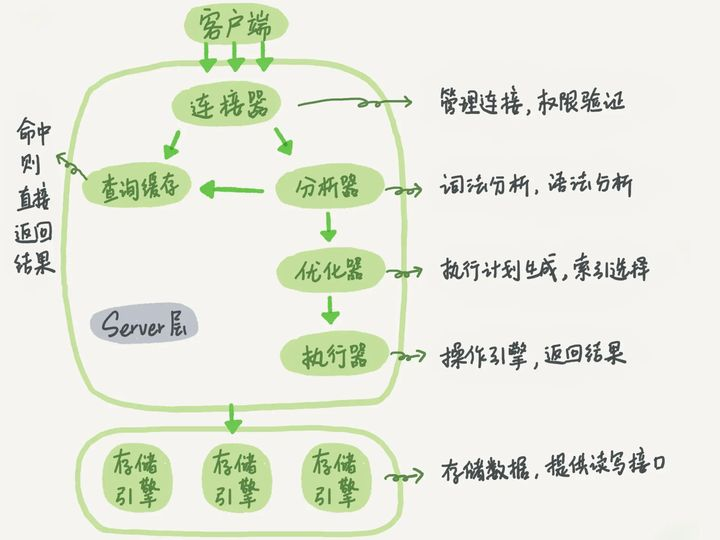

`MySQL` 的基本架构，大体上可以分为 **Server 层** 和 **存储引擎层** 两部分（有的把 Server 又细分为了 连接器 和 服务器 两部分）

第一层是服务器层，主要提供连接处理、授权认证、安全、查询解析、分析、优化、缓存以及日期和时间等所有内置函数。所有跨存储引擎的功能也都在这一层实现，例如存储过程、触发器、视图等。

第二层是存储引擎层，存储引擎负责 MySQL 中数据的存储和提取。服务器通过 API 与存储引擎通信，这些接口屏蔽了不同存储引擎的差异，使得差异对上层查询过程透明。除了会解析外键定义的 InnoDB 外，存储引擎不会解析 SQL，不同存储引擎之间也不会相互通信，只是简单响应上层服务器请求。

`Mysql` 有三种存储引擎：`InnoDB`，`MyISAM`，和 `Memory`。

`InnoDB` 提供了良好的事务处理、崩溃修复能力和并发控制。缺点是读写效率较差，占用的数据空间相对较大。

`MyISAM` 的优势在于占用空间小，处理速度快。缺点是不支持事务的完整性和并发性、不支持行锁。

`Memory` 的数据全部放在内存中，效率较高，但没有持久化。一般中间表才用。默认使用哈希索引。

