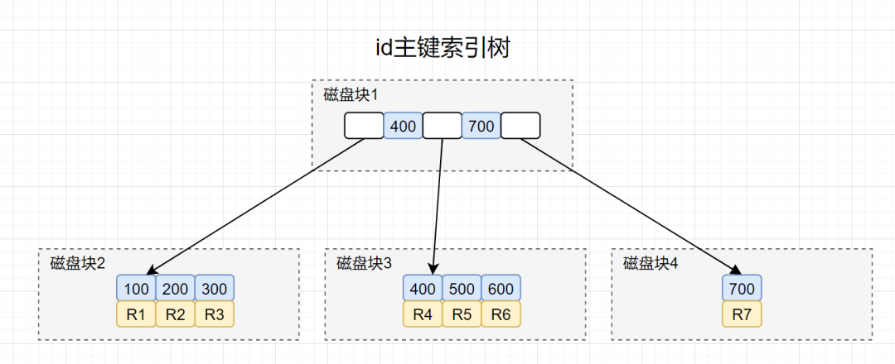
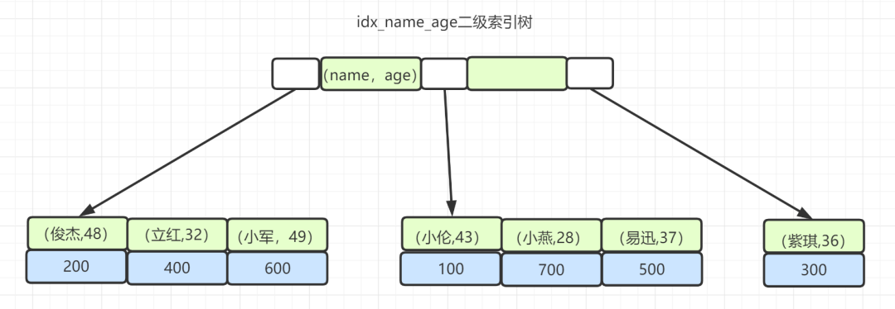

# 索引

索引是一种能提高数据库查询效率的数据结构。它可以比作一本字典的目录，可以帮你快速找到对应的记录。

# 索引分类

# 数据结构维度

## B+树索引

B+树结构上和二叉树类似，只不过每个节点的子节点不止两个了，而是多个，即多叉查找树。根节点的槽中会有多个指向子节点的指针，这些指针上定义了子节点页中值的区间。

#### B+树 VS 二叉树

不同的节点，很有可能分布在不同的磁盘页中。因此加载节点时，是从磁盘加载到内存上的。这就意味着树越深，磁盘加载次数越多，查找越慢。因此矮胖的 B+树 更适合做索引。

#### B+树 VS B树

二者的区别在于，B树会在非叶子结点上存数据。因此同一个 `16KB` 的页上，B树能存的索引比 `B+` 树少，节点更多，加载磁盘次数就更多。

`innodb` 一页默认 `16KB`，指针和主键一般占用 `8+8=16B`， 因此 `B+` 树一页能存 `16KB/16B = 1000 ` 条数据，三层能存 `10^9=10亿` 左右了，因此一般索引查三层就能检索到。 

另外叶子节点存了数据，且是按顺序排列的，链表连着的。那么 B+树使得范围查找、排序查找、分组查找以及去重查找变得异常简单。

## Hash 索引

只有 `Memory` 引擎显式支持哈希索引，这也是 `Memory` 引擎的默认索引类型。

查找较快，但不支持范围查找、组合索引、排序。

## 自适应哈希索引

自适应哈希索引是 `InnoDB` 引擎的一个特殊功能，当它注意到很多SQL存在很长的寻路，并且有很多 `SQL` 命中相同的页面 (`page`)，`InnoDB` 会在自己的内存缓冲区(`buffer`) 里，开辟一块区域，建立自适应哈希索引 `AHI`，以加速查询。

这是一个完全自动的内部行为，用户无法控制或配置，但可以关闭该功能。

## 全文索引

通过分词做的倒排索引，可以很快搜索 `%关键词%` 这样的查询

## R-Tree 索引
用来对 `GIS` 数据类型创建空间索引

# 物理存储维度

## 聚簇索引

聚簇索引：将数据存储与索引放到了一块，找到索引也就找到了数据。`InnoDB` 的主键索引使用的是这个。

非聚簇索引：将数据存储与索引分开的结构，存的是主键值。`InnoDB` 的二级/辅助索引，和 `MyISAM` 的索引都是这种类型。

聚簇索引不是一种索引类型，而是一种数据存储方式。`InnoDB` 的聚簇索引实际上在同一个结构中保存了索引和数据行，在叶子页上。

因为无法同时把数据行存放在两个不同的地方，所以一个表只能有一个聚簇索引。

**优点：**

1. 可以把相关数据保存在一起。数据访问更快，不需要根据主键 `ID` 进行二次查找。
2. 使用覆盖索引扫描的查询可以直接使用页节点中的主键值。

**缺点：**

1. 更新聚簇索引列的代价很高，因为会强制每个被更新的行移动到新位置。
2. 基于聚簇索引的表插入新行或主键被更新导致行移动时，可能导致页分裂，表会占用更多磁盘空间。
3. 当行稀疏或由于页分裂导致数据存储不连续时，全表扫描可能很慢。

# 覆盖索引

覆盖索引指一个索引包含或覆盖了所有需要查询的字段的值，不再需要根据索引回表查询数据。

# 联合索引

以该图为例，查找 `WHERE name LIKE '小%' AND age = 28` 时，先根据联合索引里的 `name` 字段查找出 "小" 开头的索引，再用 `age` 过滤。

# 索引的分裂

## B+树的分裂
当一个结点满时，新建一个结点，并将原结点中 `1/2` 的数据复制到新结点，最后在父结点中增加新结点的指针。

`B+` 树的分裂只影响原结点和父结点，而不会影响兄弟结点，所以它不需要指向兄弟的指针。

## B树的分裂

当一个结点满时：

如果它的下一个兄弟结点未满，那么将一部分数据移到兄弟结点中，再在原结点插入关键字，最后修改父结点中兄弟结点的关键字（因为兄弟结点的关键字范围改变了）。

如果兄弟也满了，则在原结点与兄弟结点之间增加新结点，并各复制 `1/3` 的数据到新结点（大家都剩 `2/3`），最后在父结点增加新结点的指针。

所以，B树分配新结点的概率比B+树要低，空间使用率更高

 

## B+树的删除

`InnoDB` 下可以设置一个 `MERGE_THRESHOLD`，当节点的数据填充率低于该值时，会触发节点合并。

#### 参考

> [吴师兄 - 32 道 MySQL 面试题总结](https://www.cxyxiaowu.com/16302.html?utm_source=wechat_session&utm_medium=social&utm_oi=29059463512064)
>
> [帅地 - 为啥文件索引要用B树而不用二叉查找树？](https://mp.weixin.qq.com/s/XODnqAH2TLJ5pF2TiiTXRQ)
>
> [sunshine_lyn - 快速了解B+树的插入、删除操作](https://elainelv.blog.csdn.net/article/details/82747596)
>
> [捡田螺的小男孩 - 给了几条SQL，问需要执行几次树搜索操作](https://mp.weixin.qq.com/s/iyLb_pRj52oBwqDvfS2Hfg)

