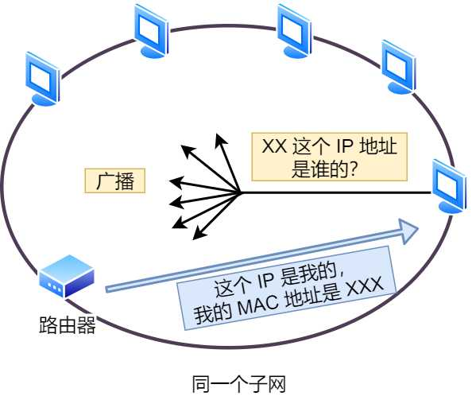

# ARP解析

用于查找IP对应的MAC地址

ARP 协议会在以太网中以**广播**的形式，对以太网所有的设备喊出：“这个 IP 地址是谁的？请把你的 MAC 地址告诉我”。

然后就会有人回答：“这个 IP 地址是我的，我的 MAC 地址是 XXXX”。

如果对方和自己处于同一个子网中，那么通过上面的操作就可以得到对方的 MAC 地址。然后，我们将这个 MAC 地址写入 MAC 头部，MAC 头部就完成了。

##### 好像每次都要广播获取，这不是很麻烦吗？

在后续操作系统会把本次查询结果放到一块叫做 **ARP 缓存**的内存空间留着以后用，不过缓存的时间就几分钟。

也就是说，在发包时：

- 先查询 ARP 缓存，如果其中已经保存了对方的 MAC 地址，就不需要发送 ARP 查询，直接使用 ARP 缓存中的地址。
- 而当 ARP 缓存中不存在对方 MAC 地址时，则发送 ARP 广播查询。

##### 查看 ARP 缓存内容

在 Linux 系统中，我们可以使用 `arp -a` 命令来查看 ARP 缓存的内容。

#### 参考

[小林coding](https://www.zhihu.com/question/437193010/answer/2065582348)