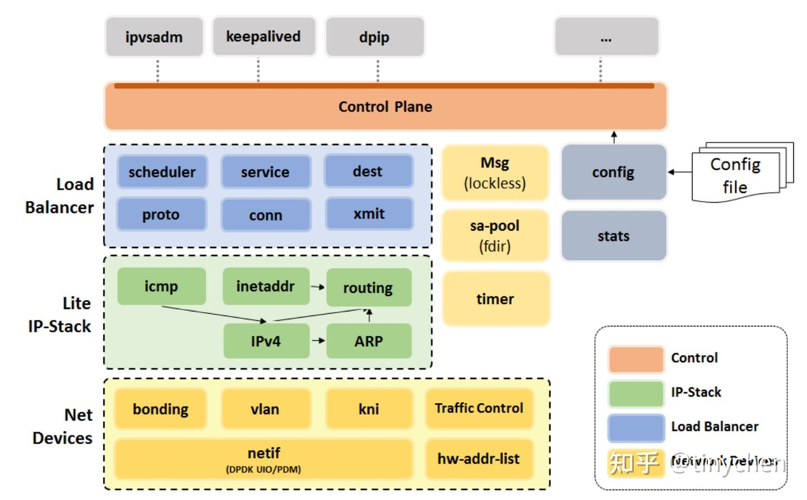

## DPVS简介

**[DPVS](https://github.com/iqiyi/dpvs)** 是一个基于 [DPDK](https://www.dpdk.org/)的高性能四层负载均衡器（Layer-4 load balancer，DPVS的名字来源于 DPDK + LVS，注意这里的LVS是[阿里巴巴改进版的LVS](https://github.com/alibaba/LVS)。下图是爱奇艺官方给出的一个DPVS架构以及主要特点：

1. 用户态实现
2. Master / Worker 模型
3. 网卡队列 & CPU 绑定 => 关键数据无锁化

## **用户态实现**

DPVS主要的任务都是在用户态完成的，可以极大地提高效率。这主要是因为DPVS没有使用 `Linux` 复杂的协议栈，而是自研。采用轮询的方式收发数据包，避免了锁、内核中断、上下文切换、内核态和用户态数据拷贝产生的性能开销。

**实际上四层负载均衡并不需要完整的协议栈，但是需要基本的网络组件**，以便完成和周围设备的交互（ARP/NS/NA）、确定分组走向 （Route）、回应 Ping 请求、健全性检查（分组完整性，Checksum校验）、以及 IP 地址管理等基本工作。使用 DPDK 提高了收发包性能，但也绕过了内核协议栈，DPVS 依赖的协议栈需要自己实现。

## **Master/Worker模型**

这一点和 nginx 一样，使用  M/S模型，Master 处理控制平面，比如参数配置、统计获取等；Worker 实现核心负载均衡、调度、数据转发功能。

另外，DPVS 使用多线程模型，每个线程绑定到一个 CPU 物理核心上，并且禁止这些 CPU 被调度。这些 CPU 只运行 DPVS 的 Master 或者某个 Worker，以此避免上下文切换，别的进程不会被调度到这些 CPU，Worker 也不会迁移到其他 CPU 造成缓存失效。

## **网卡队列/CPU绑定**

现在的服务器网卡绝大多数都是**多队列网卡**，支持多个队列同时收发数据，让不同的 CPU 处理不同的网卡队列的流量，分摊工作量，DPVS将其和CPU进行绑定，**利用DPDK 的 API 实现一个网卡的一个收发队列对应一个CPU核心和一个Worker进程**，实现一一对应和绑定，从而实现了处理能力随CPU核心、网卡队列数的增加而线性增长，并且很好地实现了**并行处理**和线性扩展。

## **关键数据无锁化**

内核协议性能问题的一大原因就是资源共享和锁。`Linux` 内核协议栈会将所有的 `listener socket` 和已经建立连接的 `established socket` 分别链接到两个全局的 `hash` 表。如果服务器只监听 `80` 端口，意味着所有连接都会命中同一个 `slot`，那么这个机制就相当于一个全局的内核大锁。

所以，被频繁访问的关键数据需要尽可能的实现无锁化，其中一个方法是将数据做到 per-cpu 化，**即每个CPU核心只处理自己本地的数据，不需要访问其他CPU的数据，这样就可以避免加锁**。对于DPVS而言，`连接表`，`邻居表`，`路由表`等频繁修改或者频繁查找的数据，都做到了 per-cpu 化。但是在具体 per-cpu 的实现上，连接表和邻居表、路由表两者的实现方式并不相同。

**连接表在高并发的情况下会被频繁的CRUD**。DPVS中每个CPU核心维护的是不相同的连接表，不同的网络数据流（TCP/UDP/ICMP）按照 N 元组被定向到不同的CPU核心，在此特定的CPU核心上创建、查找、转发、销毁。同一个数据流的包，只会出现在某个CPU核心上，不会落到其他的CPU核心上。这样就可以做到不同的CPU核心只维护自己本地的表，无需加锁。

对于邻居表和路由表这种每个CPU核心都要使用的全局级别的操作系统数据，默认情况下是使用”全局表+锁保护“的方式。**DPVS通过让每个CPU核心有同样的视图，也就是每个CPU核心需要维护同样的表，从而做到了`per-cpu`。**对于这两个表，虽然在具体实现上有小的差别（路由表是直接传递信息，邻居是克隆数据并传递分组给别的 CPU），但是**本质上都是通过跨CPU通信来实现的跨CPU无锁同步**，从而将表的变化同步到每个CPU，最后实现了无锁化。

## **跨CPU无锁通信**

上面的关键数据无锁化和这一点实际上是殊途同归的。首先，虽然采用了关键数据 per-cpu等优化，但跨CPU还是需要通信的，比如:

- Master 获取各个 Worker 的各种统计信息
- Master 将路由、黑名单等配置同步到各个 Worker
- Master 将来自DPVS的KNI网卡的数据发送到 Worker（只有 Worker 能操作DPDK网卡接口来发送数据）

既然需要通信，就不能存在互相影响、相互等待的情况，因为那会影响性能。**DPVS的无锁通信还是主要依靠DPDK提供的无锁`rte_ring`库实现的**，从底层保证通信是无锁的，并且我们在此之上封装一层消息机制来支持一对一，一对多，同步或异步的消息。

## **小结**

从上面列出的几个DPVS的主要特点我们不难发现，**DPVS的主要设计思路就是通过减少各种切换和避免加锁来提高性能**，具体的实现上则主要依赖了DPDK的许多功能特性以及使用了常用的几个开源负载均衡软件（ipvsadm、keepalived、dpip等），结合用户态的轻量级网络协议栈（只保留了四层负载均衡所必须的），就实现了超强性能的四层负载均衡系统。

#### 参考

[tinychen - DPVS简介与部署](https://zhuanlan.zhihu.com/p/344194786)