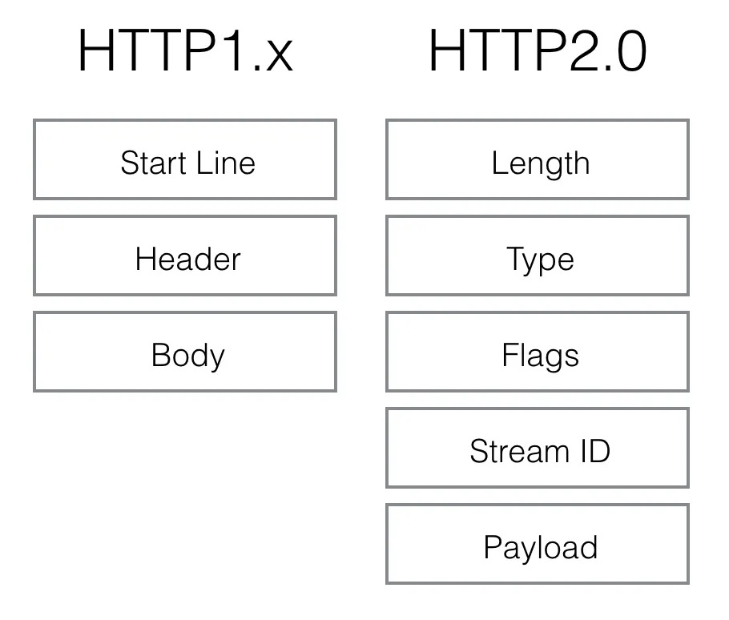
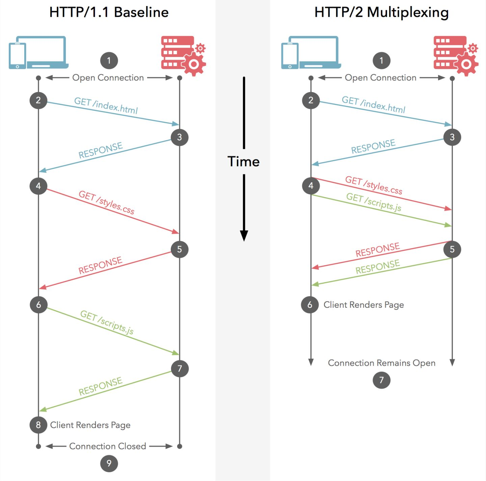

# 多路复用的单一长连接
## 1.单一长连接

##### 队头阻塞
在 `HTTP/1.0` 中，顺序请求的一个请求必须处理完才能处理后续的其他请求，当一个请求被阻塞时会给应用程序带来延迟。虽然 `HTTP/1.1` 提供了流水线(pipeline) 的请求操作，但后续请求仍然需要等待首个请求返回才能跟着返回，无法消除队头阻塞带来的延迟。

##### 多连接

为了减少延迟，需要HTTP的客户端与服务器建立多个连接实现并发处理请求，降低延迟。在高并发情况下，大量的网络连接可能耗尽系统资源

##### 单一连接

在 `HTTP/2` 中，客户端向某个域名的服务器请求页面的过程中，只会创建一条 `TCP` 连接，即使这页面可能包含上百个资源。单一的连接应该是 `HTTP2` 的主要优势，能减少 `TCP` 握手带来的时延，并节省新建和维持连接的开销 ，提高了吞吐量。

## 2. 多路复用

`HTTP/2` 要解决的一大难题就是多路复用（MultiPlexing），即连接共享。

其协议结构体里设计了一个字段stream id就是用作连接共享机制的。一个request对应一个stream并分配一个id，这样一个连接上可以有多个stream，每个stream的frame可以随机的混杂在一起，接收方可以根据stream id将frame再归属到各自不同的request里面。

# 头部压缩和二进制格式

## 二进制帧

`HTTP1.x` 一直都是 `plain text`，对此我只能想到一个优点，便于阅读和 debug。但是，现在很多都走 `HTTPS`，`SSL` 把 `plain text` 变成了二进制，那这个优点也没了。

`HTTP2` 把要传输的信息分割成一个个二进制帧，首部信息会被封装到 `HEADER Frame`，相应的请求体放到 `DATA Frame`。

二进制数据最大的好处是：更小的传输体积；更易于解析且不易出错。文本的表现形式有多样性，要做到健壮性考虑的场景必然很多，要考虑处理空格、大小写、空行、换行等问题。二进制则不同，只认0和1的组合，实现方便且健壮。

## 头部压缩

 `HTTP2` 搞了个 `HPACK` 压缩算法来压缩头部，减少报文大小。

具体来说，收个请求发送所有的头部信息，后续的请求只发送增量或者更新的部分。

# 服务端推动 Sever Push

这个功能通常被称作 **缓存推送**。主要的思想是：当一个客户端请求资源X，而服务器知道它很可能也需要资源Z的情况下，服务器可以在客户端发送请求前，主动将资源Z推送给客户端。

[腾讯云加社区 - HTTP/2 相比 1.0 有哪些重大改进](https://www.zhihu.com/question/34074946/answer/157909115)