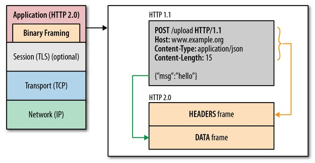

[TOC]

# 1. 多路复用的单一长连接

## 1.1 单一长连接

在 `HTTP 1.x` 中，为了减少延迟，需要HTTP的客户端与服务器建立多个连接实现并发处理请求，降低延迟。在高并发情况下，大量的网络连接可能耗尽系统资源

在 `HTTP/2` 中，只会创建一条 `TCP` 连接，即使这页面可能包含上百个资源。单一的连接应该是 `HTTP2` 的主要优势，能减少 `TCP` 握手带来的时延，并节省新建和维持连接的开销 ，提高了吞吐量。

## 2. 多路复用

为了实现单一长连接，`HTTP2` 允许一次传输携带多个请求的数据，为此必须在协议结构体里设计一个字段 `stream id` 用作连接共享机制。一个请求对应一个 `stream` 并分配一个 `id`，这样一个连接上可以有多个 `stream`，每个 `stream` 的帧可以随机的混杂在一起，接收方再根据 `stream id` 将帧归属到各自不同的请求里面。

# 2. 头部压缩和二进制格式

## 2.1 二进制帧

`HTTP1.x` 一直都是 `plain text`，对此我只能想到一个优点，便于阅读和 debug。但是，现在很多都走 `HTTPS`，`SSL` 把 `plain text` 变成了二进制，那这个优点也没了。

`HTTP2` 把要传输的信息分割成一个个二进制帧，首部信息会被封装到 `HEADER Frame`，相应的请求体放到 `DATA Frame`

## 2.2 头部压缩

 `HTTP2` 搞了个 `HPACK` 压缩算法来压缩头部，减少报文大小。

另外首个请求发送所有的头部信息，后续的请求只发送增量或者更新的部分。进一步提升效率

# 3. 服务端推动 Sever Push

这个功能通常被称作 **缓存推送**。主要的思想是：当一个客户端请求资源X，而服务器知道它很可能也需要资源Z的情况下，服务器可以在客户端发送请求前，主动将资源Z推送给客户端。

[腾讯云加社区 - HTTP/2 相比 1.0 有哪些重大改进](https://www.zhihu.com/question/34074946/answer/157909115)