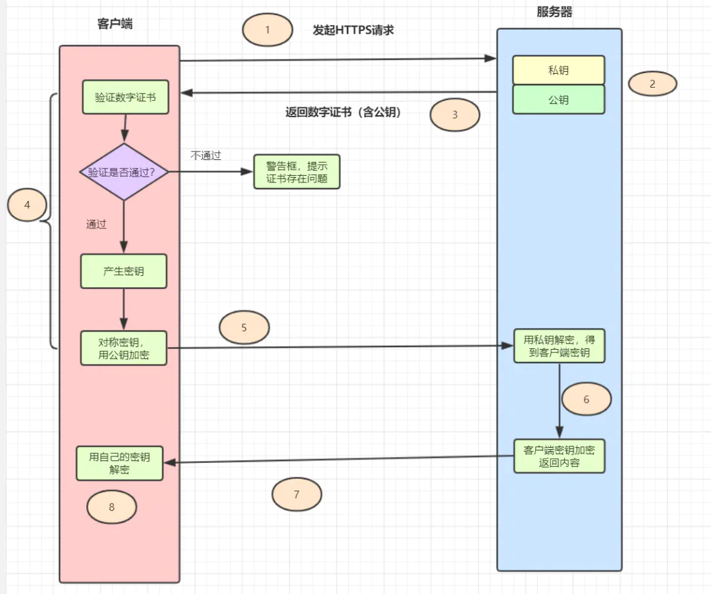

- `HTTPS = HTTP + SSL/TLS`，即用 `SSL/TLS` 对数据进行加密和解密，`HTTP` 进行传输。
- `SSL`，即 Secure Sockets Layer（安全套接层协议），是网络通信提供安全及数据完整性的一种安全协议。
- `TLS`，即Transport Layer Security(安全传输层协议)，它是 `SSL3.0` 的后续版本。

1. 客户端发起 `HTTS` 请求，连接到服务器的443端口。
   2. 服务器必须要有一套数字证书（证书内容有公钥、证书颁发机构、失效日期等）。
2. 服务器将自己的数字证书发送给客户端（公钥在证书里面，私钥由服务器持有）。
   4. 客户端收到数字证书之后，会验证证书的合法性。如果证书验证通过，就会生成一个随机的**对称密钥**，用证书的公钥加密。
5. 客户端将公钥加密后的密钥发送到服务器。
6. 服务器接收到客户端发来的密文密钥之后，用自己的私钥对其进行非对称解密，解密之后就得到客户端的密钥，然后用客户端密钥对返回数据进行对称加密，酱紫传输的数据都是密文啦。
7. 服务器将加密后的密文返回到客户端。
8. 客户端收到后，用自己的密钥对其进行对称解密，得到服务器返回的数据。
9. 这里同时使用了对称和非对称加密。对称加密用于后续实际的 **数据加密**，非对称加密用于加密 **对称加密所用的密钥**。

#### 参考

[捡田螺的小男孩 - 蚂蚁金服一面：十道经典面试题解析](https://mp.weixin.qq.com/s/kDZrJfJq6hMffMgw_KHyqQ)