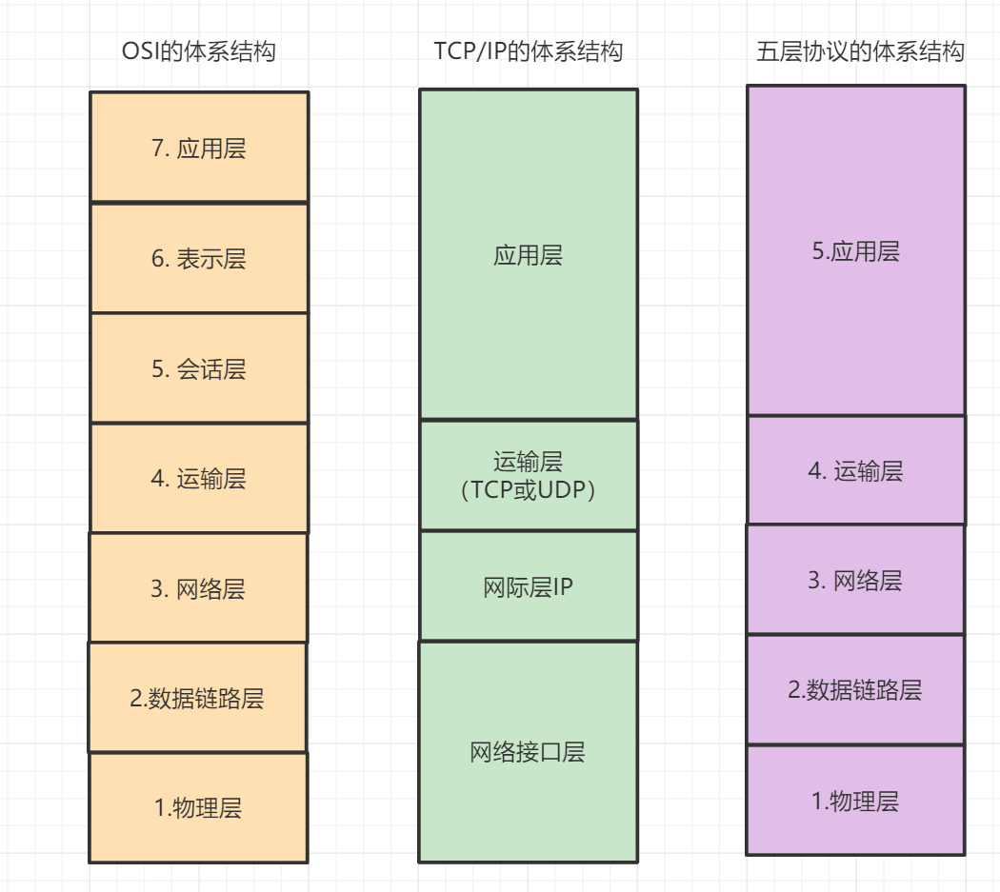
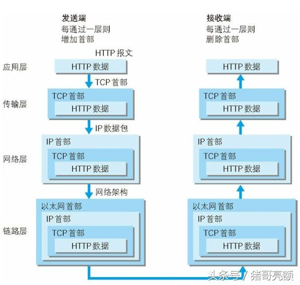
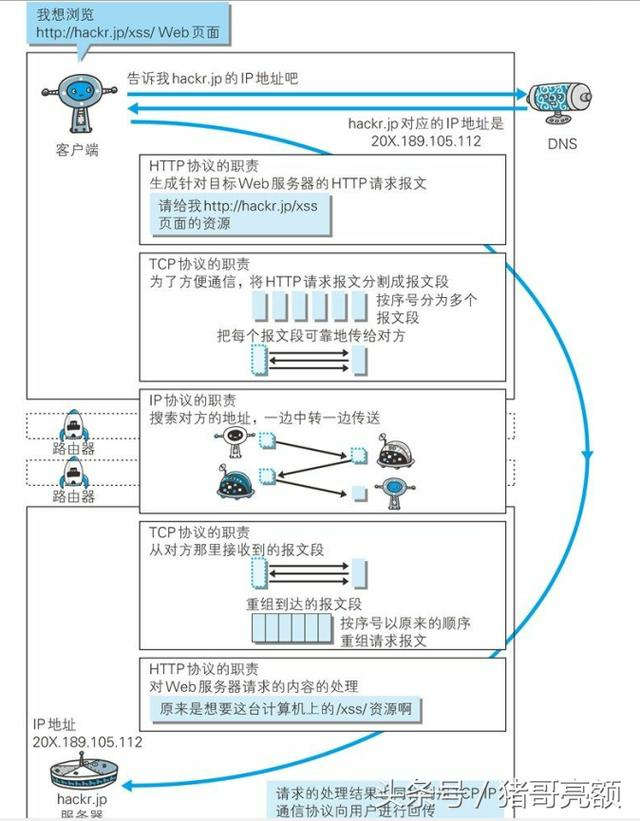

国际标准化组织 ISO 搞了个《OSI七层网络模型》，但是因为实在太过复杂与繁琐，基本上没人执行它。

但是又有一个五层模型和四层模型却比较常见，尤其是四层模型。

### 七层、四层模型及其协议

| OSI七层网络模型 | TCP/IP四层概念模型 | 对应的网络协议          | 用途                           |
| --------------- | ------------------ | ----------------------- | ------------------------------ |
| 应用层          | 应用层             | HTTP / FTP / SMTP / DNS | 数据格式协议                   |
| 表示层          |                    |                         | 数据的表示、安全、压缩 |
| 会话层          |                    | SSL / TLS               | 建立、管理、终止会话，对应主机进程 |
| 传输层          | 传输层             | TCP / UDP / SCTP / RTP  | 指定端口，提供连接。这层的数据，叫 Segment             |
| 网络层          | 网际层             | IP / RARP / ICMP / IGMP | 指定IP地址。这层的数据，叫 Packet。路由器工作的层             |
| 数据链路层      | 网络接口层         | ARP                        | 指定MAC地址。这层的数据，叫 Frame。交换机工作的层            |
| 物理层          |                    |                         | 处理连接网络的硬件部分，如网卡 |

发送端在层与层之间传输时，每经过一层都会被打上该层所独有的头部信息，反之，接收端在层与层传输数据时，每经过一层时会把对应的首部消去。这种把数据信息包装起来的做法称为封装（encapsulate）。

### HTTP协议与其他TCP/IP协议是如何协作的？

# 参考
[宋讼颂 - 简单聊聊四层/七层模型到HTTP](https://www.cnblogs.com/ss-py/p/9851155.html)

