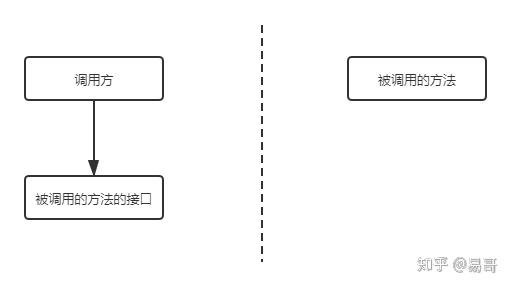
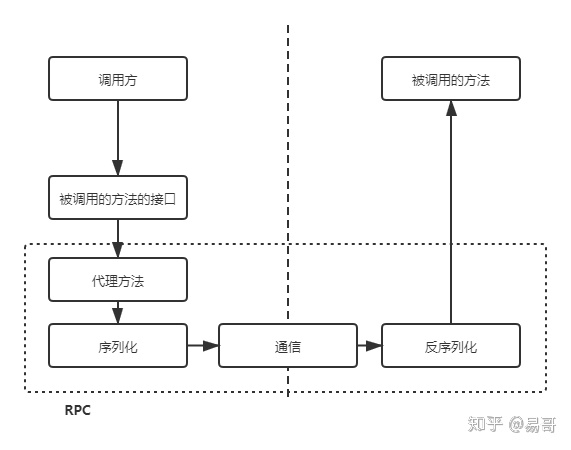

# HTTP 和 RPC 不是对等的概念

`RPC` 是一个完整的远程调用方案，它包括了：传输协议 + 序列化反序列化协议 + 通信协议 等。

而 `HTTP`只是一个通信协议，工作在 `OSI` 的第七层，不是一个完整的远程调用方案。

要想比较 `HTTP` 调用和 `RPC` 调用，应该将二者拉平为一个对等的概念。例如，**HTTP + Restful规范 + 序列化与反序列化**，构成一个完整的远程调用方案，再和 `RPC` 进行比较。

# 基于 HTTP 的远程调用方案

##### 优势

1. 实现和接入简单。大多数库天然支持 `HTTP`，用起来很容易，不需要引第三方库
2. 可读性好
3. 可以得到跨语言、防火墙的支持

##### 缺点

1. 有用信息占比少，毕竟 `HTTP` 工作在第七层，包含了大量的HTTP头等信息。导致 **效率低**
2. 虽然接入容易，但是麻烦，主要是参数的封装复杂

# RPC

通常，RPC要求在调用方（客户端SDK）中放置被调用的方法的接口。调用方只要调用了这些接口，就相当于调用了被调用方的实际方法，十分易用。于是，调用方可以像调用内部接口一样调用远程的方法，而不用封装参数名和参数值等操作。

首先，调用方调用的是接口，必须得为接口构造一个假的实现。显然，要使用动态代理。这样，调用方的调用就被动态代理接收到了。

第二，动态代理接收到调用后，应该想办法调用远程的实际实现。这包括下面几步：

- 识别具体要调用的远程方法的IP、端口（服务发现）
- 将调用方法的入参进行序列化
- 通过通信将请求发送到远程的方法中

这样，远程的服务就接收到了调用方的请求。它应该：

- 反序列化各个调用参数
- 定位到实际要调用的方法，然后输入参数，执行方法
- 按照调用的路径返回调用的结果

整个过程如下所示。

之间的通信数据可读性不需要好，只需要RPC框架能读懂即可，因此效率可以更高。传输协议可以使用 `HTTP2 (GRPC)`，或者自研 (`Thrift`)。序列化协议可以使用 `protobuf (GRPC)`  / 自研 (`Thrift`)。

#### 参考

[易哥 - 既然有 HTTP 请求，为什么还要用 RPC 调用](https://www.zhihu.com/question/41609070/answer/1030913797)

